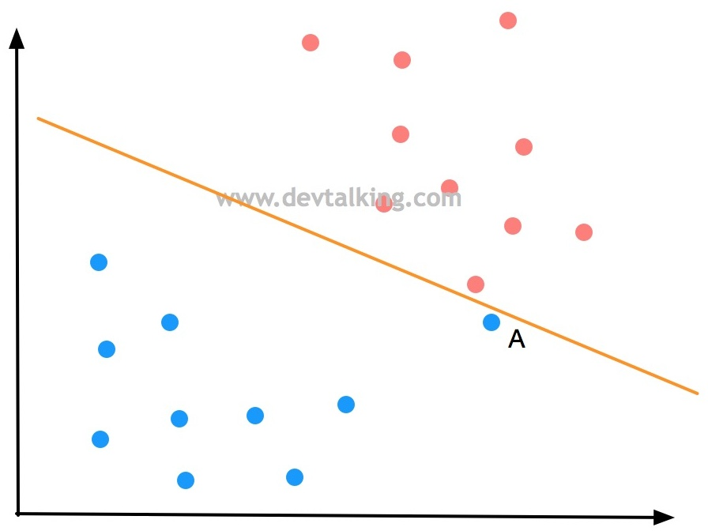
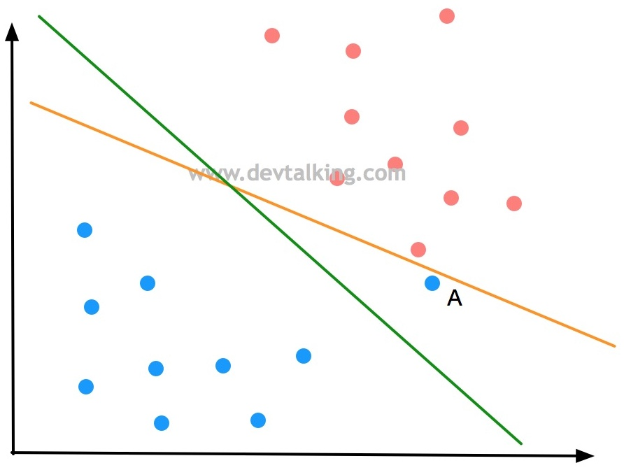
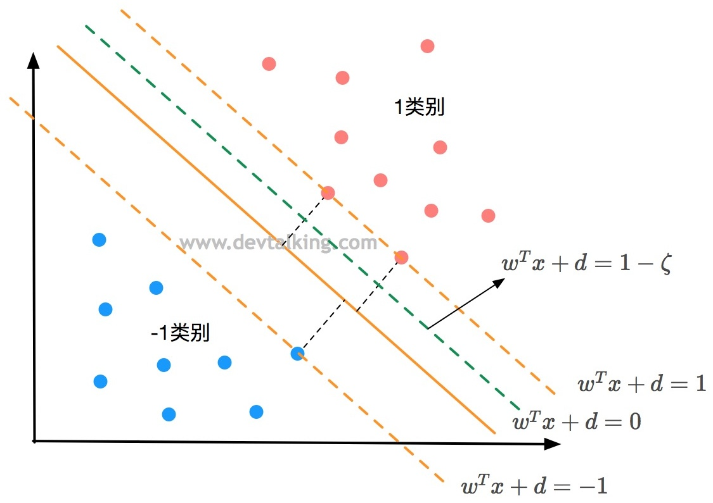
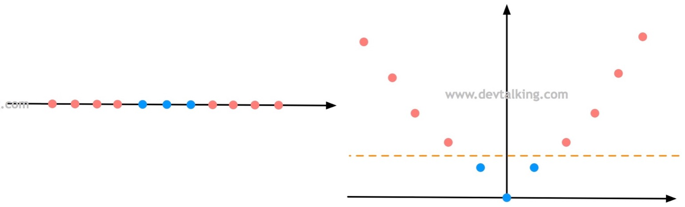
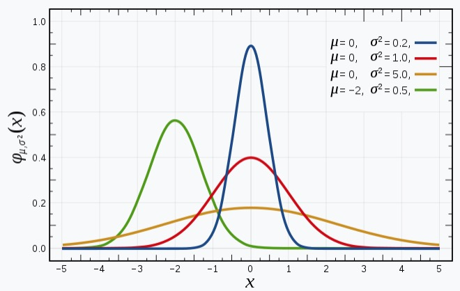
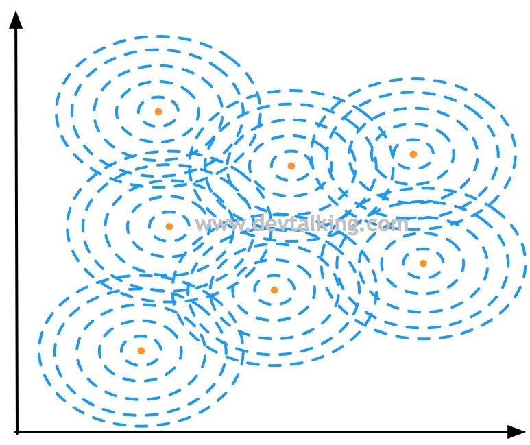
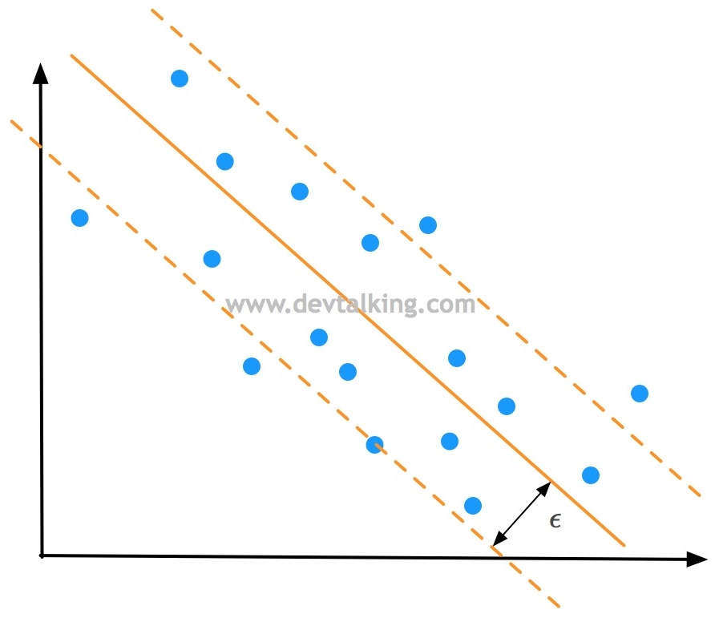

# 支持向量机

对于线性可分的两类数据有如下图的分布


> [!warning]
>
> 当两类数据间可以选择多条分类边界时，称为不适定问题。

支持向量机的算法的本质是找到一个在两类样本中间位置的分界线。

* 等价于两个类别距离分界线最近的点，到分界线的距离相等。
* 两个类别距离分界线最近的点，构成一个区域，理想条件下，这个区域内没有样本点。
* 两个类别距离分界线最近的点，被称为支撑向量。

支撑向量机算法：

1. 找到这些支撑向量。
2. 最大化margin。

如果数据是线性可分，或者在高维度线性可分，称为Hard Margin SVM。如数据线性不可分，找到分线或分界面称为Soft Margin SVM。

## Margin的数学表达

如果支撑向量，到分界线的距离定义为$d$，则两类支持向量间的距离$\text{margin}=2d$。

在$n$维空间中直线方程可以表示为$w^Tx+b=0$，也可以表示为$\theta^Tx_b=0$。点到直线的距离公式
$$
d=\frac{|w^Tx+b|}{||w||}
$$
其中$||w||=\sqrt{w_1^2+w_2^2+…+w_n^2}$。假设存在上述决策边界，则有
$$
\left\{\begin{matrix}
\frac{w^Tx^{(i)}+b}{||w||} \ge d & \forall y^{(i)}=1 \\
\frac{w^Tx^{(i)}+b}{||w||} \le -d  & \forall y^{(i)}=-1
\end{matrix}\right.
\Rightarrow
\left\{\begin{matrix}
\frac{w^Tx^{(i)}+b}{||w||d} \ge 1 & \forall y^{(i)}=1 \\
\frac{w^Tx^{(i)}+b}{||w||d} \le -1  & \forall y^{(i)}=-1
\end{matrix}\right.
$$
其中正样本是$1$，负样本是$-1$。上述式子可以化简为
$$
\left\{\begin{matrix}
w_d^Tx^{(i)}+b_d \ge 1 & \forall y^{(i)}=1 \\
w_d^Tx^{(i)}+b_d \le -1  & \forall y^{(i)}=-1
\end{matrix}\right.
$$
对于$w^Tx+b=0$两侧同时除$||w||d$，所以中间分界线的方程为
$$
w_d^Tx^{(i)}+b_d = 0
$$
重新定义直线的参数这有
$$
w^Tx+b = 1 \\
w^Tx+b = 0 \\
w^Tx+b = -1
$$
直线的示意图如下


支持向量机公式表示为
$$
\left\{\begin{matrix}
w^Tx^{(i)}+b \ge 1 & \forall y^{(i)}=1 \\
w^Tx^{(i)}+b_\le -1  & \forall y^{(i)}=-1
\end{matrix}\right.
$$
所以上面的分类器可以统一为
$$
y^{(i)}(w^Tx^{(i)}+b) \ge 1
$$
支持向量机的算法目标是最大化$d$。等价于
$$
\max \frac{|w^Tx+b|}{||w||}
$$
由于所有的$x$都是支撑向量，所以$|w^Tx+b|=1$，所以等价于
$$
\max \frac{1}{||w||}\Rightarrow \min||w|| \Rightarrow \min \frac{1}{2}||w||^2
$$
所以SVM的优化目标为
$$
\begin{cases}
y^{(i)}(w^Tx^{(i)}+b) \ge 1\\
\min \frac{1}{2}||w||^2 \\
\end{cases}
$$

在这个优化目标函数之间没有任何样本点，称为Hard Margin SVM。

> [!warning]
>
> 支持向量机的最优化是有条件的最优化问题。

## Soft Margin SVM

对于样本数据分布如下



决策边界直线看似很好的将蓝色和红色点完全区分开了，但是它的泛化能力是值得怀疑的，因为这条决策边界极大的受到了点A的影响，而点A可能是蓝色点中极为特殊的一个点，也有可能它根本就是一个错误的点。所以根据SVM的思想，比较合理的决策边界应该如下所示



更一般的情况是对于线性不可分数据


SVM分类器无法使得所有的$i\in M$满足下列公式
$$
y^{(i)}(w^Tx^{(i)}+b) \ge 1
$$

> [!warning]
>
> 为了能够正确分类，可以放松分类器的限制。

在Hard Margin SVM目标函数中增加一个宽松量，表示如下
$$
y^{(i)}(w^Tx^{(i)}+b) \ge 1-\zeta_i, \quad \zeta_i>0
$$

上面的目标函数表示，允许一些数据点分布在绿线和黄线之间，如下图所示



其中，对于每个样本数据存在不同$\zeta_i$。如果当$\zeta$无穷大时，意味着容错性无穷大，故而分不出类别。为控制$\zeta$的范围，增加正则项
$$
\min \left(\frac{1}{2}||w||^2+C\sum_i^m\zeta_i\right)
$$
其中$C$是超参数，用于平衡超参数的比例。Soft Margin SVM的分类器目标函数表示如下：
$$
\begin{cases}
y^{(i)}(w^Tx^{(i)}+b) \ge 1-\zeta_i, \quad \zeta_i>0\\
\min \left(\frac{1}{2}||w||^2+C\sum_i^m\zeta_i\right) \\
\end{cases}
$$
上面的目标函数相当于增加了L1正则。L2正则的目标函数表示如下
$$
\begin{cases}
y^{(i)}(w^Tx^{(i)}+b) \ge 1-\zeta_i, \quad \zeta_i>0\\
\min \left(\frac{1}{2}||w||^2+C\sum_i^m\zeta_i^2\right) \\
\end{cases}
$$

> [!warning]
>
> 对于线性不可分的情况，支持向量是由边界点和错误点共同组成。

## sk-learn中的svm

> [!attention]
>
> 使用SVM前需要对数据进行标准化处理。

导入鸢尾花数据集，选择两个类别和两个特征。

```python
import matplotlib.pyplot as plt
from sklearn import datasets

iris = datasets.load_iris()

x = iris.data
y = iris.target

x = x[y<2,:2]
y = y[y<2]

plt.scatter(x[y==0,0],x[y==0,1],color='red')
plt.scatter(x[y==1,0],x[y==1,1],color='blue')
plt.show()
```

对数据进行标准化处理

```python
from sklearn.preprocessing import StandardScaler

standardScaler = StandardScaler()
standardScaler.fit(x)
x_standard = standardScaler.transform(x)
```

导入SVM类，其中`C=1e9`取一个非常大的值，SVM分类器为Hard SVM，训练模型

```python
from sklearn.svm import LinearSVC

svc = LinearSVC(C=1e9)
svc.fit(x_standard,y)
```

绘制分类结果

```python
import numpy as np

def plot_decision_boundary(model,axis):
    x0,x1 = np.meshgrid(
        np.linspace(axis[0],axis[1],int((axis[1]-axis[0])*100)).reshape(-1,1),
        np.linspace(axis[2],axis[3],int((axis[3]-axis[2])*100)).reshape(-1,1)
    )
    x_new = np.c_[x0.ravel(),x1.ravel()]
    
    y_predict = model.predict(x_new)
    zz = y_predict.reshape(x0.shape)
    
    from matplotlib.colors import ListedColormap
    custom_cmap = ListedColormap(['#EF9A9A','#FFF59D','#90CAF9'])
    
    plt.contourf(x0,x1,zz,cmap=custom_cmap)
    
plot_decision_boundary(svc,axis=[-3,3,-3,3])
plt.scatter(x_standard[y==0,0],x_standard[y==0,1],color='red')
plt.scatter(x_standard[y==1,0],x_standard[y==1,1],color='blue')
plt.show()
```

当`C=0.01`时，SVM分类器为Soft SVM，训练模型

```python
svc2 = LinearSVC(C=0.01)
svc2.fit(x_standard,y)
```

绘制分类结果

```python
plot_decision_boundary(svc2,axis=[-3,3,-3,3])
plt.scatter(x_standard[y==0,0],x_standard[y==0,1],color='red')
plt.scatter(x_standard[y==1,0],x_standard[y==1,1],color='blue')
plt.show()
```

打印SVM分类器参数

```python
print(svc.coef_)
print(svc.intercept_)
```

绘制Hard SVM支持向量的边界和分类器边界

```python
def plot_svc_decision_boundary(model,axis):
    x0,x1 = np.meshgrid(
        np.linspace(axis[0],axis[1],int((axis[1]-axis[0])*100)).reshape(-1,1),
        np.linspace(axis[2],axis[3],int((axis[3]-axis[2])*100)).reshape(-1,1)
    )
    x_new = np.c_[x0.ravel(),x1.ravel()]
    
    y_predict = model.predict(x_new)
    zz = y_predict.reshape(x0.shape)
    
    from matplotlib.colors import ListedColormap
    custom_cmap = ListedColormap(['#EF9A9A','#FFF59D','#90CAF9'])
    
    plt.contourf(x0,x1,zz,cmap=custom_cmap)
    
    w = model.coef_[0]
    b = model.intercept_[0]
    
    # w0*x0 + w1*x1 + b = 0
    # => x1 = -w0/w1 * x0 - b/w1
    plot_x = np.linspace(axis[0],axis[1],200)
    up_y = -w[0]/w[1] * plot_x - b/w[1] + 1/w[1]
    down_y = -w[0]/w[1] * plot_x - b/w[1] - 1/w[1]
    
    up_index = (up_y >= axis[2]) & (up_y <= axis[3])
    down_index = (down_y >= axis[2]) & (down_y <= axis[3])
    plt.plot(plot_x[up_index],up_y[up_index],color='black')
    plt.plot(plot_x[down_index],down_y[down_index],color='black')
    
plot_svc_decision_boundary(svc,axis=[-3,3,-3,3])
plt.scatter(x_standard[y==0,0],x_standard[y==0,1],color='red')
plt.scatter(x_standard[y==1,0],x_standard[y==1,1],color='blue')
plt.show()
```

绘制Soft SVM支持向量的边界和分类器边界

```python
plot_svc_decision_boundary(svc2,axis=[-3,3,-3,3])
plt.scatter(x_standard[y==0,0],x_standard[y==0,1],color='red')
plt.scatter(x_standard[y==1,0],x_standard[y==1,1],color='blue')
plt.show()
```

> [!warning]
>
> sk-learn中SVM默认使用L2范式。

## 非线性数据分类

使用sk-learn的`datasets.make_moons`函数生成测试数据

```python
x, y = datasets.make_moons()
print(x.shape)
print(y.shape)
plt.scatter(x[y==0,0],x[y==0,1],color='red')
plt.scatter(x[y==1,0],x[y==1,1],color='blue')
plt.show()
```

给生成数据集添加扰动

```python
x, y = datasets.make_moons(noise=0.15, random_state=666)
plt.scatter(x[y==0,0],x[y==0,1],color='red')
plt.scatter(x[y==1,0],x[y==1,1],color='blue')
plt.show()
```

### 多项式特征

使用多项式特征对非线性数据分类

```python
from sklearn.preprocessing import PolynomialFeatures, StandardScaler
from sklearn.svm import LinearSVC
from sklearn.pipeline import Pipeline

def PolynomialSVC(degree, C=1.0):
    return Pipeline([
        ('poly', PolynomialFeatures(degree=degree)),
        ('std_scaler', StandardScaler()),
        ('linearSVC', LinearSVC(C=C))
    ])

poly_svc = PolynomialSVC(degree=3)
poly_svc.fit(x,y)
```

绘制分界面

```python
plot_decision_boundary(poly_svc,axis=[-1.5,2.5,-1.0,1.5])
plt.scatter(x[y==0,0],x[y==0,1],color='red')
plt.scatter(x[y==1,0],x[y==1,1],color='blue')
plt.show()
```

### 多项式核

SVM分类器中有多项式核函数可以直接对非线性数据进行分类，分类器为`SVC`，训练分类器

```python
from sklearn.svm import SVC

def PolynomialKernelSVC(degree, C=1.0):
    return Pipeline([
        ('std_scaler', StandardScaler()),
        ('kernelSVC', SVC(kernel='poly',degree=degree,C=C))
    ])

poly_kernel_svc = PolynomialKernelSVC(degree=3)
poly_kernel_svc.fit(x,y)
```

绘制分界面

```python
plot_decision_boundary(poly_kernel_svc,axis=[-1.5,2.5,-1.0,1.5])
plt.scatter(x[y==0,0],x[y==0,1],color='red')
plt.scatter(x[y==1,0],x[y==1,1],color='blue')
plt.show()
```

> [!warning]
>
> SVM最优化求解的方法是使用使用拉格朗日求极值，通过全部的训练样本寻找边界点。

其中目标函数
$$
\begin{cases}
y^{(i)}(w^Tx^{(i)}+b) \ge 1-\zeta_i, \quad \zeta_i>0\\
\min \left(\frac{1}{2}||w||^2+C\sum_i^m\zeta_i\right) \\
\end{cases}
$$
可以转换为如下形式
$$
\begin{cases}
\max\left(\sum_{i=1}^m\alpha_i-\frac{1}{2}\sum_{i=1}^m\sum_{j=1}^m \alpha_i\alpha_jy_iy_jx_ix_j \right)\\
\sum_{i=1}^m \alpha_iy_i, \quad  0\le \alpha_i \le C \\
\end{cases} 
\tag{1}
$$
其中当特征升维时有
$$
x^{(i)}\Rightarrow x^{’(i)} \\
x^{(j)}\Rightarrow x^{’(j)}
$$
公式 $(1)$ 中
$$
x_ix_j \Rightarrow x^{’(i)} x^{’(j)}
$$
核函数是找到一个函数$K$使得
$$
K(x_i,x_j) = x^{’(i)} x^{’(j)}
$$
则公式 $(1)$ 可以转换为
$$
\begin{cases}
\max\left(\sum_{i=1}^m\alpha_i-\frac{1}{2}\sum_{i=1}^m\sum_{j=1}^m \alpha_i\alpha_jy_iy_jK(x_i,x_j) \right)\\
\sum_{i=1}^m \alpha_iy_i, \quad  0\le \alpha_i \le C \\
\end{cases} 
\tag{1}
$$
其中函数$K$称为核函数。

> [!warning]
>
> 核函数这种转换方式，不止限于SVM分类器中。

多项式核函数为
$$
K(x, y)=(xy+ 1)^2
$$
对于核函数展开可得
$$
K(x, y)=(\sum_{i=1}^n x_i y_i+ 1)^2
=\sum_{i=1}^n x_i^2 y_i^2
+\sum_{i=2}^n\sum_{j=1}^{i-1} (\sqrt 2 x_i x_j)(\sqrt 2 y_i y_j)
+\sum_{i=1}^n \sqrt 2 x_i y_j + 1
$$
上述核函数，其实就相当于将原始特征$x$，根据多项式转换为新的特征$x'$
$$
x'=(x_n^2,…,x_1^2, \sqrt 2x_nx_{n-1},…,\sqrt 2x_2x_1,…,\sqrt 2x_n,…,\sqrt 2x_1,1)
$$
多项式核函数可以表示为
$$
K(x, y)=(xy + c)^d
$$
$d$代表多项式中的degree，$c$代表Soft Margin SVM中的$C$，是两个超参数。原始SVM中可以表示为
$$
K(x, y)=xy 
$$

### 高斯核函数

高斯核函数的数学公式为
$$
K(x, y)=e^{-\gamma\left \| x-y \right \|^2}
$$
高斯核函数也称为RBF核（Radial Basis Function Kernel）。特征升维可以使线性不可分的数据线性可分。



将高斯核函数中的$y$取两个定值$l_1$核$l_2$，这类点称为地标（Land Mark）。则全部特征可以转换为
$$
x\Rightarrow\left( e^{-\gamma\left \| x-l_1 \right \|^2}, e^{-\gamma\left \| x-l_2 \right \|^2}\right)
$$
使用程序模拟高斯核升维过程。生成模拟数据

```python
x = np.arange(-4, 5, 1)
y = np.array((x >= -2) & (x <= 2), dtype='int')
plt.scatter(x[y==0], [0]*len(x[y==0]))
plt.scatter(x[y==1], [0]*len(x[y==1]))
plt.show()
```

使用高斯核函数对数据进行升维

```python
def gaussian(x, l):
    gamma = 1.0
    return np.exp(-gamma * (x-l)**2)

l1, l2 = -1, 1

x_new = np.empty((len(x), 2))
for i, data in enumerate(x):
    x_new[i, 0] = gaussian(data, l1)
    x_new[i, 1] = gaussian(data, l2)
    
plt.scatter(x_new[y==0, 0], x_new[y==0, 1])
plt.scatter(x_new[y==1, 0], x_new[y==1, 1])
plt.show()
```

升维数据很容易使用线性模型分开。

> [!warning]
>
> 在高斯核中对于每一个数据点都是Land Mark，将原始$m\times n$的样本数据，通过高斯核函数转换后成为$m\times m$的数据。斯核函数的核心思想是，将每一个样本点映射到一个无穷维的特征空间。

正太分布公式如下
$$
f(x)=\frac{1}{\sigma\sqrt{2\pi}}e^{-\frac{1}{2}(\frac{x-\mu}{\sigma})^2}
$$
其中随着$\sigma$和$\mu$的变化，图像如下



高斯核函数与正太分布的形式上保持一致，而$\gamma$的值与$\sigma$成反比：

* $\gamma$越大，高斯分布越窄。
* $\gamma$越小，高斯分布越宽。

测试sk-learn中的高斯核，生成测试数据如下

```python
x, y = datasets.make_moons(noise=0.15, random_state=666)
plt.scatter(x[y==0, 0], x[y==0, 1])
plt.scatter(x[y==1, 0], x[y==1, 1])
plt.show()
```

训练SVM模型有，其中使用高斯核函数。

```python
def RBFKernelSVC(gamma=1.0):
    return Pipeline([
        ('std_scaler', StandardScaler()),
        ('svc', SVC(kernel='rbf', gamma=gamma))
    ])


rbf_svc = RBFKernelSVC(gamma=1.0)
rbf_svc.fit(x, y)
```

绘制决策边界，其中`gamma=1.0`

```python
plot_decision_boundary(rbf_svc, axis=[-1.5, 2.5, -1.0, 1.5])
plt.scatter(x[y==0, 0], x[y==0, 1])
plt.scatter(x[y==1, 0], x[y==1, 1])
plt.show()
```

当`gamma=100`时绘制决策边界

```python
svc_gamma_100 = RBFKernelSVC(gamma=100.0)
svc_gamma_100.fit(x, y)
plot_decision_boundary(svc_gamma_100, axis=[-1.5, 2.5, -1.0, 1.5])
plt.scatter(x[y==0, 0], x[y==0, 1])
plt.scatter(x[y==1, 0], x[y==1, 1])
plt.show()
```

对于每个样本点都有围绕它的一个高斯分布图，所以连起来就形成了一片区域，然后形成了决策区域和决策边界。



其中$\gamma$越大，高斯分布越窄。当`gamma=10`时绘制决策边界

```python
svc_gamma_10 = RBFKernelSVC(gamma=10.0)
svc_gamma_10.fit(x, y)
plot_decision_boundary(svc_gamma_10, axis=[-1.5, 2.5, -1.0, 1.5])
plt.scatter(x[y==0, 0], x[y==0, 1])
plt.scatter(x[y==1, 0], x[y==1, 1])
plt.show()
```

当`gamma=0.1`时绘制决策边界

```python
svc_gamma_01 = RBFKernelSVC(gamma=0.1)
svc_gamma_01.fit(x, y)
plot_decision_boundary(svc_gamma_01, axis=[-1.5, 2.5, -1.0, 1.5])
plt.scatter(x[y==0, 0], x[y==0, 1])
plt.scatter(x[y==1, 0], x[y==1, 1])
plt.show()
```

> [!warning]
>
> $\gamma$过大造成过拟合，$\gamma$过小造成欠拟合。$\gamma$实际上再调整模型复杂度。

### 核函数的总结

| 核函数                          | 公式                                       | 对应升维空间 |
| ------------------------------- | ------------------------------------------ | ------------ |
| 线性核<br />Linear Kernel       | $K( x_i, x)=\langle x_i, x \rangle$        | 原始特征空间 |
| 多项式核<br />Polynomial Kernel | $K( x_i, x)=(a\langle x_i, x \rangle+b)^d$ | 多项式空间   |
| 高斯核<br />Gaussian Kernel     | $K(x_i, x)=\exp{(-\gamma||x_i-x||^2)}$     | 无穷维空间   |

使用不同的核函数进行预测

```python
from sklearn import svm
from sklearn import datasets
from sklearn.model_selection import train_test_split as ts

iris = datasets.load_iris()
x = iris.data
y = iris.target
x_train, x_test, y_train, y_test = ts(x, y, test_size=0.3)

clf_rbf = svm.SVC(kernel='rbf')  # 高斯核函数
clf_rbf.fit(x_train, y_train)
score_rbf = clf_rbf.score(x_test, y_test)
print("The score of rbf is : %f" % score_rbf)

clf_linear = svm.SVC(kernel='linear')  # 线性和函数
clf_linear.fit(x_train, y_train)
score_linear = clf_linear.score(x_test, y_test)
print("The score of linear is : %f" % score_linear)

clf_poly = svm.SVC(kernel='poly')  # 多项式核函数
clf_poly.fit(x_train, y_train)
score_poly = clf_poly.score(x_test, y_test)
print("The score of poly is : %f" % score_poly)
```

## SVM解决回归问题

SVM解决回归问题的思路和解决分类问题的思路正好是相反的。找到一条拟合直线，使得这条直线的Margin区域中的样本点越多，说明拟合的越好，反之依然。



Margin边界到拟合直线的距离称为$\epsilon$是SVM解决回归问题的一个超参数。

导入波士顿房价数据集

```python
from sklearn.datasets import fetch_openml

boston = fetch_openml(data_id=531, as_frame=True)  # data_id=531 对应波士顿数据集
X = boston.data
X = X.astype(float)
y = boston.target
X_train, X_test, y_train, y_test = ts(X, y, random_state=666)
```

使用SVM进行回归预测

```python
from sklearn.svm import LinearSVR

def StandardLinearSVR(epsilon=0.1):
    return Pipeline([
        ('std_scaler', StandardScaler()),
        ('linearSVR', LinearSVR(epsilon=epsilon))
    ])

svr = StandardLinearSVR()
svr.fit(X_train, y_train)
print(svr.score(X_test, y_test))
```

