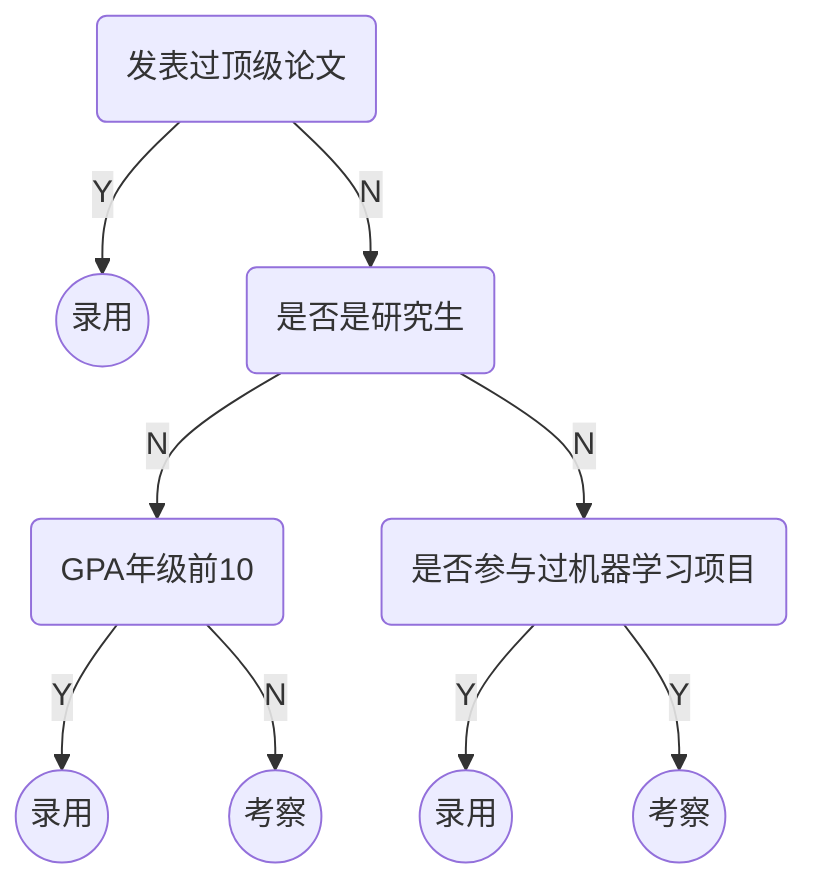
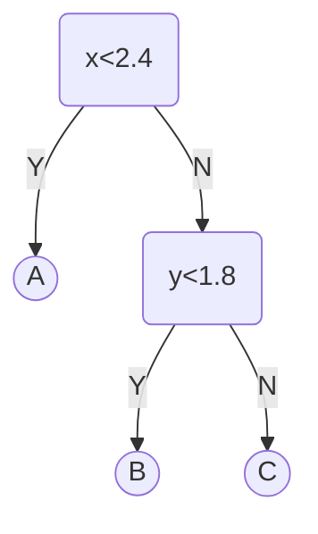
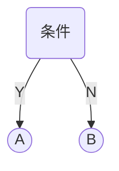

# 决策树

人工智能的招聘流程



决策树模型是一个树状结构，叶子节点为最后的分类。

> [!warning]
>
> 决策树模型包含所有计算机树模型的特征：包括根节点、叶子节点和深度等。
>
> 决策树的判断条件可以是：连续值、离散值（有大小）和离散值（没有大小）

使用公开的鸢尾花数据集

```python
import numpy as np
import matplotlib.pyplot as plt
from sklearn import datasets

iris = datasets.load_iris()
x = iris.data[:, 2:]
y = iris.target

plt.scatter(x[y==0, 0], x[y==0, 1])
plt.scatter(x[y==1, 0], x[y==1, 1])
plt.scatter(x[y==2, 0], x[y==2, 1])
```

训练决策树模型

```python
from sklearn.tree import DecisionTreeClassifier

dt_clf = DecisionTreeClassifier(max_depth=2, criterion='entropy', random_state=9)
dt_clf.fit(x, y)
```

观察分类结果

```python
def plot_decision_boundary(model, axis):
    x0, x1 = np.meshgrid(
        np.linspace(axis[0], axis[1], int((axis[1]-axis[0])*100)).reshape(-1, 1),
        np.linspace(axis[2], axis[3], int((axis[3]-axis[2])*100)).reshape(-1, 1),
    )
    X_new = np.c_[x0.ravel(), x1.ravel()]

    y_predict = model.predict(X_new)
    zz = y_predict.reshape(x0.shape)

    from matplotlib.colors import ListedColormap
    custom_cmap = ListedColormap(['#EF9A9A','#FFF59D','#90CAF9'])

    plt.contourf(x0, x1, zz, cmap=custom_cmap)
    
plot_decision_boundary(dt_clf, axis=[0.5, 7.5, 0, 3])
plt.scatter(x[y==0, 0], x[y==0, 1])
plt.scatter(x[y==1, 0], x[y==1, 1])
plt.scatter(x[y==2, 0], x[y==2, 1])
plt.show()
```

决策树分类过程



> [!attention]
>
> 决策树构建的永远是二叉树。
>
> 决策树是非参数学习算法，天然的可以用于多分类问题。也可以解决回归问题。
>
> 参数学习：假设模型拥有固定数量参数的学习方法。
>
> 非参数学习：参数数量随着数据规模的增长而变化的学习方法。

## 决策树的计算

决策树模型的目标是使两个类别可以分开。




> [!warning]
>
> 决策树构建的核心问题：
>
> 1. 如何度量两个类别数据的区分度。
> 2. 在哪个哪个特征的哪个值上进行进行划分构建决策树。

### 信息熵

信息熵代表随机变量的不确定度。熵越大，数据的不确定性越高；熵越小，数据的不确定性越低。
$$
H=-\sum_{i=1}^{k}p_i\log(p_i)
$$
$k$ 表示信息的种类，$p_i$ 表示每类信息占的比例，

| 概率                                           | 信息熵                                                       |
| ---------------------------------------------- | ------------------------------------------------------------ |
| $\{ \frac{1}{3},\frac{1}{3},\frac{1}{3} \} $   | $H=-\frac{1}{3}\log(\frac{1}{3})-\frac{1}{3}\log(\frac{1}{3})-\frac{1}{3}\log(\frac{1}{3})=1.0986$ |
| $\{ \frac{1}{10},\frac{2}{10},\frac{7}{10}\} $ | $H=-\frac{1}{10}\log(\frac{1}{10})-\frac{2}{10}\log(\frac{2}{10})-\frac{7}{10}\log(\frac{7}{10})=0.8018$ |
| $\{ 1,0,0 \} $                                 | $H=-1\log(1)=0$                                              |

对于二分类问题，信息熵计算公式如下：
$$
H=-\sum_{i=1}^{k}p_i\log(p_i)=-x\log(x)-(1-x)\log(1-x)
$$


> [!warning]
>
> 决策树划分的分界点是，使得数据整体的信息熵最低。当系统划分后，决策树的叶子节点只包含一种数据，系统的信息熵为0。
>
> 获得分界点过程是通过遍历所有数据。

### 基尼系数

$$
G=1-\sum_{i=1}^kp_i^2
$$

| 概率                                           | 信息熵                                                       |
| ---------------------------------------------- | ------------------------------------------------------------ |
| $\{ \frac{1}{3},\frac{1}{3},\frac{1}{3} \} $   | $G=1-(\frac{1}{3})^2-(\frac{1}{3})^2-(\frac{1}{3})^2=0.666$  |
| $\{ \frac{1}{10},\frac{2}{10},\frac{7}{10}\} $ | $G=1-(\frac{1}{10})^2-(\frac{2}{10})^2-(\frac{7}{10})^2=0.46$ |
| $\{ 1,0,0 \} $                                 | $G=1-1^2=0$                                                  |

对于二分类情况基尼系数为
$$
G=1-x^2-(1-x)^2=-2x^2+2x
$$

```python
import numpy as np
import matplotlib.pyplot as plt
from sklearn import datasets
from sklearn.tree import DecisionTreeClassifier

iris = datasets.load_iris()
x = iris.data[:, 2:]
y = iris.target
dt_clf = DecisionTreeClassifier(max_depth=2, criterion='gini', random_state=9)
dt_clf.fit(x, y)

def plot_decision_boundary(model, axis):
    x0, x1 = np.meshgrid(
        np.linspace(axis[0], axis[1], int((axis[1]-axis[0])*100)).reshape(-1, 1),
        np.linspace(axis[2], axis[3], int((axis[3]-axis[2])*100)).reshape(-1, 1),
    )
    X_new = np.c_[x0.ravel(), x1.ravel()]

    y_predict = model.predict(X_new)
    zz = y_predict.reshape(x0.shape)

    from matplotlib.colors import ListedColormap
    custom_cmap = ListedColormap(['#EF9A9A','#FFF59D','#90CAF9'])

    plt.contourf(x0, x1, zz, cmap=custom_cmap)


plot_decision_boundary(dt_clf, axis=[0.5, 7.5, 0, 3])
plt.scatter(x[y==0, 0], x[y==0, 1])
plt.scatter(x[y==1, 0], x[y==1, 1])
plt.scatter(x[y==2, 0], x[y==2, 1])
plt.show()
```

> [!attention]
>
> 大多情况下，使用信息熵和基尼系数划分决策树差别不大。信息熵计算比基尼系数稍慢。

## 决策树中的超参数

Sklearn 中使用的决策树是 Classification And Regression Tree (CART) ：根据某一维度的和某一阈值进行二分。

其他的决策树创建方法还包括：ID3，ID4.5，ID5.0。

> [!attention]
>
> 决策树容易参数过拟合现象。非参数学习算法都容易参数过拟合。

解决决策树的过拟合问题，可以使用剪枝的方法。

生成随机的测试数据

```python
import numpy as np
import matplotlib.pyplot as plt
from sklearn import datasets
from sklearn.tree import DecisionTreeClassifier

x, y = datasets.make_moons(noise=0.25, random_state=666)
plt.scatter(x[y==0, 0], x[y==0, 1])
plt.scatter(x[y==1, 0], x[y==1, 1])
plt.show()
```

生成决策树

```python
def plot_decision_boundary(model, axis):
    x0, x1 = np.meshgrid(
        np.linspace(axis[0], axis[1], int((axis[1]-axis[0])*100)).reshape(-1, 1),
        np.linspace(axis[2], axis[3], int((axis[3]-axis[2])*100)).reshape(-1, 1),
    )
    X_new = np.c_[x0.ravel(), x1.ravel()]

    y_predict = model.predict(X_new)
    zz = y_predict.reshape(x0.shape)

    from matplotlib.colors import ListedColormap
    custom_cmap = ListedColormap(['#EF9A9A','#FFF59D','#90CAF9'])

    plt.contourf(x0, x1, zz, cmap=custom_cmap)
    
dt_clf = DecisionTreeClassifier()
dt_clf.fit(x, y)
    
plot_decision_boundary(dt_clf, axis=[-1.5, 2.5, -1.0, 1.5])
plt.scatter(x[y==0, 0], x[y==0, 1])
plt.scatter(x[y==1, 0], x[y==1, 1])
plt.show()
```

1. 现在决策树的深度

```python
dt_clf2 = DecisionTreeClassifier(max_depth=2)
dt_clf2.fit(x, y)

plot_decision_boundary(dt_clf2, axis=[-1.5, 2.5, -1.0, 1.5])
plt.scatter(x[y==0, 0], x[y==0, 1])
plt.scatter(x[y==1, 0], x[y==1, 1])
plt.show()
```

2. 控制节点拆分的数据数量

```python
dt_clf3 = DecisionTreeClassifier(min_samples_split=10)
dt_clf3.fit(x, y)

plot_decision_boundary(dt_clf3, axis=[-1.5, 2.5, -1.0, 1.5])
plt.scatter(x[y==0, 0], x[y==0, 1])
plt.scatter(x[y==1, 0], x[y==1, 1])
plt.show()
```

3. 控制叶子中节点中数据的数量

```python
dt_clf4 = DecisionTreeClassifier(min_samples_leaf=6)
dt_clf4.fit(x, y)

plot_decision_boundary(dt_clf4, axis=[-1.5, 2.5, -1.0, 1.5])
plt.scatter(x[y==0, 0], x[y==0, 1])
plt.scatter(x[y==1, 0], x[y==1, 1])
plt.show()
```

4. 控制叶子节点的数量

```python
dt_clf5 = DecisionTreeClassifier(max_leaf_nodes=4)
dt_clf5.fit(x, y)

plot_decision_boundary(dt_clf5, axis=[-1.5, 2.5, -1.0, 1.5])
plt.scatter(x[y==0, 0], x[y==0, 1])
plt.scatter(x[y==1, 0], x[y==1, 1])
plt.show()
```

## 决策树解决回归问题

> [!warning]
>
> 计算叶子节点中数据的平均值可以用于回归问题的预测。

使用波士顿房价进行回归预测

```python
import numpy as np
import matplotlib.pyplot as plt
from sklearn import datasets
from sklearn.model_selection import train_test_split
from sklearn.tree import DecisionTreeRegressor

boston = datasets.load_boston()

x = boston.data
y = boston.target

x_train, x_test, y_train, y_test = train_test_split(x, y, random_state=666)

dt_reg = DecisionTreeRegressor()
dt_reg.fit(x_train, y_train)
```

评价模型在测试集上的表现

```python
dt_reg.score(x_test, y_test)
```

评价模型在训练集上的表现

```python
dt_reg.score(x_train, y_train)
```

## 决策树算法的局限性

> [!attention]
>
> 1. 决策树的分类曲线通常都是直线
> 2. 决策树对特殊数据比较敏感

对于4个点分类问题，决策树边界


逻辑回归边界


对于线性可分的数据集


