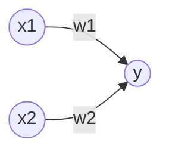

# 感知机

感知机是由美国学者Frank Rosenblatt在1957年提出的，是神经网络（深度学习）起源的算法之一，是一种线性二分类模型。

感知机接收多个输入信号，输出一个信号。感知机中所有的信号值只有1和0两个。



$x_1$和$x_2$输入信号，$y$是输出信号，$w_1$和$w_2$是权重，输入信号与权重的乘积超过某个界限时，输出为1，否则为0。
$$
y=
\begin{cases}
 0 & \text{ if } & w_1x_1+w_2x_2 \le \theta  \\
 1 & \text{ if } & w_1x_1+w_2x_2 >  \theta
\end{cases} \tag{1}
$$
> [!warning]
>
> 感知机中的权重表示输入信号的重要程度，权重越大，对应该权重的信号的重要性就越高。

使用感知机来模拟逻辑与。根据 公式 $(1)$ 所示，满足条件的参数有无数组，假设选择参数$(w_1, w_2,\theta)=(0.5, 0.5, 0.7)$。

```python
def AND(x1, x2):
    w1, w2, theta = 0.5, 0.5, 0.7
    tmp = x1*w1 + x2*w2
    if tmp <= theta:
        return 0
    elif tmp > theta:
        return 1
    
print(AND(0, 0))
print(AND(1, 0))
print(AND(0, 1))
print(AND(1, 1))
```

增加偏置项$b$ 公式 $(1)$ 可以表示为
$$
y=
\begin{cases}
 0 & \text{ if } & b+w_1x_1+w_2x_2 \le 0  \\
 1 & \text{ if } & b+w_1x_1+w_2x_2 >  0
\end{cases} \tag{2}
$$

> [!warning]
>
> 偏置$b$条件了神经元被激活的容易程度。

$w_1$、$w_2$和$b$统称为权重，使用Numpy优化上述过程。

```python
import numpy as np

def AND(x1, x2):
    x = np.array([x1, x2])
    w = np.array([0.5, 0.5])
    b = -0.7
    tmp = np.sum(w*x) + b
    if tmp <= 0:
        return 0
    else:
        return 1
    
print(AND(0, 0))
print(AND(1, 0))
print(AND(0, 1))
print(AND(1, 1))
```

使用感知机来模拟逻辑或

```python
def OR(x1, x2):
    x = np.array([x1, x2])
    w = np.array([0.5, 0.5])
    b = -0.2
    tmp = np.sum(w*x) + b
    if tmp <= 0:
        return 0
    else:
        return 1
    
print(OR(0, 0))
print(OR(1, 0))
print(OR(0, 1))
print(OR(1, 1))
```

使用感知机模拟逻辑与非

```python
def NAND(x1, x2):
    x = np.array([x1, x2])
    w = np.array([-0.5, -0.5])
    b = 0.7
    tmp = np.sum(w*x) + b
    if tmp <= 0:
        return 0
    else:
        return 1
    
print(NAND(0, 0))
print(NAND(1, 0))
print(NAND(0, 1))
print(NAND(1, 1))
```

## 感知机的局限性

对于逻辑异或来说

| $x_1$ | $x_2$ | $y$  |
| ----- | ----- | ---- |
| 0     | 0     | 0    |
| 1     | 0     | 1    |
| 0     | 1     | 1    |
| 1     | 1     | 0    |

单一的感知机无法实现逻辑异或，假设权重参数$(b, w_1, w_2)=(-0.5, 1, 1)$， 公式 $(2)$ 可表示为
$$
y=
\begin{cases}
 0 & \text{ if } & -0.5+x_1+x_2 \le 0  \\
 1 & \text{ if } & -0.5+x_1+x_2 >  0
\end{cases}
$$
比较逻辑与和逻辑或，逻辑异或在二维平面上可以表示如下图。


感知机的局限性就在于它只能表示由一条直线分割的空间。如何想分割逻辑异或，只能使用如下曲线。


### 多层感知机

虽然一层感知机不能表示异或，但是通过感知机的多层组合可以实现异或的运算。

| $x_1$ | $x_2$ | $s_1=\text{NAND}(x_1, x_2)$ | $s_2=\text{OR}(x_1, x_2)$ | $y=\text{AND}(S_1, S_2)$ |
| ----- | ----- | --------------------------- | ------------------------- | ------------------------ |
| 0     | 0     | 1                           | 0                         | 0                        |
| 1     | 0     | 1                           | 1                         | 1                        |
| 0     | 1     | 1                           | 1                         | 1                        |
| 1     | 1     | 0                           | 1                         | 0                        |

使用感知机来模拟逻辑异或

```python
def XOR(x1, x2):
    s1 = NAND(x1, x2)
    s2 = OR(x1, x2)
    y = AND(s1, s2)
    return y

print(XOR(0, 0))
print(XOR(1, 0))
print(XOR(0, 1))
print(XOR(1, 1))
```

多层感知机的结构如下


> [!warning]
>
> 通过构造多层感知机，可以解决线性不可分的问题。
