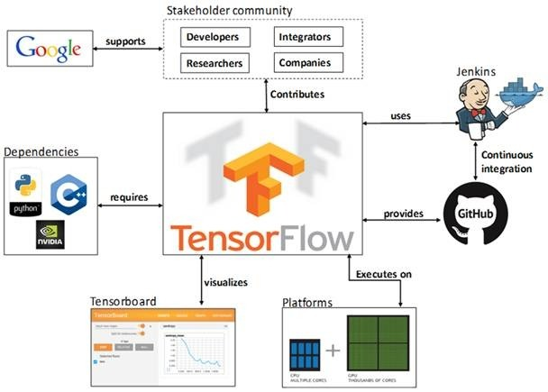
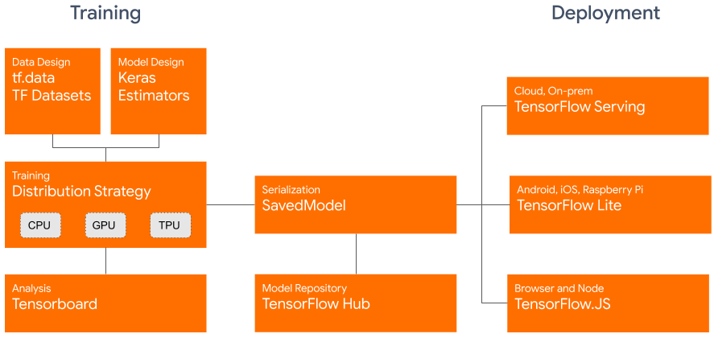

# Tensorflow

2015年11月9日，Google发布深度学习框架[TensorFlow](https://www.tensorflow.org/?hl=zh-cn)并宣布开源，并迅速得到广泛关注，在图形分类、音频处理、推荐系统和自然语言处理等场景下都被大面积推广。支持Python和C++接口，目前到2.x版本。

* TF托管在github平台，有google groups和contributors共同维护。
* TF提供了丰富的深度学习相关的API，支持Python和C/C++接口。
* TF提供了可视化分析工具Tensorboard，方便分析和调整模型。
* TF支持Linux平台，Windows平台，Mac平台，甚至手机移动设备等各种平台。

TensorFlow 2.x版本，将专注于简单性和易用性

训练过程

- `tf.data`用于加载训练用的原始数据，数据可以是公开数据集，也可以是私有数据集，数据格式为TF Datasets
- `tf. Keras`（官方推荐）或Premade Estimators用于构建、训练和验证模型。
- eager execution用于运行和调试。
- distribution strategy用于进行分布式训练，支持单机多卡以及多机多卡的训练场景。

可视化

* Tensorboard可视化分析。

模型仓库

* TensorFlow hub用于保存训练好的TensorFlow模型，供推理或重新训练使用。

部署

* TensorFlow Serving，即TensorFlow允许模型通过REST以及gPRC对外提供服务
* TensorFlow Lite，即TensorFlow针对移动和嵌入式设备提供了轻量级的解决方案
* TensorFlow.js，即TensorFlow支持在 JavaScript 环境中部署模型
* TensorFlow 还支持其他语言 包括 C, Java, Go, C#, Rust 等