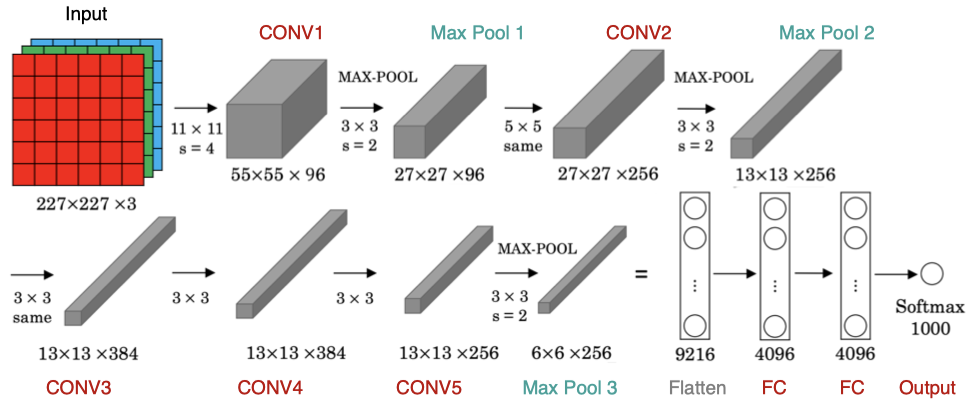
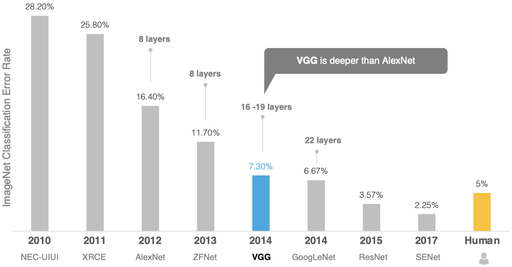
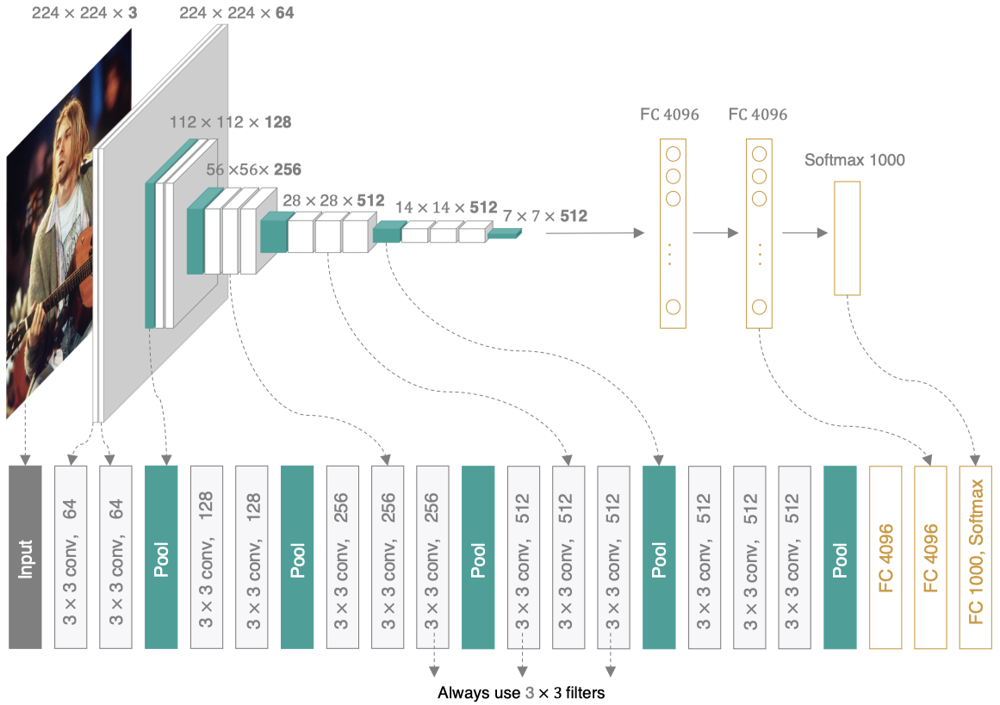
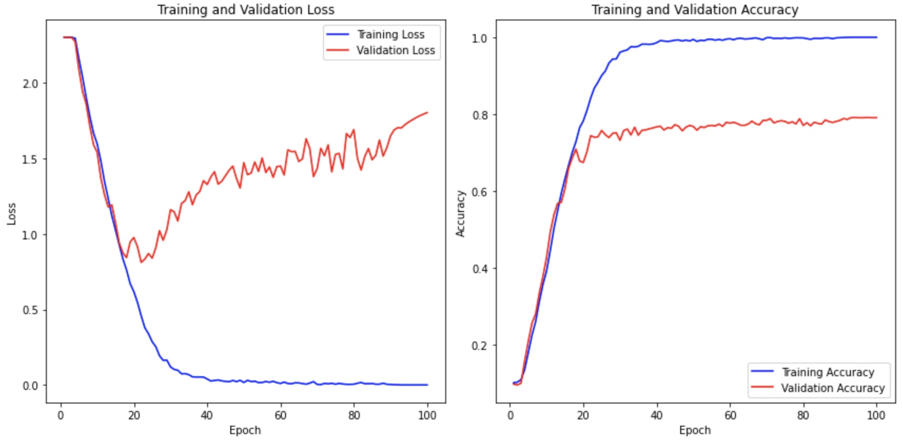

# 几种经典的分类模型

## AlexNet


2012年，AlexNet横空出世，该模型的名字源于论文第一作者的姓名Alex Krizhevsky 。AlexNet使用了8层卷积神经网络，以大优势赢得了ImageNet 2012图像识别挑战赛，它首次证明了学习到的特征可以超越人工设计的特征。

相关论文：[ImageNet Classification with Deep Convolutional Neural Networks](https://proceedings.neurips.cc/paper_files/paper/2012/file/c399862d3b9d6b76c8436e924a68c45b-Paper.pdf)

AlexNet与LeNet的设计理念非常相似



该网络的特点是：

1. AlexNet包含8层变换，有5层卷积和2层全连接隐藏层，以及1个全连接输出层。
2. AlexNet第一层中的卷积核形状是11×11。第二层中的卷积核形状减小到5×5，之后全采用3×3。所有的池化层窗口大小为3×3、步幅为2的最大池化。
3. AlexNet将sigmoid激活函数改成了ReLU激活函数，使计算更简单，网络更容易训练
4. AlexNet通过dropout来控制全连接层的模型复杂度。
5. AlexNet引入了大量的图像增强，如翻转、裁剪和颜色变化，从而进一步扩大数据集来缓解过拟合。

### 构建网络

```python
import tensorflow as tf
from tensorflow import keras

net = keras.models.Sequential([
    keras.layers.Conv2D(filters=96, kernel_size=11, strides=4, activation='relu'),
    keras.layers.MaxPool2D(pool_size=3, strides=2),
    keras.layers.Conv2D(filters=256, kernel_size=5, padding='same', activation='relu'),
    keras.layers.MaxPool2D(pool_size=3, strides=2),
    keras.layers.Conv2D(filters=384, kernel_size=3, padding='same', activation='relu'),
    keras.layers.Conv2D(filters=384, kernel_size=3, padding='same', activation='relu'),
    keras.layers.Conv2D(filters=256, kernel_size=3, padding='same', activation='relu'),
    keras.layers.MaxPool2D(pool_size=3, strides=2),
    keras.layers.Flatten(),
    keras.layers.Dense(4096, activation='relu'),
    keras.layers.Dropout(0.5),
    keras.layers.Dense(4096, activation='relu'),
    keras.layers.Dropout(0.5),
    keras.layers.Dense(10, activation='softmax')
])

X = tf.random.uniform((1, 227, 227, 1))
y = net(X)
print(net.summary())
```

### 数据读取

```python
from tensorflow.keras.datasets import mnist
import numpy as np

(train_images, train_labels), (test_images, test_labels) = mnist.load_data()

train_images = np.reshape(train_images, (train_images.shape[0], train_images.shape[1], train_images.shape[2], 1))
test_images = np.reshape(test_images, (test_images.shape[0], test_images.shape[1], test_images.shape[2], 1))
print(train_images.shape)
print(test_images.shape)
```

抽样部分数据并放大到227

```python
def preprocess_images(images, labels):
    images = tf.image.resize_with_pad(images, 227, 227)  # 上采样到 227x227
    images = images / 255.0  # 归一化
    return images, labels
```

显示缩放数据

```python
import matplotlib.pyplot as plt

demo_train = train_images[:9]
demo_labels = train_labels[:9]
demo_train, demo_labels = preprocess_images(demo_train, demo_labels)
print(demo_train.shape)

plt.figure(figsize=(8, 8))
for i in range(9):
    plt.subplot(3, 3, i + 1)
    plt.imshow(demo_train[i, :, :, 0], cmap='gray')  # 去掉通道维度并显示灰度图
    plt.title(f"Label: {demo_labels[i]}")  # 显示对应的标签
    plt.axis('off')
plt.show()
```

生成训练和测试数据

```python
train_dataset = tf.data.Dataset.from_tensor_slices((train_images, train_labels))
train_dataset = train_dataset.map(preprocess_images).batch(128).prefetch(tf.data.experimental.AUTOTUNE)

test_dataset = tf.data.Dataset.from_tensor_slices((test_images, test_labels))
test_dataset = test_dataset.map(preprocess_images).batch(128).prefetch(tf.data.experimental.AUTOTUNE)
```

### 编译和训练模型

创建文件夹

```shell
!mkdir ./graph
```

设置优化器和tensroborad

```python
optimizer = tf.keras.optimizers.SGD(learning_rate=0.01, momentum=0.0, nesterov=False)
net.compile(optimizer=optimizer, loss='sparse_categorical_crossentropy', metrics=['accuracy'])
tensorboard = keras.callbacks.TensorBoard(log_dir='./graph', histogram_freq=1, write_graph=True,write_images=True)
```

训练模型

```python
net.fit(train_dataset, epochs=10, verbose=1, validation_data=test_dataset, callbacks=[tensorboard])
```

* `validation_data`参数是设置验证集。
* `validation_split`使用训练集中的比例数据为验证集。
  * 适合NumPy数组或TensorFlow张量。
  * `tf.data.Dataset`数据不支持。

打印预测错误的数据

```python
predictions = net.predict(test_dataset)

# 获取预测类别
predicted_classes = np.argmax(predictions, axis=1)

# 获取真实标签，从 dataset 中提取标签
true_labels = np.concatenate([y for x, y in test_dataset], axis=0)

# 找出预测错误的索引
incorrect_indices = np.where(predicted_classes != true_labels)[0]

# 从测试集中提取图像数据
test_images_np = np.concatenate([x for x, y in test_dataset], axis=0)

# 查看预测错误的图像和信息
num_incorrect = len(incorrect_indices)
print(f"Total incorrect predictions: {num_incorrect}")

if num_incorrect > 0:  # 如果有预测错误的图片，则打印出来
    num_to_display = min(25, num_incorrect)  # 最多显示 25 张图片，防止过多输出
    print(f"Displaying {num_to_display} incorrect predictions:")
    
    fig, axes = plt.subplots(5, 5, figsize=(10, 10))  # 创建一个 5x5 的子图网格
    axes = axes.flatten()  # 将子图数组展平，方便索引

    for i, index in enumerate(incorrect_indices[:num_to_display]):
        image = test_images_np[index, :, :, 0] # 获取图像并去除通道维度
        ax = axes[i]
        ax.imshow(image, cmap='gray')  # 使用灰度图显示
        ax.set_title(f"P:{predicted_classes[index]}, T:{true_labels[index]}")
        ax.axis('off')

    plt.tight_layout() # 调整子图布局，避免重叠
    plt.show()
else:
    print("No incorrect predictions found.")
```

## VGGNet

2014年，牛津大学计算机视觉组（Visual Geometry Group）和Google DeepMind公司的研究员一起研发出了新的深度卷积神经网络：VGGNet，并取得了ILSVRC2014比赛分类项目的第二名，主要贡献是使用很小的卷积核(3×3)构建卷积神经网络结构，能够取得较好的识别精度，常用来提取图像特征的VGG-16和VGG-19。



相关论文：[Very Deep Convolutional Networks for Large-Scale Image Recognition](https://arxiv.org/pdf/1409.1556)

VGG可以看成是加深版的AlexNet，整个网络由卷积层和全连接层叠加而成，和AlexNet不同的是，VGG中使用的都是小尺寸的卷积核。



VGGNet的主要改特点：

1. 更深的网络结构。VGGNet 的一个主要特点是其深度，通常有16到19层。通过增加网络深度，提高了模型的表达能力，可以学习到更复杂的特征。
2. 更小的卷积核。VGGNet 使用了3x3的卷积核。VGGNet认为，多个3x3的卷积核串联起来可以达到与大卷积核相同的感受野，但参数量更少，计算效率更高。
3. 连续的卷积层。VGGNet使用了多个连续的3x3卷积层。这种连续的卷积层可以更好地提取图像的局部特征，并减少参数量。
4. 更小的步幅。VGGNet使用了1个像素的步幅。更小的步幅可以保留更多的图像信息，提高模型的准确性。
5. 更多的池化层。VGGNet使用了更多的最大池化层，可以有效地减少特征图的尺寸，降低计算量，并提高模型的鲁棒性。

### 构建网络

VGG网络可以看做由多个VGG模块构成，定义一个VGG模块生成函数

```python
from tensorflow import keras

def vgg_block(num_convs, num_filters):
    blk = keras.models.Sequential()
    for _ in range(num_convs):
        blk.add(keras.layers.Conv2D(num_filters, 
                                    kernel_size=3, 
                                    padding='same',
                                    activation='relu'))
    blk.add(keras.layers.MaxPool2D(pool_size=2, strides=2))
    return blk
```

* `num_convs`卷积层的数量。
* `num_filters`卷积核的数量。

定义卷积模块数量

```python
conv_arch = ((2, 64), (2, 128), (3, 256), (3, 512), (3, 512))
```

生成卷积网络

```python
def vgg(conv_arch, input_shape): 
    input_tensor = keras.Input(shape=input_shape)  
    x = input_tensor

    for (num_convs, num_filters) in conv_arch:
        x = vgg_block(num_convs, num_filters)(x)  

    x = keras.layers.Flatten()(x)
    x = keras.layers.Dense(4096, activation='relu')(x)
    x = keras.layers.Dropout(0.5)(x)
    x = keras.layers.Dense(4096, activation='relu')(x)
    x = keras.layers.Dropout(0.5)(x)
    output_tensor = keras.layers.Dense(10, activation='softmax')(x)

    net = keras.Model(inputs=input_tensor, outputs=output_tensor)  
    return net

input_shape = (32, 32, 3)  
vgg_16 = vgg(conv_arch, input_shape)
print(vgg_16.summary())
```

### CIFAR-10数据训练模型

导入数据集并归一化

```python
from tensorflow.keras.datasets import cifar10
from sklearn.model_selection import train_test_split

(train_images, train_labels), (test_images, test_labels) = cifar10.load_data()

train_images = train_images.astype('float32') / 255.0
test_images = test_images.astype('float32') / 255.0

train_images, val_images, train_labels, val_labels = train_test_split(
    train_images, train_labels, test_size=0.2, random_state=42
)

print(train_images.shape)
print(val_images.shape)
```

编译模型

```python
optimizer = keras.optimizers.SGD(learning_rate=0.01, 
                                 momentum=0.9, 
                                 weight_decay=0.0005)
vgg_16.compile(optimizer=optimizer, loss='sparse_categorical_crossentropy', metrics=['accuracy'])
tensorboard = keras.callbacks.TensorBoard(log_dir='./graph', histogram_freq=1, write_graph=True, write_images=True)
```

训练模型1

```python
history = vgg_16.fit(train_images, 
                     train_labels, 
                     epochs=100, 
                     batch_size=256, 
                     validation_data=(val_images, val_labels), 
                     verbose=1, 
                     callbacks=[tensorboard])
```

测试得分

```python
score = vgg_16.evaluate(test_images, test_labels, verbose=1)
print('测试集准确率:', score)
```

测试集的准确率在0.78左右。绘制损失曲线

```python
import matplotlib.pyplot as plt

plt.figure(figsize=(12, 6))
plt.subplot(1, 2, 1)  # 1 行 2 列的第一个子图
plt.plot(epochs, loss, 'b', label='Training Loss')
plt.plot(epochs, val_loss, 'r', label='Validation Loss')
plt.title('Training and Validation Loss')
plt.xlabel('Epoch')
plt.ylabel('Loss')
plt.legend()

plt.subplot(1, 2, 2)  # 1 行 2 列的第二个子图
plt.plot(epochs, acc, 'b', label='Training Accuracy')
plt.plot(epochs, val_acc, 'r', label='Validation Accuracy')
plt.title('Training and Validation Accuracy')
plt.xlabel('Epoch')
plt.ylabel('Accuracy')
plt.legend()

plt.tight_layout() 
plt.show()
```



[TensorFlow VGG16网络实现Cifar-10图像分类](https://blog.csdn.net/xun__Meng/article/details/89194148) 文章中训练的VGG-16网络在CIFAR-10准确率可以达到0.92。

