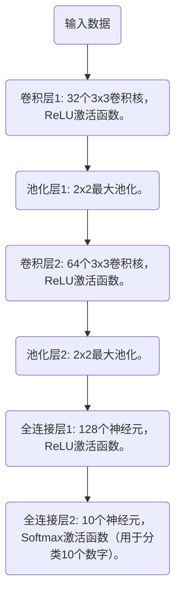

# 数字图像识别

## 数字图像识别

mnist 数据集，获取完整的mnist数据集

```python
import numpy as np
from sklearn.preprocessing import OneHotEncoder
from matplotlib import pyplot as plt
from keras.datasets import mnist


def _get_data():
    (x_train, t_train), (x_test, t_test) = mnist.load_data()
    return x_train, x_test, t_train, t_test


def _change_one_hot_label(x):
    encoder = OneHotEncoder(sparse=False)
    t_train_onehot = encoder.fit_transform(x.reshape(-1, 1))
    return t_train_onehot


def load_mnist(normalize=True, flatten=True, one_hot_label=False):
    x_train, x_test, t_train, t_test = _get_data()

    if normalize:
        x_train = x_train.astype(np.float32)
        x_test = x_test.astype(np.float32)
        x_train /= 255.0
        x_test /= 255.0

    if one_hot_label:
        t_train = _change_one_hot_label(t_train)
        t_test = _change_one_hot_label(t_test)

    if flatten:
        x_train = x_train.reshape(x_train.shape[0], -1)
        x_test = x_test.reshape(x_test.shape[0], -1)

    return (x_train, t_train), (x_test, t_test)
  
  
if __name__ == '__main__':
    (x_train, t_train), (x_test, t_test) = load_mnist(one_hot_label=True)
    print(x_train[10].shape)
    print(x_train[10])
    print(t_train[10])

```

设计如下网络对数据进行识别


## 设计已经卷积神经网



```python
Conv2D # keras 卷积层函数
MaxPooling2D # 池化层函数
Flatten # 展开函数
```

```python
from keras.datasets import mnist
from keras.models import Sequential
from keras.layers import Conv2D, MaxPooling2D, Flatten, Dense
from tensorflow.keras.utils import to_categorical

# 加载MNIST数据集
(train_images, train_labels), (test_images, test_labels) = mnist.load_data()

# 预处理数据
# 将图像数据重塑为4D张量： (样本数量, 高度, 宽度, 通道数)
train_images = train_images.reshape((60000, 28, 28, 1))
test_images = test_images.reshape((10000, 28, 28, 1))

# 将图像数据类型转换为float32，并归一化到0-1区间
train_images = train_images.astype('float32') / 255.0
test_images = test_images.astype('float32') / 255.0

# 将标签进行one-hot编码
train_labels = to_categorical(train_labels, 10)
test_labels = to_categorical(test_labels, 10)

# 创建序列模型
model = Sequential()

# 卷积层1：32个3x3卷积核，ReLU激活函数
model.add(Conv2D(32, (3, 3), activation='relu', input_shape=(28, 28, 1)))

# 池化层1：2x2最大池化
model.add(MaxPooling2D(pool_size=(2, 2)))

# 卷积层2：64个3x3卷积核，ReLU激活函数
model.add(Conv2D(64, (3, 3), activation='relu'))

# 池化层2：2x2最大池化
model.add(MaxPooling2D(pool_size=(2, 2)))

# 将多维输入展平成一维
model.add(Flatten())

# 全连接层1：128个神经元，ReLU激活函数
model.add(Dense(128, activation='relu'))

# 全连接层2：10个神经元，Softmax激活函数（用于分类10个数字）
model.add(Dense(10, activation='softmax'))

# 编译模型
model.compile(optimizer='adam',
              loss='categorical_crossentropy',
              metrics=['accuracy'])

# 训练模型
model.fit(train_images, train_labels, epochs=5, batch_size=64, validation_split=0.1)

# 评估模型
test_loss, test_acc = model.evaluate(test_images, test_labels)
print(f'Test accuracy: {test_acc}')
```

查看网络参数

```python
model.summary()
```

