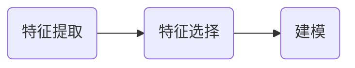

# 人工智能与计算机视觉

人工智能在视觉方向的应用

- 图像分类
- 图像检索
- 目标检测
- 图像分割

- 图像生成
- 目标跟踪
- 超分辨率重构
- 关键点定位
- 图像降噪
- 多模态
- 图像加密
- 视频编解码
- 3D视觉

## 图像的基本知识

### 颜色空间

颜色空间也称彩色模型，用于描述色彩。

常见颜色空间：RGB、CMYK、YUV、HSV模型

### RGB色彩模式

RGB色彩模式是工业解的一种颜色标准，通过对红（R）、绿（G）、蓝（B）三个颜色通道的变化以及它们相互之间的叠加来得到各式各样的颜色。红、绿、蓝三个颜色通道每种颜色各分为256阶亮度。


### HSV色彩模式

色相（Hue）：指物体传导或反射的波长。更常见的是以颜色如红色、橘色或绿色来辨识，取0到360度的数值来衡量。

饱和度（Saturation）：又称色度，是指色彩的强度或纯度，取值范围为0%到100%。

明度（Value）：表示颜色明亮度，取值范围为0%（黑）到100%（白）。


### 灰度图

灰度图通常由一个unit8、unit16、单精度类型或者双精度类型的数据描述。

彩色图像转换为灰度图像有多种算法：

1. $\text{Gray}=R\times0.3+G\times0.59+B\times0.11$
2. $\text{Gray}=\frac{R+G+B}{3}$​
3. $\text{Gray}=G$

## 图像处理的常见概念

### 亮度、对比度和饱和度

亮度：指图像的明亮程度，通常用0%到100%的百分比来表示，0%表示完全黑暗，100%表示完全明亮。图像的亮度由图像中所有像素的平均值决定。亮度越高的图像，整体看起来越明亮；亮度越低的图像，整体看起来越昏暗。

对比度：指图像中明暗区域之间的差异程度。对比度越强，明暗区域之间的差异就越大，图像显得越清晰、层次分明；对比度越弱，明暗区域之间的差异就越小，图像显得越平淡、模糊。

饱和度：指颜色的纯度或鲜艳程度。饱和度越高，颜色越鲜艳、浓郁；饱和度越低，颜色越灰暗、苍白。饱和度为0时，颜色就变成灰色。

对于亮度和对比度，可以从RGB图像上进行数据增强。

对于饱和度，可以从HSV/HSI/HSL色彩空间上进行增强。

### 图像平滑/降噪

图像平滑是指用于突出图像的宽大区域、低频成分、主干部分或抑制图像噪声和干扰高频成分的图像处理方法，使图像亮度平滑渐变，减小突变梯度，改善图像质量。图像平滑的方法有：

* 归一化滤波器
* 高斯滤波器
* 中值滤波器
* 双边滤波器


### 图像锐化

图像锐化与图像平滑是相反的操作，锐化是通过增强高频部分来减少图像中的模糊，增强图像细节边缘和轮廓，增强灰度反差，便于后期对目标的识别和处理。

方法包括：微分法和高通滤波。


### 边缘提取

通过微分的方式可以计算图像的边缘

* Roberts算子
* Prewiit算子
* Sobel算子
* Canny算子
* Laplacisan算子


### 直方图均衡化

直方图均衡化是将原图像通过某种变换，得到一幅新图像的方法。

对图像中像素多的灰度级进行展宽，对像素少的灰度级进行缩减。从而达到使图像清晰的目的。


## 特征工程

特征工程就是把一个原始的数据转换变成特征的过程，这些特性可以很好的描述这些数据，并且利用它们建立的模型在未知数据上的表现性能可以达到最优。从数学的角度来看，特征工程就是人工的去设计输入变量。



## 卷积神经网络

卷积神经网络：以卷积层为主的深度神经网络结构。

卷积神经网络的结构

* 卷积层
* 激活层
* BN层
* 池化层
* FC层
* 损失层

### 卷积层

对图像和滤波矩阵做内积运算（逐个元素相乘再求和）的操作


#### 感受野（Receptive Field）

感受野是指神经网络中神经元看到的输入区域，在卷积神经网络中，特征图上某元素的计算受输入图像上某个区域的影响，这个区域即该元素的感受野。


一般使用小的卷积核来代替大的卷积核

* 逐渐增加感受野
* 可以使网络层数加深

### 池化层

对输入图像进行压缩

* 减小特征图的变换，简化网络计算复杂度。
* 对特征进行压缩，提取主要特征

池化层最大池化、平均池化


### 激活层

激活层是增加了网络的非线性表达能力。激活函数一般是Relu激活函数

### 全连接层

将输出值给分类器

* 可以将数字特征图映射到不同长度的向量中
* 实现分类或回归分析

### 经典的神经网络结构


#### Resnet


#### inception net


## CIFAR-10数据集

CIFAR-10/100是从8000万个微小图像中提取的分类任务。

CIFAR-10数据集包含60000张32x32像素的彩色图像，共分为10个类。以下代码展示了如何加载数据、预处理数据、定义模型、编译模型以及训练模型。

```python
  from keras.datasets import cifar10

(train_images, train_labels), (test_images, test_labels) = cifar10.load_data()
```

 +  
