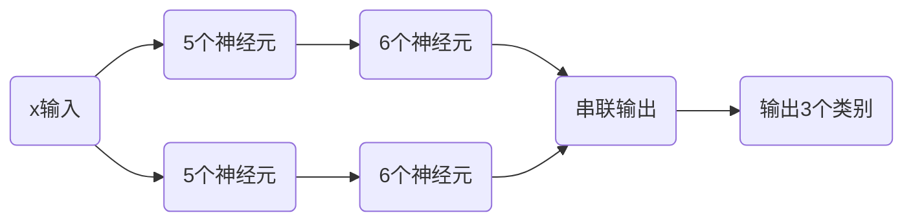
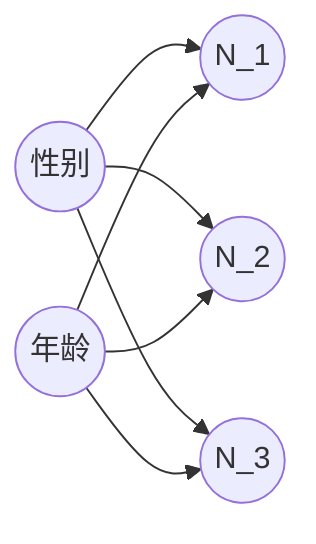

# 深度学习DNN

只有感性认识，理论支持较弱。深度学习只是机器学习的一种工具。

> [!warning]
>
> 层数越多模型越复杂，容易过拟合。在满足任务的条件下层数越少越好。

每层的神经元个数可以任意组合。


## 机器学习框架

| 框架                                               | 优点                                                         | 缺点                                                         | GitHub Stars | 公司     |
| -------------------------------------------------- | ------------------------------------------------------------ | ------------------------------------------------------------ | ------------ | -------- |
| [Caffe](https://caffe.berkeleyvision.org/)         | \- 简单易用的接口                                            | \- 功能相对较为有限                                          | 约 33k       | Facebook |
| [TensorFlow](https://www.tensorflow.org/?hl=zh-cn) | - 强大的生态系统和支持<br>- 良好的文档和社区支持<br>- 支持灵活的部署（包括移动端和嵌入式设备） | - 相对较复杂，学习曲线较陡峭<br>- 部分功能可能不够直观       | 约 160k      | Google   |
| [PyTorch](https://pytorch.org/)                    | - 动态图模式更直观，易于调试<br>- 灵活性高，易于定制<br>- 易于在GPU上进行加速计算 | - 相对TensorFlow较新，生态系统可能不及其成熟<br>- 文档相对不够完善 | 约 66k       | Facebook |
| [Keras](https://keras.io/)                         | - 高度模块化，易于使用<br>- 抽象层次较高，适合快速原型设计<br>- 与多个后端兼容（如TensorFlow、Theano等） | - 灵活性相对较差，不够适合定制<br>- 性能可能略逊于TensorFlow和PyTorch | 约 52k       | Google   |
| [PaddlePaddle](https://www.paddlepaddle.org.cn/)   | - 易用性高，提供了易于上手的高级API和简单直观的编程接口<br>- 灵活性高，支持静态图和动态图两种模式 | - 生态系统相对较小，社区资源和第三方工具相对较少<br>- 文档和教程相对不足<br>- 国际化程度有限 | 约 23k       | Baidu    |

### Keras安装

```shell
pip install tensorflow
pip install --upgrade keras
```

查看是否安装成功

```python
import keras
print(keras.__version__)
```

### 创建网络模型

创建训练和测试数据集

```python
from sklearn import datasets
from sklearn.model_selection import train_test_split
from keras.utils import to_categorical

iris = datasets.load_iris()
x = iris.data
y = iris.target
y = to_categorical(y)

x_train, x_test, y_train, y_test = train_test_split(x, y, test_size=0.2, random_state=42)
```

创建模型并训练数据

```python
from keras.models import Sequential
from keras.layers import Dense

model = Sequential()
model.add(Dense(units=5, input_dim=4, activation='sigmoid')) # 输入维度应该和特征维度相等
model.add(Dense(units=6, input_dim=5, activation='sigmoid'))
model.add(Dense(units=3, activation='softmax')) # 输出维度应该等于类别数
model.compile(loss='categorical_crossentropy', optimizer="adam") # 损失函数和学习方法
model.fit(x_train, y_train, batch_size=8, epochs=10, shuffle=True) # 训练的迭代控制
```

评估训练结果

```python
score = model.evaluate(x_test, y_test)
print(score)
```

增加中间层的数量

```python
from keras.models import Sequential
from keras.layers import Dense

model = Sequential()
model.add(Dense(units=5, input_dim=4, activation='sigmoid'))
model.add(Dense(units=10, input_dim=5, activation='sigmoid'))
model.add(Dense(units=3, activation='softmax'))
model.compile(loss='categorical_crossentropy', optimizer="adam", metrics=['accuracy'])
model.fit(x_train, y_train, batch_size=8, epochs=500, shuffle=True)
score = model.evaluate(x_test, y_test)
print('Test loss:', score[0])
print('Test accuracy:', score[1])
```

`epochs` 每个周期训练的次数，`batch_size`每次训练输入的数据数量，一般都取$2^n$。`shuffle`将数据随机打乱。`metrics`保存训练模型的准确度。

保存和读取模型

```python
from keras.models import load_model

path="model.keras"
model.save(path)
model_load = load_model(path)
result = model_load.predict(x_test)
print(result)
```


可以给中间层设置正则`kernel_regularizer`，

```python
from keras.models import Sequential
from keras.layers import Dense
from keras import regularizers

model = Sequential()
model.add(Dense(units=5, input_dim=4, activation='sigmoid', name='layer1'))
model.add(Dense(units=10, input_dim=5, activation='sigmoid', kernel_regularizer=regularizers.l1(0.01), name='layer2'))
model.add(Dense(units=3, activation='softmax'))
model.compile(loss='categorical_crossentropy', optimizer="adam", metrics=['accuracy'])
model.fit(x_train, y_train, batch_size=8, epochs=500, shuffle=True)
```

`name`给网络的一层定义名字，打印参数。

```python
print(model.get_layer('layer2').get_weights()[0])
```

### 函数式模型

```python
from keras.models import Model
from keras.layers import Dense,Input

feature_input = Input(shape=(4,))

#first model
m11 = Dense(units=5,input_dim=4,activation='relu')(feature_input)
m12 = Dense(units=6, activation='relu')(m11)

#second model
m21 = Dense(units=5,input_dim=4,activation='relu')(feature_input)
m22 = Dense(units=6, activation='relu')(m21)

m = keras.layers.Concatenate(axis= 1)([m21,m22])
output = Dense(units=3, activation='softmax')(m)
model = Model(inputs=feature_input, outputs=output)
model.compile(optimizer='adam', loss='categorical_crossentropy',metrics=["accuracy"])
model.fit(x_train, y_train, batch_size=8, epochs=100, shuffle=True)
score = model.evaluate(x_test, y_test)
print('Test loss:', score[0])
print('Test accuracy:', score[1])
```



串联输出就是将两个网络层的输出结果并列在一起。

> [!warning]
>
> 深度学习就是寻找一个合适的网络组合，达到非常好的分类效果。

神经网络参数个数运算


$$
M\times N+N+N\times1+1
$$

> [!warning]
>
> 理论上可以证明当神经元N足够多的时候，使用sigmoid函数激活，一层的神经元可以拟合任何函数。

神经网络设计的两个方向

1. 设计更多的隐层。
2. 每一层设计更多的神经元。


隐层可以作为一种特殊的特征选择器。



