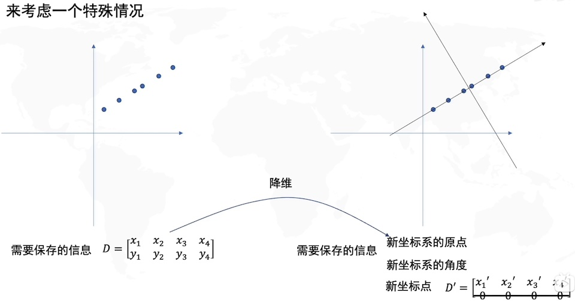

# 主成分分析

主成分分析（Principal Component Analysis）是一种多变量统计分析技术。它的主要目的是通过线性变换，将原始数据的多个变量（特征）转换为一组新的、数量较少的变量，这些新变量被称为主成分。

* 非监督的机器学习算法。
* 主要用于数据降维。
* 通过降维，可以发现更便于人类理解的特征。
* 可视化、去噪。

主成分分析并不只应用在机器学习领域，也是**统计分析领域**的重要方法。



> [!warning]
>
> PCA降维的标准是，在降维过程中信息损失最小，即方差最大。

PCA的操作步骤：

1. 去中心化，把坐标原点放在数据中心。
1. 找到方差最大方向，这个方向是第一主成分。
1. 方向与第一主成分正交（垂直），且在剩余方差中最大，是第二主成分。
1. 以此类推可以得到剩余主成分。

PCA的本质就是将原空间坐标系，变换到新的坐标系中，取出前$k$个重要的主成分，就可以在$k$个轴上获得一个低维的数据信息。降维后的数据丢失了部分信息。

> [!note]
>
> [怎样找到方差的最大方向？]( https://www.bilibili.com/video/BV1E5411E71z/?share_source=copy_web&vd_source=aa661569ff3138d0b604d53a96184bf2)

## sklearn的主成分分析

导入鸢尾花数据集

```python
from sklearn import datasets

iris = datasets.load_iris()
x = iris.data
y = iris.target
```

在`sklearn.decomposition`包中，有PCA降维的方法，使用该方法对测试数据降维有

```python
from sklearn.decomposition import PCA

pca = PCA(n_components=2)
pca.fit(x)
print(pca.components_)
x_reduction = pca.transform(x)
print(x_reduction.shape)
print(x_reduction[0:5])
```

绘制降维后的数据分布

```python
import matplotlib.pyplot as plt

def plot_pca(x_std, y):
    plt.figure(figsize=(10, 8))
    plt.scatter(x_std[:, 0], x_std[:, 1], c=y, s=100)
    plt.xticks(fontsize=16)
    plt.yticks(fontsize=16)
    plt.show()
    
plot_pca(x_reduction, y)
```

比较原始数据的特征组合与降维数据的对比


### 使用降维数据分类

导入癌症数据，使用pca对数据进行降维

```python
from sklearn.preprocessing import StandardScaler

cancer = datasets.load_breast_cancer()
x = cancer.data
y = cancer.target
x_std = StandardScaler().fit_transform(x)
pca = PCA(n_components=2)
pca.fit(x_std)
x_reduction = pca.transform(x_std)
plot_pca(x_reduction, y)
```

划分训练集和测试集

```python
from sklearn.model_selection import train_test_split

x_train, x_test, y_train, y_test = train_test_split(x_reduction, y, random_state=42)
print(x_train.shape)
print(x_test.shape)
```

使用逻辑回归对数据进行分类

```python
from sklearn.linear_model import LogisticRegression

log_reg = LogisticRegression()
log_reg.fit(x_train, y_train)
print(log_reg.score(x_train, y_train))
print(log_reg.score(x_test, y_test))
```

> [!warning]
>
> 某些情况下，PCA降维后的数据，分类性能有所提升，这是在降维的过程中对数据进行了降噪。


