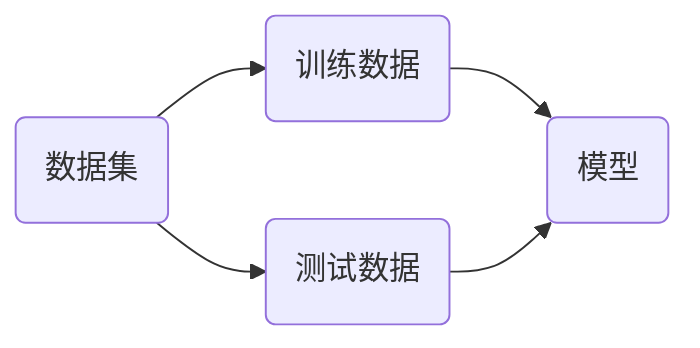
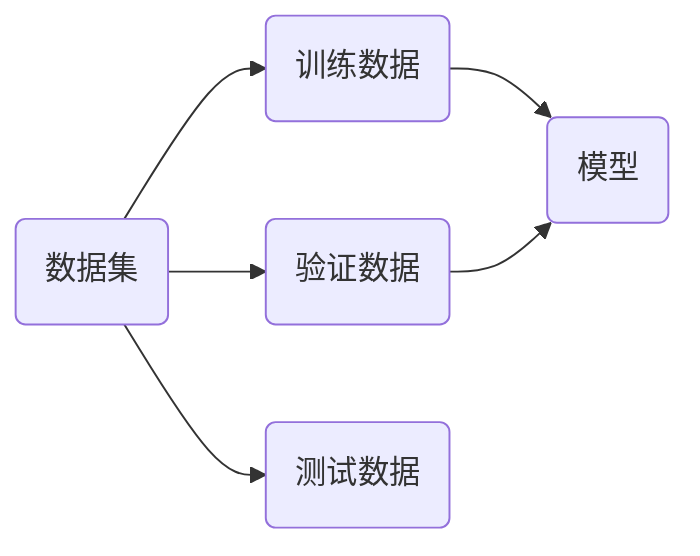
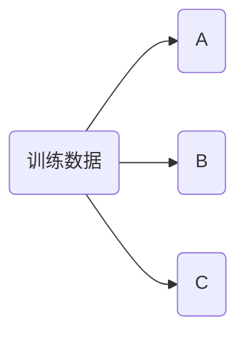

### 手写数字识别

scikit-learn测试数据集中包含一个图像数据集`load_digits`

1. 有1797个数据，每个数据是64维特征值，表示一个 $8\times8$ 大大小的图像。
2. 共有10个类别的数据，分别是数字0~9。

```python
import numpy as np
import matplotlib.pyplot as plt
import matplotlib
from sklearn import datasets

digits = datasets.load_digits()
print(digits.DESCR)

x = digits.data
print(x.shape)
y = digits.target
print(y.shape)
print(digits.target_names)

print(y[:70])
print(x[:1])
```

绘制其中一个元素的图像，使用[`imshow`](https://matplotlib.org/stable/api/_as_gen/matplotlib.pyplot.imshow.html)可以绘制图像

```python
import matplotlib
import matplotlib.pyplot as plt

some_digit = x[0]
print(y[0])
some_digit_image = some_digit.reshape(8, 8)
plt.imshow(some_digit_image, cmap=matplotlib.cm.binary)
plt.show()
```


## 交叉验证



> [!note]
>
> 使用训练数据集和测试数据集划分的方式验证模型，可能造成准对测试数据的过拟合现象。



1. 训练数据集训练模型。
2. 验证数据集调整模型，主要用于调整超参数。
3. 测试数据集验证模型，测试数据不参与模型的创建，用于评价模型的最终性能。

交叉验证（Cross Validation）



将数据分割为A、B、C三部分。

* 使用B、C训练；使用A验证。
* 使用A、C训练；使用B验证。
* 使用A、B训练；使用C验证。

上面的三种训练可以得到3个模型，使用3个模型的均值作为结果进行调参。训练数据可以分割为$k$份，进行$k$份的交叉验证。

### 使用训练集和测试集

```python
from sklearn import datasets
from sklearn.neighbors import KNeighborsClassifier

digits = datasets.load_digits()
X = digits.data
y = digits.target
X_train, X_test, y_train, y_test = train_test_split(X, y, test_size=0.4, random_state=666)

best_score, best_p, best_k = 0, 0, 0
for k in range(2, 11):
    for p in range(1, 6):
        knn_clf = KNeighborsClassifier(weights='distance', n_neighbors=k, p=p)
        knn_clf.fit(X_train, y_train)
        score = knn_clf.score(X_test, y_test)
        if score > best_score:
            best_score, best_p, best_k = score, p, k

print('best k =', best_k)
print('best p =', best_p)
print('best score =', best_score)
```

### 使用交叉验证

`cross_val_score`交叉验证的测试分类器性能。

```python
from sklearn.model_selection import cross_val_score

knn_clf = KNeighborsClassifier()
score = cross_val_score(knn_clf, X_train, y_train)
print(score)
```

使用交叉验证选择参数

```python
best_score, best_p, best_k = 0, 0, 0
for k in range(2, 11):
    for p in range(1, 6):
        knn_clf = KNeighborsClassifier(weights='distance', n_neighbors=k, p=p)
        scores = cross_val_score(knn_clf, X_train, y_train)
        score = np.mean(scores)
        if score > best_score:
            best_score, best_p, best_k = score, p, k
            
print('best k =', best_k)
print('best p =', best_p)
print('best score =', best_score)
```

使用测试集测试分类器性能

```python
best_knn_clf = KNeighborsClassifier(weights='distance', n_neighbors=2, p=2)
best_knn_clf.fit(X_train, y_train)
print(best_knn_clf.score(X_test, y_test))
```

> [!warning]
>
> 在网格搜索类中`GridSearchCV`，包含了交叉验证。

把训练数据分割为$k$份，使用交叉验证的方式训练模型，称为k-folds cross validation。

留一法（Leave-One-Out，LOO）是一种特殊的交叉验证方法，每次训练只留下一个作为预测值，其它数据全部用来训练。留一法的优点是几乎利用了所有数据进行训练，评估结果相对准确，且不受随机分组的影响，结果具有较高的稳定性和可靠性。但缺点是计算成本高，当数据集较大时，训练和验证的次数会非常多，计算量巨大。


# 模型的保存和加载

安装joblib `pip install joblib`

```python
joblib.dump(estimator, 'test.pkl')
estimator = joblib.load('test.pkl')
```


