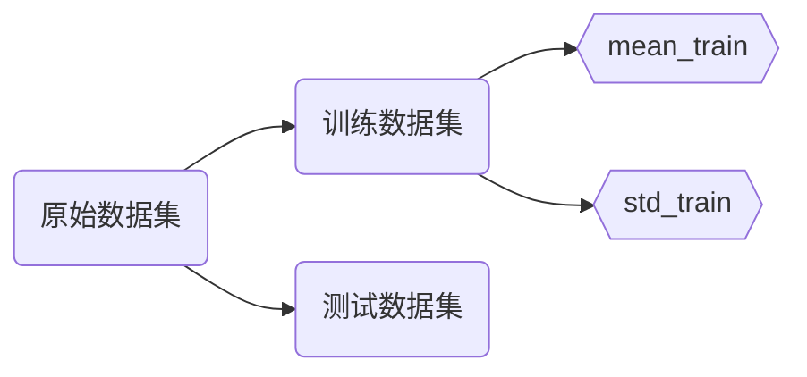

# 草稿内容

`https://raw.githubusercontent.com/hughxusu/lesson-ai/developing/_images`

图像的量化：每个像素的颜色值（R、G、B）。彩色图像可以转换为灰度图像。

电商用户画像：

1. 性别：
   * 1-男，0-女
   * [0, 1]-男，[1, 0]-女
2. 年龄：
   * 0~100 岁
   * [0, 15) [15, 40) [40, 60) [60, 100]

## 超参数和模型参数

超参数：在算法运行前需要决定的参数

模型参数：算法过程中学习的参数

如何寻找好的超参数

* 领域知识
* 经验数值
* 实验搜索

## 数据归一化

判断肿瘤是良性还是恶性

|       | 肿瘤大小（厘米） | 发现时间（天） | 发现时间（年） |
| ----- | ---------------- | -------------- | -------------- |
| 样本1 | 1                | 200            | 0.55年         |
| 样本2 | 5                | 100            | 0.27年         |

1. 当发现时间的单位为天时，样本间的距离被发现时间所主导。
2. 当发现时间的单位为年时，样本间的距离被肿瘤大小所主导。

数据归一化是将所有的数据映射到同一尺度中。

最值归一化：把所有的数据映射到0~1之间
$$
x_{\text{sacle}}=\frac{x-x_{\min}}{x_{\max}-x_{\min}}
$$
适用于分布有明显边界特征，受异常值影响比较大

* 学生考试成绩
* 图像像素点

均值方差归一化：把所有的数据归一到平均值为0方差为1的分布中，适用于数据分布没有明显边界

$$
x_{\text{sacle}}=\frac{x-\mu}{\sigma}
$$

真实数据无法获得均值和方差

对数据的归一化也是算法的一部分

## 位数灾难

随着维度的增加，看似相近的两点之间的距离越来越大

| 维度   | 点                         | 距离值 |
| ------ | -------------------------- | ------ |
| 1维    | 0到1                       | 1      |
| 2维    | (0, 0)到(1, 1)             | 1.414  |
| 3维    | (0, 0, 0)到(1, 1, 1)       | 1.73   |
| 64维   | (0, 0, …, 0)到(1, 1, …, 1) | 8      |
| 1000维 | (0, 0, …, 0)到(1, 1, …, 1) | 100    |

解决方法：降维
