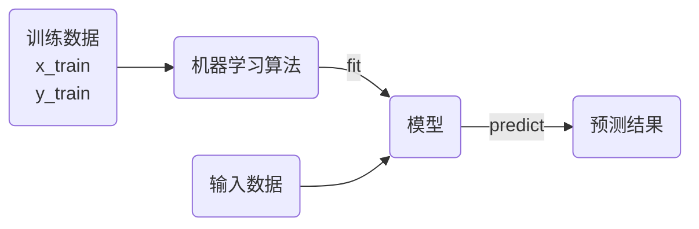
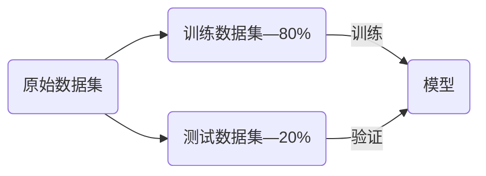

# K近邻 （KNN）

K近邻算法K-Nearest Neighbors（KNN）

1. 存在一定量的数据，包括特征和类别
2. 计算未知类别的数据与所有已知数据的距离。
3. 选择K个距离最小的样本，以最近的K个样本进行投票。


KNN的基本思想是样本距离只够接近，样本的类型可以划分为一类。

```python
raw_data_x = [[1.4, 0.2],
              [1.7, 0.4],
              [1.5, 0.1],
              [1.9, 0.2],
              [1.6, 0.4],
              [4.7, 1.4],
              [4.9, 1.5],
              [4.0, 1.3],
              [4.4, 1.4],
              [3.9, 1.1]]
raw_data_y = [0, 0, 0, 0, 0, 1, 1, 1, 1, 1]
x = [4.2, 1.5]
```

绘制上述样本数据的二维图像

```python
import numpy as np
import matplotlib.pyplot as plt

x_train = np.array(raw_data_x)
y_train = np.array(raw_data_y)
t = np.array(row_text)

plt.scatter(x_train[y_train == 0, 0], x_train[y_train == 0, 1], color='g')
plt.scatter(x_train[y_train == 1, 0], x_train[y_train == 1, 1], color='r')
plt.scatter(t[0], t[1], color='b')
plt.show()
```

使用欧拉距离来表示两个样本点之间的差异，对于 $n$ 维向量 $x$​ 其距离公式为，欧拉距离为：
$$
\sqrt{\sum_{i=1}^n\left(x_i^{(a)}-x_i^{(b)} \right)^2}
$$

1. 计算样本间所有距离

```python
from math import sqrt

distances = []
for x_i in x_train:
    d = sqrt(np.sum((x_i - t) ** 2))
    distances.append(d)
    
# 使用列表生成式来计算全部距离
distances = [sqrt(np.sum((x_i - t) ** 2)) for x_i in x_train]
```

2. 对全部距离进行排序

```python
nearest = np.argsort(distances)
```

3. 选择最近的K个样本，并获取相应的标签

```python
k = 7
top_k_y = [y_train[i] for i in nearest[:k]]
```

4. 统计标签结果

```python
from collections import Counter
votes = Counter(top_k_y)
most = votes.most_common(1)
predict = most[0][0]
```

[`Counter`类是一个，用于数据统计](https://docs.python.org/zh-cn/3.9/library/collections.html?highlight=collections#counter-objects)

将上述算法过程封装成为一个函数

```python
import numpy as np
from math import sqrt
from collections import Counter

def knn_classify(k, x_train, y_train, x):
    assert 1 <= k <= x_train.shape[0], 'k must be valid'
    assert x_train.shape[0] == y_train.shape[0], 'the size of x_train must be equal to the size of y_train'
    assert x_train.shape[1] == x.shape[0], 'the feature number of x must be equal to x_train'

    distances = [sqrt(np.sum((x_i - x) ** 2)) for x_i in x_train]
    nearest = np.argsort(distances)

    top_k_y = [y_train[i] for i in nearest[:k]]
    votes = Counter(top_k_y)

    return votes.most_common(1)[0][0]

predict = knn_classify(7, x_train, y_train, t)
print(predict)
```

机器学习算法的流程



> [!attention]
>
> KNN算法是一个不需要训练过程的算法，可以认为KNN算法的模型就是全部训练数据本身。

KNN算法的复杂度都集中在算法的预测过程，要从所有的样本数据中选出最小的K个距离。

## scikit-learn

[scikit-learn](https://scikit-learn.org/stable/#)是一个用于机器学习的 Python 库，提供了简单高效的工具来进行数据挖掘和数据分析，它建立在NumPy、SciPy和matplotlib基础之上。

安装scikit-learn包

```shell
pip install scikit-learn
```

可以使用scikit-learn工具包中[`KNeighborsClassifier`](https://scikit-learn.org/stable/modules/generated/sklearn.neighbors.KNeighborsClassifier.html#sklearn.neighbors.KNeighborsClassifier)实现KNN算法

```python
from sklearn.neighbors import KNeighborsClassifier

kNN_classifier = KNeighborsClassifier(n_neighbors=7)
kNN_classifier.fit(x_train, y_train)

x_predict = t.reshape(1, -1)
y_predict = kNN_classifier.predict(x_predict)
print(y_predict)
```

1. `fit`函数是训练模型，需要传入训练数据。
2. `predict`是预测函数，可以同时预测多个结果，传入数据必须为矩阵。`t.reshape`就是将预测数据转换为矩阵形式。
3. 预测结果也为二维矩阵。

### 模仿scikit-learn的KNN工具

根据scikit-learn的处理流程，完成一个类似的工具类。

```python
class KNNClassifier:
    def __init__(self, k):
        assert k >= 1, 'k must be valid'
        self.k = k
        self._x_train = None
        self._y_train = None
        
    def fit(self, x_train, y_train):
        assert k <= x_train.shape[0], 'k must be valid'
        assert x_train.shape[0] == y_train.shape[0], 'the size of x_train must be equal to the size of y_train'
        
        self._x_train = x_train
        self._y_train = y_train
        return self
    
    def predict(self, x_predict):
        assert self._x_train is not None and self._y_train is not None, 'must fit before predict'
        assert x_predict.shape[1] == self._x_train.shape[1], 'the feature number of x_predict must be equal to x_train'
        
        y_predict = [self._predict(x) for x in x_predict]
        return np.array(y_predict)
    
    def _predict(self, x):
        assert x.shape[0] == self._x_train.shape[1], 'the feature number of x must be equal to x_train'
        
        distances = [sqrt(np.sum((x_train - x) ** 2)) for x_train in self._x_train]
        nearest = np.argsort(distances)
        
        top_k_y = [self._y_train[i] for i in nearest[:self.k]]
        votes = Counter(top_k_y)
        return votes.most_common(1)[0][0]
    
    def __str__(self):
        return 'KNN(k=%d)' % self.k
```

对数据进行预测

```python
knn_clf = KNNClassifier(k=7)
knn_clf.fit(x_train, y_train)
x_predict = t.reshape(1, -1)
y_predict = knn_clf.predict(x_predict)
print(y_predict)
```

## 数据集的划分

> [!note]
>
> 对于对于已知数据集，如何测试机器学习算法性能的优劣？



使用测试数据解可以客观的评价算法和模型的性能。

### scikit-learn中的数据集

 [`sklearn.datasets`](https://scikit-learn.org/stable/datasets.html) 中嵌入了一些小型数据集用于实验。

* `loaders`用来加载小型测试数据集。
* `fetchers`用来下载并加载大的真实数据集

两类函数都返回一个字典一样的对象

```python
from sklearn import datasets

iris = datasets.load_iris()
print(iris.keys())
```

`keys()`包含了数据集的所有属性

```python
print(iris.DESCR)
```

`DESCR`打印数据集说明

```python
print(iris.data[:5, :])
print(iris.target[:5])
```

`data`保存了数据的特征，`target`保存了数据标签值。

### 划分数据集

对应已知数据数据集，数据排列可能是有序的。

```python
import numpy as np
from sklearn import datasets

iris = datasets.load_iris()

x = iris.data
y = iris.target
print(x.shape)
print(y.shape)
print(y)
```

对于有序数据集，进行分割时，需要打乱排序，保证不同类别的数据都在测试集和训练集中。

```python
shuffle_indexes = np.random.permutation(len(x))
print(shuffle_indexes)
test_ratio = 0.2
test_size = int(len(x) * test_ratio)
test_indexes = shuffle_indexes[:test_size] 
train_indexes = shuffle_indexes[test_size:]
```

* `np.random.permutation`函数可以根据数组的长度，生成一个随机索引数组。

* `test_indexes`和`train_indexes`是生成测试集和训练集的数据索引值。

```python
x_train = x[train_indexes]
y_train = y[train_indexes]
print(x_train.shape)
print(y_train.shape)

x_test = x[test_indexes]
y_test = y[test_indexes]
print(x_test.shape)
print(y_test.shape)
```

获得训练数据和测试数据。

对于上述数据集划分工作封装成一个函数

```python
def train_test_split(x, y, test_ratio=0.2, seed=None):
    assert x.shape[0] == y.shape[0], 'the size of x must be equal to the size of y'
    assert 0.0 <= test_ratio <= 1.0, 'test_ratio must be valid'
    
    if seed:
        np.random.seed(seed)
    
    shuffle_indexes = np.random.permutation(len(x))
    test_size = int(len(x) * test_ratio)
    test_indexes = shuffle_indexes[:test_size]
    train_indexes = shuffle_indexes[test_size:]
    
    x_train = x[train_indexes]
    y_train = y[train_indexes]
    
    x_test = x[test_indexes]
    y_test = y[test_indexes]
    
    return x_train, x_test, y_train, y_test
  
x_train, x_test, y_train, y_test = train_test_split(x, y, test_ratio=0.2, seed=666)
```

`seed`参数相同时可以保证数据集划是一致的。

使用鸢尾花数据集测试KNN算法

```python
my_knn_clf = KNNClassifier(k=3)
my_knn_clf.fit(x_train, y_train)
y_predict = my_knn_clf.predict(x_test)
print(y_predict)
print(f'score: {sum(y_predict == y_test) / len(y_test)}')
```

#### scikit-learn中的数据集划分工具

在`sklearn.model_selection`模块中，包含一个数据集划分工具[`train_test_split`](https://scikit-learn.org/stable/modules/generated/sklearn.model_selection.train_test_split.html#train-test-split)。

```python
from sklearn.model_selection import train_test_split
x_train, x_test, y_train, y_test = train_test_split(x, y, test_size=0.2, random_state=666)

print(x_train.shape)
print(y_train.shape)
print(x_test.shape)
print(y_test.shape)
```

`test_size`测试数据集的大小默认值为0.2，`random_state`随机种子数。

### 手写数字识别

scikit-learn测试数据集中包含一个图像数据集`load_digits`

1. 有1797个数据，每个数据是64维特征值，表示一个 $8\times8$ 大大小的图像。
2. 共有10个类别的数据，分别是数字0~9。

```python
import numpy as np
import matplotlib.pyplot as plt
import matplotlib
from sklearn import datasets

digits = datasets.load_digits()
print(digits.DESCR)

x = digits.data
print(x.shape)
y = digits.target
print(y.shape)
print(digits.target_names)

print(y[:70])
print(x[:1])
```

绘制其中一个元素的图像，使用[`imshow`](https://matplotlib.org/stable/api/_as_gen/matplotlib.pyplot.imshow.html)可以绘制图像

```python
import matplotlib
import matplotlib.pyplot as plt

some_digit = x[0]
print(y[0])
some_digit_image = some_digit.reshape(8, 8)
plt.imshow(some_digit_image, cmap=matplotlib.cm.binary)
plt.show()
```

使用KNN算法对手写数字识别进行分类

```python
from sklearn.model_selection import train_test_split
x_train, x_test, y_train, y_test = train_test_split(x, y, test_size=0.2, random_state=666)

my_knn_clf = KNNClassifier(k=3)
my_knn_clf.fit(x_train, y_train)
y_predict = my_knn_clf.predict(x_test)
print(sum(y_predict == y_test) / len(y_test))
```

为了方便统计算法的准确度，在KNN类中增加score函数

```python
class KNNClassifier:
    # ---skip---
    def score(self, x_test, y_test):
        y_predict = self.predict(x_test)
        return sum(y_predict == y_test) / len(y_test)
      
my_knn_clf.score(x_test, y_test)
```

#### 使用scikit-learn完成手写数字识别

```python
from sklearn.model_selection import train_test_split
from sklearn.neighbors import KNeighborsClassifier
from sklearn.metrics import accuracy_score

x_train, x_test, y_train, y_test = train_test_split(x, y, test_size=0.2, random_state=666)
knn_clf = KNeighborsClassifier(n_neighbors=3)
knn_clf.fit(x_train, y_train)
y_predict = knn_clf.predict(x_test)
print(accuracy_score(y_test, y_predict))
```

`accuracy_score`函数可以根据测试集标签和测试结果，计算准确率。`KNeighborsClassifier`也有`score`函数可以直接计算准确率。

## 超参数

超参数是指运行指定机器学习算法之前需要指定的参数。

模型参数是指机器学习算法中学习的参数。

> [!attention]
>
> KNN算法中没有模型参数。

### 近邻数K

KNN算法中的K是典型的超参数。

寻找好的超参数：

1. 结合各领域知识。
2. 经验数值。
3. 实验搜索。

```python
best_score = 0.0
best_k = -1
for k in range(1, 11):
    knn_clf = KNeighborsClassifier(n_neighbors=k)
    knn_clf.fit(x_train, y_train)
    score = knn_clf.score(x_test, y_test)
    if score > best_score:
        best_k = k
        best_score = score
        
print('best_k =', best_k)
print('best_score =', best_score)
```

### 距离权重

对于一般KNN算法，预测的点属于蓝色类。但是一般KNN算法忽略了，样本点之间的距离的影响。


考虑到距离对预测样本的影响，增加了距离权重的参数，权重等于距离的倒数（距离越近对位置样本的影响越大，距离越远对未知样本的影响越小）。
$$
\text{Red}=1\\
\text{Blue}=\frac{1}{3}+\frac{1}{4}=\frac{7}{12}
$$

计算距离权重之后，样本预测点属于红色。


使用距离权重后，可以有效的解决多分类数据中平票的情况。

在`KNeighborsClassifier`中通过参数`weights`可以选择是否计算权重。

```python
best_method = ''
best_score = 0.0
best_k = -1
for method in ['uniform', 'distance']:
    for k in range(1, 11):
        knn_clf = KNeighborsClassifier(n_neighbors=k, weights=method)
        knn_clf.fit(x_train, y_train)
        score = knn_clf.score(x_test, y_test)
        if score > best_score:
            best_k = k
            best_score = score
            best_method = method

print('best_k =', best_k)
print('best_score =', best_score)
print('best_method =', best_method)
```

### 距离类型

评价两个向量的相似程度有多种标准，前面只用了简单的欧式距离。


1. 曼哈顿距离

$$
d=\sum_{i=1}^N|x_i-y_i|
$$

2. 欧拉距离

$$
d=\sqrt{\sum_{i=1}^n\left(x_i^{(a)}-x_i^{(b)} \right)^2}
$$

3. 明可夫斯基距离

$$
d=\left(\sum_{i=1}^N|x_i-y_i|^p\right)^{\frac{1}{p}}
$$

这里就获得了，距离计算的超参数 $p$，用来选择不同距离的标准。

```python
best_p = -1
best_k = -1
best_score = 0.0

for k in range(1, 11):
    for p in range(1, 6):
        knn_clf = KNeighborsClassifier(n_neighbors=k, weights='distance', p=p)
        knn_clf.fit(x_train, y_train)
        score = knn_clf.score(x_test, y_test)
        if score > best_score:
            best_k = k
            best_score = score
            best_p = p
            
print('best_k =', best_k)
print('best_p =', best_p)
print('best_score =', best_score)
```

对超参数  $p$​ 和 K 进行了搜索。

> [!attention]
>
> 只有计算距离权重的情况下才会引入超参数 $p$​。

4. 其他距离

* 向量空间余弦相似度 Cosine Similarity
* 调整余弦相似度 Adjust Cosine Similarity
* 皮尔逊相关系数 Pearson Correlation Coefficient
* Jaccard相似系数 Jaccard Coefficient

### 网格搜索

使用sklearn的网格搜索工具[`GridSearchCV`](https://scikit-learn.org/stable/modules/generated/sklearn.model_selection.GridSearchCV.html)，可以更便捷的进行参数搜索。

```python
%%time
x_train, x_test, y_train, y_test = train_test_split(x, y, test_size=0.2, random_state=100)
param_grid = [
    {
        'weights': ['distance'],
        'n_neighbors': [i for i in range(1, 11)],
        'p': [i for i in range(1, 6)]
    },
    {
        'weights': ['uniform'],
        'n_neighbors': [i for i in range(1, 11)]
    },
]

knn_clf = KNeighborsClassifier()

from sklearn.model_selection import GridSearchCV
grid_search = GridSearchCV(knn_clf, param_grid)

grid_search.fit(x_train, y_train)
print(grid_search.best_estimator_)
print(grid_search.best_score_)
print(grid_search.best_params_)
```

1. `grid_search.best_estimator_`最佳分类器，返回一个输入的分类器。
2. `grid_search.best_score_`最佳分类器的准确率。
3. `grid_search.best_params_`最佳分类器的相关参数。

`GridSearchCV`的参数搜索是采用交叉验证的方式进行的，参数预测结果和简单的变量会有出入。

使用最佳模型对测试集进行预测

```python
knn_clf = grid_search.best_estimator_
knn_clf.score(x_test, y_test)
```

`GridSearchCV`中两个常用的参数

1. `n_jobs`设置参数搜索是使用的CPU核心数量，值为-1时使用全部处理器。
2. `verbose`打印搜索过程中的信息，值越大信息越详细。

```python
%%time
grid_search = GridSearchCV(knn_clf, param_grid, n_jobs=-1, verbose=2)
grid_search.fit(x_train, y_train)
```

## 特征归一化

判断肿瘤是良性还是恶性

|       | 肿瘤大小（厘米） | 发现时间（天） | 发现时间（年） |
| ----- | ---------------- | -------------- | -------------- |
| 样本1 | 1                | 200            | 0.55年         |
| 样本2 | 5                | 100            | 0.27年         |

数据不同维度的量纲不同，会直接影响数据距离的计算。

1. 当发现时间的单位为天时，样本间的距离被发现时间所主导。
2. 当发现时间的单位为年时，样本间的距离被肿瘤大小所主导。

数据归一化是将所有不同量纲的数据，映射在一个尺度下。

> [!warning]
>
> 理论上可以证明，归一化数据不影响分类结果，但可以加快学习速率。

### 最值归一化

把所有的数据映射到0~1之间
$$
x_{\text{sacle}}=\frac{x-x_{\min}}{x_{\max}-x_{\min}}
$$
适用于分布有明显边界特征，受异常值影响比较大，如：数据集 $1,2,3, 1000, …$

* 学生考试成绩 $[0, 100]$
* 图像像素点 $[0, 255]$​

```python
import numpy as np
import matplotlib.pyplot as plt

x = np.random.randint(0, 100, size=20)
print((x - np.min(x)) / (np.max(x) - np.min(x)))
```

### 均值方差归一化

把所有的数据归一到平均值为0方差为1的分布中，适用于数据分布没有明显边界
$$
x_{\text{sacle}}=\frac{x-\mu}{\sigma}
$$

> [!warning]
>
> 如果数据没有明显的边界，一般都采用均值方差归一化方法。

```python
x = np.random.randint(0, 100, size=20)
print((x - np.mean(x)) / np.std(x))
```

### `Scaler`归一化工具


1. 真实数据无法获得均值和方差。
2. 采用均值方差归一化是要保留测试数据的均值和方差，用于处理预测数据。预测时，预测数据同样需要归一化。对数据的归一化也可以理解为算法的一部分。

在scikit-learn中可以借助`Scaler`工具完成特征值归一化和均值方差保存的工作。

1. `StandardScaler`均值方差归一化

```python
# 导入鸢尾花数据集
import numpy as np
from sklearn import datasets
iris = datasets.load_iris()
x = iris.data
y = iris.target
print(x[:5])

from sklearn.model_selection import train_test_split
x_train, x_test, y_train, y_test = train_test_split(x, y, test_size=0.2, random_state=666)

# 对数据进行归一化处理
from sklearn.model_selection import train_test_split
from sklearn.preprocessing import StandardScaler

x_train, x_test, y_train, y_test = train_test_split(x, y, test_size=0.2, random_state=666)
standardScaler = StandardScaler()
standardScaler.fit(x_train)
print(standardScaler.mean_)
print(standardScaler.scale_)

x_train = standardScaler.transform(x_train)
x_test = standardScaler.transform(x_test)
print(x_train[:5])
```

1. `standardScaler.fit`函数可以对数据进行规划化，计算出均值和方差。
2. `standardScaler.mean_`和`standardScaler.scale_`计算出的均值和方差。
3. `standardScaler.transform`对训练数据和测试数据进行规一化处理。

绘制归一化后的鸢尾花数据图像

```python
import matplotlib.pyplot as plt

name = ['Setosa', 'Versicolour', 'Virginica']

plt.figure(figsize=(12, 6))
plt.subplot(1, 2, 1)
for target in set(y_train):
    subset = x_train[y_train == target]
    plt.scatter(subset[:, 2], subset[:, 3], label=f'{name[target]}')
    
plt.xlabel('petal length (cm)')
plt.ylabel('petal width (cm)')
plt.legend()

plt.subplot(1, 2, 2)
for target in set(y_train):
    subset = train_scale[y_train == target]
    plt.scatter(subset[:, 2], subset[:, 3], label=f'{name[target]}')
    
plt.xlabel('petal length (cm)')
plt.ylabel('petal width (cm)')
plt.legend()
plt.show()
```

使用归一化后的特征进行模型训练和预测

```python
from sklearn.neighbors import KNeighborsClassifier

knn_clf = KNeighborsClassifier(n_neighbors=3)
knn_clf.fit(train_scale, y_train)
print(knn_clf.score(test_scale, y_test))
```

> [!tip]
>
> scikit-learn的最值归一化封装在[`MinMaxScaler`](https://scikit-learn.org/stable/modules/generated/sklearn.preprocessing.MinMaxScaler.html)中，使用最值归一化处理手写数字识别数据，并测试KNN模型的性能。

## KNN算法特点

K近邻算法的优点：

* 可以解决分类问题（包括多分类问题）

* 使用k近邻算法可以解决回归问题，取K个近邻的平均值，或加权平均值。
  * [`KNeighborsRegressor`](https://scikit-learn.org/stable/modules/generated/sklearn.neighbors.KNeighborsRegressor.html)K近邻解决回归问题的工具类。


K近邻算法的缺点：

* K近邻算法的计算效率低。

  * 如果训练集有 $m$ 个样本，$n$ 维特征，每预测一个新样本需要 $O(m\times n )$​ 的时间复杂度。

* K紧邻算法对异常点过于敏感。

* K近邻算法预测结果不具有可解释性。

* k近邻算法容易陷入位数灾难。

  * 维数灾难的一个特点是，随着维度的增加，数据点之间的距离也会变得越来越大。


| 维度    | 点                         | 距离值 |
| ------- | -------------------------- | ------ |
| 1维     | 0到1                       | 1      |
| 2维     | (0, 0)到(1, 1)             | 1.414  |
| 3维     | (0, 0, 0)到(1, 1, 1)       | 1.73   |
| 64维    | (0, 0, …, 0)到(1, 1, …, 1) | 8      |
| 10000维 | (0, 0, …, 0)到(1, 1, …, 1) | 100    |
