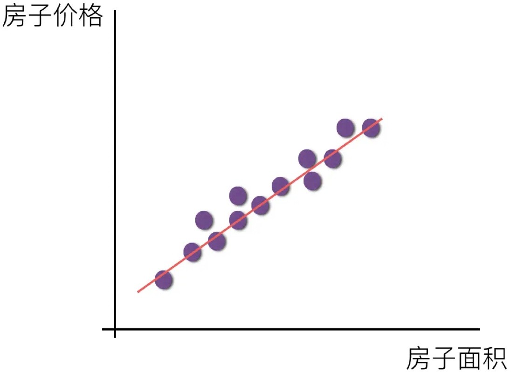
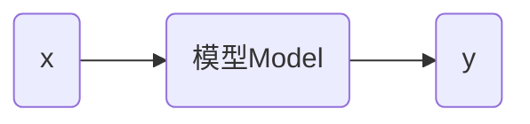

# 线性回归

线性回归的意义


回归这个概念最早是由英国生物学家兼统计学家弗朗西斯·高尔顿（Francis Galton）提出的，意思是回归平均值（regression toward the mean）。机器学习中借鉴了这一概念，产生了回归分析。


## 基本概念

假设房屋价格和房屋面积成线性关系。寻找一条直线，最大程度的拟合样本和样本输出标记之间的关系。

* 样本是房子面积
* 样本标记是房子价格



> [!warning]
>
> 在上面例子中房屋面积是特征，价格是标记。与距离问题不同，聚类问题中x，y轴都表示特征。

回归问题是预测一个具体的数值，数值是在连续的空间里，不是离散的类别。




数据集名称 `train_data` ，假设有数学公式
$$
y=wx+b
$$
该公式可以理解为模型。

 线性回归（linear regression）：是一种统计分析方法，用于预测一个因变量的值，基于一个或多个自变量的值。它假设因变量和自变量之间存在线性关系。系数是需要通过数据拟合来确定的。


`train_data` 分布如下：


在上述点中找到 $w$ 和 $b$ 使得 $y=wx+b$ 尽可能的到达理想。
$$
\hat{y_i} = wx_i+b
$$
对每个实际 $y_i$ 计算 MSE 是均方误差（Mean Squared Error）
$$
MSE=\frac{1}{n}\sum_{i=1}^n (y_i-\hat{y_i})^2
$$

使得 MSE 达到最小，可以得到一个理想的  $w$。上面的方程有两种情况：

* 有解析解
* 无解析解

训练线性模型

```python
import numpy as np
from sklearn.linear_model import LinearRegression
from sklearn import metrics

def read_data(path):
    with open(path) as f:
        lines = f.readlines()
    lines = [eval(line.strip()) for line in lines]
    x, y = zip(*lines)
    x = np.array(x)
    y = np.array(y)
    return x, y

x_train, y_train = read_data("train_data")
model = LinearRegression()
model.fit(x_train, y_train)  # 寻找合适的w和b使得误差最小
print(model.coef_, model.intercept_)
```

上面的训练过程可以找到使得 MSE 最小的  $w$ 和 $b$ ，其中输入数据可以是 $n$ 维矩阵。

## 模型测试

评估模型在训练集上的表现

```python
y_pred_train = model.predict(x_train)
train_mse = metrics.mean_squared_error(y_train, y_pred_train)
print(train_mse)
```

测试数据集为 `test_data` 评估模型测试集上的表现

```python
x_test, y_test = read_data("test_data")
y_pred_test = model.predict(x_test)
test_mse = metrics.mean_squared_error(y_test, y_pred_test)
print(test_mse)
```

> [!attention]
>
> MSE 的值只有相对意义，没有绝对意义，只是用例比较同一数据类型间的关系。

训练集中预测结果和实际结果对比


测试集中预测结果和实际结果对比


> [!attention]
>
> 在真实环境中，测试集的误差一般大于训练集

训练集、测试集和全量数据间的关系


减小误差集的方法：

1. 增大训练集数据
2. 增加训练集的多样性，更符合真实环境。

能在测试集上表现良好的能力，提高泛化能力。

> [!attention]
>
> 使用 $(y_i-\hat{y_i})^2$ 比 $\left| y_i-\hat{y_i} \right|$计算距离更好 

在距离近的点上计算 MSE 降低到一定程度后，继续在其附件优化收益就变小了。注意力会转移到距离远的点，因为优化这些点的收益更大。如果使用绝对值误差，收益永远不变，注意力会总集中在容易的点上。


## 梯度下降法

MSE 公式可以变换为
$$
MSE=\frac{1}{n}\sum_{i=1}^n (wx_i+b-y_i)^2
$$
上面公式中自变量为 $w$ 和 $b$，因变量是 MSE。

固定 $b$ 绘制 $w$ 和 MSE 的曲线如下：


当
$$
\frac{\partial MSE}{\partial w} = 0
$$
达到最小值。

根据上面的公式
$$
\frac{\partial MSE}{\partial w} = \frac{1}{n}\sum_{i=1}^n 2(wx_i+b-y_i) \cdot x_i
$$
随机初始化 $w$ 值记作 $w(0)$​，则有
$$
w(1)=w(0)-\frac{\partial MSE}{\partial w(0)} \newline
w(2)=w(1)-\frac{\partial MSE}{\partial w(1)} \\
......
$$


沿着导数的方向寻找最小值，当导数 $\frac{\partial MSE}{\partial w} = 0$ 停止迭代，即为梯度下降法。


梯度下降法存在的问题：

1. 导数小收敛慢
2. 导数过大出现震荡


为了控制梯度下降的过程增加因子 $\alpha$，梯度下降公式如下：
$$
w(t+1)=w(t)-\alpha \cdot \frac{\partial MSE}{\partial w(t)}
$$
其中 $\alpha$ 称为学习速率（超参数），需要人工设置。

> [!attention]
>
> 梯度下降法不一定找到最小值。注意：线性回归不存在这样问题


对于 MSE 极小值问题
$$
\frac{\partial MSE}{\partial w} = \frac{1}{n}\sum_{i=1}^n 2(wx_i+b-y_i) \cdot x_i=0
$$

> [!attention]
>
> 存在解，因为 $n$​ 过大直接解方程计算机无法计算，所以需要用梯度下降法 进行求解。

计算求导公式
$$
\frac{\partial MSE}{\partial w} = \frac{1}{n}\sum_{i=1}^n 2(wx_i+b-y_i) \cdot x_i
$$
当训练数据过多时，计算过程会非常耗时。为了降低计算量，会抽取部分训练集进行求导。$m \subseteq n$
$$
\frac{\partial MSE_1}{\partial w}= \frac{1}{m}\sum_{i=1}^m 2(wx_i+b-y_i) \cdot x_i
$$
上面两个 MSE 的值只有在 $m=n$ 时重合，否则 $MSE_1$ 在 $MSE$ 周围波动。 其中 $m=16,64,128 ……$


其中波动范围 $d$ 满足
$$
d \propto {\frac{1}{\sqrt{m}}}
$$
以100W次计算为例


| m    | 批次 | d                 |
| ---- | ---- | ----------------- |
| 100  | 1w   | ${\frac{1}{10}}$  |
| 1w   | 100  | ${\frac{1}{100}}$ |

> [!attention]
>
> 1. 工程实践中会在运算效率和精确度之间取平衡策略。
> 2. MSE 值不是越小越好，否则会出现过拟合现象。

实践中会将测试集划分为 Train 和 Validation


Validation 用来测试超参数，如：学习速率和训练时间等。

## 多元线性回归

对于函数
$$
y=wx+b
$$
当 $x$ 为多维度时，上面的函数可以变化为
$$
y=w_1x_1+w_2x_2+……+w_nx_n+w_0
$$
则上面的函数可以变化为
$$
y=w^T\cdot x+w_0
$$
其中
$$
w=\begin{pmatrix}
w_1 \\
\vdots \\
w_n \\
\end{pmatrix}
\hspace{1cm}
x=\begin{pmatrix}
x_1 \\
\vdots \\
x_n \\
\end{pmatrix}
$$
如果定义
$$
w=\begin{pmatrix}
w_0 \\
w_1 \\
\vdots \\
w_n \\
\end{pmatrix}
\hspace{1cm}
x=\begin{pmatrix}
1 \\
x_1 \\
\vdots \\
x_n \\
\end{pmatrix}
$$
则有公式
$$
y=w^T\cdot x
$$
波士顿房价预测

```python
import numpy as np
from sklearn.linear_model import LinearRegression
from sklearn import metrics

def read_data(path):
    with open(path) as f:
        lines = f.readlines()
    lines = [eval(line.strip()) for line in lines]
    x, y = zip(*lines)
    x = np.array(x)
    y = np.array(y)
    return x, y

x_train, y_train = read_data("boston_train_data")

model = LinearRegression()
model.fit(x_train, y_train)

print(model.coef_)
print(model.intercept_)

train_y = model.predict(x_train)
print("MSE:", metrics.mean_squared_error(y_train, train_y))
```

在测试集上测试模型

```python
x_test, y_test = read_data("boston_test_data")
test_y = model.predict(x_test)
print("MSE:", metrics.mean_squared_error(y_test, test_y))
```

> [!attention]
>
> 使用线性回归模型的条件是，数据尽量在一条直线上。

$x$ 分布如下图


上面的图像近似于抛物线
$$
y=ax^2+bx+c
$$
上述公式转换为线性回归公式如下：
$$
y=w_1x^2+w_2x+w_0
$$
针对上述数据的训练模型为

```python
import numpy as np
from sklearn.linear_model import LinearRegression
from sklearn import metrics

def extend_feature(x):
    return [x[0], x[0] * x[0]]

def read_data(path):
    with open(path) as f:
        lines = f.readlines()
    lines = [eval(line.strip()) for line in lines]
    x, y = zip(*lines)
    x = [extend_feature(x) for x in x]
    x = np.array(x)
    y = np.array(y)
    return x, y

x_train, y_train = read_data("train_paracurve_data")

model = LinearRegression()
model.fit(x_train, y_train)

print(model.coef_)
print(model.intercept_)

train_y = model.predict(x_train)
print("MSE:", metrics.mean_squared_error(y_train, train_y))
```

针对模型测试为

```python
x_test, y_test = read_data("test_paracurve_data")
y_pred = model.predict(x_test)
print("MSE:", metrics.mean_squared_error(y_test, y_pred))
```

针对任意形式的曲线，假设存证一个 $x^n$ 满足公式：
$$
y=w_1x+w_2x^2+w_3x^3+……+w_nx^n+w_0
$$

> [!attention]
>
> 1. $y=w_1x+w_0$
> 2. $y=w_1x^2+w_2x+w_0$
>
> **在训练集**中公式2的结果不会比公式1差，当 $w_1=0$ 时公式2，退化成公式1。
>
> **泰勒公式的核心思想可以理解为上面的函数。**

当 $n$ 变量足够大时会出现过拟合现象，所以 $n$ 要适可而止。


**情景一**

针对 `train_data` 数据中的 $x$ 变量生成向量 $[x_1, x_2]$ 其中 $x_2$ 的值随机产生，则学习公式为：
$$
y=w_1x_1+w_2x_2+w_0
$$

```python
import numpy as np
from sklearn.linear_model import LinearRegression
from sklearn import metrics
import random

def extend_feature(x):
    return [x[0], random.uniform(-10, 10)]

def read_data(path):
    with open(path) as f:
        lines = f.readlines()
    lines = [eval(line.strip()) for line in lines]
    x, y = zip(*lines)
    x = [extend_feature(x) for x in x]
    x = np.array(x)
    y = np.array(y)
    return x, y

x_train, y_train = read_data("train_data")

model = LinearRegression()
model.fit(x_train, y_train)

print(model.coef_)
print(model.intercept_)
```

> [!warning]
>
> 线性回归有抗噪声的能力。

**情景二**

针对 `train_data` 数据中的 $x$ 变量生成向量 $[x_1, x_2]$ 其中 $x_2$ 的值是复制于 $x_2$，则学习公式为：
$$
y=w_1x_1+w_2x_2+w_0
$$
由于 $x_1=x_2=x$ 则上面的公式可以化简为：
$$
y=(w_1+w_2)x+b
$$

```python
import numpy as np
from sklearn.linear_model import LinearRegression
from sklearn import metrics

def extend_feature(x):
    # return x
    return [x[0], x[0]]

def read_data(path):
    with open(path) as f:
        lines = f.readlines()
    lines = [eval(line.strip()) for line in lines]
    x, y = zip(*lines)
    x = [extend_feature(x) for x in x]
    x = np.array(x)
    y = np.array(y)
    return x, y

x_train, y_train = read_data("train_data")

model = LinearRegression()
model.fit(x_train, y_train)

print(model.coef_)
print(model.intercept_)
```

>[!warning]
>
>线性回归有抗冗余的能力。

假设有线性回归
$$
y=4x_1+3x_3+1
$$
当 $x_1=x_2$ 时则可以变化为
$$
y=2x_1+2x_2+3x_3+1
$$

> [!attention]
>
> 只有当特征向量 $x = (x_1, x_2,……,x_n)$ 中的特征完全线性无关没有冗余的时候，$w_n$ 才表示特征的权重。所以 $w$ 不代表任何信息，只是一个数值。


