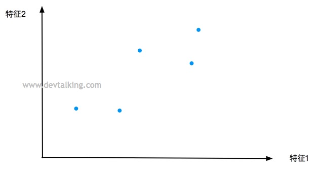
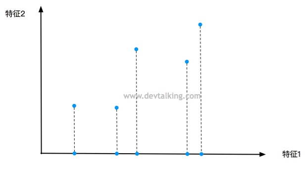
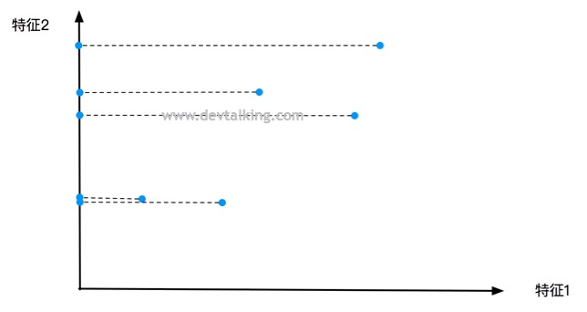
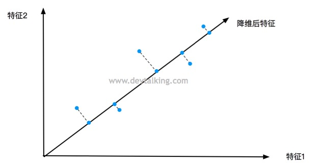
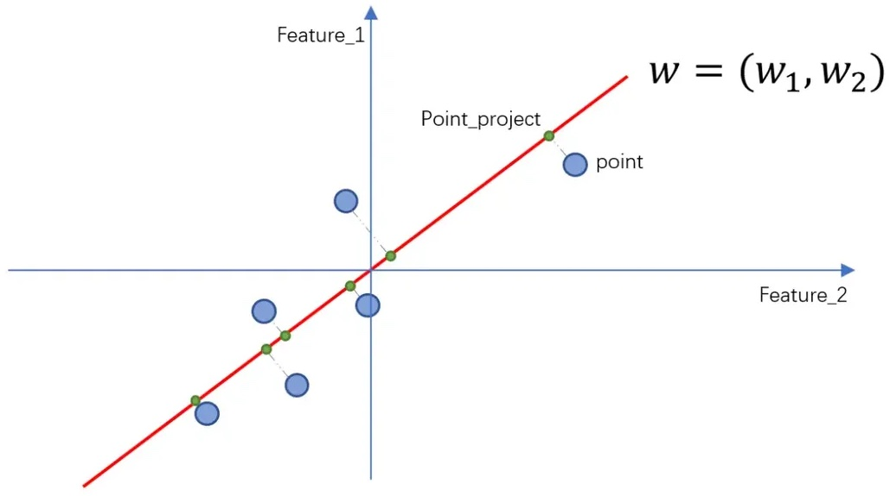
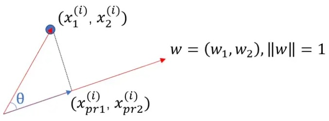

# 主成分分析

主成分分析（Principal Component Analysis）是一种多变量统计分析技术。它的主要目的是通过线性变换，将原始数据的多个变量（特征）转换为一组新的、数量较少的变量，这些新变量被称为主成分。

* 非监督的机器学习算法。
* 主要用于数据降维。
* 通过降维，可以发现更便于人类理解的特征。
* 可视化、去噪。

> [!warning]
>
> 主成分分析并不只应用在机器学习领域，也是统计分析领域的重要方法。

二维特征可以绘制在如下平面



如果只保留特征1



如果只保留特征2



从上面的结果来看，特征1的区分度较高。如果能找到一条直线，可以拟合样本的投影



降维后点和点之间的区分度更接近，原来点的分布。这个直线的标准就是，样本映射到该轴后，方差最大。

1. 将样本的均值归0，即样本值减去均值，根据方差的公式。

$$
Var(x)=\frac{1}{m}\sum_{i=1}^m(x_i-\bar{x})^2，\bar{x}=0 \Rightarrow Var(x)=\frac{1}{m}\sum_i^mx_i^2
$$



2. 找到投影轴的方向$w=\left( w_1, w_2  \right)$，使得所有样本映射到新的坐标轴有

$$
Var(X_{project})=\frac{1}{m}\sum_{i}^{m}\left \|X_{project}^{(i)}-\bar{X}_{project}\right\|^2
$$

最大。由于向量进行了归0处理，则有
$$
Var(X_{project})=\frac{1}{m}\sum_{i}^{m}\left \|X_{project}^{(i)}\right\|^2 \tag{1}
$$
最大。投影计算如下



上面的映射计算，就是
$$
X^{(i)}\cdot w=\left\| X^{(i)} \right\|\cdot\left\| w \right\| \cdot \cos \theta
$$
式子中寻找的$w$，是一个方向，可以用方向向量表示，所以有$\left\| w \right\|=1 $，上式可以化简为
$$
X^{(i)}\cdot w=\left\| X^{(i)} \right\| \cdot \cos \theta
$$
所以有
$$
X^{(i)}\cdot w=\left \|X_{project}^{(i)}\right\|
$$
所以公式 $(1)$ 可以变为
$$
Var(X_{project})=\frac{1}{m}\sum_{i}^{m}\left ( X^{(i)}\cdot w  \right )^2
$$
所以主成分分析就是求$w$使得上式最大。推广到$n$维样本点，则有
$$
Var(X_{project})=\frac{1}{m}\sum_{i}^{m}\left ( X^{(i)}_1 w_1+X^{(i)}_2 w_2+…+ X^{(i)}_n w_n \right )^2 \tag{2}
$$
所以主成分分析法，就是求目标函数 $(2)$ 的最优化问题。该问题可以使用梯度上升法来解决（该问题也有解析解）。

> [!attention]
>
> 主成分分析法与线性回归的区别：在主成分分析中横纵坐标都是特征；而在线性回归中，横坐标是特征，纵坐标是预测值。

目标函数可以表示为
$$
f\left(X \right)=\frac{1}{m}\sum_{i}^{m}\left ( X^{(i)}_1 w_1+X^{(i)}_2 w_2+…+ X^{(i)}_n w_n \right )^2 \tag{3}
$$
主成分分析法就是求目标函数 $(3)$ 最大。所以目标函数的梯度可以表示为
$$
\nabla f = \begin{pmatrix}
\frac{\partial f}{\partial w_1 } \\
\frac{\partial f}{\partial w_2 } \\
… \\
\frac{\partial f}{\partial w_n } 
\end{pmatrix} =\frac{2}{m}\begin{pmatrix}
\sum_{i=1}^m \left ( X_1^{(i)}w_1 + X_2^{(i)}w_2 + … X_n^{(i)}w_n \right ) X_1^{(i)} \\
\sum_{i=1}^m \left ( X_1^{(i)}w_1 + X_2^{(i)}w_2 + … X_n^{(i)}w_n \right ) X_2^{(i)} \\
… \\
\sum_{i=1}^m \left ( X_1^{(i)}w_1 + X_2^{(i)}w_2 + … X_n^{(i)}w_n \right ) X_n^{(i)} \\
\end{pmatrix}  =\frac{2}{m}\begin{pmatrix}
\sum_{i}^{m}\left ( X^{(i)} w  \right )X_1^{(i)} \\
\sum_{i}^{m}\left ( X^{(i)} w  \right )X_2^{(i)} \\
… \\
\sum_{i}^{m}\left ( X^{(i)} w  \right )X_n^{(i)}
\end{pmatrix} \tag{4}
$$
考虑下面的式子
$$
\frac{2}{m}\cdot\left(X^{(1)}w, X^{(2)}w, … X^{(m)}\right) \cdot \begin{pmatrix}
X_1^{(1)} & X_2^{(1)} & … & X_n^{(1)} \\
X_1^{(2)} & X_2^{(2)} & … & X_n^{(2)} \\
… \\
X_1^{(m)} & X_2^{(m)} & … & X_n^{(m)} \\
\end{pmatrix} = \frac{2}{m}\cdot \left( Xw \right)^T\cdot X \tag{5}
$$
结合公式 $(5)$ 公式 $(4)$ 可以化简为
$$
\nabla f =\frac{2}{m}\begin{pmatrix}
\sum_{i}^{m}\left ( X^{(i)} w  \right )X_1^{(i)} \\
\sum_{i}^{m}\left ( X^{(i)} w  \right )X_2^{(i)} \\
… \\
\sum_{i}^{m}\left ( X^{(i)} w  \right )X_n^{(i)}
\end{pmatrix} = \frac{2}{m}\cdot X^T \cdot \left( Xw \right)\tag{5}
$$

## PCA的过程模拟

生成测试数据

```python
import numpy as np
import matplotlib.pyplot as plt

X = np.empty([100, 2])
X[:,0] = np.random.uniform(0., 100., size=100)
X[:,1] = 0.75 * X[:,0] + 3. + np.random.normal(0, 5, size=100)
plt.scatter(X[:,0], X[:,1])
plt.show()
```

对数据进行归0处理

```python
def demean(X):
    return X - np.mean(X, axis=0)

X_demean = demean(X)
plt.scatter(X_demean[:,0], X_demean[:,1])
print(np.mean(X_demean[:,0]))
print(np.mean(X_demean[:,1]))
```

目标函数$Var(X_{project})$和梯度的计算为

```python
def f(w, X):
    return np.sum((X.dot(w)**2)) / len(X)

def df(w, X):
    return X.T.dot(X.dot(w)) * 2. / len(X)

def df_debug(w, X, epsilon=0.0001):
    res = np.empty(len(w))
    for i in range(len(w)):
        w_1 = w.copy()
        w_1[i] += epsilon
        w_2 = w.copy()
        w_2[i] -= epsilon
        res[i] = (f(w_1, X) - f(w_2, X)) / (2 * epsilon)
    return res
```

梯度上升法的求解过程为

```python
def direction(w):
    return w / np.linalg.norm(w)

def gradient_ascent(df, X, initial_w, eta, n_iters=1e4, epsilon=1e-8):
    w = direction(initial_w)
    cur_iter = 0

    while cur_iter < n_iters:
        gradient = df(w, X)
        last_w = w
        w = w + eta * gradient
        w = direction(w)
        if (abs(f(w, X) - f(last_w, X)) < epsilon):
            break

        cur_iter += 1

    return w
```

其中`direction`函数是转换$w$向量，使其值为$\left\| w \right\|=1$。测试梯度上升法

```python
initial_w = np.random.random(X.shape[1])
print(initial_w)

eta = 0.001
w = gradient_ascent(df_debug, X_demean, initial_w, eta)
print(w)
w = gradient_ascent(df, X_demean, initial_w, eta)
print(w)

plt.scatter(X_demean[:,0], X_demean[:,1])
plt.plot([w[0]*-50, w[0]*50], [w[1]*-50, w[1]*50], color='r')
plt.show()
```

假设没有扰动

```python
X2 = np.empty(X.shape)
X2[:,0] = np.random.uniform(0., 100., size=100)
X2[:,1] = 0.75 * X2[:,0] + 3.
plt.scatter(X2[:,0], X2[:,1])
plt.show()
```

使用pca方法计算方向向量

```python
X2_demean = demean(X2)
w2 = gradient_ascent(df, X2_demean, initial_w, eta)
print(w2)
plt.scatter(X2_demean[:,0], X2_demean[:,1])
plt.plot([w2[0]*-50, w2[0]*50], [w2[1]*-50, w2[1]*50], color='r')
plt.show()
```

## 数据前n个主成分

对于二维特征向量，将向量$w$表示新坐标系${x}'$轴，全部特征映射到${x}' $上。与${x}' $垂直的向量就是新坐标系的${y}'$轴。

PCA的本质是对特征空间的坐标轴重新排列，在样本的原始特征空间内寻找一套新的坐标轴替换掉样本的原始坐标轴；在这套新的坐标轴里，第一主成分轴捕获了样本最大的方差，第二主成分轴轴次之，第三主成分轴再次之，以此类推；

求出第一个主成分后，对数据进行改变，将在第一个主成分上的分量去掉。
