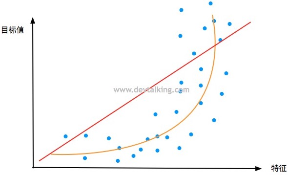
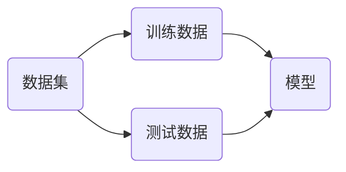
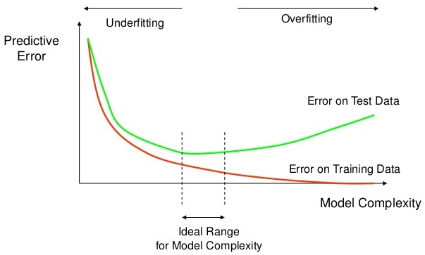

# 多项式回归与模型泛化

使用线性回归去拟合样本数据，要数据存在一定线性关系的。但现实情况是，大多数的样本数据都没有明显的线性关系，所以需要模型可以处理非线性数据。

## 多项式回归

在线性回归中，使用一条直线来拟合数据。


线性模型为
$$
y=ax+b
$$
假设数据分布情况如下



如果要更好的拟合上图中的数据，则需要选择一条曲线，模型为
$$
y = ax^2+bx+c
$$
如果将$x^2$看做特征$x_1$，$x$看做特征$x_2$，则上述模型可以表示为
$$
y=ax_1+bx_2+c
$$

> [!warning]
>
> 低维中的非线性模型，在高维特征中，可以表示层线性模型。

生成二维曲线的模拟数据

```python
import numpy as np
import matplotlib.pyplot as plt

x = np.random.uniform(-3, 3, size=100)
X = x.reshape(-1, 1)
y = 0.5 * x**2 + x + 2 + np.random.normal(0, 1, 100)

plt.scatter(x, y)
plt.show()
```

使用线性模型来拟合上面的曲线有

```python
from sklearn.linear_model import LinearRegression
lin_reg = LinearRegression()
lin_reg.fit(X, y)
y_predict = lin_reg.predict(X)
plt.scatter(x, y)
plt.plot(x, y_predict, color='r')
plt.show()
```

将$x^2$看做特征$x_1$，$x$看做特征$x_2$，使用二维特征来预测线性模型，绘制结果曲线

```python
print((X**2).shape)
X2 = np.hstack([X, X**2])
print(X2.shape)
lin_reg2 = LinearRegression()
lin_reg2.fit(X2, y)
y_predict2 = lin_reg2.predict(X2)
plt.scatter(x, y)
plt.plot(np.sort(x), y_predict2[np.argsort(x)], color='r')
plt.show()
```

打印模型参数

```python
print(lin_reg2.coef_)
print(lin_reg2.intercept_)
```

### sk-learn中多项式回归

sk-learn中多项式回归模型就是对线性模型数据进行预处理，然后使用线模型训练数据。使用`PolynomialFeatures`对数据进行升维。

```python
from sklearn.preprocessing import PolynomialFeatures
poly = PolynomialFeatures(degree=2)
poly.fit(X)
X2 = poly.transform(X)
print(X2.shape)
print(X2[:5, :])
print(X[:5, :])
```

使用线性模型拟合上述特征

```python
from sklearn.linear_model import LinearRegression

lin_reg2 = LinearRegression()
lin_reg2.fit(X2, y)
y_predict2 = lin_reg2.predict(X2)
plt.scatter(x, y)
plt.plot(np.sort(x), y_predict2[np.argsort(x)], color='r')
plt.show()
```

构造一个简单的样本二维样本数据

```python
X = np.arange(1, 11).reshape(-1, 2)
print(X.shape)
print(X)
```

对上述数据进行升维得到

```python
poly = PolynomialFeatures(degree=2)
poly.fit(X)
X2 = poly.transform(X)
print(X2.shape)
print(X2)
```

当`degree=3`时，特征计算如下
$$
x_1, \quad  x_2 \Rightarrow \begin{matrix}
1, \quad x_1, \quad x_2 \\
x_1^2, \quad x_2^2, \quad x_1x_2 \\
x_1^3, \quad x_2^3, \quad x_1^2x_2 \quad x_1x_2^2 \\
\end{matrix}
$$


可见当改变`PolynomialFeature`的`degree`参数后，转换后样本数据的特征会成指数级的增长，它会尽可能的列出所有的多项式，来丰富样本数据。

### Pipeline

sk-learn中的`Pipeline`工具可以将若干步骤打包成一个对象，相当于制作一个流程模板，对于不同的样本数据只需用`Pipeline`统一处理。

```python
x = np.random.uniform(-3, 3, size=100)
X = x.reshape(-1, 1)
y = 0.5 * x**2 + x + 2 + np.random.normal(0, 1, 100)

from sklearn.pipeline import Pipeline
from sklearn.preprocessing import StandardScaler

poly_reg = Pipeline([
    ('poly', PolynomialFeatures(degree=2)),
    ('std_scaler', StandardScaler()),
    ('lin_reg', LinearRegression())
])
```

`Pipeline`参数接收的是一个列表，每个元素对应的是一个元组，对应一个处理步骤。

## 过拟合与欠拟合

对于上面的模拟数据，计算其均方误差

```python
np.random.seed(666)
x = np.random.uniform(-3, 3, size=100)
X = x.reshape(-1, 1)
y = 0.5 * x**2 + x + 2 + np.random.normal(0, 1, 100)

lin_reg = LinearRegression()
lin_reg.fit(X, y)
y_predict = lin_reg.predict(X)

from sklearn.metrics import mean_squared_error
mean_squared_error(y, y_predict)
```

将上面的多项式拟合管道封装成函数

```python
def PolynomialRegression(degree):
    return Pipeline([
        ('poly', PolynomialFeatures(degree=degree)),
        ('std_scaler', StandardScaler()),
        ('lin_reg', LinearRegression())
    ])
```

计算拟合结果的均方误差

```python
poly2_reg = PolynomialRegression(degree=2)
poly2_reg.fit(X, y)
y2_predict = poly2_reg.predict(X)
print(mean_squared_error(y, y2_predict))
```

绘制拟合曲线

```python
plt.scatter(x, y)
plt.plot(np.sort(x), y2_predict[np.argsort(x)], color='r')
plt.show()
```

当`degree=10`时，计算均方误差

```python
poly10_reg = PolynomialRegression(degree=10)
poly10_reg.fit(X, y)
y10_predict = poly10_reg.predict(X)
print(mean_squared_error(y, y10_predict))
```

绘制拟合曲线

```python
plt.scatter(x, y)
plt.plot(np.sort(x), y10_predict[np.argsort(x)], color='r')
plt.show()
```

当`degree=100`时，计算均方误差

```python
poly100_reg = PolynomialRegression(degree=100)
poly100_reg.fit(X, y)
y100_predict = poly100_reg.predict(X)
print(mean_squared_error(y, y100_predict))
```

绘制拟合曲线

```python
plt.scatter(x, y)
plt.plot(np.sort(x), y100_predict[np.argsort(x)], color='r')
plt.show()
```

上面的图像并不是真正的拟合曲线，只是根据样本值范围内的部分曲线，所以使用连续的数值来绘制曲线

```python
X_plot = np.linspace(-3, 3, 100).reshape(100, 1)
y_plot = poly100_reg.predict(X_plot)
plt.scatter(x, y)
plt.plot(X_plot[:, 0], y_plot, color='r')
plt.axis([-3, 3, -1, 10])
plt.show()
```

过拟合（overfitting）是指过于紧密或精确地匹配特定数据集，以致于无法良好地拟合其他数据或预测未来的观察结果的现象。 过拟合模型指的是参数过多或者结构过于复杂的统计模型。

最经典的过拟合例子


欠拟合（Underfitting）是指机器学习模型在训练数据上不能很好地拟合数据的现象。模型过于简单，无法捕捉到数据中的内在规律和特征，导致在训练数据和测试数据上都表现出较差的性能。

### 训练集合测试集

当模型出现过拟合现象时，对于新的数据，无法准确的预测，这说明模型的泛化能力较差。模型的泛化能力，就是模型在未知数据集上的预测能力。

> [!warning]
>
> 模型训练的目的是最好的预测未知数据，而不是拟合所有的已知数据。



提升模型泛化能力的方法就是将原有数据划分成训练集和测试集。

* 模型在测试数据集上，表现出很好的结果，说明泛化能力强
* 模型在测试数据上，表现不好，说明泛化能力差

上面的模拟数据划分成训练集合测试集

```python
from sklearn.model_selection import train_test_split
X_train, X_test, y_train, y_test = train_test_split(X, y, random_state=666)
```

训练线性回归模型

```python
lin_reg = LinearRegression()
lin_reg.fit(X_train, y_train)
y_predict = lin_reg.predict(X_test)
print(mean_squared_error(y_test, y_predict))
```

训练`degree=2`的多项式模型

```python
poly2_reg = PolynomialRegression(degree=2)
poly2_reg.fit(X_train, y_train)
y2_predict = poly2_reg.predict(X_test)
print(mean_squared_error(y_test, y2_predict))
```

训练`degree=10`的多项式模型

```python
poly10_reg = PolynomialRegression(degree=10)
poly10_reg.fit(X_train, y_train)
y10_predict = poly10_reg.predict(X_test)
print(mean_squared_error(y_test, y10_predict))
```

训练`degree=100`的多项式模型

```python
poly100_reg = PolynomialRegression(degree=100)
poly100_reg.fit(X_train, y_train)
y100_predict = poly100_reg.predict(X_test)
print(mean_squared_error(y_test, y100_predict))
```

上面的模型`degree`在不断增加的过程中，模型的复杂度也在不断增加。模型的复杂度和预测的错误率之间曲线如下



## 学习曲线

随着样本逐渐增多，训练出模型表现力的变化。

