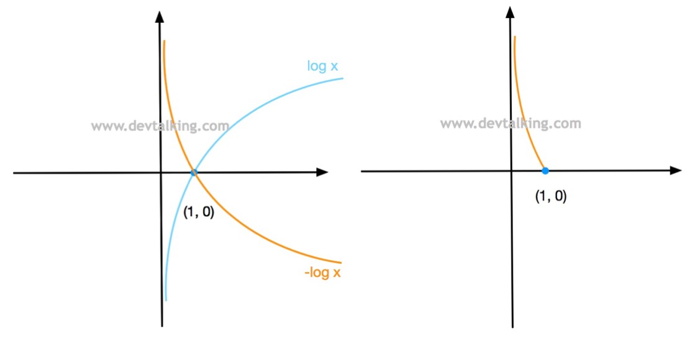

# 逻辑回归

逻辑回归：解决分类问题。将样本的特征和样本发生的概率联系起来，概率是一个数值，所以称为逻辑回归。
$$
\hat{p}=f(x) \qquad 
\hat{y}=\begin{cases}
 1, & \hat{p}\ge 0.5\\
 0, & \hat{p}< 0.5\\
\end{cases}
$$
其中1和0表示不同的情况。

> [!warning]
>
> 逻辑回归用于分类，只能解决二分类问题。

在线性回归中
$$
\hat{y}=f(x) \Rightarrow \hat{y}=\theta^{T}\cdot x_b
$$
其中$\hat{y}\in \left [ -\infty, + \infty \right ]$ ，为了使结果映射到概率的值域$ \left [0, 1\right ]$，存在函数
$$
\hat{p}=\sigma \left( \theta^{T}\cdot x_b \right)
$$
其中
$$
\sigma(t)=\frac{1}{1+e^{-t}}
$$
绘制sigmod函数曲线

```python
import numpy as np
import matplotlib.pyplot as plt

def sigmoid(x):
    return 1 / (1 + np.exp(-x))

x = np.linspace(-10, 10, 500)
y = sigmoid(x)
plt.plot(x, y)
plt.scatter(0, sigmoid(0), color='red')  
plt.text(0, sigmoid(0), '(0, 0.5)', fontsize=12, ha='right')
plt.grid(True, linestyle='--', alpha=0.5)
plt.show()
```

sigmod函数曲线的特点

* 值域是在$ \left [0, 1\right ]$之间。
* 当$t>0$时，$p>0.5$；当$t<0$时，$p<0.5$；当$t=0$时，$p=0.5$。

所以概率$\hat{p}$可以表示为
$$
\hat{p}=\sigma \left( \theta^{T}\cdot x_b \right)=\frac{1}{1+e^{\theta^{T}\cdot x_b}} \qquad
\hat{y}=\begin{cases}
 1, & \hat{p}\ge 0.5\\
 0, & \hat{p}< 0.5\\
\end{cases}
$$

## 逻辑回归的损失函数

逻辑回归损失函数的特点

* 如果$y=1$，$p$越小，损失函数越大。
* 如果$y=0$，$p$越大，损失函数越大。

根据上述特点定义损失函数
$$
\text{cost} = \begin{cases}
-\log(\hat{p})    & \text{ if } y=1 \\
-\log(1-\hat{p})  & \text{ if } y=0
\end{cases}
$$
当$y=1$时，损失函数为$-\log(\hat{p})$



* $p$越小，损失函数越大。
* $p$越大，损失函数越小。
* 当$p=1$时，损失函数为0。

当$y=0$时，损失函数为$-\log(1-\hat{p})$，其中$-\log(1-x)$的曲线如下


所以$-\log(1-\hat{p})$的曲线为


* $p$越大，损失函数越大。
* $p$越小，损失函数越小。
* 当$p=0$时，损失函数为0。

将上面的分段函数整合为一个函数
$$
\text{cost}=-y\log(\hat{p})-(1-y)\log(1-\hat{p})
$$
所以逻辑回归的损失函数为
$$
J(\theta)=-\frac{1}{m}\sum_i^{m}\left (y^{(i)}\log(\hat{p}^{(i)})+(1-y^{(i)})\log(1-\hat{p}^{(i)})\right)
$$
其中
$$
\hat{p}^{(i)}=\sigma \left( X_b^{(i)} \theta \right)=\frac{1}{1+e^{X_b^{(i)} \theta}}
$$

* 上述函数求损失函数的最小值，没有解析解。
* 可以使用梯度下降法求解。
* 上述函数是凸函数，存在唯一的一个全局最优解。

### 损失函数的梯度

根据上面的公式逻辑回归的损失函数表示为如下式子：
$$
J(\theta)=-\frac{1}{m}\sum_i^{m}\left (y^{(i)}\log \left(\sigma \left( X_b^{(i)} \theta \right)\right)+(1-y^{(i)})\log \left(1-\sigma \left( X_b^{(i)} \theta \right)\right)\right)
$$
其中对sigmod函数求导为
$$
\sigma(t)=\frac{1}{1+e^{-t}}=(1+e^{-t})^{-1} \Rightarrow {\sigma(t)}' =(1+e^{-t})^{-2} \cdot e^{-t}
$$
所以$\log\sigma(t)$的导数可以表示为
$$
{\log}'\sigma(t)=\frac{e^{-t}}{1+e^{-t}}=1-\frac{1}{1+e^{-t}}=1-\sigma(t)
$$
$\log(1-\sigma(t))$的导数可以表示为
$$
{\log}'(1-\sigma(t))=-\sigma(t)
$$
整理可得
$$
\frac{\partial J(\theta )}{\partial \theta_j }= \frac{1}{m}\sum_{i=1}^{m}\left(\sigma(X_b^{(i)}\theta)-y^{(i)}\right)X^{(i)}_j=\frac{1}{m}\sum_{i=1}^{m}\left(\hat{y}^{(i)}-y^{(i)}\right)X^{(i)}_j
$$
所以逻辑回归的梯度可以表示为
$$
\nabla J(\theta )=
\begin{pmatrix}
\frac{\partial J}{\partial \theta_0 } \\
\frac{\partial J}{\partial \theta_1 } \\
\frac{\partial J}{\partial \theta_2 } \\
…\\
\frac{\partial J}{\partial \theta_n } 
\end{pmatrix}
=\frac{1}{m} 
\begin{pmatrix}
\sum_{i=1}^{m}(\hat{y}^{(i)}-y^{(i)}) \\
\sum_{i=1}^{m}(\hat{y}^{(i)}-y^{(i)})\cdot X_1^{(i)} \\
\sum_{i=1}^{m}(\hat{y}^{(i)}-y^{(i)})\cdot X_2^{(i)} \\
…\\
\sum_{i=1}^{m}(\hat{y}^{(i)}-y^{(i)})\cdot X_n^{(i)} \\
\end{pmatrix}
=\frac{1}{m} \cdot X_b^T \cdot (\sigma(X_b\theta)-y)
$$

## 实现简单的逻辑回归