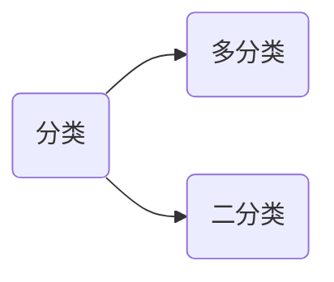
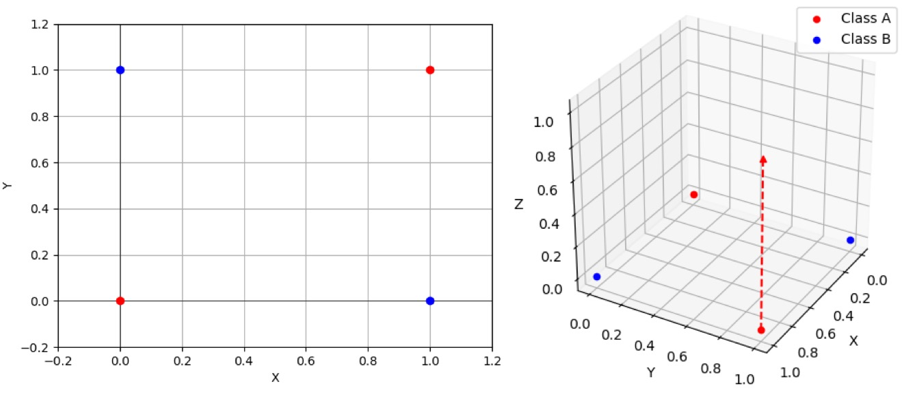

# 逻辑回归

逻辑回归：解决分类问题。



对于二分类问题，假设其中一个类别的概率为 $P_1$，不属于该类的概率是 $P_2$，则有：
$$
P_1+P_2=1
$$
二分类要求两个了类别是互斥的。

将样本的特征和样本发生的概率联系起来，概率是一个数值，所以称为逻辑回归。
$$
\hat{p}=f(x) \qquad 
\hat{y}=\begin{cases}
 1, & \hat{p}\ge 0.5\\
 0, & \hat{p}< 0.5\\
\end{cases}
$$
其中1和0表示不同的情况。

> [!warning]
>
> 标准的逻辑回归用于分类，只能解决二分类问题。

在线性回归中
$$
\hat{y}=f(x) \Rightarrow \hat{y}=\theta^{T}\cdot x_b
$$
其中$\hat{y}\in \left [ -\infty, + \infty \right ]$ ，为了使结果映射到概率的值域$ \left [0, 1\right ]$，存在函数
$$
\hat{p}=\sigma \left( \theta^{T}\cdot x_b \right)
$$
其中
$$
\sigma(t)=\frac{1}{1+e^{-t}}
$$
绘制sigmod函数曲线

```python
import numpy as np
import matplotlib.pyplot as plt

def sigmoid(x):
    return 1 / (1 + np.exp(-x))

x = np.linspace(-10, 10, 500)
y = sigmoid(x)
plt.plot(x, y)
plt.scatter(0, sigmoid(0), color='red')  
plt.text(0, sigmoid(0), '(0, 0.5)', fontsize=12, ha='right')
plt.grid(True, linestyle='--', alpha=0.5)
plt.show()
```

sigmod函数曲线的特点

* 值域是在$ \left [0, 1\right ]$之间。
* 当$t>0$时，$p>0.5$；当$t<0$时，$p<0.5$；当$t=0$时，$p=0.5$。

所以概率$\hat{p}$可以表示为
$$
\hat{p}=\sigma \left( \theta^{T}\cdot x_b \right)=\frac{1}{1+e^{\theta^{T}\cdot x_b}} \qquad
\hat{y}=\begin{cases}
 1, & \hat{p}\ge 0.5\\
 0, & \hat{p}< 0.5\\
\end{cases}
$$

> [!warning]
>
> 线性回归和逻辑回归的区别：
>
> 1. 线性回归用于预测连续的值。
> 2. 逻辑回归用于分类。

## 逻辑回归的损失函数

逻辑回归损失函数的特点

* 如果$y=1$，$p$越小，损失函数越大。
* 如果$y=0$，$p$越大，损失函数越大。

根据上述特点定义损失函数
$$
\text{cost} = \begin{cases}
-\log(\hat{p})    & \text{ if } y=1 \\
-\log(1-\hat{p})  & \text{ if } y=0
\end{cases}
$$
当$y=1$时，损失函数为$-\log(\hat{p})$


* $p$越小，损失函数越大。
* $p$越大，损失函数越小。
* 当$p=1$时，损失函数为0。

当$y=0$时，损失函数为$-\log(1-\hat{p})$，其中$-\log(1-x)$的曲线如下


所以$-\log(1-\hat{p})$的曲线为


* $p$越大，损失函数越大。
* $p$越小，损失函数越小。
* 当$p=0$时，损失函数为0。

将上面的分段函数整合为一个函数
$$
\text{cost}=-y\log(\hat{p})-(1-y)\log(1-\hat{p})
$$
所以逻辑回归的损失函数为
$$
J(\theta)=-\frac{1}{m}\sum_i^{m}\left (y^{(i)}\log(\hat{p}^{(i)})+(1-y^{(i)})\log(1-\hat{p}^{(i)})\right)
$$
其中
$$
\hat{p}^{(i)}=\sigma \left( X_b^{(i)} \theta \right)=\frac{1}{1+e^{X_b^{(i)} \theta}}
$$

* 上述函数求损失函数的最小值，没有解析解。
* 可以使用梯度下降法求解。
* 上述函数是凸函数，存在唯一的一个全局最优解。

### 损失函数的梯度

根据上面的公式逻辑回归的损失函数表示为如下式子：
$$
J(\theta)=-\frac{1}{m}\sum_i^{m}\left (y^{(i)}\log \left(\sigma \left( X_b^{(i)} \theta \right)\right)+(1-y^{(i)})\log \left(1-\sigma \left( X_b^{(i)} \theta \right)\right)\right)
$$
其中对sigmod函数求导为
$$
\sigma(t)=\frac{1}{1+e^{-t}}=(1+e^{-t})^{-1} \Rightarrow {\sigma(t)}' =(1+e^{-t})^{-2} \cdot e^{-t}
$$
所以$\log\sigma(t)$的导数可以表示为
$$
{\log}'\sigma(t)=\frac{e^{-t}}{1+e^{-t}}=1-\frac{1}{1+e^{-t}}=1-\sigma(t)
$$
$\log(1-\sigma(t))$的导数可以表示为
$$
{\log}'(1-\sigma(t))=-\sigma(t)
$$
整理可得
$$
\frac{\partial J(\theta )}{\partial \theta_j }= \frac{1}{m}\sum_{i=1}^{m}\left(\sigma(X_b^{(i)}\theta)-y^{(i)}\right)X^{(i)}_j=\frac{1}{m}\sum_{i=1}^{m}\left(\hat{y}^{(i)}-y^{(i)}\right)X^{(i)}_j
$$
所以逻辑回归的梯度可以表示为
$$
\nabla J(\theta )=
\begin{pmatrix}
\frac{\partial J}{\partial \theta_0 } \\
\frac{\partial J}{\partial \theta_1 } \\
\frac{\partial J}{\partial \theta_2 } \\
…\\
\frac{\partial J}{\partial \theta_n } 
\end{pmatrix}
=\frac{1}{m} 
\begin{pmatrix}
\sum_{i=1}^{m}(\hat{y}^{(i)}-y^{(i)}) \\
\sum_{i=1}^{m}(\hat{y}^{(i)}-y^{(i)})\cdot X_1^{(i)} \\
\sum_{i=1}^{m}(\hat{y}^{(i)}-y^{(i)})\cdot X_2^{(i)} \\
…\\
\sum_{i=1}^{m}(\hat{y}^{(i)}-y^{(i)})\cdot X_n^{(i)} \\
\end{pmatrix}
=\frac{1}{m} \cdot X_b^T \cdot (\sigma(X_b\theta)-y)
$$

## 实现简单的逻辑回归

根据上述算法使用python实现逻辑回归如下

```python
from sklearn.metrics import accuracy_score

class LogisticRegression:
    def __init__(self):
        self.coef_ = None
        self.interception_ = None
        self._theta = None
        
    def _sigmoid(self, t):
        return 1. / (1. + np.exp(-t))
        
    def fit(self, X_train, y_train, eta=0.01, n_iters=1e4):
        assert X_train.shape[0] == y_train.shape[0], 'the size of X_train must be equal to the size of y_train'
        
        def J(theta, X_b, y):
            y_hat = self._sigmoid(X_b.dot(theta))
            try:
                return -np.sum(y*np.log(y_hat) + (1-y)*np.log(1-y_hat)) / len(y)
            except:
                return float('inf')
        
        def dJ(theta, X_b, y):
            return X_b.T.dot(self._sigmoid(X_b.dot(theta)) - y) / len(y)
        
        def gradient_descent(X_b, y, initial_theta, eta, n_iters=1e4, epsilon=1e-8):
            theta = initial_theta
            cur_iter = 0
            while cur_iter < n_iters:
                gradient = dJ(theta, X_b, y)
                last_theta = theta
                theta = theta - eta * gradient
                if abs(J(theta, X_b, y) - J(last_theta, X_b, y)) < epsilon:
                    break
                cur_iter += 1
            return theta
        
        X_b = np.hstack([np.ones((len(X_train), 1)), X_train])
        initial_theta = np.zeros(X_b.shape[1])
        self._theta = gradient_descent(X_b, y_train, initial_theta, eta, n_iters)
        self.interception_ = self._theta[0]
        self.coef_ = self._theta[1:]
        return self
    
    def predict_proba(self, X_predict):
        assert self.interception_ is not None and self.coef_ is not None, 'must fit before predict'
        assert X_predict.shape[1] == len(self.coef_), 'the feature number of X_predict must be equal to X_train'
        X_b = np.hstack([np.ones((len(X_predict), 1)), X_predict])
        return self._sigmoid(X_b.dot(self._theta))
    
    def predict(self, X_predict):
        proba = self.predict_proba(X_predict)
        return np.array(proba >= 0.5, dtype=int)
    
    def score(self, X_test, y_test):
        y_predict = self.predict(X_test)
        return accuracy_score(y_test, y_predict)
```

与线性回归实现相比：

* 增加了`_sigmoid`函数
* 修改了损失函数`J`和求导函数`dJ`
* 修改了预测函
* 修改了得分的评价标准

使用sk-learn中的鸢尾花数据为测试集

```python
from sklearn import datasets

iris = datasets.load_iris()
X = iris.data
y = iris.target
X = X[y<2, :2]
y = y[y<2]
print(X.shape)
print(y.shape)
```

上述数据只选则了鸢尾花数据的两种分类和二维特征，绘制上述数据集

```python
plt.scatter(X[y==0, 0], X[y==0, 1], color='red')
plt.scatter(X[y==1, 0], X[y==1, 1], color='blue')
plt.show()
```

使用逻辑回归进行数据分类

```python
from sklearn.model_selection import train_test_split

X_train, X_test, y_train, y_test = train_test_split(X, y, random_state=666)
log_reg = LogisticRegression()

log_reg.fit(X_train, y_train)
print(log_reg.score(X_test, y_test))
print(log_reg.predict_proba(X_test))
print(y_test)
print(log_reg.predict(X_test))
```

## 决策边界

打印模型参数

```python
print(log_reg.coef_)
print(log_reg.interception_)
```

对于逻辑回归有分类函数表示为
$$
\hat{p}=
\sigma \left( \theta^{T}\cdot x_b \right)=\frac{1}{1+e^{\theta^{T}\cdot x_b}} \qquad
\hat{y}=
\begin{cases}
 1, & \hat{p}\ge 0.5 \Rightarrow \theta^{T}\cdot x_b \ge 0.5\\
 0, & \hat{p}< 0.5 \Rightarrow \theta^{T}\cdot x_b < 0.5 \\
\end{cases}
$$
所以
$$
\theta^{T}\cdot x_b = 0
$$
称为决策边界。当特征维度为2时，决策边界可以表示为
$$
\theta_0+\theta_1x_1+\theta_2x_2=0
$$
绘制上面模型的决策边界如下

```python
def x2(x1):
    return (-log_reg.coef_[0] * x1 - log_reg.interception_) / log_reg.coef_[1]

x1_plot = np.linspace(4, 8, 1000)
x2_plot = x2(x1_plot)

plt.scatter(X[y==0, 0], X[y==0, 1], color='red')
plt.scatter(X[y==1, 0], X[y==1, 1], color='blue')
plt.plot(x1_plot, x2_plot)
plt.show()
```

> [!warning]
>
> 逻辑回归可以看做预测一个点相对于一条直线的位置。

根据模型绘制决策边界（该函数仅了解即可）

```python
def plot_decision_boundary(model, axis):
    x0, x1 = np.meshgrid(
        np.linspace(axis[0], axis[1], int((axis[1]-axis[0])*100)).reshape(-1, 1),
        np.linspace(axis[2], axis[3], int((axis[3]-axis[2])*100)).reshape(-1, 1),
    )
    X_new = np.c_[x0.ravel(), x1.ravel()]
    y_predict = model.predict(X_new)
    zz = y_predict.reshape(x0.shape)
    
    from matplotlib.colors import ListedColormap
    custom_cmap = ListedColormap(['#EF9A9A', '#FFF59D', '#90CAF9'])
    
    plt.contourf(x0, x1, zz, linewidth=5, cmap=custom_cmap)
```

调用上述函数绘制线性回归的决策边界

```python
plot_decision_boundary(log_reg, axis=[4, 7.5, 1.5, 4.5])
plt.scatter(X[y==0, 0], X[y==0, 1], color='red')
plt.scatter(X[y==1, 0], X[y==1, 1], color='blue')
plt.show()
```

### 验证KNN算法的决策边界

使用KNN分类器分类上面的数据并绘制决策边界

```python
from sklearn.neighbors import KNeighborsClassifier

knn_clf = KNeighborsClassifier()
knn_clf.fit(X_train, y_train)
print(knn_clf.score(X_test, y_test))

plot_decision_boundary(knn_clf, axis=[4, 7.5, 1.5, 4.5])
plt.scatter(X[y==0, 0], X[y==0, 1], color='red')
plt.scatter(X[y==1, 0], X[y==1, 1], color='blue')
plt.show()
```

绘制3类的分类边界

```python
knn_clf_all = KNeighborsClassifier()
knn_clf_all.fit(iris.data[:, :2], iris.target)
plot_decision_boundary(knn_clf_all, axis=[4, 8, 1.5, 4.5])
plt.scatter(iris.data[iris.target==0, 0], iris.data[iris.target==0, 1], color='red')
plt.scatter(iris.data[iris.target==1, 0], iris.data[iris.target==1, 1], color='blue')
plt.scatter(iris.data[iris.target==2, 0], iris.data[iris.target==2, 1], color='green')
plt.show()
```

当`n_neighbors=50`绘制决策边界

```python
knn_clf_all = KNeighborsClassifier(n_neighbors=50)
knn_clf_all.fit(iris.data[:, :2], iris.target)
plot_decision_boundary(knn_clf_all, axis=[4, 8, 1.5, 4.5])
plt.scatter(iris.data[iris.target==0, 0], iris.data[iris.target==0, 1], color='red')
plt.scatter(iris.data[iris.target==1, 0], iris.data[iris.target==1, 1], color='blue')
plt.scatter(iris.data[iris.target==2, 0], iris.data[iris.target==2, 1], color='green')
plt.show()
```

> [!warning]
>
> 在KNN算法中，当面模型的`n_neighbors`参数越大模型越简单，在分类边界中表现为边界越规整。

## 逻辑回归的多项式特征

上面的逻辑回归本质上是找到一条直线，用直线来分割样本的类别。通过对数据添加多项式向，可以使得逻辑回归对非线性的数据同时起作用。

生成模拟数据

```python
import numpy as np
import matplotlib.pyplot as plt

np.random.seed(666)

X = np.random.normal(0, 1, size=(200, 2))
y = np.array(X[:, 0]**2 + X[:, 1]**2 < 1.5, dtype=int)

plt.scatter(X[y==0, 0], X[y==0, 1], color='red')
plt.scatter(X[y==1, 0], X[y==1, 1], color='blue')
plt.show()
```

使用原始数据训练逻辑回归模型，并绘制决策边界

```python
log_reg = LogisticRegression()
log_reg.fit(X, y)
print(log_reg.score(X, y))
plot_decision_boundary(log_reg, axis=[-4, 4, -4, 4])
plt.scatter(X[y==0, 0], X[y==0, 1], color='red')
plt.scatter(X[y==1, 0], X[y==1, 1], color='blue')
plt.show()
```

使用多项式特征来训练模型

```python
from sklearn.pipeline import Pipeline
from sklearn.preprocessing import PolynomialFeatures
from sklearn.preprocessing import StandardScaler

def PolynomialLogisticRegression(degree):
    return Pipeline([
        ('poly', PolynomialFeatures(degree=degree)),
        ('std_scaler', StandardScaler()),
        ('log_reg', LogisticRegression())
    ])

poly_log_reg = PolynomialLogisticRegression(degree=2)
poly_log_reg.fit(X, y)
print(poly_log_reg.score(X, y))
```

绘制多项式特征的决策边界

```python
plot_decision_boundary(poly_log_reg, axis=[-4, 4, -4, 4])
plt.scatter(X[y==0, 0], X[y==0, 1], color='red')
plt.scatter(X[y==1, 0], X[y==1, 1], color='blue')
plt.show()
```

> [!warning]
>
> 在实际应用中数据分布不可能是规则的原型，多项式特征的`degree`可以取更大的值。

升维可以使线性不可分的数据变为线性可分



## sk-learn的逻辑回归

sk-learn中逻辑回归使用了正则化的处理方式
$$
C\cdot J(\theta)+L_1 \\
C\cdot J(\theta)+L_2
$$
其中正则化系数$C$在损失函数前面，$C$损失函数越重要。

生成测试数据

```python
np.random.seed(666)

X = np.random.normal(0, 1, size=(200, 2))
y = np.array(X[:, 0]**2 + X[:, 1] < 1.5, dtype=int)
for _ in range(20):
    y[np.random.randint(200)] = 1
    
plt.scatter(X[y==0, 0], X[y==0, 1], color='red')
plt.scatter(X[y==1, 0], X[y==1, 1], color='blue')
plt.show()
```

使用sk-learn的逻辑回归来训练模型和预测

```python
from sklearn.linear_model import LogisticRegression
from sklearn.model_selection import train_test_split

X_train, X_test, y_train, y_test = train_test_split(X, y, random_state=666)

log_reg = LogisticRegression()
log_reg.fit(X_train, y_train)
print(log_reg.score(X_train, y_train))
print(log_reg.score(X_test, y_test))
```

默认的逻辑回归函数采用$L_2$正则，$C=1$。

绘制模型的决策边界

```
plot_decision_boundary(log_reg, axis=[-4, 4, -4, 4])
plt.scatter(X[y==0, 0], X[y==0, 1], color='red')
plt.scatter(X[y==1, 0], X[y==1, 1], color='blue')
plt.show()
```

使用多项式特征训练分类器

```python
def PolynomialLogisticRegression(degree):
    return Pipeline([
        ('poly', PolynomialFeatures(degree=degree)),
        ('std_scaler', StandardScaler()),
        ('log_reg', LogisticRegression())
    ])

poly_log_reg = PolynomialLogisticRegression(degree=2)
poly_log_reg.fit(X_train, y_train)
print(poly_log_reg.score(X_train, y_train))
print(poly_log_reg.score(X_test, y_test))
```

绘制模型的决策边界

```python
plot_decision_boundary(poly_log_reg, axis=[-4, 4, -4, 4])
plt.scatter(X[y==0, 0], X[y==0, 1], color='red')
plt.scatter(X[y==1, 0], X[y==1, 1], color='blue')
plt.show()
```

当特征多项式时训练模型并绘制边界

```python
poly_log_reg2 = PolynomialLogisticRegression(degree=20)
poly_log_reg2.fit(X_train, y_train)
print(poly_log_reg2.score(X_train, y_train))
print(poly_log_reg2.score(X_test, y_test))
plot_decision_boundary(poly_log_reg2, axis=[-4, 4, -4, 4])
plt.scatter(X[y==0, 0], X[y==0, 1], color='red')
plt.scatter(X[y==1, 0], X[y==1, 1], color='blue')
plt.show()
```

当`degree=20`修改正则项参数训练模型，并绘制边界

```python
def PolynomialLogisticRegression(degree, C):
    return Pipeline([
        ('poly', PolynomialFeatures(degree=degree)),
        ('std_scaler', StandardScaler()),
        ('log_reg', LogisticRegression(C=C))
    ])

poly_log_reg3 = PolynomialLogisticRegression(degree=20, C=0.1)
poly_log_reg3.fit(X_train, y_train)
print(poly_log_reg3.score(X_train, y_train))
print(poly_log_reg3.score(X_test, y_test))

plot_decision_boundary(poly_log_reg3, axis=[-4, 4, -4, 4])
plt.scatter(X[y==0, 0], X[y==0, 1], color='red')
plt.scatter(X[y==1, 0], X[y==1, 1], color='blue')
plt.show()
```

使用$L_1$正则训练模型，并绘制边界

```python
def PolynomialLogisticRegression_l1(degree, C):
    return Pipeline([
        ('poly', PolynomialFeatures(degree=degree)),
        ('std_scaler', StandardScaler()),
        ('log_reg', LogisticRegression(C=C, penalty='l1', solver='liblinear'))
    ])

poly_log_reg4 = PolynomialLogisticRegression_l1(degree=20, C=0.1)
poly_log_reg4.fit(X_train, y_train)
print(poly_log_reg4.score(X_train, y_train))
print(poly_log_reg4.score(X_test, y_test))

plot_decision_boundary(poly_log_reg4, axis=[-4, 4, -4, 4])
plt.scatter(X[y==0, 0], X[y==0, 1], color='red')
plt.scatter(X[y==1, 0], X[y==1, 1], color='blue')
plt.show()
```

$L_1$正则有特征选择的效果。

## 逻辑回归的多分类问题

### OvR（One vs Rest）


如果有$n$个类别进行$n$次分类，选择分类得分最高的。需要训练$n$个模型。

### OvO（One vs One）


需要训练$C_n^2$个模型，选择分类数量最多的类别。

### sk-learn中的多分类

使用鸢尾花数据训练多分类模型

```python
iris = datasets.load_iris()
X = iris.data[:, :2]
y = iris.target

X_train, X_test, y_train, y_test = train_test_split(X, y, random_state=666)

log_reg = LogisticRegression()
log_reg.fit(X_train, y_train)
print(log_reg.score(X_test, y_test))
```

sk-learn中逻辑回归多分类模型默认使用OvR方式，绘制分类边界。

```python
def plot_decision_boundary(model, axis):
    x0, x1 = np.meshgrid(
        np.linspace(axis[0], axis[1], int((axis[1]-axis[0])*100)).reshape(-1, 1),
        np.linspace(axis[2], axis[3], int((axis[3]-axis[2])*100)).reshape(-1, 1),
    )
    X_new = np.c_[x0.ravel(), x1.ravel()]
    y_predict = model.predict(X_new)
    zz = y_predict.reshape(x0.shape)
    
    from matplotlib.colors import ListedColormap
    custom_cmap = ListedColormap(['#EF9A9A', '#FFF59D', '#90CAF9'])
    
    plt.contourf(x0, x1, zz, linewidth=5, cmap=custom_cmap)
    
    
plot_decision_boundary(log_reg, axis=[4, 8, 1.5, 4.5])
plt.scatter(X[y==0, 0], X[y==0, 1], color='red')
plt.scatter(X[y==1, 0], X[y==1, 1], color='blue')
plt.scatter(X[y==2, 0], X[y==2, 1], color='green')
plt.show()
```

使用OvO模型进行多分类，绘制分类边界。

```python
log_reg2 = LogisticRegression(multi_class='multinomial', solver='newton-cg')
log_reg2.fit(X_train, y_train)
print(log_reg2.score(X_test, y_test))

plot_decision_boundary(log_reg2, axis=[4, 8, 1.5, 4.5])
plt.scatter(X[y==0, 0], X[y==0, 1], color='red')
plt.scatter(X[y==1, 0], X[y==1, 1], color='blue')
plt.scatter(X[y==2, 0], X[y==2, 1], color='green')
```

使用鸢尾花全部数据训练模型

```python
X = iris.data
y = iris.target

X_train, X_test, y_train, y_test = train_test_split(X, y, random_state=666)

log_reg = LogisticRegression()
log_reg.fit(X_train, y_train)
print(log_reg.score(X_test, y_test))
```

>[!warning]
>
>在`sklearn.multiclass`中，包含`OneVsRestClassifier`和`OneVsOneClassifier`可以用于二分类器的封装，完成多分类任务。
