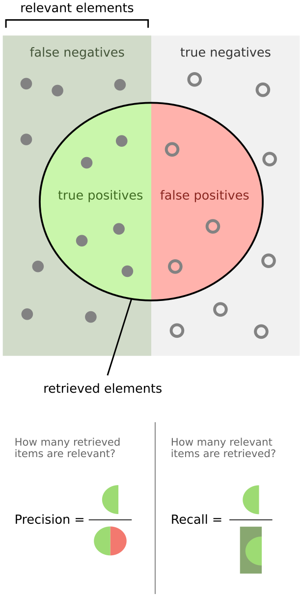

# 评价分类结果

> [!note]
>
> 一个癌症预测系统，输入体检信息，可以判断是否有癌症，该系统的预测正确率（Accuracy）是$99.9\%$。

如果该癌症的发病率是$0.1\%$。只要系统预测所以人都是健康的，系统的正确率即可达到$99.9\%$；如果该癌症的发病率是$0.01\%$。只要系统预测所以人都是健康的，系统的正确率即可达到$99.99\%$

上述情况的数据称为极度偏斜（Skewed Data）。所以分类准确度远远不能表示分类器性能。

## 混淆矩阵

混淆矩阵（Confusion Matrix），对于二分类问题，混淆矩阵如下。

|                            | 预测为$\hat P$       | 预测为$\hat N$       |
| -------------------------- | -------------------- | -------------------- |
| 真实$P$（正样本 Positive） | TP（True Positive）  | FN（False Negative） |
| 真实$N$（负样本 Negative） | FP（False Positive） | TN（True Negative）  |

假设有10000人，其癌症预测结果的混淆矩阵如下

|      | $\hat P$ | $\hat N$ |
| ---- | -------- | -------- |
| $P$  | 8        | 2        |
| $N$  | 12       | 9978     |

## 准确率和召回率

|      | $\hat P$                                                     | $\hat N$ |                                                              |
| ---- | ------------------------------------------------------------ | -------- | ------------------------------------------------------------ |
| $P$  | TP                                                           | FN       | 召回率$\text{Recall} = \frac{\text{TP}}{\text{TP} + \text{FN}}$ |
| $N$  | FP                                                           | TN       |                                                              |
|      | 准确率$\text{Precision} = \frac{\text{TP}}{\text{TP} + \text{FP}}$ |          | 正确率$\text{Accuracy}=\frac{\text{TP+TN}}{\text{ALL}}$      |

1. 通常在有偏数据中将分类为正样本作为关注的对象。
2. 准确率表示预测关注的事件有多准。
3. 召回率表示关注的事件，真实发生后，被成功预测的有多少。

在癌症预测中计算准确率和召回率

|      | $\hat P$                                   | $\hat N$ |                                                |
| ---- | ------------------------------------------ | -------- | ---------------------------------------------- |
| $P$  | 8                                          | 2        | $\text{Recall} = \frac{8}{8 + 2}=80\%$         |
| $N$  | 12                                         | 9978     |                                                |
|      | $\text{Precision} = \frac{8}{12 + 8}=40\%$ |          | $\text{Accuracy}=\frac{8+9978}{10000}=99.86\%$ |

1. 上述预测的准确率表示预测癌症的成功率。
2. 召回率表示癌症患者被成功找到的概率。

对于10000个人，癌症的发病率为$0.1\%$，预测所以人为健康的

|      | $\hat P$                             | $\hat N$ |                                             |
| ---- | ------------------------------------ | -------- | ------------------------------------------- |
| $P$  | 0                                    | 10       | $\text{Recall} = \frac{0}{10 + 0}=0$        |
| $N$  | 0                                    | 9990     |                                             |
|      | $\text{Precision} = \frac{0}{0 + 0}$ |          | $\text{Accuracy}=\frac{9990}{10000}=99.9\%$ |

1. 准确率的计算无意义。
2. 召回率为0。

