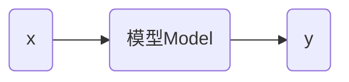

# 线性回归

## 基本概念



数据集名称 `train_data`

数学公式
$$
y=wx+b
$$
上面的公式可以理解为模型。

 线性回归（linear regression）：是一种统计分析方法，用于预测一个因变量的值，基于一个或多个自变量的值。它假设因变量和自变量之间存在线性关系。系数是需要通过数据拟合来确定的。

回归这个概念最早是由英国生物学家兼统计学家弗朗西斯·高尔顿（Francis Galton）提出的，意思是回归平均值（regression toward the mean）。


`train_data` 分布如下：


在上述点中找到 $w$ 和 $b$ 使得 $y=wx+b$ 尽可能的到达理想。
$$
\hat{y_i} = wx_i+b
$$
对每个实际 $y_i$ 计算 MSE 是均方误差（Mean Squared Error）
$$
MSE=\frac{1}{n}\sum_{i=1}^n (y_i-\hat{y_i})^2
$$

上面的方程有两种情况：

* 有解析解
* 无解析解

训练线性模型

```python
import numpy as np
from sklearn.linear_model import LinearRegression

def read_data(path):
    with open(path) as f:
        lines = f.readlines()
    lines = [eval(line.strip()) for line in lines]
    x, y = zip(*lines)
    x = np.array(x)
    y = np.array(y)
    return x, y

x_train, y_train = read_data("train_data")
model = LinearRegression()
model.fit(x_train, y_train)  # 寻找合适的w和b使得误差最小
print(model.coef_, model.intercept_)
```

上面的训练过程可以找到使得 MSE 最小的  $w$ 和 $b$ ，其中输入数据可以是 $n$ 维矩阵。

### 模型测试

评估模型在训练集上的表现

```python
y_pred_train = model.predict(x_train)
train_mse = metrics.mean_squared_error(y_train, y_pred_train)
print(train_mse)
```

测试数据集为 `test_data` 评估模型测试集上的表现

```python
x_test, y_test = read_data("test_data")
y_pred_test = model.predict(x_test)
test_mse = metrics.mean_squared_error(y_test, y_pred_test)
print(test_mse)
```

> [!warning]
>
> MSE 的值只有相对意义，没有绝对意义，只是用例比较同一数据类型间的关系。

训练集中预测结果和实际结果对比


测试集中预测结果和实际结果对比


> [!warning]
>
> 在真实环境中，测试集的误差一般大于训练集

训练集、测试集和全量数据间的关系


