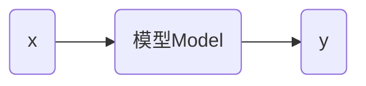

# 线性回归

## 基本概念



数据集名称 `train_data`

数学公式
$$
y=wx+b
$$
上面的公式可以理解为模型。

 线性回归（linear regression）：是一种统计分析方法，用于预测一个因变量的值，基于一个或多个自变量的值。它假设因变量和自变量之间存在线性关系。系数是需要通过数据拟合来确定的。

回归这个概念最早是由英国生物学家兼统计学家弗朗西斯·高尔顿（Francis Galton）提出的，意思是回归平均值（regression toward the mean）。机器学习中借鉴了这一概念，产生了回归分析。


`train_data` 分布如下：


在上述点中找到 $w$ 和 $b$ 使得 $y=wx+b$ 尽可能的到达理想。
$$
\hat{y_i} = wx_i+b
$$
对每个实际 $y_i$ 计算 MSE 是均方误差（Mean Squared Error）
$$
MSE=\frac{1}{n}\sum_{i=1}^n (y_i-\hat{y_i})^2
$$

上面的方程有两种情况：

* 有解析解
* 无解析解

训练线性模型

```python
import numpy as np
from sklearn.linear_model import LinearRegression

def read_data(path):
    with open(path) as f:
        lines = f.readlines()
    lines = [eval(line.strip()) for line in lines]
    x, y = zip(*lines)
    x = np.array(x)
    y = np.array(y)
    return x, y

x_train, y_train = read_data("train_data")
model = LinearRegression()
model.fit(x_train, y_train)  # 寻找合适的w和b使得误差最小
print(model.coef_, model.intercept_)
```

上面的训练过程可以找到使得 MSE 最小的  $w$ 和 $b$ ，其中输入数据可以是 $n$ 维矩阵。

### 模型测试

评估模型在训练集上的表现

```python
y_pred_train = model.predict(x_train)
train_mse = metrics.mean_squared_error(y_train, y_pred_train)
print(train_mse)
```

测试数据集为 `test_data` 评估模型测试集上的表现

```python
x_test, y_test = read_data("test_data")
y_pred_test = model.predict(x_test)
test_mse = metrics.mean_squared_error(y_test, y_pred_test)
print(test_mse)
```

> [!warning]
>
> MSE 的值只有相对意义，没有绝对意义，只是用例比较同一数据类型间的关系。

训练集中预测结果和实际结果对比


测试集中预测结果和实际结果对比


> [!warning]
>
> 在真实环境中，测试集的误差一般大于训练集

训练集、测试集和全量数据间的关系


减小误差集的方法：

1. 增大训练集数据
2. 增加训练集的多样性，更符合真实环境。

能在测试集上表现良好的能力，提高泛化能力。

> [!warning]
>
> 使用 $(y_i-\hat{y_i})^2$ 比 $\left| y_i-\hat{y_i} \right|$计算距离更好 

在距离近的点上计算 MSE 降低到一定程度后，继续在其附件优化收益就变小了。注意力会转移到距离远的点，因为优化这些点的收益更大。如果使用绝对值误差，收益永远不变，注意力会总集中在容易的点上。

### 梯度下降法

MSE 公式可以变换为
$$
MSE=\frac{1}{n}\sum_{i=1}^n (wx_i+b-\hat{y_i})^2
$$
上面公式中自变量为 $w$ 和 $b$，因变量是 MSE。

固定 $b$ 绘制 $w$ 和 MSE 的曲线如下：


当
$$
\frac{\partial MSE}{\partial w} = 0
$$
达到最小值。

根据上面的公式
$$
\frac{\partial MSE}{\partial w} = \frac{1}{n}\sum_{i=1}^n 2(wx_i+b-\hat{y_i}) \cdot x_i
$$
随机出事化 $w$ 值记作 $w(0)$，则有
$$
w(1)=w(0)-\frac{\partial MSE}{\partial w(0)} \\
w(2)=w(1)-\frac{\partial MSE}{\partial w(1)} \\
......
$$

沿着导数的方向寻找最小值，即为梯度下降法。


梯度下降法存在的问题：

1. 导数小收敛慢
2. 导数过大出现震荡


为了控制梯度下降的过程增加因子 $\alpha$，梯度下降公式如下：
$$
w(t+1)=w(t)-\alpha \cdot \frac{\partial MSE}{\partial w(t)}
$$
其中 $\alpha$ 称为学习速率（超参数），需要人工设置。

> [!warning]
>
> 梯度下降法不一定找到最小值。注意：线性回归不存在这样问题


对于 MSE 极小值问题
$$
\frac{\partial MSE}{\partial w} = \frac{1}{n}\sum_{i=1}^n 2(wx_i+b-\hat{y_i}) \cdot x_i=0
$$

> [!warning]
>
> 存在解，因为 $n$​ 过大直接解方程计算机无法计算，所以需要用梯度下降法 进行求解。

计算求导公式
$$
\frac{\partial MSE}{\partial w} = \frac{1}{n}\sum_{i=1}^n 2(wx_i+b-\hat{y_i}) \cdot x_i
$$
当训练数据过多时，计算过程会非常耗时。为了降低计算量，会抽取部分训练集进行求导。
