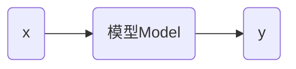

# 线性回归

数据集名称 `train_data`

数学公式
$$
y=wx+b
$$
上面的公式可以理解为模型。

 线性回归（linear regression）：是一种统计分析方法，用于预测一个因变量的值，基于一个或多个自变量的值。它假设因变量和自变量之间存在线性关系。系数是需要通过数据拟合来确定的。

回归这个概念最早是由英国生物学家兼统计学家弗朗西斯·高尔顿（Francis Galton）于1886年在《自然》杂志上发表的一篇文章中提出的。意思是（regression toward the mean）

根据数据绘制的散点图如下

在上述点中找到 $w$ 和 $b$ 使得 $y=wx+b$ 尽可能的到达理想。
$$
\hat{y_i} = wx_i+b
$$
对每个实际 $y_i$ 计算 MSE 是均方误差（Mean Squared Error）
$$
MSE=\frac{1}{n}\sum_{i=1}^n (y_i-\hat{y_i})^2
$$
 

