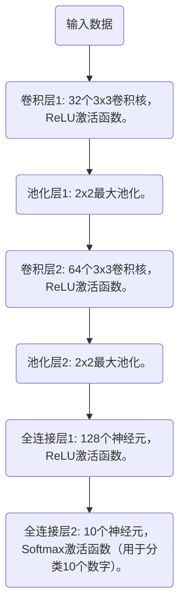

# 数字图像识别

## 数字图像识别

mnist 数据集，获取完整的mnist数据集

```python
import numpy as np
from sklearn.preprocessing import OneHotEncoder
from matplotlib import pyplot as plt
from keras.datasets import mnist


def _get_data():
    (x_train, t_train), (x_test, t_test) = mnist.load_data()
    return x_train, x_test, t_train, t_test


def _change_one_hot_label(x):
    encoder = OneHotEncoder(sparse=False)
    t_train_onehot = encoder.fit_transform(x.reshape(-1, 1))
    return t_train_onehot


def load_mnist(normalize=True, flatten=True, one_hot_label=False):
    x_train, x_test, t_train, t_test = _get_data()

    if normalize:
        x_train = x_train.astype(np.float32)
        x_test = x_test.astype(np.float32)
        x_train /= 255.0
        x_test /= 255.0

    if one_hot_label:
        t_train = _change_one_hot_label(t_train)
        t_test = _change_one_hot_label(t_test)

    if flatten:
        x_train = x_train.reshape(x_train.shape[0], -1)
        x_test = x_test.reshape(x_test.shape[0], -1)

    return (x_train, t_train), (x_test, t_test)
  
  
if __name__ == '__main__':
    (x_train, t_train), (x_test, t_test) = load_mnist(one_hot_label=True)
    print(x_train[10].shape)
    print(x_train[10])
    print(t_train[10])

```

设计如下网络对数据进行识别


## 设计已经卷积神经网



```python
Conv2D # keras 卷积层函数
MaxPooling2D # 池化层函数
Flatten # 展开函数
```

