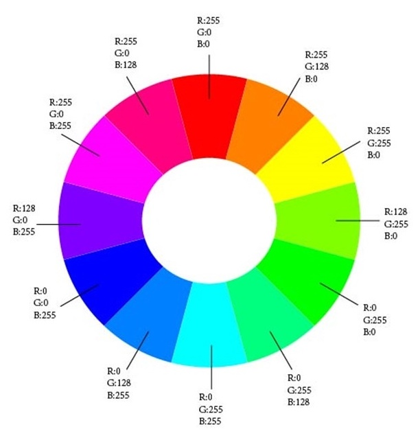
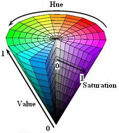

# 人工智能与计算机视觉

人工智能在视觉方向的应用

* 图像分类
* 图像检索
* 目标检测
* 图像分割
* 图像生成
* 目标跟踪
* 超分辨率重构
* 关键点定位
* 图像降噪
* 多模态
* 图像加密
* 视频编解码
* 3D视觉

## 图像的基本知识

### 颜色空间

颜色空间也称彩色模型，用于描述色彩。

常见颜色空间：RGB、CMYK、YUV、HSV模型

### RGB色彩模式

RGB色彩模式是工业解的一种颜色标准，通过对红（R）、绿（G）、蓝（B）三个颜色通道的变化以及它们相互之间的叠加来得到各式各样的颜色。红、绿、蓝三个颜色通道每种颜色各分为256阶亮度。

### HSV色彩模式

色相（Hue）：指物体传导或反射的波长。更常见的是以颜色如红色、橘色或绿色来辨识，取0到360度的数值来衡量。

饱和度（Saturation）：又称色度，是指色彩的强度或纯度，取值范围为0%到100%。

明度（Value）：表示颜色明亮度，取值范围为0%（黑）到100%（白）。

