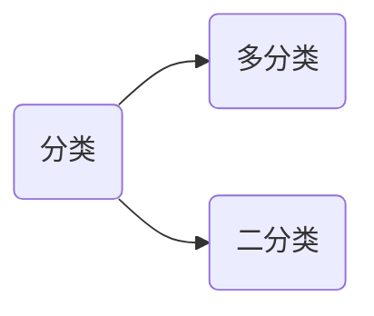
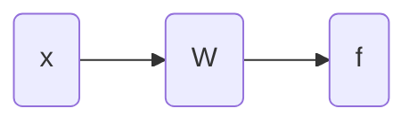
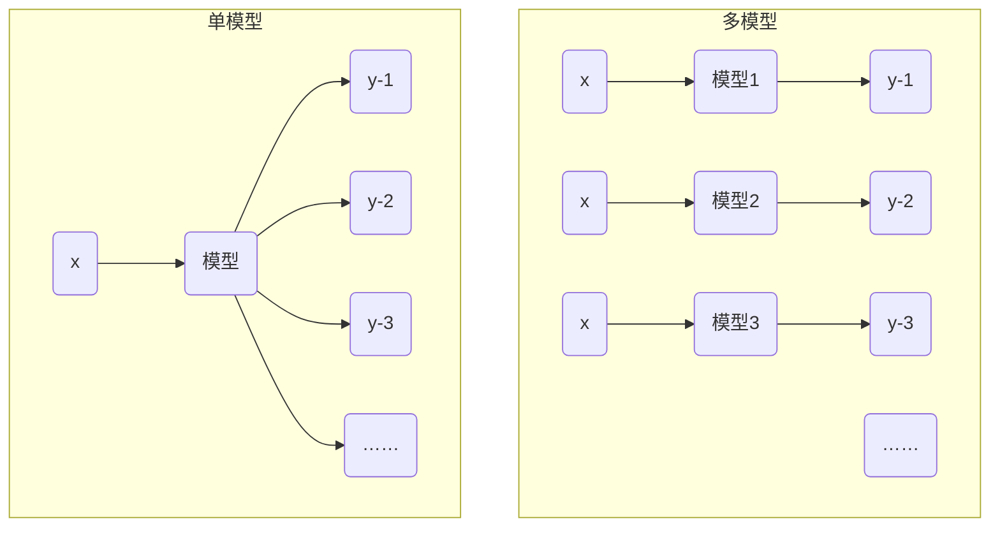
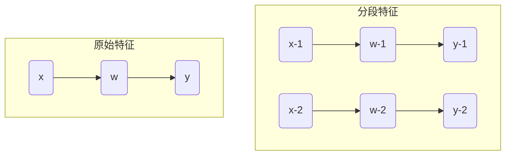
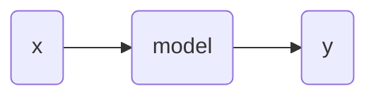

# 逻辑回归

## 基本概念

逻辑回归是用于分类的，分类问题。



对于二分类问题，假设其中一个类别的概率为 $P_1$，不属于该类的概率是 $P_2$，则有：
$$
P_1+P_2=1
$$
二分类要求两个了类别是互斥的。



定义如下分类方法：

1. $w_1x_1+w_2x_2+w_0\gt0\rightarrow f=1$​
2. $w_1x_1+w_2x_2+w_0\lt0\rightarrow f=0$

对于直线
$$
w_1x_1+w_2x_2+w_0=0
$$


> [!attention]
>
> 线性回归和逻辑回归的区别：
>
> 1. 线性回归：预测一个点的 $y$ 值。
> 2. 逻辑回归：预测一个点相对于一条直线的位置。

### 逻辑回归的输出

根据上面的公式分类有输出函数


但是世界上的问题并不是非黑即白，所以定义一个渐进函数：
$$
f = \frac{1}{1 + e^{-(wx+w_0)}}
$$

1. 当 $wx+w_0\rightarrow +\infty$ 时 $f\rightarrow1$
2. 当 $wx+w_0\rightarrow -\infty$ 时 $f\rightarrow0$

定义 $d=wx+w_0$

则上面的公式化简为
$$
f = \frac{1}{1 + e^{-d}}
$$
上面的函数和导数图像如下


上面的学习过程也是不断调整 $w$ 值影响 $f$​ 的值。

### 优化函数

数据集名字 `train_data` 数据分布如下图


预测 $w$ 的过程，随机取 $(w_1, w_2)$

1. $x_1\rightarrow w_1x_{1-1}+w_2x_{1-2}\rightarrow f_1(\text{predict value}) \rightarrow y_1 (\text{real value})$ 
2. $x_2\rightarrow w_1x_{2-1}+w_2x_{2-2}\rightarrow f_2(\text{predict value}) \rightarrow y_2 (\text{real value})$
3. $\space……$​

根据预测值 $f_i$ 和 $y_i$ 来优化 $w$ 的值。

> [!attention]
>
> 在逻辑回归中，预测最优 $w$ 不能再使用 MSE 函数。

MSE本身为一种距离度量，为了度量概率之间的距离，引入KL距离（Kullback-Leibler散度），用于度量两个概率分布之间的差异。
$$
D_{\text{KL}}(P \| Q) = \sum_{x \in \mathcal{X}} P(x) \log \left( \frac{P(x)}{Q(x)} \right)
$$


假设存在两个硬币，则 $x$ 存在两个事件：正面和反面

|      | 硬币1 | 硬币2 |                                                   |
| ---- | ----- | ----- | ------------------------------------------------- |
| 正面 | $a$   | $b$   | $a\log\frac{a}{b}$                                |
| 反面 | $c$   | $d$   | $c\log\frac{c}{d}$                                |
|      |       |       | $D_{\text{KL}}=a\log\frac{a}{b}+c\log\frac{c}{d}$ |

1. 当 $a=\frac{1}{3}, \space b=\frac{1}{4}, \space c=\frac{2}{3}, \space d=\frac{3}{4}$ 时 $D_{\text{KL}}=\frac{1}{3}\log\frac{\frac{1}{3}}{\frac{1}{4}}+\frac{2}{3}\log\frac{\frac{2}{3}}{\frac{3}{4}}\approx 0.0384$
2. 当 $a=b=\frac{1}{3}, \space c=d=\frac{2}{3}$ 时 $D_{\text{KL}}=0$

KL距离不是一个真正的距离度量：

1. 不具备对称性。
2. 不满足三角不等式。

对于相同的 $P(x)$ 假设有两个不同的 $Q(x)$。


其中 $D_{\text{KL}}$ 距离可以化简为
$$
D_{\text{KL}}(P \| Q) = \sum_{x \in \mathcal{X}} P(x) \log \left( P(x) \right)-\sum_{x \in \mathcal{X}} P(x) \log \left( Q(x)\right)
$$
根据上述公式可以看出

1. 当 $P(x)$ 大， $Q(x)$ 越大，$D_{\text{KL}}$ 距离越小。
2. 当 $P(x)$ 小， $Q(x)$ 影响可忽略，$D_{\text{KL}}$ 距离越大。

>[!attention]
>
>思考：将 $P(x)$ 和 $Q(x)$ 互换，$D_{\text{KL}}$ 有什么变化。
>
>1. $D_{\text{KL}}(P \| Q)$ $Q$ 尽可能匹配P的大值
>2. $D_{\text{KL}}(Q \| P)$ $Q$ 尽可能匹配P的小值

针对逻辑回归中二分类的距离有交叉熵损失如下：
$$
D_{\text{KL}} = \frac{1}{n} \sum_{i=1}^{n} \left[ y_i \log(\frac{y_i}{f_i}) + (1 - y_i) \log(\frac{1 - y_i}{1 - f_i}) \right]
$$
对上述函数化简可得
$$
D_{\text{KL}} = -\frac{1}{n}\sum_{i=1}^{n} \left[ y_i \log(f_i) + (1 - y_i) \log(1 - f_i) \right]
$$
其中 $f_i$ 值为
$$
f_i = \frac{1}{1 + e^{-(wx_i+w_0)}}
$$
其中 $f_i$ 的值不为 0，获得理想的 $w$ 值就需要使得上面的 $D_{\text{KL}}$ 尽可能减小。

对于数据集名字 `train_data` 训练模型

```python
import numpy as np
from sklearn.linear_model import LogisticRegression

def read_data(path):
    with open(path) as f:
        lines = f.readlines()
    lines = [eval(line.strip()) for line in lines]
    x, y = zip(*lines)
    x = np.array(x)
    y = np.array(y)
    return x, [i[0] for i in y]

x_train, y_train = read_data("train_data")

model = LogisticRegression()
model.fit(x_train, y_train)

print(model.coef_)
print(model.intercept_)

y_pred = model.predict_proba(x_train)
print(y_train)
print(y_pred)
```

分类曲线如果


$w$ 的求解过程：

1. 先随机出一个 $w$ 计算模型输出。
2. 计算模型输出和真实数值的差异得到损失函数 MSE、$D_{\text{KL}}$ 距离
3. 不停地调整 $w$ 让损失函数变小。

调整 $w$ 的方法：
$$
w=w-\alpha\frac{\partial D_{kl}}{\partial w}
$$
根据下列求导公式
$$
f = \frac{1}{1 + e^{-d}} \rightarrow \frac{\partial f}{\partial d}=f(1-f)
$$
可以得出导数公式
$$
f = \frac{1}{1 + e^{-(wx+w_0)}} \rightarrow \frac{\partial f}{\partial w}=f(1-f)x
$$
可以推导出
$$
\frac{\partial D_{kl}}{\partial w}=-\frac{1}{n}\left[y_i(1-f_i)-(1-y_i)f_i \right]x_i
$$
其中 $y_i(1-f_i)$ 或 $(1-y_i)f_i$ 一个一定为0。

> [!attention]
>
> 逻辑回归使用均方误差会让损失函数非凸。凸函数：是指函数图形上，任意两点连成的线段，皆位于图形的上方的实值函数实函数

凸函数和非凸函数


> [!note]
>
> 上述问题中可以尝试多次取值来达到最小值。在机器学习的前沿领域，很多研究都是在研究怎么选初始点，但在工程上达不到很好的效果。
>
> 局部极小的数量和维度的平方成正比。

### 多分类的实现



## 特征变换

对于如下分布数据


> [!attention]
>
> 上述分布数据无法使用一条直线将其分开，即为线性不可分。现实数据大量为线性不可分。

将上述平面特征转换为三维特征，并实现如下转换就可以使用分类平面将两种类别分开。


分类平面公式为
$$
w_1x+w_2y+w_3z=0 \rightarrow w_1x_1+w_2x_2+w_3x_3=0 
$$
对于原始特征进行如下变换可以得到上面的特征。
$$
(x_1, x_2)\rightarrow(x_1, x_2, x_1\cdot x_2)
$$
生成训练数据

```python
import random
import numpy as np
from sklearn.linear_model import LogisticRegression

def get_data(center_label, num=100):
    x_train = []
    y_train = []
    sigma = 0.01
    for point, label in center_label:
        c1, c2 = point
        for _ in range(0,num):
            x1 = c1 + random.uniform(-sigma, sigma)
            x2 = c2 + random.uniform(-sigma, sigma)
            x_train.append([x1, x2])
            y_train.append([label])
    return x_train, y_train

center_label = [[[0, 0], 1], [[1, 1], 1], [[0, 1], 0], [[1, 0], 0]]
x_train, y_train = get_data(center_label)
```

训练数据分布如下：


增加新的维度

```python
x_train = [x + [x[0] * x[1]] for x in x_train]
x_train = np.array(x_train)
```

训练模型

```python
model = LogisticRegression()
model.fit(x_train, y_train)

print(model.coef_)
print(model.intercept_)
```

上述分类平面在二维投影如下图。


### 特征分段

假设存在一个连续特征是 $[1, 100]$ 将其分段后为 $[1, 50)$ 和 $[50, 100]$



上述特征对应图像


## 多元逻辑回归

对于数据集 `cancer_train_data` 训练程序如下

```python
import numpy as np
from sklearn.linear_model import LogisticRegression

def read_data(path):
    with open(path) as f:
        lines = f.readlines()
    lines = [eval(line.strip()) for line in lines]
    x, y = zip(*lines)
    x = np.array(x)
    y = np.array(y)
    return x, y

x_train, y_train = read_data("cancer_train_data")
model = LogisticRegression(max_iter=10000)
model.fit(x_train, y_train)

print(model.coef_)
print(model.intercept_)

y_pred = model.predict_proba(x_train)
print(y_train)
print(y_pred)
```

对于上述模型



> [!attention]
>
> 对于上述癌症模型，分类阈值一般不取 $0.5$，可以适当降低，如： $y>0.2$ 时可以判断为癌症。

### 样本不均衡


解决样本不均衡的方法：下采样和上采样。

## 评价指标


|                                                          | 预测为 $\hat P$                                              | 预测为 $\hat N$                                              |                                                              |
| -------------------------------------------------------- | ------------------------------------------------------------ | ------------------------------------------------------------ | ------------------------------------------------------------ |
| 真实 $P$—正样本 Positive<br />正样本总数 All Positive—AP | TP <br />True Positive                                       | FN <br />False Negative                                      | 召回率P<br />$\text{Recall}_P = \frac{\text{TP}}{\text{TP} + \text{FN}}$ |
| 真实 $N$—负样本 Negative<br />负样本总数 All Negative—AN | FP <br />False Positive                                      | TN <br />True Negative                                       | 召回率N<br />$\text{Recall}_N = \frac{\text{TN}}{\text{TN} + \text{FP}}$ |
| 样本总数 All = AP + AN                                   | 准确率P<br />$\text{Precision}_P = \frac{\text{TP}}{\text{TP} + \text{FP}}$ | 准确率N<br />$\text{Precision}_N = \frac{\text{TN}}{\text{TN} + \text{FN}}$ | 正确率$\text{Accuracy}=\frac{\text{TP+TN}}{\text{ALL}}$      |

1. 模型越好TP和TN的值越高。
2. 准确率和召回率可以针对正负样本分别统计。

|         | $\hat P$                          | $\hat N$                        |                                   |
| ------- | --------------------------------- | ------------------------------- | --------------------------------- |
| P=95    | 94                                | 1                               | $\text{R}_P=\frac{94}{94+1}=99\%$ |
| N=5     | 4                                 | 1                               | $\text{R}_N=\frac{1}{4+1}=20\%$   |
| All=100 | $\text{P}_P=\frac{94}{94+4}=96\%$ | $\text{P}_N=\frac{1}{1+1}=50\%$ | $\text{AC}=\frac{94+1}{100}=95\%$ |

> [!attention]
>
> 1. 正确率评价标准并不能客观的反应模型效果。
> 2. 准确率和召回率直接与样本的预测结果相关。

准确率和召回率的变化根据分类阈值变化而变化，阈值越高准确率越高，召回率越低。


阈值的定义一般与产品形态有关。

假设模型的分类结果为 $\hat{y}$，阈值为 $\theta$：

|                                    | 真实正样本 M                    | 真实负样本 N                    |
| ---------------------------------- | ------------------------------- | ------------------------------- |
| 预测为正                           | m                               | n                               |
|                                    | $\frac{m}{M}$                   | $\frac{n}{N}$                   |
| 当 $\theta = 0$ 时全部预测结果为正 | $m=M \rightarrow \frac{m}{M}=1$ | $n=N \rightarrow \frac{n}{N}=1$ |
| 当 $\theta = 1$ 时全部预测结果为负 | $m=0 \rightarrow \frac{m}{M}=0$ | $n=0 \rightarrow \frac{n}{N}=0$ |

当 $\theta$ 值变化时可以绘制曲线，该曲线称为ROC曲线。


曲线下方的面积为AUC


AUC的取值 0.5 ~ 1 之间的数


[ROC-AUC原理及计算方法](https://rogerspy.github.io/2021/07/29/roc-auc/)

| 评价标准       | 问题                                                       |
| -------------- | ---------------------------------------------------------- |
| 正确率         | 1. 容易被样本不均衡性<br />2. 指标被阈值影响               |
| 准确率和召回率 | 1. 每个指标只反映一类预测结果的指标<br />2. 指标被阈值影响 |
| ROC曲线和AUC值 | 真正反应了模型的性能                                       |

## 正则优化

$$
f(x) = \frac{1}{1 + e^{-(wx+w_0)}}
$$

$x$ 为二维向量时，$wx+w_0 \rightarrow w_1x_1+w_2x_2+w_0=0$ ：

1. 当 $w_1,w_2,w_0\rightarrow -w_1,-w_2,-w_0$ 时，相当于类别进行翻转。

2. 当 $w_1,w_2,w_0\rightarrow 10w_1, 10w_2, 10w_0$ 时，不影响分类结果，但是 $f(x)$ 的概率值会增加。

3. 当 $w_1$ 的值足够大，$x_1$ 微小的变化最终的分类值都会变化比较大。相当于将误差放大。

4. 对于任意变量 $x_i$ 可以分为两部分，$x_i=\overline{x_i} + \widetilde{x_i}$ 其中 $\overline{x_i}$ 表示信号，$\widetilde{x_i}$ 表示噪声，公式可以表示为：
   $$
   w_1\overline {x_1}+ w_2\overline {x_2} + … + w_i\overline {x_i}+w_1\widetilde {x_1}+ w_2\widetilde{x_2} + … + w_i\widetilde{x_i}+w_0
   $$
   由于信号部分存在冗余而噪声部分不存在冗余，所以 $\overline{x_i}$ 部分的信息低于 $\widetilde{x_2}$ 部分。所以 $w_i$​​ 大信噪比越小。

> [!note]
>
> 训练模型的最终目的 $=$ 在测试数据上性能好 $\rightarrow$ 在训练集上性能好 $+$​ 训练数据和测试数据差别小

忽略分类器的性能，当 $f(x)=0.5$ 时训练数据和测试数据的差别最小，此时可以看做为随机猜测状态，此时 $w=0$​。

对于交叉熵损失计算时加入正则项 $D_{\text{KL}}+\lambda \left\| w \right\|$，公式如下：
$$
-\frac{1}{n}\sum_{i=1}^{n} \left[ y_i \log(f_i) + (1 - y_i) \log(1 - f_i) \right] + \lambda \left\| w \right\|
$$
其中 $\left\| w \right\| = \sqrt{w_1^2+w_2^2+…}$ ，当 $\left\| w \right\|$ 越小训练集和测试集的差异越小。

> [!attention]
>
> 如果找到正确的 $w$ 进行分类，损失函数越小结果越优，如果 $w$ 扩大两倍，损失函数会更小，迭代中会导致 $w$ 计算趋向于 $-\infty$。

**正则项的影响：**

1. 抑制 $w$ 在分类正确情况下，按比例无限增大。
2. 减少测试集和训练集的差异性。
3. 破坏训练集的效果。

正则项一般有两种取值方式：

1. $\lVert w \rVert_1= \left| w_1 \right|+\left| w_2 \right|+…$  牺牲最不重要的维度
2. $ \lVert w \rVert_2= \sqrt{w_1^2+w_2^2+…} $​  各维度特征普遍减小

比较不同正则的计算结果：

```python
import numpy as np
from sklearn.linear_model import LogisticRegression
from sklearn import metrics

def read_data(path):
    with open(path) as f:
        lines = f.readlines()
    lines = [eval(line.strip()) for line in lines]
    x, y = zip(*lines)
    x = np.array(x)
    y = np.array(y)
    return x, y

x_train, y_train = read_data("cancer_train_data")
x_test, y_test = read_data("cancer_test_data")

def train_model(reg):
    print("reg:", reg)
    model = LogisticRegression(max_iter=10000, penalty=reg, solver='liblinear')
    model.fit(x_train, y_train)
    print(model.coef_)
    y_pred_train = model.predict(x_train)
    y_pred_test = model.predict(x_test)
    e_train = metrics.mean_squared_error(y_train, y_pred_train)
    e_test = metrics.mean_squared_error(y_test, y_pred_test)
    print("train error:", e_train)
    print("test error:", e_test)
    print("end ==============")

train_model(reg="l1")
train_model(reg="l2")
```

> [!attention]
>
> 当特征维度多的时候使用L1正则，可以实现降为。对于特征分割现象L1可以实现特征合并。

## 特征归一化

根据 $D_{KL}$ 公式
$$
D_{\text{KL}} = -\frac{1}{n}\sum_{i=1}^{n} \left[ y_i \log(f_i) + (1 - y_i) \log(1 - f_i) \right]
$$

> [!warning]
>
> 假设特征 $x_1\in [0, 100]$，特征 $x_2 \in [0, 10]$，所以有 $w_1$ 变化的影响远大于 $w_2$​

对在任意一个维度的特征可以进行归一化
$$
\widetilde{x_1}=\frac{x_1-min_1}{max_1-max_1}
$$

> [!warning]
>
> 上述归一化方法对于异常数据不友好，如数据集 $1,2,3, 1000, …$​

归一化也可以使用如下方法
$$
\widetilde{x_1}=\frac{x_1-\mu_1}{\sigma_1}
$$
原始数据和正规化数据的等高线曲线如下。


> [!attention]
>
> 理论上可以证明，归一化数据不影响分类结果，但可以加快学习速率。

特征归一化的函数

```python
from sklearn import preprocessing
import numpy as np
X = np.array([[1., -1.,  2.], [2.,  0.,  0.], [0.,  1., -1.]])
scaler = preprocessing.StandardScaler().fit(X)

print(scaler.mean_)
print(scaler.scale_)
print(scaler.transform(X))
```

> [!attention]
>
> 特征转换矩阵需要保存下来，对于归一化过程在预测的时候需要同样的归一化。

## Sigmoid函数和KL距离的数学思想

### Sigmoid函数

> [!note]
>
> 逻辑回归三个假设：
>
> 1. 对于具体一个类别来说，它的特征分布符合正态分布。
> 2. 对于同质的特征，不同类别的均值不同，方差相同。
> 3. 两类概率相等。

正太分布函数如下


$$
f(x) = \frac{1}{\sigma \sqrt{2\pi}} \exp \left( -\frac{(x - \mu)^2}{2\sigma^2} \right)
$$
对于一个分类问题，假设特征为身高，1-男性，0-女性，两个概率密度函数为：
$$
f(x|y=1) = \frac{1}{\sigma \sqrt{2\pi}} \exp \left( -\frac{(x - \mu_1)^2}{2\sigma^2} \right) \\
f(x|y=0) = \frac{1}{\sigma \sqrt{2\pi}} \exp \left( -\frac{(x - \mu_0)^2}{2\sigma^2} \right)
$$
对于一个特征当 $x=1.7$ 预测属于哪个类别，就是一个分类问题。

根据贝叶斯公式可以得到
$$
P(y=1|x=1.7)=\frac{P(y=1)}{P(x=1.7)}\cdot P(x=1.7|y=1)\\
P(y=0|x=1.7)=\frac{P(y=0)}{P(x=1.7)}\cdot P(x=1.7|y=0)
$$
上面的两个公式用于类别的预测。对上面两个概率相除，可以得到：
$$
\frac{P(y=1|x=1.7)}{P(y=0|x=1.7)}=\frac{P(y=1)}{P(y=0)}\cdot\frac{P(x=1.7|y=1)}{P(x=1.7|y=0)}=A\cdot\frac{P(x=1.7|y=1)}{P(x=1.7|y=0)}
$$
将概率密度函数带入，考虑可以得到
$$
\frac{P(y=1|x)}{P(y=0|x)}=A\cdot\frac{P(x|y=1)}{P(x|y=0)}\\
=A\cdot\exp \left(-\frac{1}{2\sigma^2}[(x - \mu_1)^2-(x - \mu_0)^2] \right)\\
=A\cdot\exp \left(-\frac{1}{\sigma^2}(\mu_1 - \mu_0)x-(\mu_1^2 - \mu_0^2) \right)
$$
对于概率密度函数
$$
P(y=1|x)+P(y=0|x)=1
$$
根据上述公式解方程可以得到
$$
P(y=1|x)=\frac{1}{1+A\cdot\exp \left(-\frac{1}{\sigma^2}(\mu_1 - \mu_0)x-(\mu_1^2 - \mu_0^2) \right)}
$$
令 $w=\frac{1}{\sigma^2}(\mu_1 - \mu_0)$，$w_0=\mu_1^2 - \mu_0^2$​​，上面公式可以化简为
$$
P(y=1|x) = \frac{1}{1 + A \cdot e^{-(wx+w_0)}}
$$
当两类概率相等时 $A=1$

> [!attention]
>
> 对于方程 $f(x|y=1)$ 和方程 $f(x|y=0)$ 包含三个参数 $\mu_0$，$\mu_1$ 和 $\sigma$​，无法计算得出，但是可以判断出两个类别的差异。
>
> 所以逻辑回归模型为判别模型。

### KL距离

> [!note]
>
> 根据极大似然估计的定义。

对于任意的特征和标签集
$$
\left(x_1, y_1\\ \right) \\
\left(x_2, y_2\\ \right) \\
\left(x_3, y_3\\ \right) \\
……
$$
如果使得概率
$$
\prod_{i=1}^{n} P(x_i,y_i)
$$
最大
$$
\prod_{i=1}^{n} P(x_i,y_i)=\prod_{i=1}^{n} P(y_i|x_i)P(x_i)
$$
对于上述算数两边取对数
$$
\sum_{i=1}^{n}\left[ \log P(y_i|x_i)+ \log P(x_i) \right]
$$
其中 $\log P(x_i)$ 是关于 $x_i$ 的自然分布可以看做常数。上式求最小值即表示为：
$$
\sum_{i=1}^{n} \log P(y_i|x_i)
$$
最大。对于概率 $y=1$ 和 $y=0$ 可以表示为：
$$
P(y=1|x)=f(x) \qquad \\
P(y=0|x)=1- f(x)
$$
则上面概率公式可以统一表示为
$$
P(y|x)=f(x)^y(1- f(x))^{1-y}
$$
概率最大值公式可以表示为
$$
\sum_{i=1}^{n} \log P(y_i|x_i)=\sum_{i=1}^{n}\log(f(x_i)^y(1- f(x_i))^{1-y})=\sum_{i=1}^{n}\left[y\log(f(x_i)+(1-y)\log(1- f(x_i))\right]
$$
使上述公式最大化就是使
$$
-\sum_{i=1}^{n}\left[y\log(f(x_i)+(1-y)\log(1- f(x_i))\right]
$$
最小。

> [!attention]
>
> 所以KL距离表示极大似然估计。
