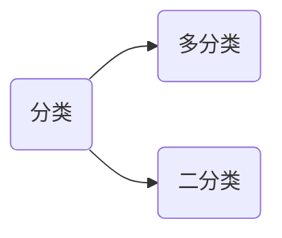
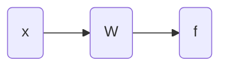

# 逻辑回归

逻辑回归是用于分类的，分类问题。

对于二分类问题，假设其中一个类别的概率为 $P_1$，不属于该类的概率是 $P_2$，则有：
$$
P_1+P_2=1
$$
二分类要求两个了类别是互斥的。

定义如下分类方法：
$$
w_1x_1+w_2x_2+w_0\gt\rightarrow f=1 \\
w_1x_1+w_2x_2+w_0\lt\rightarrow f=0
$$
对于直线
$$
w_1x_1+w_2x_2+w_0=0
$$

> [!warning]
>
> 线性回归和逻辑回归的区别：
>
> 1. 线性回归：预测一个点的 $y$ 值。
> 2. 逻辑回归：预测一个点相对于一条直线的位置。

根据上面的公式分类有输出函数

但是世界上的问题并不是非黑即白，所以定义一个渐进函数：
$$
f = \frac{1}{1 + e^{-(wx+w_0)}}
$$

1. 当 $wx+w_0\rightarrow +\infty$ 时 $f\rightarrow1$
2. 当 $wx+w_0\rightarrow -\infty$ 时 $f\rightarrow0$

定义 $d=wx+w_0$

则上面的公式化简为
$$
f = \frac{1}{1 + e^{-d}}
$$
上面的函数和导数图像如下

上面的学习过程也是不断调整 $w$ 值影响 $f$ 的值。

数据集名字 `train_data` 数据分布如下图

