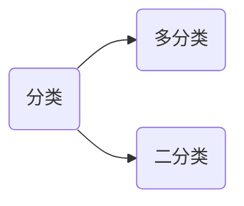
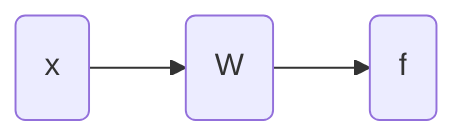

# 逻辑回归

逻辑回归是用于分类的，分类问题。

对于二分类问题，假设其中一个类别的概率为 $P_1$，不属于该类的概率是 $P_2$，则有：
$$
P_1+P_2=1
$$
二分类要求两个了类别是互斥的。

定义如下分类方法：
$$
w_1x_1+w_2x_2+w_0\gt\rightarrow f=1 \\
w_1x_1+w_2x_2+w_0\lt\rightarrow f=0
$$
对于直线
$$
w_1x_1+w_2x_2+w_0=0
$$

> [!warning]
>
> 线性回归和逻辑回归的区别：
>
> 1. 线性回归：预测一个点的 $y$ 值。
> 2. 逻辑回归：预测一个点相对于一条直线的位置。

根据上面的公式分类有输出函数

但是世界上的问题并不是非黑即白，所以定义一个渐进函数：
$$
f = \frac{1}{1 + e^{-(wx+w_0)}}
$$

1. 当 $wx+w_0\rightarrow +\infty$ 时 $f\rightarrow1$
2. 当 $wx+w_0\rightarrow -\infty$ 时 $f\rightarrow0$

定义 $d=wx+w_0$

则上面的公式化简为
$$
f = \frac{1}{1 + e^{-d}}
$$
上面的函数和导数图像如下

上面的学习过程也是不断调整 $w$ 值影响 $f$ 的值。

数据集名字 `train_data` 数据分布如下图

预测 $w$ 的过程，随机取 $(w_1, w_2)$

1. $x_1\rightarrow w_1x_{1-1}+w_2x_{1-2}\rightarrow f_1(\text{predict value}) \rightarrow y_1 (\text{real value})$ 
2. $x_2\rightarrow w_1x_{2-1}+w_2x_{2-2}\rightarrow f_2(\text{predict value}) \rightarrow y_2 (\text{real value})$
3. $\space……$

> [!warning]
>
> 在逻辑回归中，预测过程的损失函数不能再使用MSE函数。

MSE本身为一种距离度量，为了度量概率之间的距离，引入KL距离（Kullback-Leibler散度），用于度量两个概率分布之间的差异。
$$
D_{\text{KL}}(P \| Q) = \sum_{x \in \mathcal{X}} P(x) \log \left( \frac{P(x)}{Q(x)} \right)
$$

假设存在两个硬币，则 $x$ 存在两个事件：正面和反面

|      | 硬币1 | 硬币2 |                                                   |
| ---- | ----- | ----- | ------------------------------------------------- |
| 正面 | $a$   | $b$   | $a\log\frac{a}{b}$                                |
| 反面 | $c$   | $d$   | $c\log\frac{c}{d}$                                |
|      |       |       | $D_{\text{KL}}=a\log\frac{a}{b}+c\log\frac{c}{d}$ |

1. 当 $a=\frac{1}{3}, \space b=\frac{1}{4}, \space c=\frac{2}{3}, \space d=\frac{3}{4}$，时 $D_{\text{KL}}=\frac{1}{3}\log\frac{\frac{1}{3}}{\frac{1}{4}}+\frac{2}{3}\log\frac{\frac{2}{3}}{\frac{3}{4}}\approx 0.0384$
2. 当 $a=b=\frac{1}{3}$， $c=d=\frac{2}{3}$，时 $D_{\text{KL}}=0$​​

KL距离不是一个真正的距离度量：

1. 不具备对称性。
2. 不满足三角不等式。

