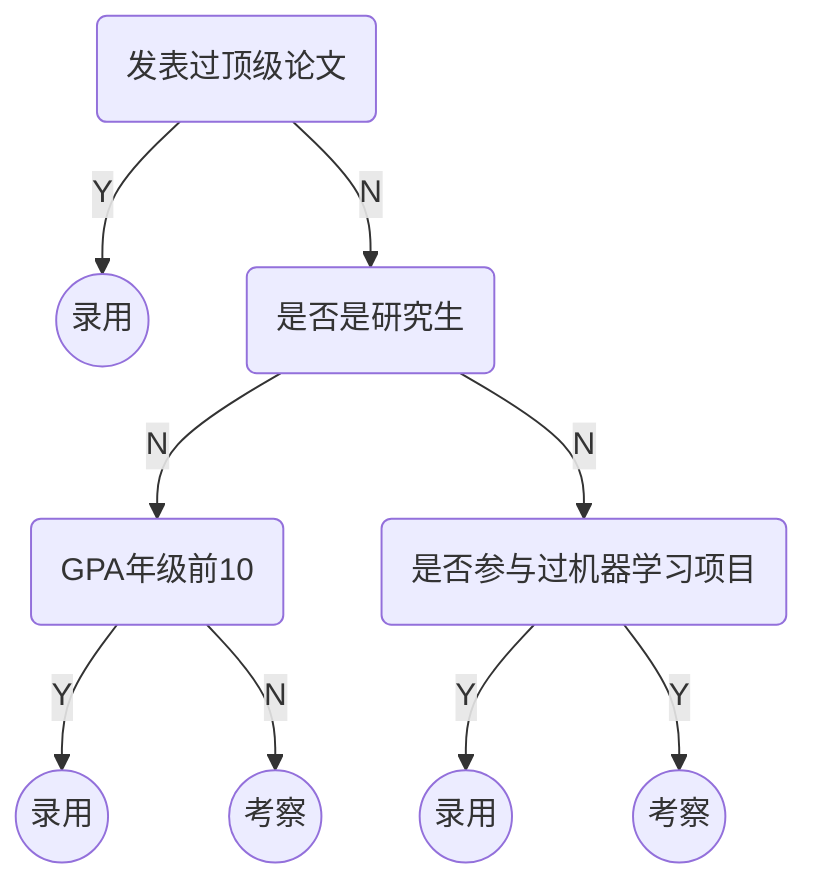
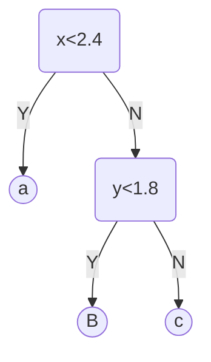

# 决策树

人工智能的招聘流程



决策树模型是一个树状结构，叶子节点为最后的分类。

> [!note]
>
> 决策树模型包含所有计算机树模型的特征：包括根节点、叶子节点和深度等。

使用公开的鸢尾花数据集

```python
import numpy as np
import matplotlib.pyplot as plt
from sklearn import datasets

iris = datasets.load_iris()
x = iris.data[:, 2:]
y = iris.target

plt.scatter(x[y==0, 0], x[y==0, 1])
plt.scatter(x[y==1, 0], x[y==1, 1])
plt.scatter(x[y==2, 0], x[y==2, 1])
```

训练决策树模型

```python
from sklearn.tree import DecisionTreeClassifier

dt_clf = DecisionTreeClassifier(max_depth=2, criterion='entropy')
dt_clf.fit(x, y)
```

观察分类结果

```python
def plot_decision_boundary(model, axis):
    x0, x1 = np.meshgrid(
        np.linspace(axis[0], axis[1], int((axis[1]-axis[0])*100)).reshape(-1, 1),
        np.linspace(axis[2], axis[3], int((axis[3]-axis[2])*100)).reshape(-1, 1),
    )
    X_new = np.c_[x0.ravel(), x1.ravel()]

    y_predict = model.predict(X_new)
    zz = y_predict.reshape(x0.shape)

    from matplotlib.colors import ListedColormap
    custom_cmap = ListedColormap(['#EF9A9A','#FFF59D','#90CAF9'])

    plt.contourf(x0, x1, zz, linewidth=5, cmap=custom_cmap)
    
plot_decision_boundary(dt_clf, axis=[0.5, 7.5, 0, 3])
plt.scatter(x[y==0, 0], x[y==0, 1])
plt.scatter(x[y==1, 0], x[y==1, 1])
plt.scatter(x[y==2, 0], x[y==2, 1])
plt.show()
```

决策树分类过程



> [!attention]
>
> 决策树是非参数学习算法，天然的可以用于多分类问题。也可以解决回归问题

## 决策树的计算

决策树确定的核心问题是在哪个特征的哪个值上进行进行划分。

### 信息熵

信息熵代表随机变量的不确定度。熵越大，数据的不确定性越高；熵越小，数据的不确定性越低。
$$
H=-\sum_{i=1}^{k}p_i\log(p_i)
$$
$k$ 表示信息的种类，$p_i$ 表示每类信息占的比例，

| 概率                                           | 信息熵                                                       |
| ---------------------------------------------- | ------------------------------------------------------------ |
| $\{ \frac{1}{3},\frac{1}{3},\frac{1}{3} \} $   | $H=-\frac{1}{3}\log(\frac{1}{3})-\frac{1}{3}\log(\frac{1}{3})-\frac{1}{3}\log(\frac{1}{3})=1.0986$ |
| $\{ \frac{1}{10},\frac{2}{10},\frac{7}{10}\} $ | $H=-\frac{1}{10}\log(\frac{1}{10})-\frac{2}{10}\log(\frac{2}{10})-\frac{7}{10}\log(\frac{7}{10})=0.8018$ |
| $\{ 1,0,0 \} $                                 | $H=-1\log(1)=0$                                              |

对于二分类问题，信息熵计算公式如下：
$$
H=-\sum_{i=1}^{k}p_i\log(p_i)=-x\log(x)-(1-x)\log(1-x)
$$


> [!note]
>
> 决策树划分的分界点是，使得数据整体的信息熵最低。当系统划分后，决策树的叶子节点只包含一种数据，系统的信息熵为0。

使用信息熵训练决策树

```python
import numpy as np
import matplotlib.pyplot as plt
from sklearn import datasets

iris = datasets.load_iris()
x = iris.data[:, 2:]
y = iris.target

dt_clf = DecisionTreeClassifier(max_depth=2, criterion='entropy')
dt_clf.fit(x, y)

def plot_decision_boundary(model, axis):
    x0, x1 = np.meshgrid(
        np.linspace(axis[0], axis[1], int((axis[1]-axis[0])*100)).reshape(-1, 1),
        np.linspace(axis[2], axis[3], int((axis[3]-axis[2])*100)).reshape(-1, 1),
    )
    X_new = np.c_[x0.ravel(), x1.ravel()]

    y_predict = model.predict(X_new)
    zz = y_predict.reshape(x0.shape)

    from matplotlib.colors import ListedColormap
    custom_cmap = ListedColormap(['#EF9A9A','#FFF59D','#90CAF9'])

    plt.contourf(x0, x1, zz, linewidth=5, cmap=custom_cmap)
    
plot_decision_boundary(dt_clf, axis=[0.5, 7.5, 0, 3])
plt.scatter(x[y==0, 0], x[y==0, 1])
plt.scatter(x[y==1, 0], x[y==1, 1])
plt.scatter(x[y==2, 0], x[y==2, 1])
plt.show()
```

### 基尼系数

$$
G=1-\sum_{i=1}^kp_i^2
$$

| 概率                                           | 信息熵                                                       |
| ---------------------------------------------- | ------------------------------------------------------------ |
| $\{ \frac{1}{3},\frac{1}{3},\frac{1}{3} \} $   | $G=1-(\frac{1}{3})^2-(\frac{1}{3})^2-(\frac{1}{3})^2=0.666$  |
| $\{ \frac{1}{10},\frac{2}{10},\frac{7}{10}\} $ | $G=1-(\frac{1}{10})^2-(\frac{2}{10})^2-(\frac{7}{10})^2=0.46$ |
| $\{ 1,0,0 \} $                                 | $G=1-1^2=0$                                                  |

对于二分类情况基尼系数为
$$
G=1-x^2-(1-x)^2=-2x^2+2x
$$
