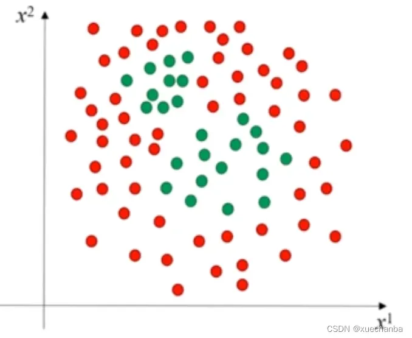
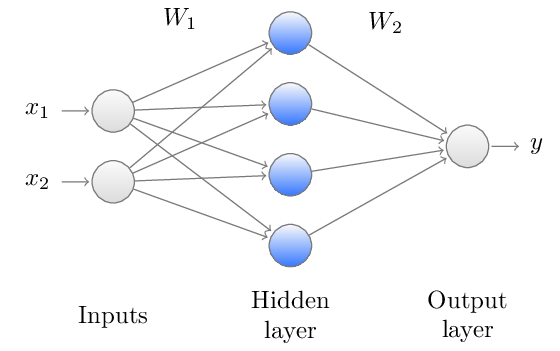
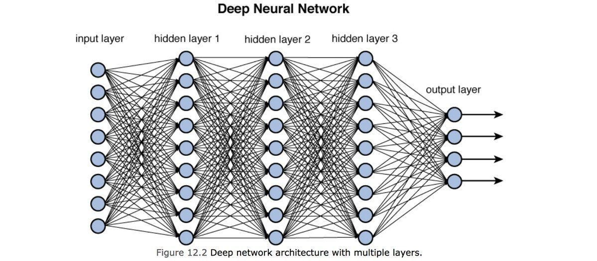

# 深度学习DNN

Deep Neural Network (DNN)

只有感性认识，理论支持较弱。

深度学习只是机器学习的一种工具。

对于线性不可分数据集

> [!note]
>
> 线性变换是否可以将线性不可分变为线性可分？

$$
\begin{pmatrix}
a & b \\
c & d
\end{pmatrix}
\begin{pmatrix}
x \\
y
\end{pmatrix}
=
\begin{pmatrix}
x' \\
y'
\end{pmatrix}
$$

线性变换无法将线性不可分变为线性可分，如果想让数据可分需要通过非线性变换。
$$
y = f(Wx + b)
$$
其中$f$函数是Sigmoid函数

隐层的输出表示为，下式：
$$
H=f(W_1x+W_0)
$$
$f$为激活函数。每个神经元可以看做是一个逻辑回归。当隐层足够多的时候即为深度学习。

最后一层是标准的逻辑回归，输出有概率意义。

> [!warning]
>
> 层数越多模型越复杂，容易过拟合。在满足任务的条件下层数越少越好。
