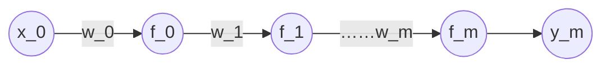

# 梯度下降算法

链式法则
$$
\frac{d\sin(e^x)}{dx}  = \cos(e^x) e^x
$$
假设只有一层的神经元

其中

$$
y_0=f_0(w_0\cdot x_0) \\
y_1=f_1(w_1\cdot y_0)  \\
...... \\
y_m=f_m(w_m\cdot y_{m-1})
$$
其中 $y_0$ 到 $y_m$ 都是Sigmoid函数，最终值 $y_m$ 通过前一层的神经元计算得出。

对于真实的类别为 $\hat y$ 则KL距离
$$
D_{\text{KL}} =  -\hat y \log(y) - (1 - \hat y) \log(1 - y)
$$
对于最后一层神经元迭代求参数 $w_m$
$$
w_m'=w_m-\alpha\frac{dL}{dw_m}
$$
其中迭代步长是损失函数对 $w_m$ 
$$
\frac{dL}{dw_m}=\frac{dL}{dy_m}\cdot\frac{dy_m}{dw_m}
$$
其中
$$
\frac{dL}{dy_m}=-\frac{\hat y}{y_m}+\frac{1 - \hat y}{1 - y_m}
$$
最后一层神经元
$$
\frac{dy_m}{dw_m}=f_m’(w_m\cdot y_{m-1})\cdot y_{m-1}
$$
对于参数 $w_{m-1}$ 的更新有
$$
w_{m-1}'=w_{m-1}-\alpha\frac{dL}{dw_{m-1}}
$$
则有
$$
\frac{dL}{dw_{m-1}}=\frac{dL}{dy_{m-1}}\cdot\frac{dy_{m-1}}{dw_{m-1}}
$$
其中
$$
\frac{dy_{m-1}}{dw_{m-1}}=f_{m-1}’(w_{m-1}\cdot y_{m-2})\cdot y_{m-2}
$$
其中
$$
\frac{dL}{dy_{m-1}}=\frac{dL}{dy_m}\cdot \frac{dy_m}{dy_{m-1}}
$$
对于
$$
\frac{dy_m}{dy_{m-1}}=f_m’(w_m\cdot y_{m-1})\cdot w_{m-1}
$$
结合公式
$$
\frac{dL}{dy_{m-1}}=\frac{dL}{dy_m}\cdot f_m’(w_m\cdot y_{m-1})\cdot w_{m-1}
$$
上面的式子可以看做是迭代公式。

根据上面的迭代公式可以推导到$\frac{dL}{dw_0}$

上面的链式求导过程称为反向传输算法。

对于Sigmoid函数
$$
f(z)=\frac{1}{1+e^{-z}}
$$

导数为
$$
\frac{df}{dz}=f(z)\cdot(1-f(z))
$$

对于导数
$$
f_m’(w_m\cdot y_{m-1})
$$
最大值为0.25对于n层网络，最前面的神经元 $(0-0.25)^n$ 参数计算很快就趋向于0。

在多层神经网络下，用Sigmoid函数为激活函数，越靠前的神经元更新数据趋向于0。这种线性叫梯度消失。

> [!warning]
>
> Sigmoid是造成梯度消失的原因，要解决梯度消失，需要更换激活函数。激活函数的导数相对比较大，且是非线性函数。
