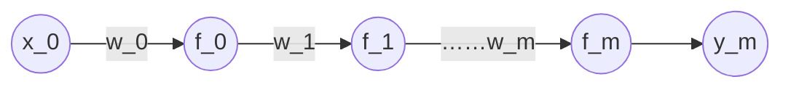
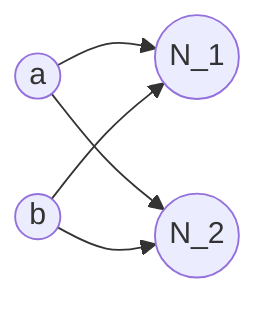

# 梯度下降算法

链式法则
$$
\frac{d\sin(e^x)}{dx}  = \cos(e^x) e^x
$$
假设只有每层只有一个神经元



其中

$$
y_0=f_0(w_0\cdot x_0) \\
y_1=f_1(w_1\cdot y_0)  \\
...... \\
y_m=f_m(w_m\cdot y_{m-1})
$$
其中 $y_0$ 到 $y_m$ 都是Sigmoid函数，最终值 $y_m$ 通过前一层的神经元计算得出。

对于真实的类别为 $\hat y$ 则KL距离
$$
D_{\text{KL}} =  -\hat y \log(y) - (1 - \hat y) \log(1 - y)
$$
对于最后一层神经元迭代求参数 $w_m$
$$
w_m'=w_m-\alpha\frac{dL}{dw_m}
$$
其中迭代步长是损失函数对 $w_m$ 
$$
\frac{dL}{dw_m}=\frac{dL}{dy_m}\cdot\frac{dy_m}{dw_m}
$$
其中
$$
\frac{dL}{dy_m}=-\frac{\hat y}{y_m}+\frac{1 - \hat y}{1 - y_m}
$$
最后一层神经元
$$
\frac{dy_m}{dw_m}=f_m’(w_m\cdot y_{m-1})\cdot y_{m-1}
$$
对于参数 $w_{m-1}$ 的更新有
$$
w_{m-1}'=w_{m-1}-\alpha\frac{dL}{dw_{m-1}}
$$
则有
$$
\frac{dL}{dw_{m-1}}=\frac{dL}{dy_{m-1}}\cdot\frac{dy_{m-1}}{dw_{m-1}}
$$
其中
$$
\frac{dy_{m-1}}{dw_{m-1}}=f_{m-1}’(w_{m-1}\cdot y_{m-2})\cdot y_{m-2}
$$
其中
$$
\frac{dL}{dy_{m-1}}=\frac{dL}{dy_m}\cdot \frac{dy_m}{dy_{m-1}}
$$
对于
$$
\frac{dy_m}{dy_{m-1}}=f_m’(w_m\cdot y_{m-1})\cdot w_{m-1}
$$
结合公式
$$
\frac{dL}{dy_{m-1}}=\frac{dL}{dy_m}\cdot f_m’(w_m\cdot y_{m-1})\cdot w_{m-1}
$$
上面的式子可以看做是迭代公式。

根据上面的迭代公式可以推导到$\frac{dL}{dw_0}$

上面的链式求导过程称为反向传播算法。

对于多个神经元的反向传播算法，相当于对多个链条求和。

对于Sigmoid函数
$$
f(z)=\frac{1}{1+e^{-z}}
$$


导数为
$$
\frac{df}{dz}=f(z)\cdot(1-f(z))
$$


对于导数
$$
f_m’(w_m\cdot y_{m-1})
$$
最大值为0.25对于n层网络，最前面的神经元 $(0-0.25)^n$ 参数计算很快就趋向于0。

在多层神经网络下，用Sigmoid函数为激活函数，越靠前的神经元更新数据趋向于0。这种线性叫梯度消失。

> [!warning]
>
> Sigmoid是造成梯度消失的原因，要解决梯度消失，需要更换激活函数。激活函数的导数相对比较大，且是非线性函数。

激活函数
$$
\text{tanh}(x)=f(x)=\frac{e^x-e^x}{e^x+e^x}
$$
导数
$$
\frac{df}{dz}=1-f(x)^2
$$


根据 $\text{tanh}(x)$ 的导数形式，可以减轻梯度消失的影响。

> [!warning]
>
> $\text{tanh}(x)$ 不具备概率意义不能作为最后一层的激活函数，但是可以作为中间层的激活函数。

$\text{tanh}(x)$ 和Sigmoid计算量都比较大，导数可以由函数本身表示。

relu激活函数
$$
f(x)=\max(0, x)
$$
导数为
$$
f'(x)=
\begin{cases}
1 , \quad x>0\\
undefine, \quad x=0 \\
0, \quad x<0 \\
\end{cases}
$$


> [!warning]
>
> relu函数不存在梯度消失的问题

对于单一链式神经元

1. 存在神经元死亡。
2. relu激活函数如果 $x_i > 0$ 且 $w_i > 0$ 则 $x_i\cdot w_i > 0$，相当于线性变换。

但是工程实践中，不会存在单链条网络。

relu函数的优点：

1. 导数简单计算量小。
2. 不会出现梯度消失。

> [!note]
>
> 对于梯度消失现象，是否可以通过增加 $\alpha$ 参数增加梯度

$$
w_m'=w_m-\alpha\frac{dL}{dw_m}
$$


单纯的增加 $\alpha$ 参数可以解决部分参数梯度消失的问题，但是会导致后部分参数震荡的问题。

> [!warning]
>
> 梯度消失的真正本质影响是各个层的梯度值  数值不在一个量级，导致无法选取合适的学习因子。

```python
import keras
from keras.models import Model
from sklearn import datasets
from keras.utils import to_categorical
from keras.layers import Dense,Input

iris = datasets.load_iris()
x = iris.data
y = iris.target
y = to_categorical(y)

feature_input = Input(shape=(4,))
act = 'relu'
l = feature_input
layer_num = 20
hidden_num = 5 #调整隐藏层的神经元数量

for i in range(0,layer_num):
	l = Dense(units=hidden_num, activation=act, name="layer{}".format(i))(l)
    
output = Dense(units=3, activation='softmax')(l)
model = Model(inputs=feature_input, outputs=output)
model.compile(loss='categorical_crossentropy', optimizer='adam')

weights1 = [model.get_layer("layer{}".format(i)).get_weights()[0] for i in range(0,layer_num)]
model.fit(x, y, batch_size=len(x), epochs=1)
weights2 = [model.get_layer("layer{}".format(i)).get_weights()[0] for i in range(0,layer_num)]

def cal_distance(w1,w2):
	delta = w1-w2
	delta = delta.tolist()
	result = sum([s*s for ss in delta for s in ss])
	return result

delta=[cal_distance(w1, w2) for [w1, w2] in zip(weights1, weights2)]
print(delta)
```

> [!note]
>
> 1. 对于relu函数初始化的权重都是正数。
> 2. 对于relu函数初始化的权重都是负数。

使用relu函数时神经元不能太少。

假设某一层神经元全部死亡的概率是 $P$ 和神经元的个数 $M$ 之间的关系
$$
P \propto \frac{1}{M}
$$


对于一个神经网络是否存在某一层全部死亡的概率。
$$
1-\prod_i^nP
$$
当 $n$ 特别大时必然存在一层全部死亡。

1. 逻辑回归：人为的加强特征选择能力逻辑回归，离散分段特征。

2. 深度学习：特征选择有网络自己学习出来，降低了对人的要求。

* 测试全负输出
* 测试全正输出

```python
feature_input = Input(shape=(4,))
act = 'relu'
hidden_models = []
l = feature_input
layer_num = 20
hidden_num = 5 #调整隐藏层的神经元数量
my_init = keras.initializers.RandomNormal(mean=-2.0, stddev=0.05)

for i in range(0, layer_num):
	l = Dense(units=hidden_num, activation=act, name="layer{}".format(i), kernel_initializer=my_init)(l)
	hidden_models.append(Model(inputs=feature_input, outputs=l))
    
output = Dense(units=3, activation='softmax')(l)
model = Model(inputs=feature_input, outputs=output)
model.compile(loss='categorical_crossentropy', optimizer='adam')

weights1 = [model.get_layer("layer{}".format(i)).get_weights()[0] for i in range(0,layer_num)]
model.fit(x, y, batch_size=len(x), epochs=1)
weights2 = [model.get_layer("layer{}".format(i)).get_weights()[0] for i in range(0,layer_num)]

for hidden_model in hidden_models:
	print(hidden_model.predict(x[0:1]))
```

有正有负的初始化 `kernel_initializer='glorot_uniform'`

## 激活函数的改良

1. Elu函数


其中 $\alpha$ 是超参数。

2. PRelu


其中 $\alpha$ 是超参数。

3. Maxout激活函数每一个神经元配几组 $w$

$$
f(x) = \max(wx+b)
$$

maxout函数可以理解为用线段去拟合曲线。

### 激活函数的要求

任何的非线性函数都可以做激活函数。

如 $\sin(x)$，$\cos(x)$，$x^2$，$\sqrt{x}$，$\log(x)$​

> [!warning]
>
> 好的激活函数具备的特点可能相互矛盾。relu、sigmoid和tanh并不满足所有特点。

1. 0 均值输出。tanh是0均值输出。0均值可以保证神经元计算结果有正有负快速找到最小值。
2. 激活函数，导数不能太小，但也不能太大。导数太小会导致梯度消失，导数太大会造成梯度爆炸。
3. 必须是单调函数。单调性的目的：减少震荡。
4. 输入范围有限。应该有上下界。会导致前向计算时的溢出。
5. 没有超参数。
6. 运算速度快。

## 权重初始化



初始化权重 $w_1=(0.1, 0.2) =w_2$

所以上面的网络结构则变成对称形式。两个中间层的神经元得到一样的输入。

> [!warning]
>
> 打破W初始化的对称性，对于每层的各个神经元，W不能完全一样一般来说可以考虑随机。

### 正交初始化

对于一个n维空间有n-1条直线相互正交。

正交向量可以做到信息不冗余。

对于上述网络 $w_1=(w_{11}, w_{12}) \perp w_2=(w_{21}, w_{22})$

对于隐层大于输入神经元，不能得到足够的正交变量。

对于0均值随机初始化的两个向量正交的概率比较高，可以用零均值代替正交初始化。

> [!warning]
>
> 初始化 $w$ 时过大会导致前向传播移除，过小会导致反向传播梯度消失。

随机初始化时方差值不能过大。方差越大，随机初始化的 $w$ 绝对值越可能出现大数。


对于一个隐藏层的神经元，激活函数为Relu
$$
a_{j1}=\sum_i^{m}w_{i1}\cdot x_i
$$


如果下一层激活函数为tanh或sigmoid函数当 $w_{i1}$ 过大是很快会到饱和区间。

对于参数 $w$ 存在
$$
w \propto {\sigma}
$$
所以存在
$$
\sigma \propto \frac{1}{M}
$$
对于反向传播过程中神经元
$$
\sigma \propto \frac{1}{N}
$$
所以希望 $w$ 是一个均匀分布，且是0均值分布。

且均匀分布参数为
$$
d = \pm \frac{\sqrt{6}}{\sqrt{M+N}}
$$

> [!warning]
>
> 神经元权重 W的初始化，不仅跟自身有关，也跟宏观有关跟本神经元所在层神经元总数有关跟本神经元上一层神经元总数有关

## 集成学习与深度学习

集成学习多个分类器结果取平均 比单个分类器要好。

对于强分类器，集成主要是降低方差。

对于弱分类器，集成主要是提升分类能力。

分类器之间 越独立，集成效果越好。


> [!warning]
>
> 对于任何一个神经网络，都可以看成若干 小神经网络的集成。
>
> 对于大神经网络，去掉某些神经元，对应于一个子神经网络，这些子神经网络，通过集成，变成大神经网络。

对于一个有N个神经元的网络每次去掉m个神经元可以形成多少个子网络
$$
C_N^m
$$
用集成的角度来看神经网络，虽然牺牲了子神经网络之间的独立性，但是通过子神经网络的数量进行了弥补。

在训练是抛弃一定的神经元这种训练方法叫Dropout技术。

> [!warning]
>
> Dropout  在每次训练的时候，随机的忽略一定数量的神经元（往往以概率的方法），可以产生集成学习的效果，剩下的神经元类比于一个子分类器，子分类器的数量可以理解成海量。
>
> 训练的时候，随机抛弃，相当于训练子分类器预测的时候，所有神经元都用，相当于集成。

对于Dropout方法输出是应该层参数(1-P)
$$
(1-p)\sum_{i=1}^{M}x_i
$$
对于大量神经元使用Dropout训练时，参与训练的子网络，只被训练一次。大量的子网络都没有被训练。

因为子神经网络之间独立性很差，相关性很强，因此，训练一个子网络的时候，其实其他网络也在被训练。

集成学习 本身希望子网络独立但是面对海量子网络，根本没法训练但通过dropout这种方式，产生的子网络，虽然独立性很差，但是在训练上获得了提升。

> [!warning]
>
> Dropout方法也可以看成是减轻对特征的依赖过程。Dropout也是低成本提升泛化能力的方法。

Dropout方法也可以看做是L1正则的过程。

```python
from keras.models import Model
from sklearn import datasets
from keras.utils import to_categorical
from keras.layers import Dense, Input, Dropout

iris = datasets.load_iris()
x = iris.data
y = iris.target
y = to_categorical(y)

feature_input = Input(shape=(4,))
m1 = Dense(units=5,input_dim=4,activation='sigmoid',name="layer1")(feature_input)
m1 = Dropout(0.2)(m1)
m2 = Dense(units=6, activation='sigmoid',name="layer2")(m1)
m2 = Dropout(0.2)(m2)
output = Dense(units=3, activation='softmax')(m2)
model = Model(inputs=feature_input, outputs=output)
model.compile(optimizer='adam', loss='categorical_crossentropy')
model.fit(x, y, batch_size=8, epochs=100, shuffle=True)
```

