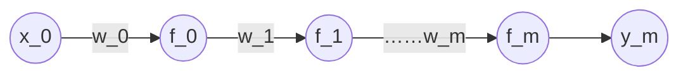

# 梯度下降算法

链式法则
$$
\frac{d\sin(e^x)}{dx}  = \cos(e^x) e^x
$$
假设只有每层只有一个神经元



其中

$$
y_0=f_0(w_0\cdot x_0) \\
y_1=f_1(w_1\cdot y_0)  \\
...... \\
y_m=f_m(w_m\cdot y_{m-1})
$$
其中 $y_0$ 到 $y_m$ 都是Sigmoid函数，最终值 $y_m$ 通过前一层的神经元计算得出。

对于真实的类别为 $\hat y$ 则KL距离
$$
D_{\text{KL}} =  -\hat y \log(y) - (1 - \hat y) \log(1 - y)
$$
对于最后一层神经元迭代求参数 $w_m$
$$
w_m'=w_m-\alpha\frac{dL}{dw_m}
$$
其中迭代步长是损失函数对 $w_m$ 
$$
\frac{dL}{dw_m}=\frac{dL}{dy_m}\cdot\frac{dy_m}{dw_m}
$$
其中
$$
\frac{dL}{dy_m}=-\frac{\hat y}{y_m}+\frac{1 - \hat y}{1 - y_m}
$$
最后一层神经元
$$
\frac{dy_m}{dw_m}=f_m’(w_m\cdot y_{m-1})\cdot y_{m-1}
$$
对于参数 $w_{m-1}$ 的更新有
$$
w_{m-1}'=w_{m-1}-\alpha\frac{dL}{dw_{m-1}}
$$
则有
$$
\frac{dL}{dw_{m-1}}=\frac{dL}{dy_{m-1}}\cdot\frac{dy_{m-1}}{dw_{m-1}}
$$
其中
$$
\frac{dy_{m-1}}{dw_{m-1}}=f_{m-1}’(w_{m-1}\cdot y_{m-2})\cdot y_{m-2}
$$
其中
$$
\frac{dL}{dy_{m-1}}=\frac{dL}{dy_m}\cdot \frac{dy_m}{dy_{m-1}}
$$
对于
$$
\frac{dy_m}{dy_{m-1}}=f_m’(w_m\cdot y_{m-1})\cdot w_{m-1}
$$
结合公式
$$
\frac{dL}{dy_{m-1}}=\frac{dL}{dy_m}\cdot f_m’(w_m\cdot y_{m-1})\cdot w_{m-1}
$$
上面的式子可以看做是迭代公式。

根据上面的迭代公式可以推导到$\frac{dL}{dw_0}$

上面的链式求导过程称为反向传播算法。

对于多个神经元的反向传播算法，相当于对多个链条求和。

对于Sigmoid函数
$$
f(z)=\frac{1}{1+e^{-z}}
$$


导数为
$$
\frac{df}{dz}=f(z)\cdot(1-f(z))
$$


对于导数
$$
f_m’(w_m\cdot y_{m-1})
$$
最大值为0.25对于n层网络，最前面的神经元 $(0-0.25)^n$ 参数计算很快就趋向于0。

在多层神经网络下，用Sigmoid函数为激活函数，越靠前的神经元更新数据趋向于0。这种线性叫梯度消失。

> [!warning]
>
> Sigmoid是造成梯度消失的原因，要解决梯度消失，需要更换激活函数。激活函数的导数相对比较大，且是非线性函数。

激活函数
$$
\text{tanh}(x)=f(x)=\frac{e^x-e^x}{e^x+e^x}
$$
导数
$$
\frac{df}{dz}=1-f(x)^2
$$


根据 $\text{tanh}(x)$ 的导数形式，可以减轻梯度消失的影响。

> [!warning]
>
> $\text{tanh}(x)$ 不具备概率意义不能作为最后一层的激活函数，但是可以作为中间层的激活函数。

$\text{tanh}(x)$ 和Sigmoid计算量都比较大，导数可以由函数本身表示。

relu激活函数
$$
f(x)=\max(0, x)
$$
导数为
$$
f'(x)=
\begin{cases}
1 , \quad x>0\\
undefine, \quad x=0 \\
0, \quad x<0 \\
\end{cases}
$$


> [!warning]
>
> relu函数不存在梯度消失的问题

对于单一链式神经元

1. 存在神经元死亡。
2. relu激活函数如果 $x_i > 0$ 且 $w_i > 0$ 则 $x_i\cdot w_i > 0$，相当于线性变换。

但是工程实践中，不会存在单链条网络。

relu函数的优点：

1. 导数简单计算量小。
2. 不会出现梯度消失。

> [!note]
>
> 对于梯度消失现象，是否可以通过增加 $\alpha$ 参数增加梯度

$$
w_m'=w_m-\alpha\frac{dL}{dw_m}
$$


单纯的增加 $\alpha$ 参数可以解决部分参数梯度消失的问题，但是会导致后部分参数震荡的问题。

> [!warning]
>
> 梯度消失的真正本质影响是各个层的梯度值  数值不在一个量级，导致无法选取合适的学习因子。

```python
from sklearn import datasets
from keras.utils import to_categorical

iris = datasets.load_iris()
x = iris.data
y = iris.target
y = to_categorical(y)

feature_input = Input(shape=(4,))
act = 'relu'
l = feature_input
layer_num = 20
hidden_num = 5 #调整隐藏层的神经元数量

for i in range(0,layer_num):
	l = Dense(units=hidden_num, activation=act, name="layer{}".format(i))(l)
    
output = Dense(units=3, activation='softmax')(l)
model = Model(inputs=feature_input, outputs=output)
model.compile(loss='categorical_crossentropy', optimizer='adam')

weights1 = [model.get_layer("layer{}".format(i)).get_weights()[0] for i in range(0,layer_num)]
model.fit(x, y, batch_size=len(x), epochs=1)
weights2 = [model.get_layer("layer{}".format(i)).get_weights()[0] for i in range(0,layer_num)]

def cal_distance(w1,w2):
	delta = w1-w2
	delta = delta.tolist()
	result = sum([s*s for ss in delta for s in ss])
	return result

delta=[cal_distance(w1, w2) for [w1, w2] in zip(weights1, weights2)]
print(delta)
```

> [!note]
>
> 1. 对于relu函数初始化的权重都是正数。
> 2. 对于relu函数初始化的权重都是负数。

使用relu函数时神经元不能太少。

假设某一层神经元全部死亡的概率是 $P$ 和神经元的个数 $M$ 之间的关系
$$
P \propto \frac{1}{M}
$$


对于一个神经网络是否存在某一层全部死亡的概率。
$$
1-\prod_i^nP
$$
当 $n$ 特别大时必然存在一层全部死亡。
