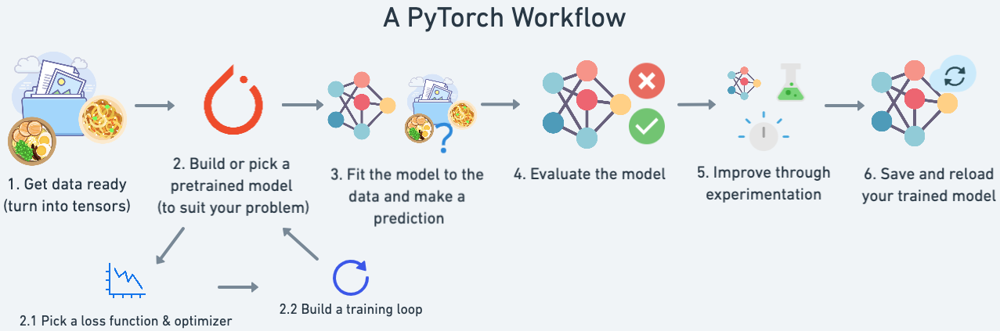

# PyTorch入门

[Pytorch](https://pytorch.org/)是由Facebook AI Research (FAIR)开发的开源深度学习框架，是一个基于Numpy的科学计算包，向它的使用者提供了两大功能。与Tensorflow对比，PyTorch在GitHub上的开源项目，数量和社区活跃度方面，略占优势，尤其在研究和学术领域。

* Hugging Face Transformers提供BERT、GPT-2、T5、RoBERTa等预训练模型，支持文本分类、翻译、生成等任务。
* 常用的开源大语言模型基于PyTorch
  * Deepseek官方推荐PyTorch。
  * Facebook开源模型LLaMA基于PyTorch。
* YOLO开源工具V5、V8、V11均基于PyTorch。
* Stable Diffusion基于 扩散模型（Diffusion Models）的文本到图像生成工具。
* FaceFusion高度真实感的换脸工具。
* LLM-Driver结合了大型语言模型（LLM）与自动驾驶任务。

> [!warning]
>
> 目前知名的开源项目，大多是基于PyTorch开发。

核心特点

* 动态计算图：计算图，在代码运行时动态构建，灵活性高，适合调试和研究。对比 TensorFlow 1.x 的静态图（Define-and-Run），PyTorch 更直观，适合快速实验。
* 张量计算：作为Numpy的替代者，向用户提供使用GPU强大功能的能力。
* 自动微分：自动计算梯度，简化反向传播。
* 模块化神经网络：做为一款深度学习的平台，向用户提供最大的灵活性和速度。
* GPU 加速（CUDA 支持）：只需简单命令即可实现GPU加速。
* 数据加载与预处理：使用`Dataset` 和 `DataLoader`方便数据批处理和多线程加载。

工作流



可视化

* 支持Tensorboard可视化分析。

模型仓库

* PyTorch提供了[PyTorch Hub](https://pytorch.org/hub/)官方模型仓库。
* [HuggingFace](https://huggingface.co/)：开源的AI工具库中的预训练模型。

学习资料

* 学习网站
  * [官方教程](https://pytorch.org/tutorials/)
  * [20天吃掉那只Pytorch](https://jackiexiao.github.io/eat_pytorch_in_20_days/)
  * [深入浅出PyTorch](https://datawhalechina.github.io/thorough-pytorch/index.html#)
* 学习书籍
  * [《PyTorch深度学习实战》](https://book.douban.com/subject/35776474/)

PyTorch的安装

* [安装命令](https://pytorch.org/get-started/locally/)
  * `torch`为PyTorch的核心包。
  * `torchvision`专为计算机视觉任务设计的扩展库。
  * `torchaudio`音频处理库。


模型的转换

* ONNX可以对不同框架模型进行转换，可以将Tensorflow模型转换为PyTorch模型。

## PyTorch基本语法

### 张量及其操作

张量（Tensors）是一种多为数组，它可以看做是矩阵和向量的推广。


在PyTorch中，张量的概念类似于Numpy中的`ndarray`数据结构，最大的区别在于Tensor可以利用GPU的加速功能。张量的类型为`tensor`，具有数据类型和形状。


使用PyTorch前，需要引入相关包

```python
import torch
```

### 基本方法

创建一个没有初始化的矩阵

```python
x = torch.empty(5, 3)
print(x)
```

> [!warning]
>
> 有些版本的PyTorch，创建一个未初始化的矩阵时，分配给矩阵的内存，包含残留数据。

随机初始化矩阵（标准高斯分布初始化数据）

```python
x = torch.rand(5, 3)
print(x)
```

创建一个全零矩阵，指定数据类型为`long`

```python
x = torch.zeros(5, 3, dtype=torch.long)
print(x)
```

直接通过数据创建张量。`tensor`可以封装不同类型的数据

```python
x = torch.tensor([2.5, 3.5])
print(x)
```

通过已有的张量，创建相同尺寸的新张量。

```python
x = x.new_ones(5, 3, dtype=torch.double)
print(x)

y = torch.randn_like(x, dtype=torch.float)
print(y)

```

得到张量的尺寸。`size()`方法返回的是一个元组，它支持一切元组的操作，如：拆包等。

```python
print(x.size())
print(y.size())
a, b = x.size()
print(a, b)
```

### 张量的运算

[加法操作](https://pytorch.org/docs/stable/generated/torch.add.html)

```python
print(x + y)
print(torch.add(x, y))
```

指定输出变量的加法操作

```python
result = torch.empty(5, 3)
torch.add(x, y, out=result)
print(result)
```

加法操作，原地置换（in-place）

```python
print(y)
y.add_(x)
print(y)
```

> [!warning]
>
> 原地置换会修改变量，所有原地置换操作函数，都有一个下划线的后缀，如：`x.copy_(y)`。

用类似于Numpy的方式对张量进行操作

```python
print(y[:, 1])
```

改变张量的形状`torch.view()`

* 操作需要保证数据元素的总数量不变。
* `-1`代表自动匹配个数。

```python
x = torch.randn(4, 4)
y = x.view(16)
z = x.view(-1, 8)
print(x.size(), y.size(), z.size())

```

如果张量中**只有一个元素**，可以用`item()`将值取出，作为一个python number。

```python
x = torch.randn(1)
print(x)
print(x.item())
```

> [!warning]
>
> `item()`常用在获取损失（loss）值时。获取Python列表[`tolist`](https://pytorch.org/docs/stable/generated/torch.Tensor.tolist.html)

### `tensor`和`ndarray`的转换

Torch的`tensor`和Numpy的`ndarray`共享底层的内存空间，因此改变其中一个的值，另一个也会随之被改变。

```python
a = torch.ones(5)
print(a)
```

将`tensor`转换为`ndarray`

```python
b = a.numpy()
print(b)
```

对其中一个进行加法操作，另一个也随之被改变。

```python
a.add_(1)
print(a)
print(b)
```

将`ndarray`转换为`tensor`

```python
import numpy as np
a = np.ones(5)
b = torch.from_numpy(a)
print(a)
print(b)
print(20*'-')
np.add(a, 1, out=a)
print(a)
print(b)
```

> [!warning]
>
> 所有在CPU上的`tensor`，除了CharTensor，都可以转换为`ndarray`并可以反向转换。

## 模型搭建

