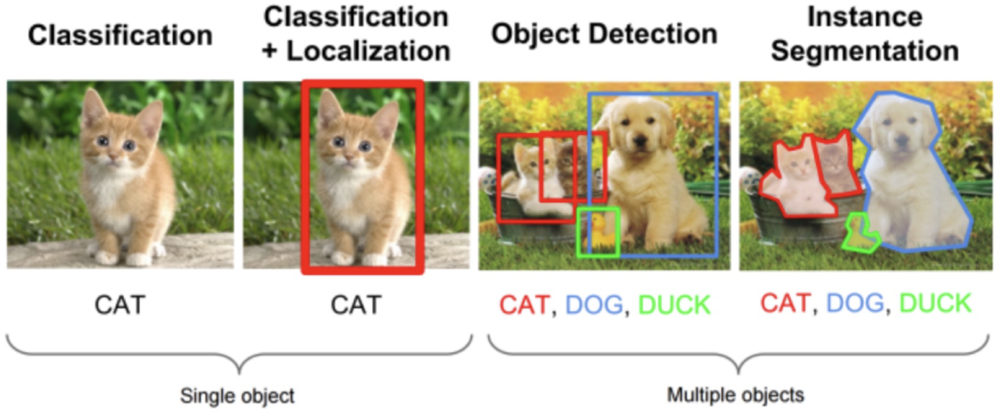
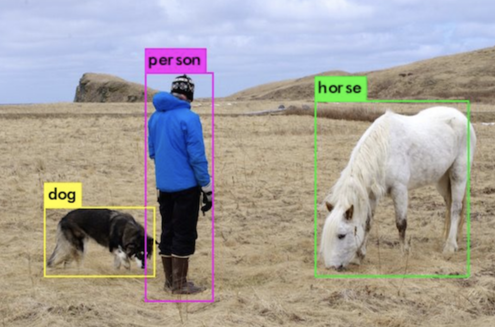
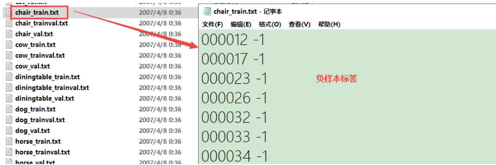
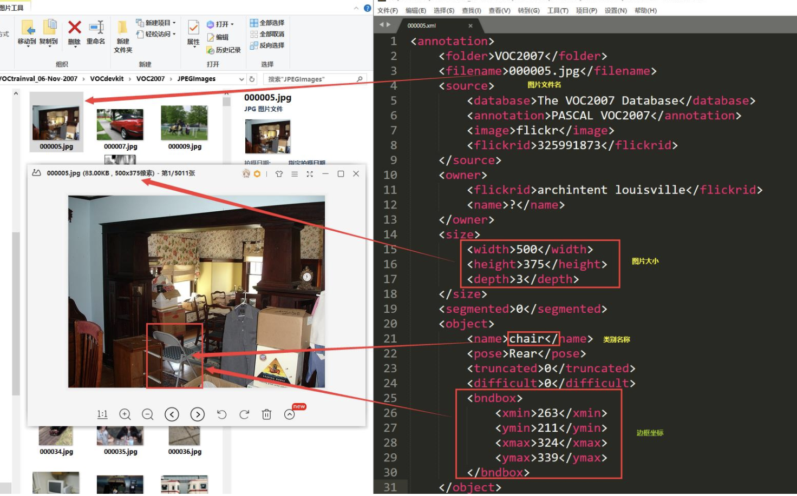

# 图像检测

目标检测（Object Detection）的任务是找出图像中所有感兴趣的目标，并确定它们的类别和位置。



目标检测中能检测出来的物体，取决于当前任务定义的物体有哪些。假设目标检测模型定义检测目标为猫和狗，那么模型对任意一张图片都不会输出除猫和狗外的其它结果。

目标检测，一般以图片左上角为原点，位置信息一般有两种格式：

1. 极坐标表示：目标左上角（位置最小点）和目标右下角（位置最大点）。
2. 中心点坐标：目标中心点和物体的宽高。



目标检测过程：

1. 对目标类别进行分类，为分类任务。
2. 定位目标的位置，回归任务。

## 开源数据集

经典的目标检测数据集有两种：PASCAL VOC数据集和MS COCO数据集。

### PASCAL VOC

PASCAL VOC包含约10000张带有边界框的图片用于训练和验证，是目标检测问题的一个基准数据集。常用的是VOC2007和VOC2012两个版本数据，共20个类别。

1. Person：person
2. Animal：bird、cat、cow、dog、horse、sheep
3. Verhical：aeroplane、bicycle、boat、bus、car、motorbike、train
4. Indoor：bottle、chair、dining table、potted plant（盆栽）、sofa、tv/monitor

[PASCAL VOC 下载](https://pjreddie.com/projects/pascal-voc-dataset-mirror/) TensorFlow中没有PASCAL VOC数据集

```shell
.
├── Annotations               标注信息
├── ImageSets                 指定图片的训练和验证
│   ├── Action                人的动作（running、jumping等）
│   ├── Layout                具有人体部位的数据（人的head、feet等）
│   ├── Main                  图像物体识别的数据
│   │   ├── train.txt         训练集的图片列表
│   │   └── val.txt						验证集的图片列表
│   └── Segmentation          可用于分割的数据
├── JPEGImages                图片信息
├── SegmentationClass         
└── SegmentationObject
```

* Main下存放的是图像物体识别的数据，总共分为20类，这是进行目标检测的重点。该文件夹中的数据对负样本文件进行了描述。



PASCAL VOC的标注信息



### MS COCO

MS COCO（Microsoft Common Objects in Context）微软于2014年出资标注的Microsoft COCO数据集，与ImageNet竞赛一样，被视为是计算机视觉领域最受关注和最权威的比赛之一。COCO数据集提供的类别有80类，有超过33万张图片，其中20万张有标注，整个数据集中个体的数目超过150万个。
[MS COCO 首页](https://cocodataset.org/#home)