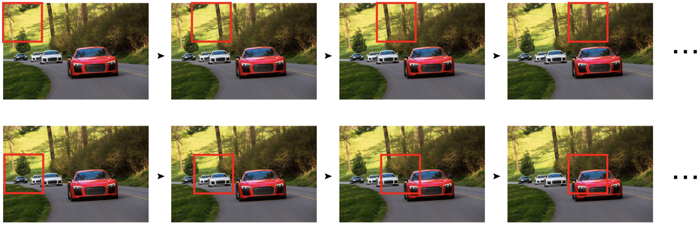
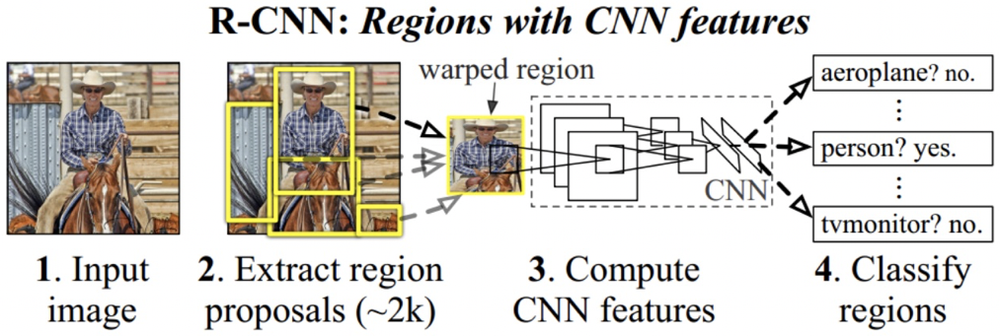
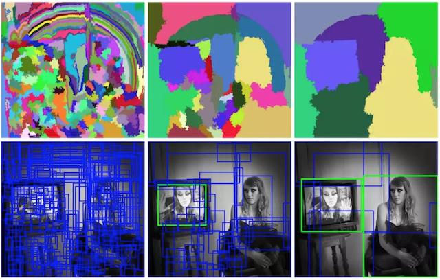
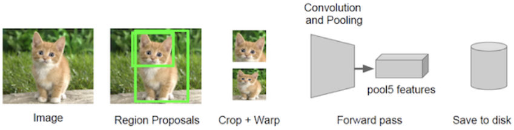

# R-CNN网络

## Overfeat模型

Overfeat方法使用滑动窗口进行目标检测，滑动窗口使用固定宽度和高度的矩形区域，在图像上扫描，并将扫描结果送入到神经网络中进行分类。下图展示了Overfeat的扫描过程，将所有的扫描结果送入网络中进行分类，得到最终的汽车的检测结果。

这种方法类似一种暴力穷举的方式，会消耗大量的计算力，并且由于窗口大小问题可能会造成效果不准确。

## R-CNN模型

R-CNN网络是2014年提出的，该网络不再使用暴力穷举的方法，而是使用候选区域方法（region proposal method）创建目标检测的区域来完成目标检测的任务，R-CNN是以深度神经网络为基础的目标检测的模型 ，以R-CNN为基点，后续的Fast R-CNN、Faster R-CNN模型都延续了这种目标检测思路。

### 算法流程

1. 候选区域生成：使用选择性搜索（Selective Search）的方法找出图片中可能存在目标的侯选区域
2. CNN网络提取特征：选取预训练卷积神经网网络（AlexNet或VGG）用于进行特征提取。
3. 目标分类：训练支持向量机（SVM）来辨别目标物体和背景，对每个类别，都要训练一个二元SVM。
4. 目标定位：训练一个线性回归模型，为每个辨识到的物体生成更精确的边界框。

### 候选区域生成

选择性搜索（SelectiveSearch）中，采用了聚类的方法。通过计算颜色、边界、纹理等信息的相似度进行聚类，将相似的区域合并，最终生成候选区域。这些区域要远远少于传统的滑动窗口的穷举法产生的候选区域。

选择性搜索，在一张图片上约能提取出2000个侯选区域，需要注意的是这些候选区域的长宽不固定。 

### 特征提取

采用预训练模型（AlexNet或VGG）在生成的候选区域上进行特征提取，将提取好的特征保存在磁盘中，用于后续步骤的分类。

使用CNN提取候选区域的特征向量时，需要接受固定长度的输入，所以需要对候选区域做一些尺寸上的修改。利用微调后的CNN网络，提取每一个候选区域的特征，获取一个4096维的特征，一幅图像就是$2000\times4096$维特征存储到磁盘中。

### 目标分类

分类器使用SVM分类器，对于多分类任务采用[One vs Rest](https://hughxusu.github.io/lesson-ai/#/a-base/06-%E9%80%BB%E8%BE%91?id=ovr%ef%bc%88one-vs-rest%ef%bc%89)方式进行分类。

1. 训练过程：对于每个类别，正样本是该类别的标注区域，负样本是其他类别的标注区域以及背景区域。
2. 测试过程：对于每个候选区域，所有类别的SVM模型会分别计算一个分类得分。最终，选择得分最高的类别作为该候选区域的预测类别。
3. 背景被视为一个特殊的类别，通常也会训练一个独立的SVM模型来区分背景和非背景区域。

对于N分类任务，需要训练包括背景在内的N+1个SVM分类器。