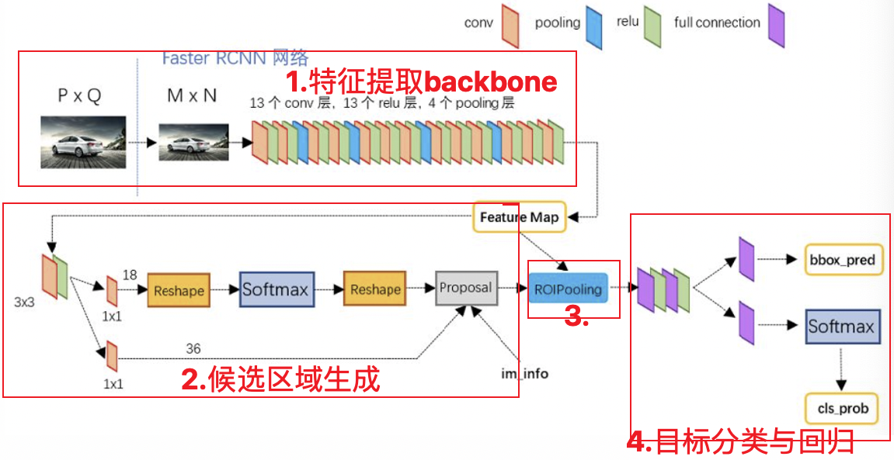
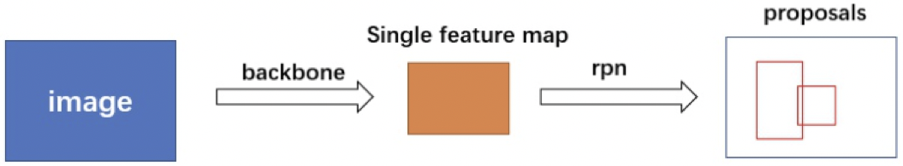
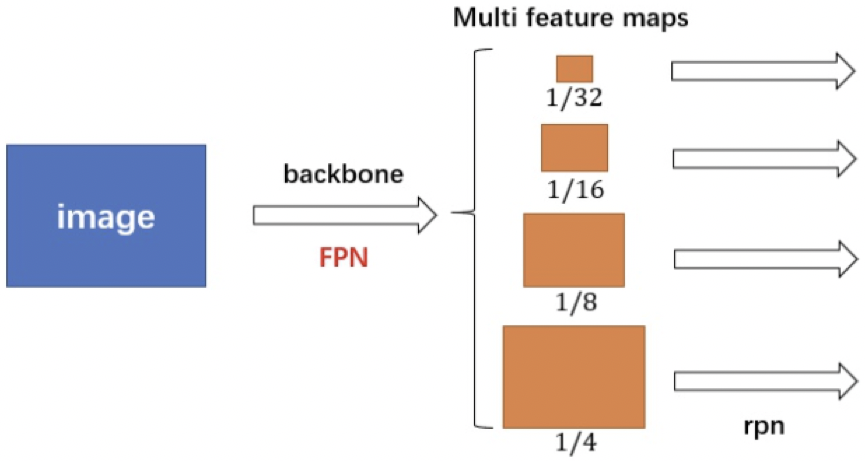
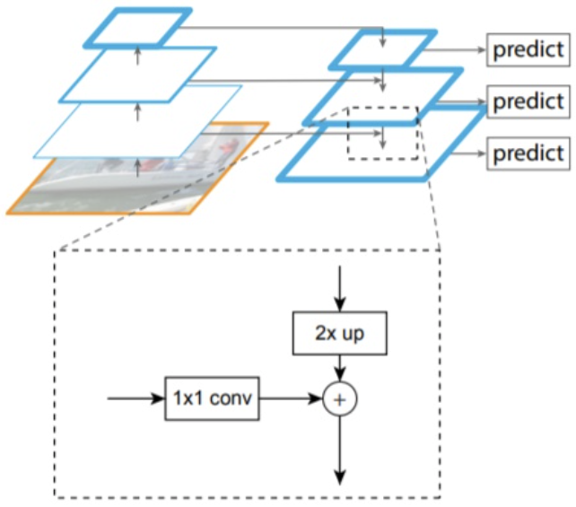
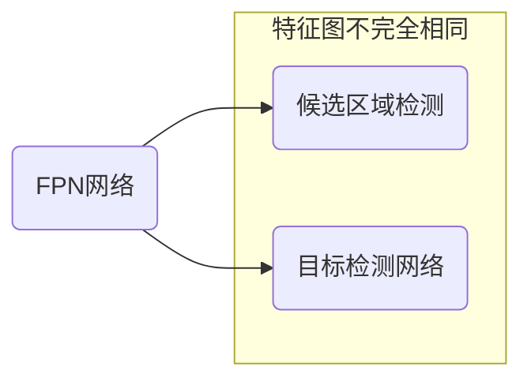
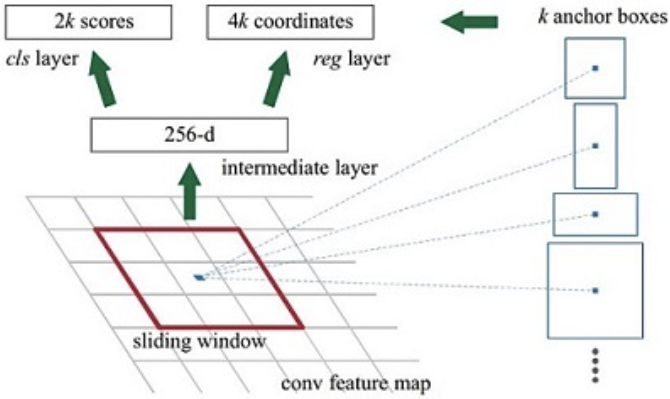
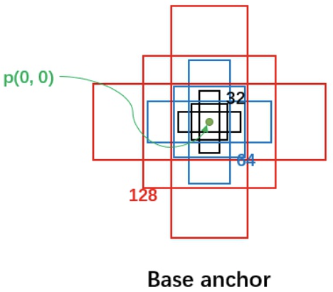
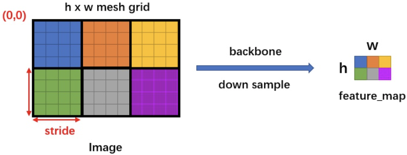
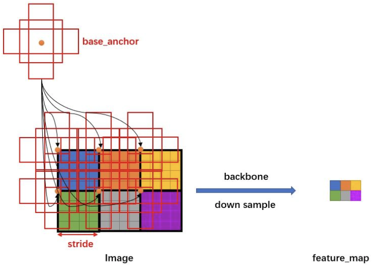
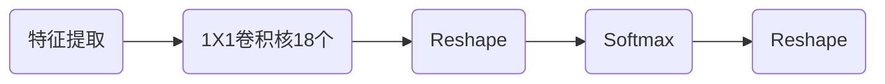

# Faster R-CNN网络

## 基本思想

在R-CNN和Fast R-CNN的基础上，在2016年提出了Faster R-CNN网络模型，该将候选区域的生成、特征提取、目标分类及目标定位整合在了一个网络中，综合性能有较大提高。

Faster R-CNN可以看成是区域生成网络（RPN）与Fast R-CNN的组合：

* 区域生成网络，替代选择性搜索，生成候选区域。
* Fast R-CNN用来进行目标检测。

1. Backbone：由CNN卷积神经网络构成，常用的是VGG和resnet，用来提取图像的特征图。特征图被用于后续RPN层生成候选区域和ROIPooling层中。
2. RPN网络：用于生成候选区域。
3. Roi Pooling：与Fast R-CNN网络中一样，得到候选区域的特征。
4. 目标分类与回归：与Fast R-CNN网络中一样，使用两个同级层，完成目标的分类和定位。

## 模型结构详解

### 主干网络（backbone）

backbone一般为VGG，ResNet进行特征提取（优先选择ResNet），将最后的全连接层舍弃，得到特征图送入后续网络中进行处理。一般的特性处理如下

在特征提取中，还可以引入FPN结构，将多个特征图逐个送入到后续网络中，特征提取如下

FPN结构的作用，是低分辨率的特征图进行上采样并和高分辨率的特征图融合，提升检测精度。

FPN网络获取多个特征图后

* 输入RPN网络中的特征图
* 输入目标检测网络的特征图并不完全相同 。

> [!warning]
>
> 通过FPN结构得到的多尺度特征图中，高阶特征用于检测大的物体，低阶特征用于检测小的物体。

### RPN网络

RPN网络用于代替选择性搜索的方法，生成候选区域。

1. 生成一系列的固定参考框anchors，覆盖图像的任意位置，然后送入后续网络中进行分类和回归。
2. 分类分支：通过softmax分类判断anchor中是否包含目标。
3. 回归分支：计算目标框对于anchors的偏移量，以获得精确的候选区域。
4. Proposal层：则负责综合分类和回归结果，获取候选区域，同时剔除太小和超出边界的候选区域。

#### anchors

目标检测中，预设一组不同尺度、不同长宽比的固定参考框，覆盖所有位置， 每个参考框负责检测与其交并比大于阈值 （常用0.5或0.7）的目标，每个参考框的中心区域称为anchor。anchor技术，将候选区域生成问题转换为，这个固定参考框中有没有目标、目标框偏离参考框多远。假设参考框尺度为32、64、128，长宽比为1:1、1:2、2:1

参考框的大小（如32像素）是相对于原图，特征提取会对图像进行下采样

* 假设输入图像大小：$512 \times 512$
* 主干网络提取的特征图大小：$32 \times 32$
* 下采样倍数

$$
\text{stride}=\frac{\text{原图尺寸}}{\text{特征图尺寸}}=\frac{512}{32}=16
$$

这意味着特征图上的1个像素点，对应原图上的$16 \times 16$个像素区域。假设参考框框=32像素，特征图的stride是16，在特征图上的大小计算

$$
\frac{32}{\text{stride}}=\frac{32}{16}=2
$$

也就是说，这个anchor在特征图上相当于$2 \times 2$的区域。图像的下采样关系如下

媒体特征在原图上对于的参考框如图所示

对于FPN网络获取的多个特征图，会将不同尺寸的参考框映射在不同尺度的特征图上。

#### RPN分类

一幅图像，经过特征提取后，得到$H\times W$大小的特征图。如果anchor=9，则分类流程如下

1. $1 \times 1$卷积核得到特征图为`[batchsize,H,W,18]`
2. Reshape将特征图转换为`[batchsize,9*H,W,2]`，然后使用SoftMax分类。
3. 使用SoftMax分类后，再将特征图Reshape到`[batchsize,H,W,18]`

