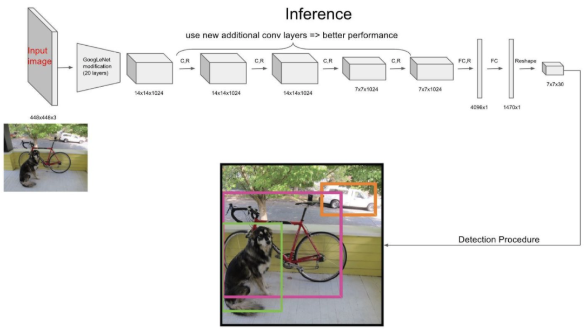
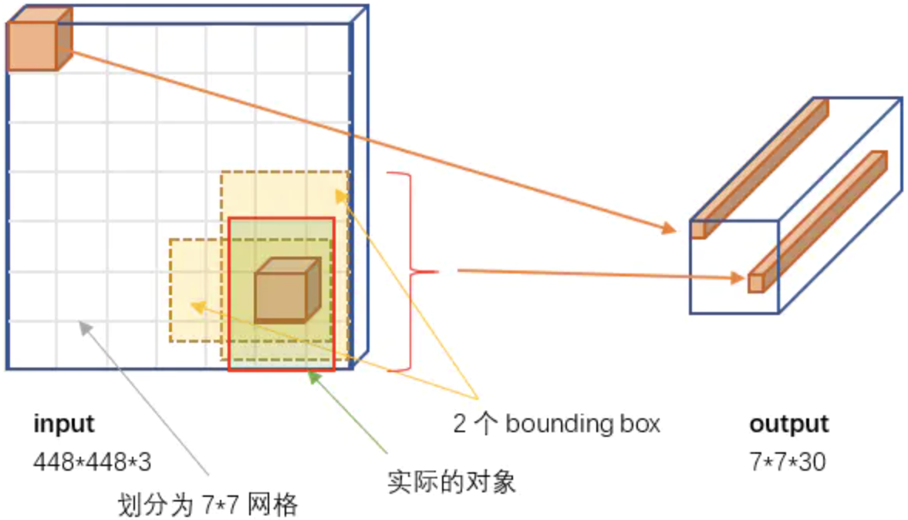
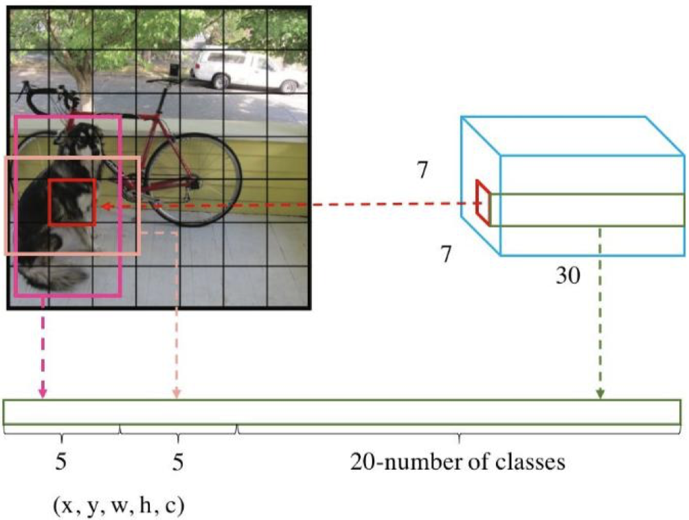
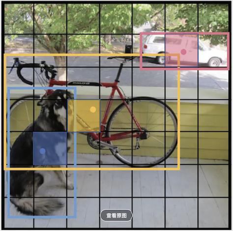
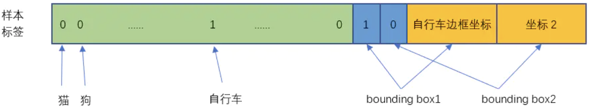
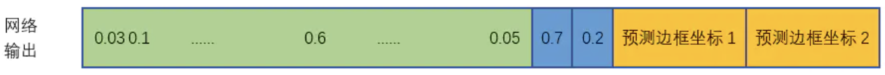
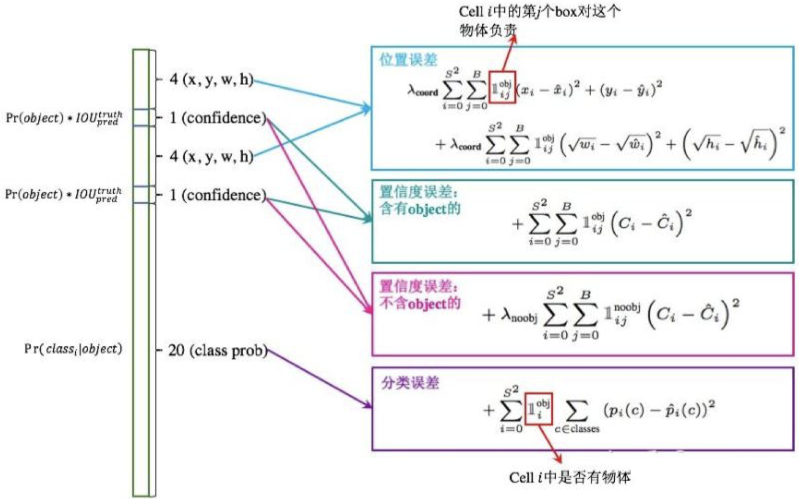

# YOLO系列算法

[YOLO](https://docs.ultralytics.com/zh#where-to-start)系列算法是一类典型的one-stage目标检测算法，其利用anchor box将分类与目标定位的回归问题结合起来，从而做到了高效、灵活和泛化性能好，所以在工业界也十分受欢迎。

| **版本**    | **发布时间** | **主要特点**                                             | **作者/团队**               | **框架** |
| ----------- | ------------ | -------------------------------------------------------- | --------------------------- | -------- |
| **YOLOv1**  | 2016年5月    | 首个单阶段检测框架，实时性强但定位精度较低。             | Joseph Redmon               | Darknet  |
| **YOLOv2**  | 2017年12月   | 引入批量归一化、锚框和多尺度训练，支持检测9000类物体。   | Joseph Redmon               | Darknet  |
| **YOLOv3**  | 2018年4月    | 采用Darknet-53骨干网络，引入多尺度预测，提升小物体检测。 | Joseph Redmon & Ali Farhadi | Darknet  |
| **YOLOv4**  | 2020年4月    | 结合数据增强、自适应锚点等技术，平衡速度与精度。         | Alexey Bochkovskiy          | Darknet  |
| **YOLOv5**  | 2020年6月    | 非官方版本，优化易用性和性能，支持PyTorch部署。          | Glenn Jocher                | PyTorch  |
| **YOLOv6**  | 2022年6月    | 美团团队开发，采用无锚点检测器，优化工业场景。           | 美团技术团队                | -        |
| **YOLOv7**  | 2022年7月    | 改进模型结构，提升硬件效率（如GPU利用率）。              | Alexey Bochkovskiy          | -        |
| **YOLOv8**  | 2023年1月    | 引入Anchor-free检测头和新骨干网络，支持图像分割。        | Ultralytics公司             | PyTorch  |
| **YOLOv9**  | 2024年2月    | 提出GELAN架构和可编程梯度信息（PGI），显著提升精度。     | Chien-Yao Wang等            | -        |
| **YOLOv10** | 2024年5月    | 清华大学团队解决NMS和计算冗余问题，兼顾速度与精度。      | 清华大学团队                | -        |
| **YOLOv11** | 2024年9月    | Ultralytics公司优化推理时间，适合低算力设备。            | Ultralytics公司             | PyTorch  |

* 早期版本（v1-v4）基于Darknet框架开发，从v5开始转向PyTorch，提升易用性和部署灵活性。
* 官方主线版本：v1-v4、v7-v9

## YOLO算法

Yolo算法采用统一的网络实现端到端的目标检测，以整张图像作为网络的输入，在输出目标位置的同时，输出目标类别，系统流程如下：

1. 将输入图片resize到$448\times448$。
2. 同时得到分类结果和目标位置，其速度相比R-CNN算法更快。

相关论文：[You Only Look Once: Unified, Real-Time Object Detection](https://arxiv.org/pdf/1506.02640)

### 基本思想

Yolo（意思是You Only Look Once）算法，创造性的将候选区和目标分类合二为一，看一眼图片就能知道有哪些对象以及它们的位置。

Yolo模型，将原始图像划分为$7\times7=49$个网格（grid），每个网格允许预测2个包含某个对象的矩形框，即边框（bounding box），总共$49\times2=98$个。这98个预测区，很粗略的覆盖了整张图片，在这98个预测区中进行目标检测，得到98个区域的目标分类和回归结果，再进行NMS，得到最终结果。

### 网络结构

YOLO的结构就是单纯的卷积、池化最后加了两层全连接，与前面介绍的CNN分类网络没有本质的区别。最大的差异是输出层用线性函数做激活函数，需要预测目标的位置和物体的类别。YOLO的整个结构，就是输入图片经过神经网络，变换得到一个输出的张量。

#### 网络输入

输入图像的大小固定为$448\times448$

#### 网络输出

网络的输出就是一个$7\times7\times30$ 的张量。根据YOLO的设计，输入图像被划分为$7\times 7$的网格（grid），输入图像中的每个网格对应输出一个30维的向量。

30维的向量包含：

1. 2个bbox的位置和置信度
   1. bbox需要4个数值来表示其位置`(Center_x,Center_y,width,height)`，2个bbox共需要8个数值来表示其位置。
   2. 2个bbox的置信度
      * $\text{Pr}(\text{Object})$bbox是否包含物体的中心点。
      * $\text{IOU}^{\text{truth}}_{\text{pred}}$bbox比标注框的交并比。

$$
\text{Confidence}=\text{Pr}(\text{Object})\times\text{IOU}^{\text{truth}}_{\text{pred}}
$$

2. 网格属于20个类别的概率。YOLO V1基于VOC数据进行训练，支持20种对象分类。

### 模型标注

训练图像如下

输出结果标注如下

1. 20个对象分类的概率。比如上图中自行车，中心点位置网格负责预测自行车，自行车的概率是1，其它概率为0。所有其它网格的30维向量中，自行车的概率都是0。
2. 2个bbox的置信度
   1. 负责检测目标的网格（自行车）
      1. 与标注值交并比大的框，置信度为1。
      2. 与标注值交并比小的框，置信度为0。
   2. 不负责检测目标的网格，置信度为0。
3. bbox的自信值为1的边框设置为标注值，为随机值。

### 损失函数

网络实际输出值如下

损失函数为样本标签和网络输出之间的偏差
$$
\begin{align}
\text{Loss} 
&= 
\lambda_{\text{coord}}\sum_{i=0}^{S^2}\sum_{j=0}^B
\mathbb{1}^{obj}_{ij}\left[(x_i-\hat{x}_i)^2-(y_i-\hat{y}_i)^2\right] & \text{边框中心点误差} \\
&+
\lambda_{\text{coord}}\sum_{i=0}^{S^2}\sum_{j=0}^B
\mathbb{1}^{obj}_{ij}
\left[(\sqrt{w_i} -\sqrt{\hat{w}} _i)^2-(\sqrt{h_i} -\sqrt{\hat{h}_i} )^2\right] & \text{边框中宽、高误差} \\
&+
\sum_{i=0}^{S^2}\sum_{j=0}^B
\mathbb{1}^{obj}_{ij}(C_i-\hat{C}_i)^2 & \text{有对象置信度误差} \\ 
&+
\lambda_{\text{noobj}}\sum_{i=0}^{S^2}\sum_{j=0}^B
\mathbb{1}^{noobj}_{ij}(C_i-\hat{C}_i)^2 & \text{无对象置信度误差} \\
&+
\sum_{i=0}^{S^2}\mathbb{1}^{obj}_{i}\sum_{c\in \text{classes} }
(C_i-\hat{C}_i)^2 & \text{对象分类误差} 
\end{align}
$$

* $\mathbb{1}^{obj}_{i}$表示目标出现在第$i$个网格中。
* $\mathbb{1}^{obj}_{ij}$第$i$个网格第$j$个边界框预中存在目标。
* $\mathbb{1}^{noobj}_{ij}$第$i$个网格第$j$个边界框中不存在目标。
* $\lambda_{\text{coord}}=5$增加位置误差的权重。
* $\lambda_{\text{noobj}}=0.5$减少不存在对象的bbox的置信度误差的权重。

输出结果与损失函数的对应关系

### 模型训练

* 使用ImageNet数据集对前20层卷积网络进行预训练
* 使用完整的网络，在PASCAL VOC数据集上进行对象识别和定位的训练。
* 最后一层采用线性激活函数，其它层都是Leaky ReLU。
* 训练中采用了drop out和数据增强（data augmentation）来防止过拟合。

### 模型预测

* 将图片resize成$448\times448$的大小，送入到yolo网络中。
* 输出一个$7\times7\times30$ 的张量。
* 采用NMS算法选出最有可能是目标的结果。

### YOLO算法特点

优点

* 速度非常快，处理速度可以达到45fps。快速版本（网络较小）甚至可以达到155fps。
* 训练和预测可以端到端的进行，非常简便。

缺点

* 准确率会打折扣。
* 对于小目标和靠的很近的目标检测效果并不好。

## YOLO V2

相关论文：[YOLO9000: Better, Faster, Stronger](https://arxiv.org/pdf/1612.08242)

## YOLO V3

相关论文：[YOLOv3: An Incremental Improvement](https://arxiv.org/pdf/1804.02767)

## YOLO V4

相关论文：[YOLOv4: Optimal Speed and Accuracy of Object Detection](https://arxiv.org/pdf/2004.10934)