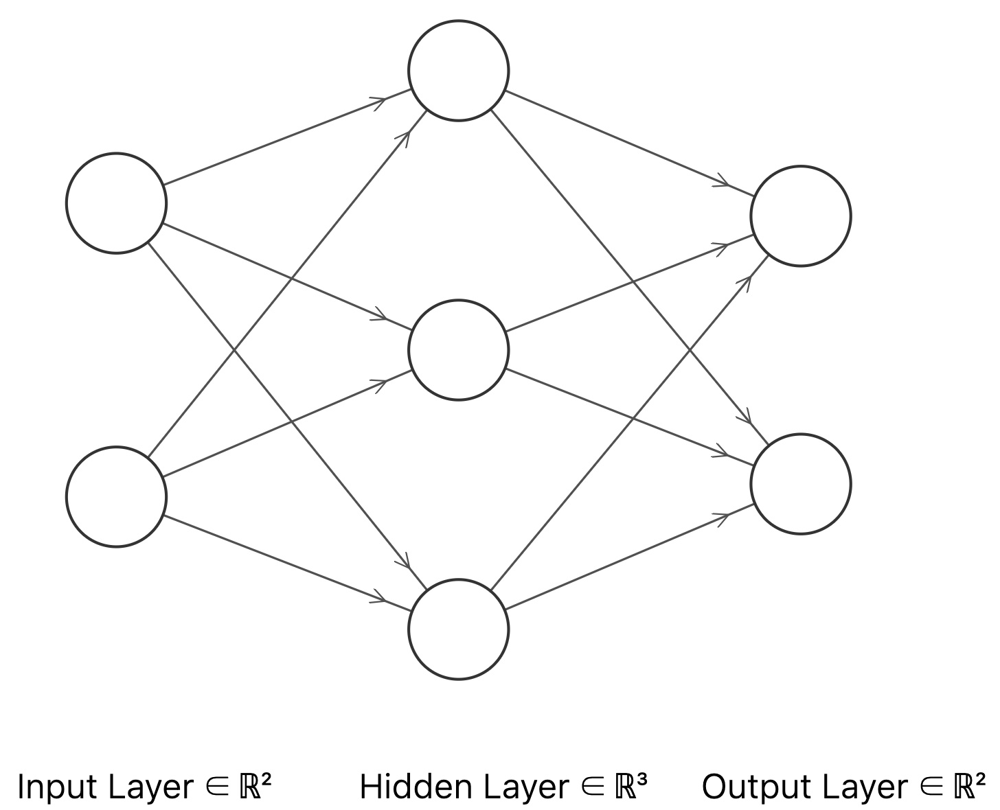
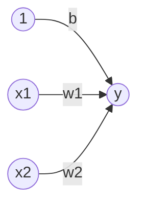

# 神经网络

神经网络可以看做是多层感知机构成网络系统，每一个感知机即为一个神经元。上图中神经元共有三层：

1. 第一层为输入层。
2. 第二层为隐藏层。
3. 第三层为输出层。

对于每个神经元的表示如下
$$
y=
\begin{cases}
 0 & \text{ if } & b+w_1x_1+w_2x_2 \le 0  \\
 1 & \text{ if } & b+w_1x_1+w_2x_2 >  0
\end{cases}
$$
引入函数$h(x)$化简上式可以得到
$$
y=h\left(b+w_1x_1+w_2x_2\right)
$$
上式的网络结构可以表示为

输入信号的转换函数$h(x)$可以表示为
$$
h(x)=
\begin{cases}
 0 & \text{ if } & x \le 0  \\
 1 & \text{ if } & x >  0
\end{cases}
$$
即输入神经元的汇总结果小于0时，输出是0；大于0时，输出是1。

