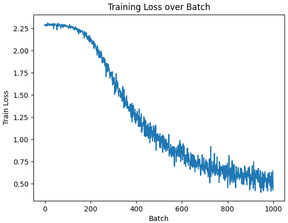
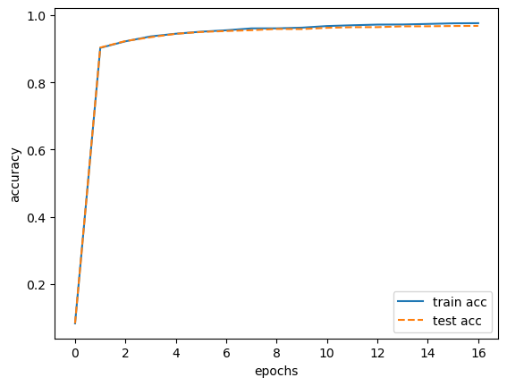

# 神经网络的学习

神经网络的学习就是从训练数据中自动获取最优权重参数的过程。

* 神经网络是一种参数学习算法，这些参数是从数据特征中提取出来的。
* 神经网络的学习过程以数据为驱动，则极力避免人为介入。

> [!note]
>
> 如何实现数字图片中“5”的识别


人可以简单地识别出5，但却很难明确说出是基于何种规律而识别出了5，有效的方法是通过数据来解决这个问题。

1. 基本方法：从图像中提取特征量，再用机器学习技术学习这些特征量的模式。

   * 图像中常用的特征，包括：SIFT、SURF 和 HOG等，这种特征可以把图像转换成向量。

   * 常用的机器学习分类器有，SVM、KNN等分类器进行学习。
   * 该方法的存在的问题是，图像转换为特征向量是由人提前设计好的。不同的问题，必须使用合适的特征，才能得到好的结果。

2. 神经网络方法：直接学习图像本身。
   * 特征仍是由人工设计的，但包含在神经网络中。
   * 特征和分类模型都是由机器学习而来。
   * 神经网络的优点是可以将数据作为原始输入，且对所有的问题都可以用同样的流程来解决。

> [!warning]
>
> 深度学习也称为端到端机器学习（end-to-end machine learning ）。端到端的意思，是指从一端到另一端，也就是从原始数据（输入）中获得目标结果（输出）。

## 损失函数

任何机器学习的过程都是最优化目标函数，即最小化损失函数。深度学习中常用的损失函数是：均方误差和交叉熵误差。

### 均方误差

$$
E=\frac{1}{2}\sum_k\left(y_k-t_k\right)^2
$$

* $y_k$表示神经网络的输出。
* $t_k$表示监督数据。
* $k$表示数据的维数。

使用Python语言模拟均方误差的计算

```python
import numpy as np

def mean_squared_error(y, t):
    return 0.5 * np.sum((y-t)**2)

y1 = [0.1, 0.05, 0.6, 0.0, 0.05, 0.1, 0.0, 0.1, 0.0, 0.0]
y2 = [0.1, 0.05, 0.1, 0.0, 0.05, 0.1, 0.0, 0.6, 0.0, 0.0]
t = [0, 0, 1, 0, 0, 0, 0, 0, 0, 0]

print(mean_squared_error(np.array(y1), np.array(t)))
print(mean_squared_error(np.array(y2), np.array(t)))
```

### 交叉熵损失函数

对于多分类问题交叉熵损失函数表示如下
$$
E=-\sum_kt_k\log y_k
$$

* $\log$表格为以$e$为底数的自然对数。
* $y_k$表示神经网络的输出。


> [!warning]
>
> 多分类问题与二分类问题的损失函数形式有所不同：二分类是对数损失函数；多分类是交叉熵损失函数。

使用Python语言模拟交叉熵损失函数的计算

```python
def cross_entropy_error(y, t):
    delta = 1e-7
    return -np.sum(t * np.log(y + delta))

print(cross_entropy_error(np.array(y1), np.array(t)))
print(cross_entropy_error(np.array(y2), np.array(t)))
```

### mini-batch学习

神经网络的学习是从训练数据中选出一批数据（称为 mini-batch，小批量），作为全部数据的“近似”，然后对每个mini-batch进行学习，这种学习方式称为mini-batch学习。

mini-batch的交叉熵损失函数计算公式如下
$$
E=-\frac{1}{N}\sum_n\sum_kt_k^{(n)}\log y_k^{(n)}
$$

* $N$表示样本的总数。
* $t_k^{(n)}$表示第$n$个监督数据的第$k$个元素的值。
* $y_k^{(n)}$表示第$n$个神经网络输出的第$k$个元素的值。

使用minst数据集进行mini-batch测试，读取minst数据集

```python
from sklearn.datasets import fetch_openml

def load_mnist(normalize=True, flatten=True, one_hot_label=False):
    mnist = fetch_openml('mnist_784', version=1)

    X, y = mnist['data'], mnist['target']
    X_train = np.array(X[:60000], dtype=float)
    y_train = np.array(y[:60000], dtype=int)  # 转换为整数类型
    X_test = np.array(X[60000:], dtype=float)
    y_test = np.array(y[60000:], dtype=int)  # 转换为整数类型
    
    if normalize:
        X_train /= 255.0
        X_test /= 255.0
        
    if one_hot_label:
        y_train = np.eye(10)[y_train]
        y_test = np.eye(10)[y_test]
    
    if not flatten:
        X_train = X_train.reshape(-1, 1, 28, 28)
        X_test = X_test.reshape(-1, 1, 28, 28)
        
    return (X_train, y_train), (X_test, y_test)


(x_train, t_train), (x_test, t_test) = load_mnist(normalize=True, one_hot_label=True)
print(x_train.shape)
print(t_train.shape)
```

随机选择数据

```python
train_size = x_train.shape[0]
batch_size = 10
batch_mask = np.random.choice(train_size, batch_size)
x_batch = x_train[batch_mask]
t_batch = t_train[batch_mask]
print(x_batch.shape)
print(t_batch.shape)
```

交叉熵批量计算函数

```python
def cross_entropy_error(y, t):
    if y.ndim == 1:
        t = t.reshape(1, t.size)
        y = y.reshape(1, y.size)
    batch_size = y.shape[0]
    return -np.sum(t * np.log(y + 1e-7)) / batch_size
```

在深度学习中损失函数的价值和逻辑回归或线性回归是一致的，通过寻找损失函数的最小值，来实现函数产生的优化。当数据标签不是one-hot编码时，交叉熵的计算公式如下

```python
def cross_entropy_error(y, t):
    if y.ndim == 1:
        t = t.reshape(1, t.size)
        y = y.reshape(1, y.size)
    batch_size = y.shape[0]
    return -np.sum(np.log(y[np.arange(batch_size), t] + 1e-7)) / batch_size
```

## 梯度

### 导数

根据定义，函数的求导公式如下
$$
\frac{df(x)}{dx}=\lim_{h\rightarrow0}\frac{f(x+h)-f(x)}{h}
$$
  使用python实现求导的代码如下

```python
def numerical_diff(f, x):
    h = 1e-4
    return (f(x+h) - f(x-h)) / (2*h)
```

函数公式如下
$$
y=0.01x^2+0.1x
$$
计算该函数在$x=5$和$x=10$处的导数，代码实现为

```python
def function_1(x):
    return 0.01*x**2 + 0.1*x

print(numerical_diff(function_1, 5))
print(numerical_diff(function_1, 10))
```


### 偏导数

函数公式如下
$$
f(x_0, x_1)=x_0^2+x_1^2 \tag{1}
$$
该函数的图像如下


上述公式的python代码实现

```python
def function_2(x):
    return x[0]**2 + x[1]**2
```

计算$x_0=3$，$x_1=4$时，对于$x_0$的偏导数$\frac{\partial f}{\partial x_0}$

```python
def function_tmp1(x0):
    return x0*x0 + 4.0**2.0

print(numerical_diff(function_tmp1, 3.0))
```

计算$x_0=3$，$x_1=4$时，对于$x_0$的偏导数$\frac{\partial f}{\partial x_1} $

```python
def function_tmp2(x1):
    return 3.0**2.0 + x1*x1

print(numerical_diff(function_tmp2, 4.0))
```

求偏导数时需要固定一个变量，计算另一个变量的导数。

### 梯度的计算

对于公式 $(1)$ 梯度可以表示为
$$
\left( \frac{\partial f}{\partial x_0}, \frac{\partial f}{\partial x_1} \right)
$$
使用python实现梯度的计算过程

```python
def numerical_gradient(f, x):
    h = 1e-4
    grad = np.zeros_like(x)
    for idx in range(x.size):
        tmp_val = x[idx]
        x[idx] = tmp_val + h
        fxh1 = f(x)
        x[idx] = tmp_val - h
        fxh2 = f(x)
        grad[idx] = (fxh1 - fxh2) / (2*h)
        x[idx] = tmp_val
    return grad
```

* 输入`x`是一个Numpy的数组
* 返回结果也为一个Numpy数组

测试梯度计算

```python
print(numerical_gradient(function_2, np.array([3.0, 4.0]))) # (3, 4)
print(numerical_gradient(function_2, np.array([0.0, 2.0]))) # (0, 2)
print(numerical_gradient(function_2, np.array([3.0, 0.0]))) # (3, 0)
```

使用Python绘制公式 $(1)$ 的梯度图像

```python
import matplotlib.pylab as plt

def _numerical_gradient_no_batch(f, x):
    h = 1e-4 # 0.0001
    grad = np.zeros_like(x)

    for idx in range(x.size):
        tmp_val = x[idx]
        x[idx] = float(tmp_val) + h
        fxh1 = f(x) # f(x+h)

        x[idx] = tmp_val - h 
        fxh2 = f(x) # f(x-h)
        grad[idx] = (fxh1 - fxh2) / (2*h)

        x[idx] = tmp_val # 还原值

    return grad

def numerical_gradient(f, X):
    if X.ndim == 1:
        return _numerical_gradient_no_batch(f, X)
    else:
        grad = np.zeros_like(X)

        for idx, x in enumerate(X):
            grad[idx] = _numerical_gradient_no_batch(f, x)

        return grad
     
x0 = np.arange(-2, 2.5, 0.25)
x1 = np.arange(-2, 2.5, 0.25)
X, Y = np.meshgrid(x0, x1)

X = X.flatten()
Y = Y.flatten()

grad = numerical_gradient(function_2, np.array([X, Y]) )

plt.figure()
plt.quiver(X, Y, -grad[0], -grad[1],  angles="xy",color="#666666")#,headwidth=10,scale=40,color="#444444")
plt.xlim([-2, 2])
plt.ylim([-2, 2])
plt.xlabel('x0')
plt.ylabel('x1')
plt.grid()
plt.legend()
plt.draw()
plt.show()
```

> [!warning]
>
> 梯度指示的方向是各点处的函数值减小最多的方向。

梯度下降算法是寻找梯度为0的点，但当失函数很复杂，参数空间庞大时，函数的极小值、最小值以及鞍点 （saddle point） 的梯度均为0。

* 极小值是局部最小值，也就是限定在某个范围内的最小值。
* 鞍点是从某个方向上看是极大值，从另一个方向上看则是极小值的点。


当函数很复杂且呈扁平状时，学习可能会进入一个（几乎）平坦的地区，陷入被称为“学习高原”的无法前进的停滞期。

在机器学习过程中上述问题，可以通过反复学习和随机初始化等方法解决。

公式 $(1)$ 的梯度下降法数学公式为
$$
x_0 = x_0-\eta\frac{\partial f}{\partial x_0} \\
x_1 = x_1-\eta\frac{\partial f}{\partial x_1}
$$
$\eta$表示学习率。使用python实现梯度下降算法如下

```python
def gradient_descent(f, init_x, lr=0.01, step_num=100):
    x = init_x
    for i in range(step_num):
        grad = numerical_gradient(f, x)
        x -= lr * grad
    return x
```

测试梯度下降算法计算公式 $(1)$ 的最小值，起始点设置为$(-3.0, 4.0)$

```python
init_x = np.array([-3.0, 4.0])
gradient_descent(function_2, init_x=init_x, lr=0.1, step_num=100)
```

绘制上述梯度计算的过程

```python
def gradient_descent_log(f, init_x, lr=0.01, step_num=100):
    x = init_x
    x_history = []

    for i in range(step_num):
        x_history.append( x.copy() )

        grad = numerical_gradient(f, x)
        x -= lr * grad
    return x, np.array(x_history)

init_x = np.array([-3.0, 4.0])    

lr = 0.1
step_num = 20
x, x_history = gradient_descent_log(function_2, init_x, lr=lr, step_num=step_num)

plt.plot( [-5, 5], [0,0], '--b')
plt.plot( [0,0], [-5, 5], '--b')
plt.plot(x_history[:,0], x_history[:,1], 'o')

plt.xlim(-3.5, 3.5)
plt.ylim(-4.5, 4.5)
plt.xlabel("X0")
plt.ylabel("X1")
plt.show()
```

### 神经网络的梯度

神经网络的训练过程也是用梯度下降法，使用损失函数关于权重参数的梯度。假设神经网络中的一层参数如下
$$
W=
\begin{pmatrix}
 w_{11} & w_{21} & w_{31}\\
 w_{12} & w_{22} & w_{32}
\end{pmatrix}
$$
参数的梯度计算如下
$$
\frac{\partial L}{\partial W} =
\begin{pmatrix}
\frac{\partial L}{\partial w_{11}}  & \frac{\partial L}{\partial w_{12}} & \frac{\partial L}{\partial w_{13}} \\
\frac{\partial L}{\partial w_{21}}  & \frac{\partial L}{\partial w_{22}} & \frac{\partial L}{\partial w_{23}}
\end{pmatrix}
$$
定义一个简单的神经网络代码如下

```python
def cross_entropy_error_new(y, t):
    if y.ndim == 1:
        t = t.reshape(1, t.size)
        y = y.reshape(1, y.size)

    if t.size == y.size:
        t = t.argmax(axis=1)
             
    batch_size = y.shape[0]
    return -np.sum(np.log(y[np.arange(batch_size), t] + 1e-7)) / batch_size

def softmax_new(x):
    if x.ndim == 2:
        x = x.T
        x = x - np.max(x, axis=0)
        y = np.exp(x) / np.sum(np.exp(x), axis=0)
        return y.T 

    x = x - np.max(x) # 溢出对策
    return np.exp(x) / np.sum(np.exp(x))

class SimpleNet:
    def __init__(self):
        np.random.seed(666)
        self.W = np.random.randn(2, 3)
        
    def predict(self, x):
        return np.dot(x, self.W)
    
    def loss(self, x, t):
        z = self.predict(x)
        y = softmax_new(z)
        loss = cross_entropy_error_new(y, t)
        return loss
```

* 神经网络只有一层神经元，输入是2个神经元，输入是3个类别；随机初始化$W$的值。
* `predict`预测输出结果；`loss`是计算损失函数。
* `softmax`函数用于计算神经网络的输出。
* `cross_entropy_error`函数用于计算交叉熵，标签数据可以是one-hot编码也可以是单标签。

1. 定义神经网络，初始化参数

```python
net = SimpleNet()
print(net.W)
```

2. 多数据进行预测，并打印输出最大的索引

```python
x = np.array([0.6, 0.9])
p = net.predict(x)
print(p)
print(np.argmax(p))
```

3. 最大值的索引为0，假设正确标签即为0号标签，并计算损失函数。

```python
t = np.array([1, 0, 0])
print(net.loss(x, t))
```

4. 计算$W$的梯度

```python
f = lambda w: net.loss(x, t)
dW = numerical_gradient(f, net.W)
print(dW)
```

### 学习算法的实现

神经网络的学习步骤：

1. 从训练数据中随机选出一部分数据，这部分数据称为mini-batch，通过mini-batch的数据减少损失函数的值。
2. 为了减小mini-batch的损失函数的值，需要求出各个权重参数的梯度。
3. 将权重参数沿梯度下降的方向进行微小更新。
4. 将权重参数沿梯度方向进行微小更新。
5. 迭代终止条件迭代指定多的次数或权重参数减小数量级小于一定阈值。

上述过程称为随机梯度下降法 （ stochastic gradient descent ），即对随机选择的数据进行的梯度下降法。

定义一个2层的神经网络

```python
def sigmoid_new(x):
    return 1 / (1 + np.exp(-x)) 

def numerical_gradient_new(f, x):
    h = 1e-4 # 0.0001
    grad = np.zeros_like(x)

    it = np.nditer(x, flags=['multi_index'], op_flags=['readwrite'])
    while not it.finished:
        idx = it.multi_index
        tmp_val = x[idx]
        x[idx] = float(tmp_val) + h
        fxh1 = f(x) # f(x+h)

        x[idx] = tmp_val - h 
        fxh2 = f(x) # f(x-h)
        grad[idx] = (fxh1 - fxh2) / (2*h)

        x[idx] = tmp_val # 还原值
        it.iternext()   

    return grad

class TwoLayerNet:
    def __init__(self, input_size, hidden_size, output_size, weight_init_std=0.01):
        self.params = {}
        np.random.seed(666)
        self.params["W1"] = weight_init_std * np.random.randn(input_size, hidden_size)
        self.params["b1"] = np.zeros(hidden_size)
        np.random.seed(666)
        self.params["W2"] = weight_init_std * np.random.randn(hidden_size, output_size)
        self.params["b2"] = np.zeros(output_size)
        
    def predict(self, x):
        W1, W2 = self.params["W1"], self.params["W2"]
        b1, b2 = self.params["b1"], self.params["b2"]
        a1 = np.dot(x, W1) + b1
        z1 = sigmoid_new(a1)
        a2 = np.dot(z1, W2) + b2
        y = softmax_new(a2)
        return y
    
    def loss(self, x, t):
        y = self.predict(x)
        return cross_entropy_error_new(y, t)
    
    def accuracy(self, x, t):
        y = self.predict(x)
        y = np.argmax(y, axis=1)
        t = np.argmax(t, axis=1)
        accuracy = np.sum(y == t) / float(x.shape[0])
        return accuracy
    
    def numerical_gradient(self, x, t):
        loss_W = lambda W: self.loss(x, t)
        grads = {}
        grads["W1"] = numerical_gradient_new(loss_W, self.params["W1"])
        grads["b1"] = numerical_gradient_new(loss_W, self.params["b1"])
        grads["W2"] = numerical_gradient_new(loss_W, self.params["W2"])
        grads["b2"] = numerical_gradient_new(loss_W, self.params["b2"])
        return grads
```

`TwoLayerNet`与`SimpleNet`类似，增加了正确率的计算和梯度的计算。

1. 定义神经网络并查看参数。

```python
net = TwoLayerNet(input_size=784, hidden_size=15, output_size=10)
print(net.params["W1"].shape)
print(net.params["b1"].shape)
print(net.params["W2"].shape)
print(net.params["b2"].shape)
```

2. 模拟输入数据，并对模拟数据进行预测。

```python
np.random.seed(777)
x = np.random.rand(100, 784)
y = net.predict(x)
print(y.shape)
print(y[0])
print(np.argmax(y[0]))
```

3. 计算参数的梯度

```python
np.random.seed(888)
t = np.random.rand(100, 10)
grads = net.numerical_gradient(x, t)
print(grads["W1"].shape)
print(grads["b1"].shape)
print(grads["W2"].shape)
print(grads["b2"].shape)
```

使用minst数据测试上述学习过程

```python
(x_train, t_train), (x_test, t_test) = load_mnist(normalize=True, one_hot_label=True)

train_loss_list = []
iters_num = 10000
train_size = x_train.shape[0]
batch_size = 100
learning_rate = 0.1
network = TwoLayerNet(input_size=784, hidden_size=50, output_size=10)

for i in range(iters_num):
    batch_mask = np.random.choice(train_size, batch_size)
    x_batch = x_train[batch_mask]
    t_batch = t_train[batch_mask]
    grad = network.numerical_gradient(x_batch, t_batch)
    for key in ("W1", "b1", "W2", "b2"):
        network.params[key] -= learning_rate * grad[key]
    loss = network.loss(x_batch, t_batch)
    train_loss_list.append(loss)
```

* mini-batch 的大小为100，需要每次从60000个训练数据中随机取出100个数据。
* 对这100个数据求梯度，使用随机梯度下降法（SGD）更新参数。
* 梯度法的更新次数（循环的次数）为1000次。



从图中可以发现，损失函数的值在不断减小。表示学习正常进行，即神经网络的权重在逐渐拟合数据。通过反复地向它浇灌数据，神经网络正在逐渐向最优参数靠近。

### 基于测试数据集的评价

神经网络学习的目标是掌握泛化能力，虽然损失函数值减小，表示神经网络的学习正常进行，但由于过拟合现象的存在，不能保证学习的目标是正确的。要评价神经网络的泛化能力，就必须使用测试数据进行预测。

下面的代码在，每经过一个epoch，会记录训练数据和测试数据的精度。

> [!warning]
>
> epoch是一个单位，一个epoch表示学习中所有训练数据均被使用过一次时的更新次数。
>
> 例如：对于10000条训练数据，用大小为100条数据的mini-batch进行学习，重复随机梯度下降法100次，所有的训练数据就都被使用过了。此时，100次就是一个epoch。

```python
(x_train, t_train), (x_test, t_test) = load_mnist(normalize=True, one_hot_label=True)

train_loss_list = []
train_acc_list = []
test_acc_list = []

iters_num = 10000
batch_size = 100
learning_rate = 0.1
train_size = x_train.shape[0]
iter_per_epoch = max(train_size / batch_size, 1)

network = TwoLayerNet(input_size=784, hidden_size=50, output_size=10)

for i in range(iters_num):
    batch_mask = np.random.choice(train_size, batch_size)
    x_batch = x_train[batch_mask]
    t_batch = t_train[batch_mask]
    grad = network.numerical_gradient(x_batch, t_batch)
    for key in ("W1", "b1", "W2", "b2"):
        network.params[key] -= learning_rate * grad[key]
    loss = network.loss(x_batch, t_batch)
    train_loss_list.append(loss)
    if i % iter_per_epoch == 0:
        train_acc = network.accuracy(x_train, t_train)
        test_acc = network.accuracy(x_test, t_test)
        train_acc_list.append(train_acc)
        test_acc_list.append(test_acc)
        print("train acc, test acc | " + str(train_acc) + ", " + str(test_acc))

```



从图中可以看出，随着epoch的前进（学习的进行），训练数据和测试数据的识别精度都提高了。

上面是通过数值微分，计算了神经网络权重参数的梯度，通过梯度不断修改权重来训练神经网络。这种方法存在的问题

* 计算效率低。
* 数值不稳定性，数值微分对$h$的选择非常敏感。
* 无法处理高维数据。
* 不适合大规模数据集。
