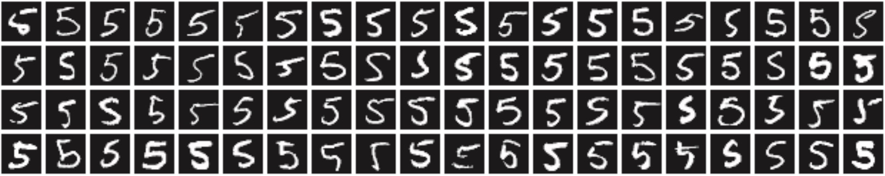

# 神经网络的学习

神经网络的学习就是从训练数据中自动获取最优权重参数的过程。

* 神经网络是一种参数学习算法，这些参数是从数据特征中提取出来的。
* 神经网络的学习过程以数据为驱动，则极力避免人为介入。

> [!note]
>
> 如何实现数字图片中“5”的识别

人可以简单地识别出5，但却很难明确说出是基于何种规律而识别出了5，有效的方法是通过数据来解决这个问题。

1. 基本方法：从图像中提取特征量，再用机器学习技术学习这些特征量的模式。

   * 图像中常用的特征，包括：SIFT、SURF 和 HOG等，这种特征可以把图像转换成向量。

   * 常用的机器学习分类器有，SVM、KNN等分类器进行学习。
   * 该方法的存在的问题是，图像转换为特征向量是由人提前设计好的。不同的问题，必须使用合适的特征，才能得到好的结果。

2. 神经网络方法：直接学习图像本身。
   * 特征仍是由人工设计的，但包含在神经网络中。
   * 特征和分类模型都是由机器学习而来。
   * 神经网络的优点是可以将数据作为原始输入，且对所有的问题都可以用同样的流程来解决。

> [!warning]
>
> 深度学习有时也称为端到端机器学习（end-to-end machine learning ）。这里所说的端到端是指从一端到另一端的意思，也就是从原始数据（输入）中获得目标结果（输出）的意思。

## 损失函数

任何机器学习的过程都是最优化目标函数，即最小化损失函数。深度学习中常用的损失函数是：均方误差和交叉熵误差。

### 均方误差

$$
E=\frac{1}{2}\sum_k\left(y_k-t_k\right)^2
$$

* $y_k$表示神经网络的输出。
* 

