# 反向传播法算法

神经网络训练中常用的方法是反向传播算法。

## 计算图

计算图将计算过程用图形表示出来，图包括：过多个节点和边相互连接。

> [!note]
>
> 例1：小明在超市买了2个100元一个的苹果，消费税是10%，请计算支付金额。

使用计算图表示上述问题

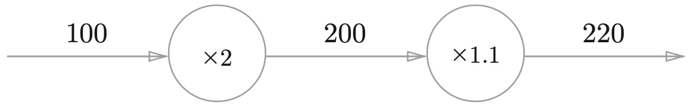

如果将运算表示为节点，数值作为边，上述计算图表示为

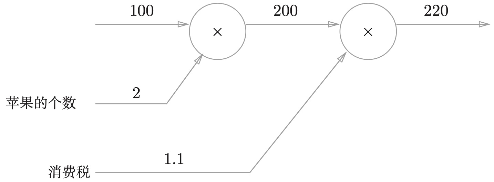

> [!note]
>
> 例2：小明在超市买了2个苹果、3个橘子。其中，苹果每个100元，橘子每个150元。消费税是10%，请计算支付金额。

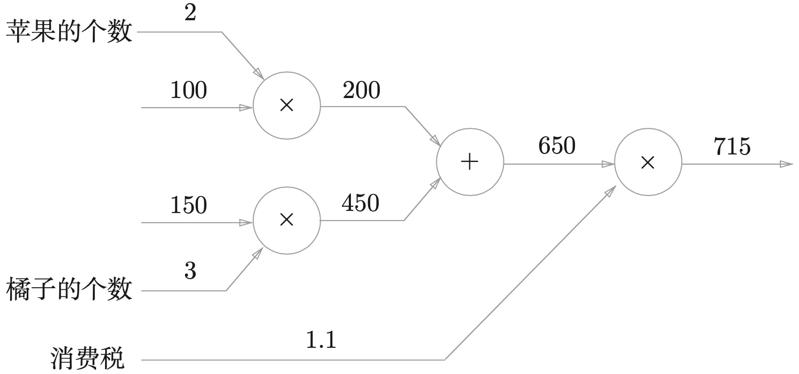

上述计算图中增加了加法节点“+”，用来合计苹果和橘子的金额。计算过程从左向右进行，最终得到计算结果，这一过程简称为正向传播 （forward propagation）。

计算图的特征是可以通过传递“局部计算”获得最终结果。局部计算是指，无论全局发生了什么，都能只根据与自己相关的信息输出接下来的结果。

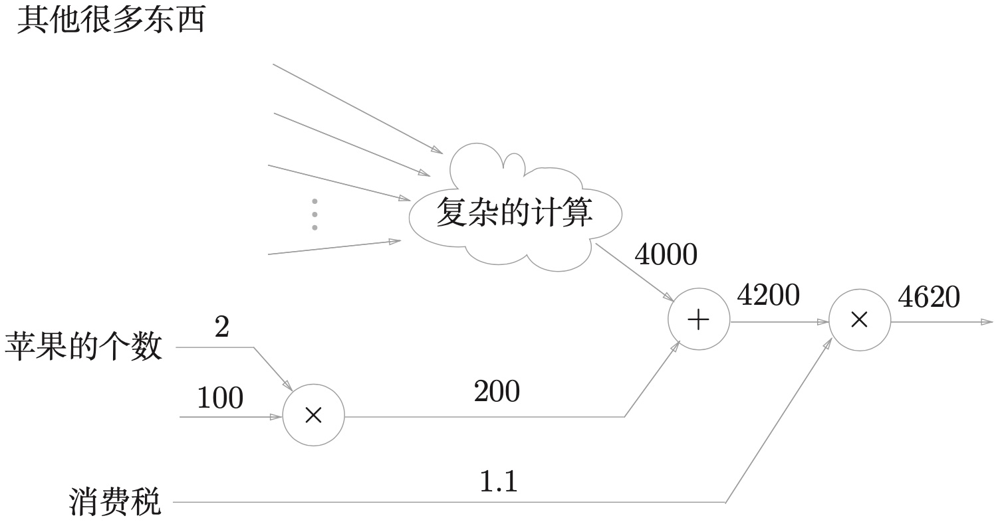

计算图可以通过反向传播高效计算导数。与正向计算相反的计算，称为反向传播，在上述例子中是从右向左计算。

> [!note]
>
> 例3：在例1中，计算支付金额关于苹果的价格的导数。

设苹果的价格为$x$，支付金额为$L$，则相当于求$\frac{\partial L}{\partial x}$。这个导数的值表示当苹果的价格稍微上涨时，支付金额会增加多少。

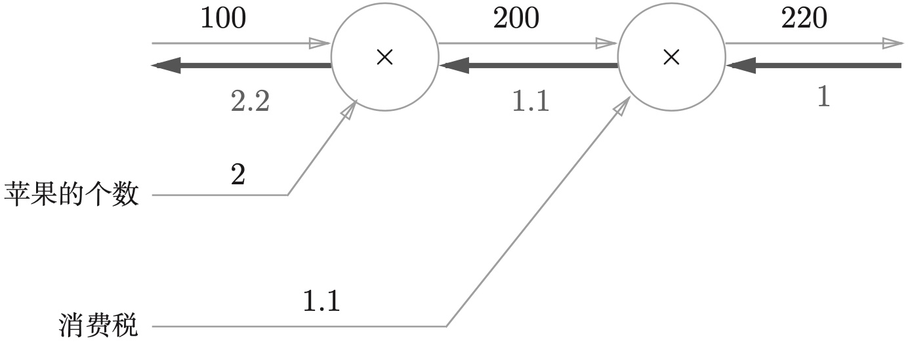

* 粗线表示反向传播的计算过程。
* 从左向右导数的计算是$1\rightarrow1.1\rightarrow2.2$。

$$
\frac{220}{200}\times1=1.1 \\ 
\frac{200}{100}\times1.1=2.2
$$

反向传播的结果表示，苹果的价格上涨1元，最终的支付金额会增加2.2元。
$$
100\times2\rightarrow200\times1.1\rightarrow220  \\
101\times2\rightarrow202\times1.1\rightarrow222.2 \\
222.2-220=2.2
$$
即苹果的价格增加某个微小值，则最终的支付金额将增加那个微小值的2.2倍。这里只求了关于苹果的价格的导数，关于“支付金额关于消费税的导数”与“支付金额关于苹果的个数的导数”也都可以用同样的方式算出来。

### 链式法则

反向传播求导的原理可以通过链式法则进行证明。假设存在函数$y=f(x)$。

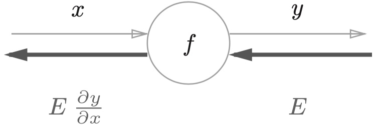

反向传播求导的计算顺序是，将信号$E$乘以节点的局部导数$\frac{\partial y}{\partial x}$，然后将结果传递给下一个节点。
$$
y=f(x)=x^2 \Rightarrow \frac{\partial y}{\partial x}=2x \Rightarrow 2xE
$$

> [!warning]
>
> 链式法则：如果某个函数由复合函数表示，则该复合函数的导数可以用构成复合函数的各个函数的导数的乘积表示。

### 链式法则和计算图

复合函数构成如下
$$
z=(x+y)^2\Rightarrow \left\{\begin{matrix}
z=t^2 \\
t=x+y
\end{matrix}\right.
$$
上述复合函数，链式求导法则的计算图为

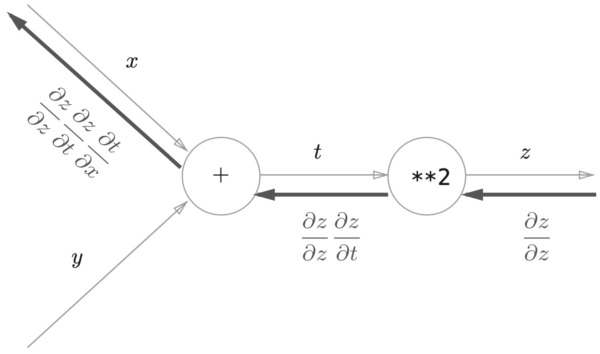

其中`**2`表示平方计算。将导数代入上图可以得到

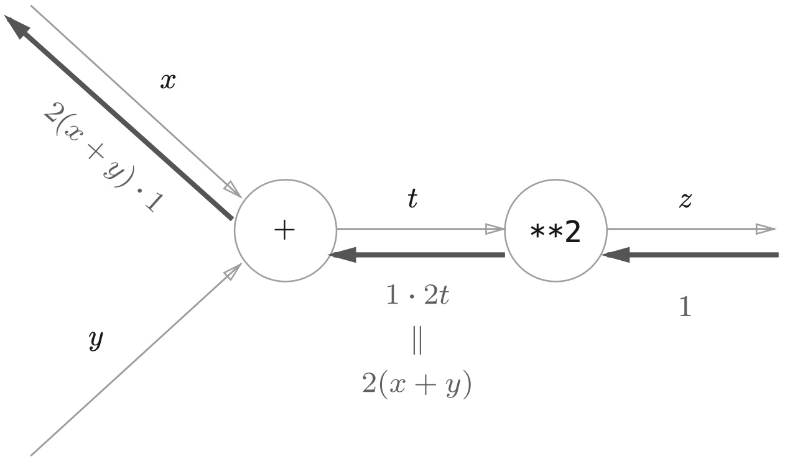

## 反向传播

### 加法的反向传播

函数$z=y+x$，其偏导数计算如下
$$
\frac{\partial z}{\partial x}=1 \qquad \frac{\partial z}{\partial y}=1
$$
其计算图为

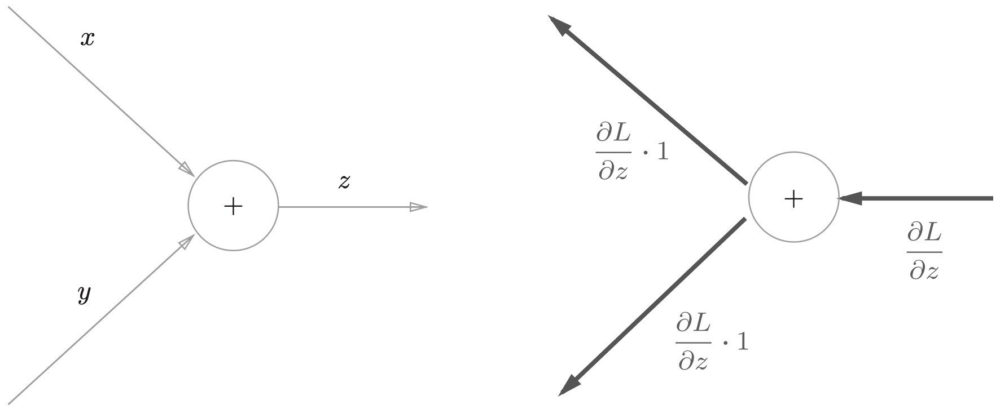

其中$\frac{\partial L}{\partial z}$表示上游的计算结果。假设有计算$10+5=15$，反向传播上游计算的结果为$1.3$，则有

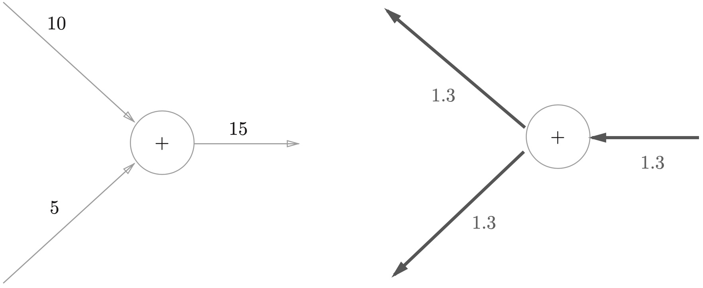

### 乘法的反向传播

函数$z=xy$，其偏导数计算如下
$$
\frac{\partial z}{\partial x}=y \qquad \frac{\partial z}{\partial y}=x
$$
其计算图为

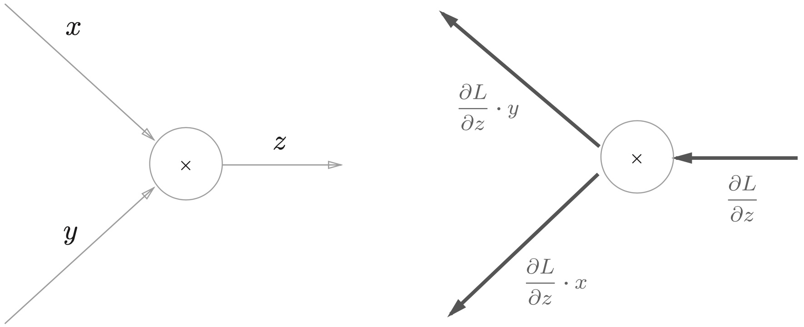

假设有计算$10\times5=50$，反向传播上游计算的结果为$1.3$，则有

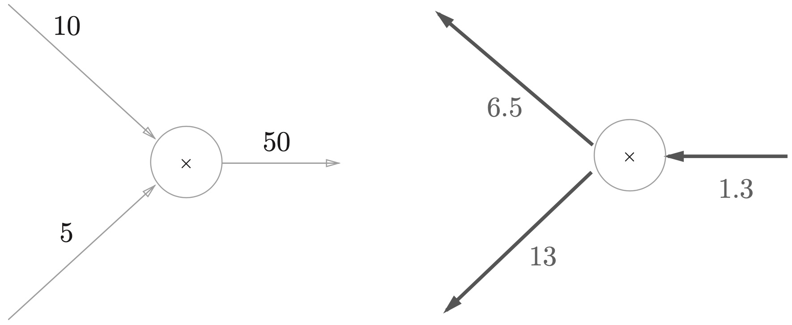

### 反向传播的实例

考虑例1中全部输入的反向传播

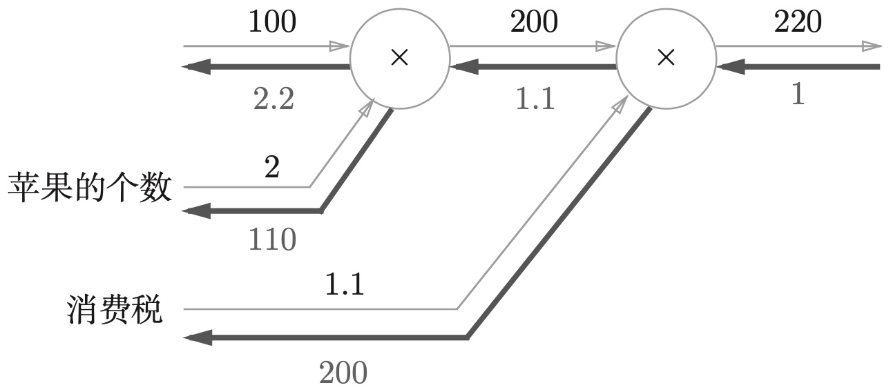

1. 苹果的价格的导数是2.2。
2. 苹果的个数的导数是110。
3. 消费税的导数是200。

这可以理解为，如果消费税和苹果的价格增加相同的值，则消费税将对最终价格产生200倍大小的影响，苹果的价格将产生2.2倍大小的影响。

> [!warning]
>
> 形成这样结果的原因是，中消费税和苹果的价格的量纲不同。

## 反向传播的实现

通常把构建神经网络的“层”设计为一个类。“层”表示为神经网络中功能的单位。比如：sigmoid函数计算、矩阵的乘积等，都以层为单位进行实现。

### 简单层的实现

1. 乘法层的实现

```python
class MulLayer:
    def __init__(self):
        self.x = None
        self.y = None

    def forward(self, x, y):
        self.x = x
        self.y = y
        out = x * y

        return out

    def backward(self, dout):
        dx = dout * self.y
        dy = dout * self.x

        return dx, dy
```

> [!warning]
>
> 正向传播的结果，保存在属性`x`和`y`中。只有先计算完成正向传播后，才能用反向传播求导。

使用前向传播计算例1

```python
#%%
apple = 100
apple_num = 2
tax = 1.1

mul_apple_layer = MulLayer()
mul_tax_layer = MulLayer()

apple_price = mul_apple_layer.forward(apple, apple_num)
price = mul_tax_layer.forward(apple_price, tax)

print(price)
```

使用反向传播计算例1的导数

```python
dprice = 1
dapple_price, dtax = mul_tax_layer.backward(dprice)
dapple, dapple_num = mul_apple_layer.backward(dapple_price)

print(dapple, dapple_num, dtax)
```

2. 加法层的实现

```python
class AddLayer:
    def __init__(self):
        pass

    def forward(self, x, y):
        out = x + y

        return out

    def backward(self, dout):
        dx = dout * 1
        dy = dout * 1

        return dx, dy
```

使用加法层计算例子2

```python
apple = 100
apple_num = 2
orange = 150
orange_num = 3
tax = 1.1

mul_apple_layer = MulLayer()
mul_orange_layer = MulLayer()
add_apple_orange_layer = AddLayer()
mul_tax_layer = MulLayer()

apple_price = mul_apple_layer.forward(apple, apple_num)
orange_price = mul_orange_layer.forward(orange, orange_num)
all_price = add_apple_orange_layer.forward(apple_price, orange_price)
price = mul_tax_layer.forward(all_price, tax)

dprice = 1
dall_price, dtax = mul_tax_layer.backward(dprice)
dapple_price, dorange_price = add_apple_orange_layer.backward(dall_price)
dorange, dorange_num = mul_orange_layer.backward(dorange_price)
dapple, dapple_num = mul_apple_layer.backward(dapple_price)

print(price)
print(dapple_num, dapple, dorange, dorange_num, dtax)
```

### 激活层的实现

1. relu激活函数。relu激活函数的公式如下

$$
y=\left\{\begin{matrix}
  x & x > 0\\
  0 & x \le 0
\end{matrix}\right.
$$

其偏导数为
$$
\frac{\partial y}{\partial x}=\left\{\begin{matrix}
  1 & x > 0\\
  0 & x \le 0
\end{matrix}\right.
$$

> [!warning]
>
> relu激活函数表示，如果正向传播时的x小于等于 0，则反向传播中传给下游的信号将停在此处。

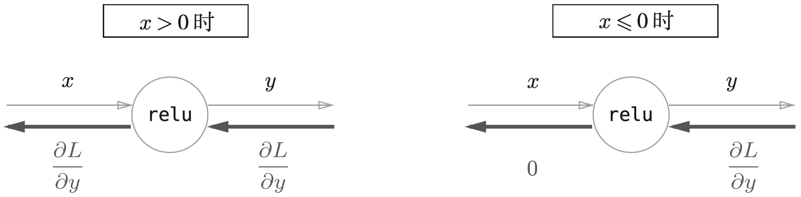

relu函数的实现

```python
class Relu:
    def __init__(self):
        self.mask = None

    def forward(self, x):
        self.mask = (x <= 0)
        out = x.copy()
        out[self.mask] = 0

        return out

    def backward(self, dout):
        dout[self.mask] = 0
        dx = dout

        return dx
```

2. sigmoid激活函数。sigmoid函数公式

$$
y=\frac{1}{1+e^{-x}}
$$

sigmoid函数的计算图

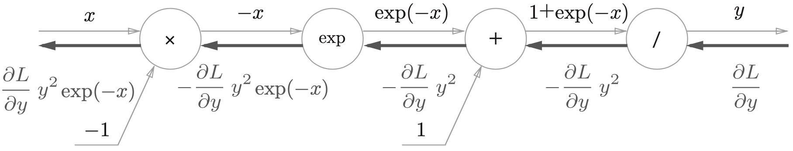

除法节点导数的计算
$$
y=\frac{1}{t} \Rightarrow \frac{\partial y}{\partial t}=-\frac{1}{t^2}=-y^2
$$
指数节点的导数
$$
z=e^{r}, r=-x \Rightarrow \frac{\partial z}{\partial r}=e^{r}, r=-x \Rightarrow z=e^{-x}
$$
所以sigmoid函数的反向传播结果
$$
\frac{\partial L}{\partial y} y^2e^{-x}=\frac{\partial L}{\partial y}\frac{e^{-x}}{(1+e^{-x})^2}e^{-x}=\frac{\partial L}{\partial y}\frac{e^{-x}}{1+e^{-x}}\frac{e^{-x}}{1+e^{-x}} =\frac{\partial L}{\partial y}y(1-y)
$$
所以sigmoid函数的计算图可以整体表示为

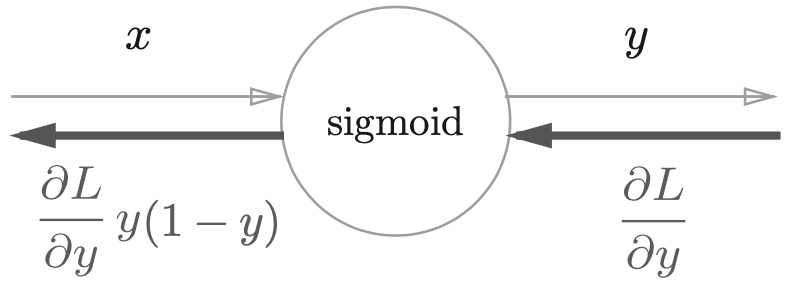

sigmoid函数的代码实现

```python
import numpy as np

class Sigmoid:
    def __init__(self):
        self.out = None

    def forward(self, x):
        out = 1 / (1 + np.exp(-x))
        self.out = out
        return out

    def backward(self, dout):
        dx = dout * (1.0 - self.out) * self.out
        return dx
```

正向传播的结果保存在属性`out`中。

### 全连接层的实现

全连接成通常称为Affine层其计算公式为
$$
Y=WX+B
$$
其中$Y$、$X$和$B$都表示矩阵。

假设有全连接层计算图为

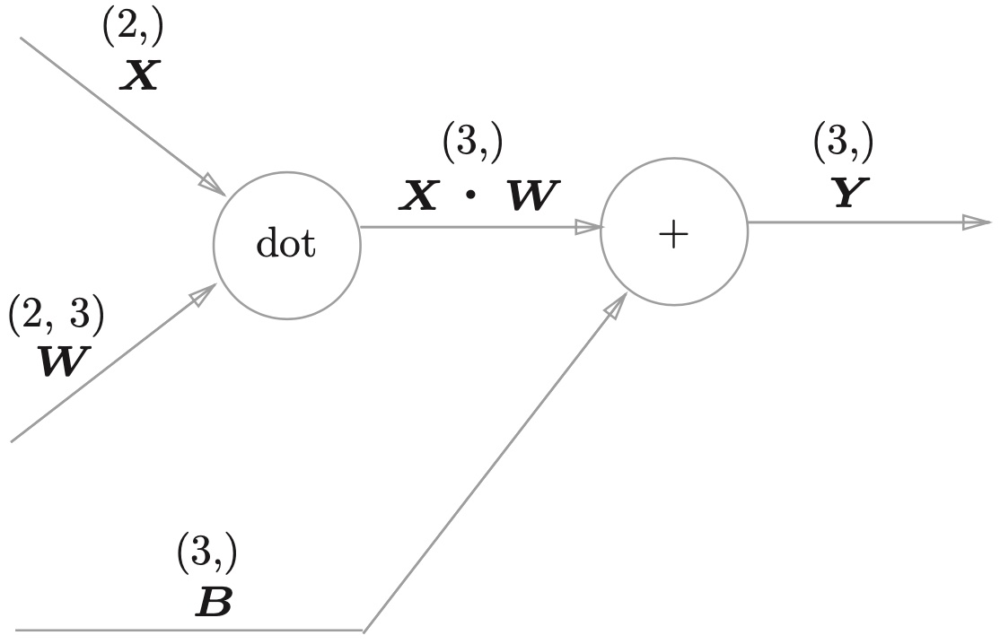

全连接层的反向传播计算为

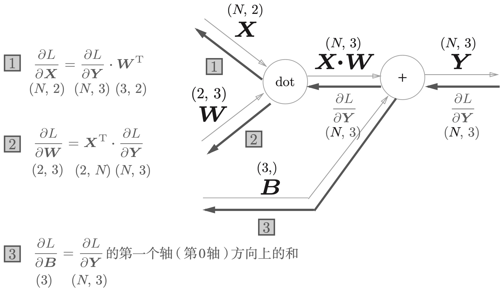

1. 输入层导数计算

$$
\frac{\partial Y}{\partial X}=W^T\Rightarrow\frac{\partial L}{\partial W}=\frac{\partial L}{\partial Y}W^T
$$

导数计算的结果应该保证与输入矩阵$X$一致。

2. 权重层导数计算

$$
\frac{\partial Y}{\partial W}=X^T\Rightarrow\frac{\partial L}{\partial W}=X^T\frac{\partial L}{\partial Y}
$$

导数计算的结果应该保证与权重矩阵$W$一致。

3. 偏置的导数计算。由于节点是加法节点，所有反向传播的导数与上一层输入一致为$\frac{\partial L}{\partial Y}$。但是偏置本身不是一个矩阵，而是一个向量，作用在输入矩阵的每一行。所以偏置的反向传播等于上一层导数在水平方向上求和。

   * 偏置$B$是一个共享参数，它对所有样本的输出都有贡献。

   * 在反向传播中，每个样本的梯度都会对偏置的梯度产生影响。

   * 因此，需要将所有样本的梯度相加，得到偏置的最终梯度。

```python
class Affine:
    def __init__(self, W, b):
        self.W = W
        self.b = b
        self.x = None
        self.dW = None
        self.db = None

    def forward(self, x):
        self.x = x
        out = np.dot(x, self.W) + self.b
        return out

    def backward(self, dout):
        dx = np.dot(dout, self.W.T)
        self.dW = np.dot(self.x.T, dout)
        self.db = np.sum(dout, axis=0)
        return dx
```

