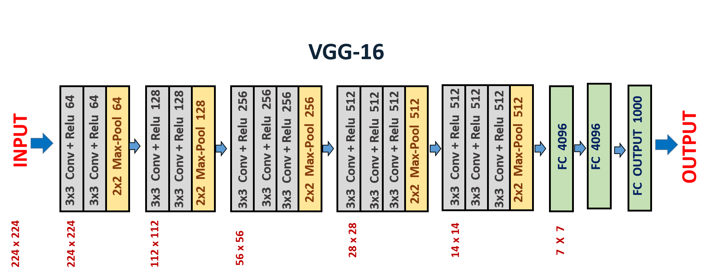
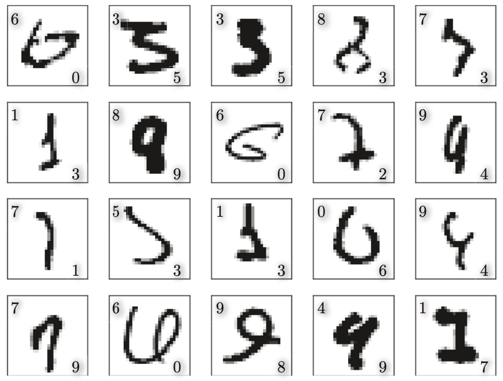
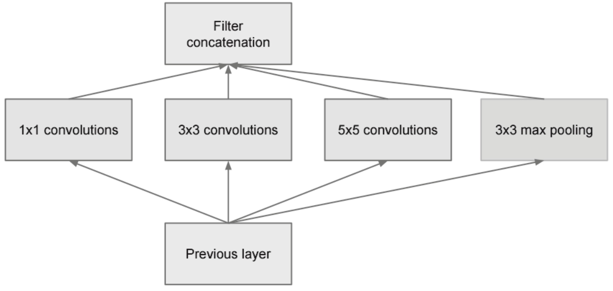
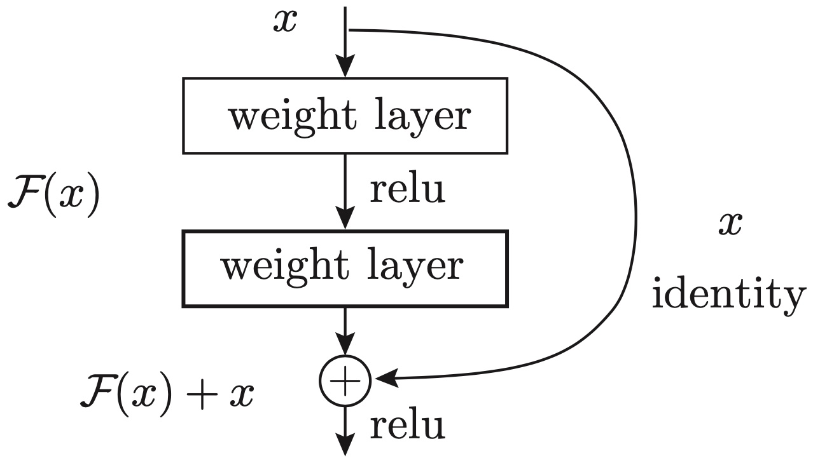

# 深度学习

深度学习就是神经网络加深了网络层。基于之前介绍的网络，只需通过叠加层，就可以创建深度网络。深度学习只是机器学习的一种工具。

> [!warning]
>
> 只有感性认识，理论支持较弱。

深度学习就是寻找一个合适的网络组合，达到非常好的分类效果。

> [!warning]
>
> 层数越多模型越复杂，容易过拟合。在满足任务的条件下层数越少越好。

## 加深网络

### VGG网络

VGG-16网络结构图如下

VGG-16网络结构的特点

1. AlexNet网络有8层，而VGG16网络达到16层 。
2. VGGNet全部使用3x3的小卷积核，通过堆叠多个卷积层来增大感受野。AlexNet使用较大的卷积核，如第一个卷积层使用11x11的卷积核，后续层使用5x5和3x3的卷积核。
3. 参数数量控制， 虽然网络更深，但通过使用小卷积核控制了参数数量。
4. 使用ReLU激活函数，但去除了LRN层。
5. 训练模型时使用了Dropout优化。
6. 基于Adam的最优化。
7. 使用He初始值作为权重初始值。

基于VGG-16的手写数字识别准确率可以达到99.38%，下图显示了识别错误的结果

各个图像的左上角显示了正确解标签，右下角显示了本网络的推理结果。即使人类识别这些数字也可能会犯错误。

### 加深网络的意义

[图像分类的算法比较](https://rodrigob.github.io/are_we_there_yet/build/classification_datasets_results.html) 从总体的趋势看，随着网络深度的增加，网络的性能不断提升。但加深层的重要性，现状是理论研究还不够透彻，相关理论还比较贫乏。可以从定性分析中大概阐述加深网络的好处。

1. 叠加小型滤波器来加深网络的好处是可以减少参数的数量，扩大感受野。
2. 通过叠加层，将 ReLU 等激活函数夹在卷积层的中间，进一步提高了网络的表现力。通过非线性函数的叠加，可以表现更加复杂的东西。
3. 通过加深网络，就可以分层次地分解需要学习的问题。可以将各层要学习的问题分解成容易解决的简单问题，从而可以进行高效的学习。在前面的卷积层中，神经元会对边缘等简单的形状有响应，随着层的加深，开始对纹理、物体部件等更加复杂的东西有响应。

### 网络的深度与广度

神经网络设计的两个方向

1. 设计更多的隐层。
2. 每一层设计更多的神经元。理论上可以证明当神经元N足够多的时候，使用sigmoid函数激活，一层的神经元可以拟合任何函数。

深度学习中单纯增加网络深度，会出现梯度消失问题。所以GoogLeNet的特征是，网络不仅在纵向上有深度，在横向上也有广度。其中，拓展广度使用了Inception结构

与此相对于ResNet着重在加深网络层数，通过引入跳连接结构，降低训练过程中的梯度消失问题

经典的ResNet最高可以达到152层。在ILSVRC大赛中，ResNet 的错误识别率为 3.5%。

> [!warning]
>
> 从实践结果来看，加深网络结构比加宽网络结构更有效。

## 学习的高速化

1. 基于GPU的高速化。深度学习中需要进行大量的乘积累加运算，使用GPU进行深度学习的运算可以加速训练过程。
2. 分布式学习。可以考虑在多个GPU或者多台机器上进行分布式计算。
3. 运算精度的位数缩减。计算机中为了表示实数，主要使用64位或者32位的浮点数。但在深度学习中并不那么高的精度，即便是16位的半精度浮点数（half float），也可以顺利地进行学习。

## 机器学习框架

| 框架                                               | 优点                                                         | 缺点                                                         | GitHub Stars | 公司     |
| -------------------------------------------------- | ------------------------------------------------------------ | ------------------------------------------------------------ | ------------ | -------- |
| [Caffe](https://caffe.berkeleyvision.org/)         | \- 简单易用的接口                                            | \- 功能相对较为有限                                          | 约 33k       | Facebook |
| [TensorFlow](https://www.tensorflow.org/?hl=zh-cn) | - 强大的生态系统和支持 - 良好的文档和社区支持 - 支持灵活的部署（包括移动端和嵌入式设备） | - 相对较复杂，学习曲线较陡峭 - 部分功能可能不够直观       | 约 160k      | Google   |
| [PyTorch](https://pytorch.org/)                    | - 动态图模式更直观，易于调试 - 灵活性高，易于定制 - 易于在GPU上进行加速计算 | - 相对TensorFlow较新，生态系统可能不及其成熟 - 文档相对不够完善 | 约 66k       | Facebook |
| [Keras](https://keras.io/)                         | - 高度模块化，易于使用 - 抽象层次较高，适合快速原型设计 - 与多个后端兼容（如TensorFlow、Theano等） | - 灵活性相对较差，不够适合定制 - 性能可能略逊于TensorFlow和PyTorch | 约 52k       | Google   |
| [PaddlePaddle](https://www.paddlepaddle.org.cn/)   | - 易用性高，提供了易于上手的高级API和简单直观的编程接口 - 灵活性高，支持静态图和动态图两种模式 | - 生态系统相对较小，社区资源和第三方工具相对较少 - 文档和教程相对不足 - 国际化程度有限 | 约 23k       | Baidu    |

