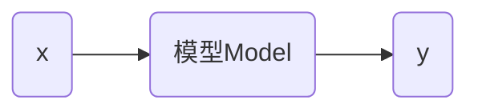

# 线性回归

线性回归的意义


回归这个概念最早是由英国生物学家兼统计学家弗朗西斯·高尔顿（Francis Galton）提出的，意思是回归平均值（regression toward the mean）。高尔顿的学生卡尔・皮尔逊（Karl Pearson）将这一概念延伸到统计学。机器学习中借鉴了统计学的回归概念，产生了回归分析。


## 简单线性回归

汽车销量和汽车价格成线性关系。寻找一条直线，最大程度的拟合样本特征和监督数据之间的关系。

* 样本特征是汽车价格
* 监督数据是汽车销量


> [!warning]
>
> 在上面例子中x轴价格是特征，y轴是监督数据。与KNN问题不同，KNN问题中x，y轴都表示特征。

 **线性回归（linear regression）**：是一种统计分析方法，用于预测一个因变量的值，基于一个或多个自变量的值。它假设因变量和自变量之间存在线性关系。系数是需要通过数据拟合来确定的。

* 回归问题是预测一个具体的数值，数值是在连续的空间里。
* 对于样本特征只有一个的回归问题，称为简单线性回归。通过研究简单线性回归，可以理解线性回归的特性，从而推广到更高维度。

在二维平面中找到一条直线最大程度去拟合样本的分布，可以表示为数学公式：
$$
y=ax+b
$$
对于每一个样本点$x^{(i)}$，根据直线方程可以得到预测值
$$
\hat{y}^{(i)} = ax^{(i)}+b
$$

同时也存在着一个监督值$y^{(i)}$，在预测直线时，希望$y^{(i)}$和$\hat{y}^{(i)}$的差距尽量小，可以表示为
$$
y^{(i)}-\hat{y}^{(i)}
$$
但是差值有可能为正，也有可能能为负，所以可以使用
$$
\left | y^{(i)}-\hat{y}^{(i)} \right |
$$
由于上式不是一个处处可到的函数，在求极值时存在问题。所以可以使用
$$
\left ( y^{(i)}-\hat{y}^{(i)} \right )^2
$$
考虑到所有样本
$$
\sum_{i=1}^m \left ( y^{(i)}-\hat{y}^{(i)} \right )^2
$$
最佳拟合的目标就是使上式尽可能小，上式可以转化为
$$
\sum_{i=1}^m \left ( y^{(i)}-ax^{(i)}-b \right )^2 \tag{1}
$$
在上式中，$a$和$b$是未知数，$ y^{(i)}$和$x^{(i)}$​是已知数。

> [!warning]
>
> 将上述问题，转化为一个求最小值问题，是典型的机器学习算法的思考方式。

函数 $(1)$ 称为**损失函数（loss function）**，用于度量模型**没有拟合**样本的程度（预测结果与实际结果之间差异）。如果目是度量样本**拟合**样本的程度，称为**效用函数（utility function）**。两者统称为**目标函数**。

机器学习的任务就是最优化这个目标函数，损失函数值越小越好，效用函数值越大越好。最终，得到一个机器学习模型。几乎所有**参数学习**的方法，都遵循上面的思路

* 参数学习：假设模型拥有固定数量参数的学习方法。
* 非参数学习：参数数量随着数据规模的增长，而变化的学习方法。KNN属于非参数学习。

函数 $(1)$ 是典型的最小二乘法问题（最小化平方误差）。求函数 $(1)$ 的最小值可以转化为就函数的极值，而极值存在的点是导数等于0的点。最终可以解得
$$
a = \frac{\sum_{i=1}^{m}\left ( x^{(i)}- \bar x \right)\left ( y^{(i)}- \bar y \right)}{\sum_{i=1}^{m}\left ( x^{(i)}- \bar x \right)^2} \qquad
b=\bar y - a \bar x
$$

> [!note]
>
> 为什么要使用线性模型来拟合已有的值？

这里的直线$y=ax+b$就可以理解为模型



### 简单线性回归的实现

有汽车销售数据，其中`x`是价格（单位：万元），`y`是汽车销量（单位：千量）

```python
import matplotlib.pyplot as plt

x = [9, 9.23, 9.41, 9.68, 9.98, 10.20, 10.58, 10.68, 10.88, 10.98, 11.28, 11.38, 11.56, 11.88, 12.00]
y = [12.23, 11.7, 10.21, 9.60, 8.72, 7.70, 7.10, 6.61, 6.10, 5.82, 5.50, 5.23, 4.65, 4.20, 3.50]

plt.figure(figsize=(10, 8))
plt.scatter(x, y, s=120)
plt.xticks(fontsize=16)
plt.yticks(fontsize=16)
plt.show()
```

根据公式可以求出$a$和$b$的值。

```python
x_mean = np.mean(x)
y_mean = np.mean(y)

num = 0.0
d = 0.0

for x_i, y_i in zip(x, y):
    num += (x_i - x_mean) * (y_i - y_mean)
    d += (x_i - x_mean) ** 2
    
a = num / d
b = y_mean - a * x_mean

print(f'a = {a}, b = {b}')
```

根据$a$和$b$的值可以绘制估计曲线

```python
y_hat = a * x + b

plt.figure(figsize=(10, 8))
plt.scatter(x, y, s=120)
plt.plot(x, y_hat, color='r', linewidth=3)
plt.xticks(fontsize=16)
plt.yticks(fontsize=16)
plt.show()
```

可以得到的模型来预测未知值

```python
x_predict = 8
y_predict = a * x_predict + b
print(y_predict)
```

可以将上面的算法过程封装层一个类

```python
class SimpleLinearRegression:
    def __init__(self):
        self.a_ = None
        self.b_ = None
        
    def fit(self, x_train, y_train):
        assert x_train.ndim == 1, 'Simple Linear Regression can only solve single feature training data.'
        assert len(x_train) == len(y_train), 'The size of x_train must be equal to the size of y_train.'
        
        x_mean = np.mean(x_train)
        y_mean = np.mean(y_train)
        
        num = 0.0
        d = 0.0
        
        for x_i, y_i in zip(x_train, y_train):
            num += (x_i - x_mean) * (y_i - y_mean)
            d += (x_i - x_mean) ** 2
        
        self.a_ = num / d
        self.b_ = y_mean - self.a_ * x_mean
        
        return self
    
    def predict(self, x_predict):
        assert x_predict.ndim == 1, 'Simple Linear Regression can only solve single feature training data.'
        assert self.a_ is not None and self.b_ is not None, 'Must fit before predict.'
        
        return np.array([self._predict(x) for x in x_predict])
    
    def _predict(self, x_single):
        return self.a_ * x_single + self.b_
```

使用自己定义的算法类

```py
reg = SimpleLinearRegression()
reg.fit(x, y)
print(f'a = {reg.a_}, b = {reg.b_}')
print(reg.predict(np.array([x_predict])))
```

### 向量化计算

计算参数$a$和$b$的值，主要依据的公式是
$$
a = \frac{\sum_{i=1}^{m}\left ( x^{(i)}- \bar x \right)\left ( y^{(i)}- \bar y \right)}{\sum_{i=1}^{m}\left ( x^{(i)}- \bar x \right)^2} \qquad \tag{2}
$$
考虑如下的公式
$$
\sum_{i=1}^{m} w^{(i)} v^{(i)} \tag{3}
$$
其中
$$
\begin{cases}
w = \left( w^{(1)}, w^{(2)},……, w^{(m)}\right) \\
v = \left( v^{(1)}, v^{(2)},……, v^{(m)}\right)
\end{cases}
$$
所以公式 $(3)$ 可以表示文
$$
w \cdot v
$$
所以公式 $(2)$ 可以使用numpy中的向量化计算，而不是用循环来实现。

```python
class SimpleLinearRegressionPro:
    def __init__(self):
        self.a_ = None
        self.b_ = None
        
    def fit(self, x_train, y_train):
        assert x_train.ndim == 1, 'Simple Linear Regression can only solve single feature training data.'
        assert len(x_train) == len(y_train), 'The size of x_train must be equal to the size of y_train.'
        
        x_mean = np.mean(x_train)
        y_mean = np.mean(y_train)
        
        num = (x_train - x_mean).dot(y_train - y_mean)
        d = (x_train - x_mean).dot(x_train - x_mean)
        
        self.a_ = num / d
        self.b_ = y_mean - self.a_ * x_mean
        
        return self
    
    def predict(self, x_predict):
        assert x_predict.ndim == 1, 'Simple Linear Regression can only solve single feature training data.'
        assert self.a_ is not None and self.b_ is not None, 'Must fit before predict.'
        
        return np.array([self._predict(x) for x in x_predict])
    
    def _predict(self, x_single):
        return self.a_ * x_single + self.b_
    
    
reg_pro = SimpleLinearRegressionPro()
reg_pro.fit(x, y)
print(f'a = {reg_pro.a_}, b = {reg_pro.b_}')
```

可以分别测试一下算法的性能

```python
m = 100000
big_x = np.random.random(size=m)
big_y = big_x * 2.0 + 3.0 + np.random.normal(size=m)
%time reg.fit(big_x, big_y)
%time reg_pro.fit(big_x, big_y)
```

根据拟合结果，观察拟合的参数

```python
print(f'a = {reg.a_}, b = {reg.b_}')
print(f'a = {reg_pro.a_}, b = {reg_pro.b_}')
```

## 多元线性回归

在真实世界中描述一个样本，会有很多的特征值，对于这样的问题也可以使用线性回归的方法来解决，这就是多元线性回归。


当样本点由多个特征表示时
$$
X^{(i)}= \left( X_1^{(i)}, X_2^{(i)},……,X_n^{(i)} \right)
$$
多元线性回归公式可以表示为
$$
y=w_0+w_1x_1+w_2x_2+……+w_nx_n
$$
在简单线性回归中$b$等价于$w_0$，$a$等价于$w_1$。如何可以学习出响应的参数，对于样本$i$可以求出预测值
$$
\hat{y}^{(i)} =w_0+w_1X_1^{(i)}+w_2X_2^{(i)}+……+w_nX_n^{(i)} \tag{5}
$$
上式中同样可以使用目标函数
$$
\sum_{i=1}^m \left ( y^{(i)}-\hat{y}^{(i)} \right )^2 \tag{6}
$$
所以，多元线性回归就是找到使上面的目标函数最小的一组$(w_0, w_1, ……, w_n)$​。定义
$$
w=\left(w_0, w_1, ……, w_n\right)^T
$$
将公式 $(5)$ 转化为
$$
\hat{y}^{(i)} =w_0X_0^{(i)}+w_1X_1^{(i)}+w_2X_2^{(i)}+……+w_nX_n^{(i)} \tag{7}
$$
其中$X_0^{(i)}\equiv 1 $，可以得到
$$
X^{(i)}_b= \left( X_0^{(i)}, X_1^{(i)}, X_2^{(i)},……,X_n^{(i)} \right)
$$
公式 $(7)$ 可以表示为
$$
\hat{y}^{(i)} =X^{(i)}_b \cdot w
$$
即计算两个向量的内积，得到一个数。对于所有的样本数据存在
$$
X_b=
\begin{pmatrix}
1 & X_1^{(1)} & X_2^{(1)} & \cdots & X_n^{(1)} \\
1 & X_1^{(2)} & X_2^{(2)} & \cdots & X_n^{(2)} \\
\vdots & \vdots & \vdots & \ddots & \vdots \\
1 & X_1^{(m)} & X_2^{(m)} & \cdots & X_n^{(m)} \\
\end{pmatrix}
$$
同时$w$可以表示为
$$
w = 
\begin{pmatrix}
w_0 \\
w_1 \\
… \\
w_n
\end{pmatrix} \tag{8}
$$
在公式 $(8)$中$w_0$称为截距（intercept），$\left(w_1, ……, w_n\right)^T$称为系数（coefficient），系数在一定程度上反应了特征的重要性，而截距没有这一特征。预测值的计算可以表示为矩阵运算
$$
\hat{y}=X_b \cdot w
$$
公式 $(6)$ 目标函数可以表示为
$$
\left ( y- X_b \cdot w \right )^T\left ( y- X_b \cdot w \right )
$$
使得上述公式最小的$w$可以表示为
$$
w=\left ( X_b^T X_b \right )^{-1}X_b^Ty
$$
上述公式称为多元线性回归的正规方程解（Normal Equation），但是上述结果求解的时间复杂度为$O(n^3)$（优化后可达到$O(n^{2.4})$）。

[糖尿病数据集](https://scikit-learn.org/stable/datasets/toy_dataset.html#diabetes-dataset)是sklearn中进行，回归实验的数据集，包含：年龄、性别、平均血压等10个特征。需要估计的是一年疾病进展的定量测量。

```python
from sklearn import datasets
diabetes = datasets.load_diabetes(scaled=False)
print(diabetes.DESCR)
```

`scaled=False`表示数据不需要归一化。

```python
x = diabetes.data
y = diabetes.target

print(x[:5])
print(y[:5])
```

将数据划分为训练集和测试集

```python
from sklearn.model_selection import train_test_split

x_train, x_test, y_train, y_test = train_test_split(x, y, test_size=0.2, random_state=42)
print(x_train.shape)
print(x_test.shape)
```

在sklearn中使用多元线性回归

```python
from sklearn.linear_model import LinearRegression 

lin_reg = LinearRegression()
lin_reg.fit(x_train, y_train)
print(lin_reg.intercept_)
print(lin_reg.coef_)
```

`LinearRegression`默认通过正规方程求解，适合中小规模数据集。

## 评价指标

> [!note]
>
> 如何评价回归算法的性能？

线性回归算法的目标就是找$a$和$b$的值，使函数 $(1)$ 尽可能小。在回归算法中，也需要将原始数据集分为**训练数据集**和**测试数据集**两部分。在训练过程中使函数 $(1)$ 尽可能小，是针对训练数据集来说，所以可以表示为：
$$
\sum_{i=1}^m \left ( y^{(i)}_{train}-\hat{y}^{(i)}_{train} \right )^2
$$
根据拟合出$a$和$b$​的值，可以计算出测试数据集：
$$
\hat{y}^{(i)}_{test} = ax^{(i)}_{test}+b
$$
所以可以根据
$$
\sum_{i=1}^m \left ( y^{(i)}_{test}-\hat{y}^{(i)}_{test} \right )^2
$$
的结果，作为衡量算法性能的标准，但是上述结果与数据量（$m$值）相关。所以可以使用如下公式作为衡量标准
$$
\text{MSE}_{test}=\frac{1}{m}\sum_{i=1}^m \left ( y^{(i)}_{test}-\hat{y}^{(i)}_{test} \right )^2
$$
其中MSE（Mean Squared Error）是均方误差。MSE 的值**只有相对意义，没有绝对意义**。只是用例比较同一数据类型间的关系。以MSE作为标准，误差的量纲会发生变化，所以开方可以得到
$$
\text{RMSE}_{test}=\sqrt{\text{MSE}_{test}}=\sqrt{\frac{1}{m}\sum_{i=1}^m \left ( y^{(i)}_{test}-\hat{y}^{(i)}_{test} \right )^2}
$$
上式的评价标准称为均方根误差（Root Mean Square Error）。对于回归算法还可以采用如下公式
$$
\text{MAE}_{test}=\frac{1}{m}\sum_{i=1}^m \left | y^{(i)}_{test}-\hat{y}^{(i)}_{test} \right |
$$
作为评价标，其中MAE（Mean Absolute Error）平均绝对误差。

> [!warning]
>
> 在机器学习算法中，目标函数和评价标准的函数可完全不一致。

sklearn中MSE、RMSE和MAE的计算

```python
from sklearn.metrics import mean_squared_error, root_mean_squared_error, mean_absolute_error

y_predict = reg.predict(x_test)
mse = mean_squared_error(y_test, y_predict)
print(mse)
rmse = root_mean_squared_error(y_test, y_predict)
print(rmse)
mae = mean_absolute_error(y_test, y_predict)
print(mae)
```

> [!note]
>
> 为什么RMSE的值要大于MAE，这两个评价标准哪个更有价值。

### 判定系数

考虑到不同任务中，MSE和MAE的波动浮动不同，需要找到一个评价标准可以绝对意义上表示算法的优劣程度。判定系数（Coefficient of Determination）计算公式如下。
$$
R^2=1-\frac{SS_{residual}}{SS_{total}}=1-\frac{\sum_{i=1}^m \left ( \hat{y}^{(i)} -y^{(i)} \right )^2}{\sum_{i=1}^m \left ( \bar{y} -y^{(i)} \right )^2} \tag{4}
$$
公式 $(4)$ 中，分子表示模型预测的偏差，分母表示真实值与均值的偏差，**这个值可以理解为基准模型**，所以上式可以理解为模型拟合的一些结果，即没有产生错误的指标。公式 $(4)$ 还可以表示为
$$
1R^2=1-\frac{ \frac{1}{m} \sum_{i=1}^m \left ( \hat{y}^{(i)} -y^{(i)} \right )^2}{\frac{1}{m}\sum_{i=1}^m \left ( y^{(i)} -\bar{y} \right )^2}=1-\frac{\text{MSE}}{\text{Var}}
$$

* $R^2 \le 1$​
* $R^2$越大越好。当预测全部正确时，$R^2=1$取得最大值。
* $R^2=0$说明模型等于基准模型。
* $R^2 \le 0$​​说明模型还不如基准模型，很可能数据不存在任何线性关系。


```python
print(1 - mean_squared_error(y_test, y_predict) / np.var(y_test))
```

sklearn中$R^2$的计算

```python
from sklearn.metrics import r2_score

print(r2_score(y_test, y_predict))
print(lin_reg.score(x_test, y_test))
```

## 关于线性回归

线性回归假设，数据和结果之间存在线性关系，这种线性关系包括正相关和负相关。在高维空间中线性相关，不能简单的理解为平面中的直线。使用全部数据进行预测

```python
lin_reg.fit(x, y)
print(lin_reg.intercept_)
print(lin_reg.coef_)
```

从`coef_`的结果可以看出$w_i$​有正有负，正数表示预测结果与特征正相关，负数表示特征与预测结果负相关。将特征**由小到大排序**。

```python
index = np.argsort(lin_reg.coef_)
names = np.array(diabetes.feature_names)

print(index)
print(names[np.argsort(index)])
```

> [!warning]
>
> 线性回归具有强可解释性。

线性回归的模型可以表示为
$$
y=w^Tx
$$
其中$w$由公式 $(8)$ 表示。

