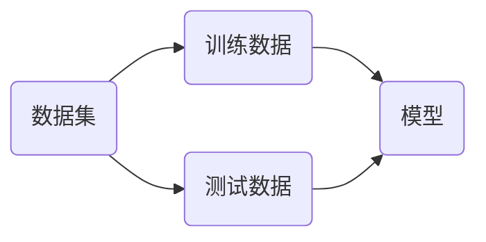

# 多项式回归与模型泛化

使用线性回归去拟合样本数据，要数据存在一定线性关系的。但现实情况是，大多数的样本数据都没有明显的线性关系，所以需要模型可以处理非线性数据。

## 多项式回归

在线性回归中，使用一条直线来拟合数据。


线性模型为
$$
y=ax+b
$$
假设数据分布情况如下


如果要更好的拟合上图中的数据，则需要选择一条曲线，模型为
$$
y = ax^2+bx+c
$$
如果将$x^2$看做特征$x_1$，$x$看做特征$x_2$，则上述模型可以表示为
$$
y=ax_1+bx_2+c
$$

> [!warning]
>
> 低维的非线性模型，在高维特征空间中，可以表示为线性模型。

生成二维曲线的模拟数据

```python
import numpy as np
import matplotlib.pyplot as plt

np.random.seed(42)
x = np.random.uniform(-3, 3, size=100)
X = x.reshape(-1, 1)
y = 0.5 * x**2 + x + 2 + np.random.normal(0, 1, 100)

plt.figure(figsize=(10, 8))
plt.scatter(x, y, s=120)
plt.xticks(fontsize=16)
plt.yticks(fontsize=16)
plt.show()
```

使用线性模型来拟合上面的曲线有

```python
from sklearn.linear_model import LinearRegression

lin_reg = LinearRegression()
lin_reg.fit(X, y)
y_predict = lin_reg.predict(X)
plt.scatter(x, y)
plt.plot(x, y_predict, color='r')
plt.show()
```

将$x^2$看做特征$x_1$，$x$看做特征$x_2$，使用二维特征来预测线性模型，绘制结果曲线

```python
print((X ** 2).shape)
X2 = np.hstack([X, X ** 2])
print(X2.shape)
lin_reg2 = LinearRegression()
lin_reg2.fit(X2, y)
y_predict2 = lin_reg2.predict(X2)

plt.figure(figsize=(10, 8))
plt.scatter(x, y, s=120)
plt.plot(np.sort(x), y_predict2[np.argsort(x)], color='r', linewidth=3)
plt.xticks(fontsize=16)
plt.yticks(fontsize=16)
plt.show()
```

打印模型参数

```python
print(lin_reg2.coef_)
print(lin_reg2.intercept_)
```

根据麦克劳林公式（Maclaurin Series）有，麦克劳林公式是泰勒公式的特例
$$
f(x)=f(0)+{f(0)}'x+\frac{{f(0)}'' }{2!}x^2+…+\frac{f^{(n)}(0)}{n!}x^n+R_n(X)
$$
在多项式回归中上式可以表示为
$$
y=w_1x+w_2x^2+w_3x^3+…+w_nx^n+w_0
$$
通过机器学习的方式，可以学习出参数$(w_1, w_2, w_3, …, w_n)$。

> [!warning]
>
> 理论上任何形式的函数，都可以通过多项式回归来模拟。

### sklearn中多项式回归

sklearn中多项式回归模型就是对线性模型数据进行预处理，然后使用线模型训练数据。使用`PolynomialFeatures`对数据进行升维。

```python
from sklearn.preprocessing import PolynomialFeatures

poly = PolynomialFeatures(degree=2)
poly.fit(X)
X2 = poly.transform(X)
print(X2.shape)
print(X2[:2, :])
print(X[:2, :])
```

使用线性模型拟合上述特征

```python
lin_reg2 = LinearRegression()
lin_reg2.fit(X2, y)
y_predict2 = lin_reg2.predict(X2)

plt.figure(figsize=(10, 8))
plt.scatter(x, y, s=120)
plt.plot(np.sort(x), y_predict2[np.argsort(x)], color='r', linewidth=3)
plt.xticks(fontsize=16)
plt.yticks(fontsize=16)
plt.show()
```

构造一个简单的样本二维样本数据

```python
X = np.arange(1, 7).reshape(-1, 2)
print(X.shape)
print(X)
```

对上述数据进行升维得到

```python
poly = PolynomialFeatures(degree=2)
poly.fit(X)
X2 = poly.transform(X)
print(X2.shape)
print(X2)
```

当`degree=3`时，特征计算如下
$$
x_1, \quad  x_2 \Rightarrow \begin{matrix}
1, \quad x_1, \quad x_2 \\
x_1^2, \quad x_2^2, \quad x_1x_2 \\
x_1^3, \quad x_2^3, \quad x_1^2x_2 \quad x_1x_2^2 \\
\end{matrix}
$$

改变`degree`参数后，转换后的特征，会成指数级增长，它会尽可能列出所有多项式，丰富样本数据。

### Pipeline

sklearn中的`Pipeline`工具，可以将若干步骤打包成一个对象（相当于制作一个流程模板），对于不同的样本数据只需用`Pipeline`统一处理。

```python
from sklearn.pipeline import Pipeline
from sklearn.preprocessing import StandardScaler

np.random.seed(42)
x = np.random.uniform(-3, 3, size=100)
X = x.reshape(-1, 1)
y = 0.5 * x ** 2 + x + 2 + np.random.normal(0, 1, 100)

poly_reg = Pipeline([
    ('poly', PolynomialFeatures(degree=2)),
    ('std_scaler', StandardScaler()),
    ('lin_reg', LinearRegression())
])

poly_reg.fit(X, y)
y_predict2 = poly_reg.predict(X)

plt.figure(figsize=(10, 8))
plt.scatter(x, y, s=120)
plt.plot(np.sort(x), y_predict2[np.argsort(x)], color='r', linewidth=3)
plt.xticks(fontsize=16)
plt.yticks(fontsize=16)
plt.show()
```

`Pipeline`参数接收的是一个列表，每个元素对应的是一个元组，对应一个处理步骤。

## 过拟合与欠拟合

拟合：模型评估用于评价训练好的的模型的表现效果。计算模拟数据的均方误差

```python
from sklearn.metrics import mean_squared_error

np.random.seed(42)
x = np.random.uniform(-3, 3, size=100)
X = x.reshape(-1, 1)
y = 0.5 * x ** 2 + x + 2 + np.random.normal(0, 1, 100)

lin_reg = LinearRegression()
lin_reg.fit(X, y)
y_predict = lin_reg.predict(X)

mean_squared_error(y, y_predict)
```

将上面的多项式拟合管道封装成函数

```python
def PolynomialRegression(degree):
    return Pipeline([
        ('poly', PolynomialFeatures(degree=degree)),
        ('std_scaler', StandardScaler()),
        ('lin_reg', LinearRegression())
    ])
```

计算拟合结果的均方误差

```python
poly2_reg = PolynomialRegression(degree=2)
poly2_reg.fit(X, y)
y2_predict = poly2_reg.predict(X)
print(mean_squared_error(y, y2_predict))
```

绘制拟合曲线

```python
def plot_lin_reg(x, y, y_hat):
    plt.figure(figsize=(10, 8))
    plt.scatter(x, y, s=120)
    plt.plot(np.sort(x), y_hat[np.argsort(x)], color='r', linewidth=3)
    plt.xticks(fontsize=16)
    plt.yticks(fontsize=16)
    plt.show()
    
plot_lin_reg(x, y, y2_predict)
```

当`degree=20`时，计算均方误差，并绘制拟合曲线

```python
poly10_reg = PolynomialRegression(degree=10)
poly10_reg.fit(X, y)
y10_predict = poly10_reg.predict(X)
print(mean_squared_error(y, y10_predict))
plot_lin_reg(x, y, y10_predict)
```

当`degree=100`时，计算均方误差，并绘制拟合曲线

```python
poly100_reg = PolynomialRegression(degree=100)
poly100_reg.fit(X, y)
y100_predict = poly100_reg.predict(X)
print(mean_squared_error(y, y100_predict))
plot_lin_reg(x, y, y100_predict)
```

上面的图像并不是真正的拟合曲线，只是根据样本值范围内的部分曲线，所以使用连续的数值来绘制曲线

```python
X_plot = np.linspace(-3, 3, 100).reshape(100, 1)
y_plot = poly100_reg.predict(X_plot)
plt.figure(figsize=(10, 8))
plt.scatter(x, y, s=120)
plt.plot(X_plot[:, 0], y_plot, color='r', linewidth=3)
plt.axis([-3, 3, -1, 10])
plt.xticks(fontsize=16)
plt.yticks(fontsize=16)
plt.show()
```

> [!note]
>
> 上面的模型，训练集的误差越来越小，但这表示模型更好吗？

过拟合（overfitting）是指过于紧密或精确地匹配特定数据集，以致于无法良好地拟合其他数据或预测未来的观察结果的现象。 过拟合模型指的是参数过多或者结构过于复杂的统计模型。

最经典的过拟合例子


欠拟合（Underfitting）是指机器学习模型在训练数据上不能很好地拟合数据的现象。模型过于简单，无法捕捉到数据中的内在规律和特征，导致在训练数据和测试数据上都表现出较差的性能。

### 训练集合测试集

当模型出现过拟合现象时，对于新的数据，无法准确的预测，这说明模型的泛化能力较差。模型的泛化能力，就是模型在未知数据集上的预测能力。

> [!warning]
>
> 模型训练的目的是最好的预测未知数据，而不是拟合所有的已知数据。



提升模型泛化能力的方法就是将原有数据划分成训练集和测试集。

* 模型在测试数据集上，表现出很好的结果，说明泛化能力强。
* 模型在测试数据上，表现不好，说明泛化能力差。

> [!warning]
>
> 训练准确率与验证准确了差异：
>
> 1. 如果差值 > 10%，通常表示严重过拟合。
> 2. 如果差值在5% - 10%，表示轻微过拟合。
> 3. 如果差值 < 5%，模型泛化能力较好。

上面的模拟数据划分成训练集合测试集

```python
from sklearn.model_selection import train_test_split
X_train, X_test, y_train, y_test = train_test_split(X, y, random_state=666)
```

训练线性回归模型

```python
lin_reg = LinearRegression()
lin_reg.fit(X_train, y_train)
y_predict = lin_reg.predict(X_test)
print(mean_squared_error(y_test, y_predict))
```

训练`degree=2`的多项式模型

```python
poly2_reg = PolynomialRegression(degree=2)
poly2_reg.fit(X_train, y_train)
y2_predict = poly2_reg.predict(X_test)
print(mean_squared_error(y_test, y2_predict))
```

训练`degree=10`的多项式模型

```python
poly10_reg = PolynomialRegression(degree=10)
poly10_reg.fit(X_train, y_train)
y10_predict = poly10_reg.predict(X_test)
print(mean_squared_error(y_test, y10_predict))
```

训练`degree=100`的多项式模型

```python
poly100_reg = PolynomialRegression(degree=100)
poly100_reg.fit(X_train, y_train)
y100_predict = poly100_reg.predict(X_test)
print(mean_squared_error(y_test, y100_predict))
```

上面的模型`degree`在不断增加的过程中，模型的复杂度也在不断增加。模型的复杂度和预测的错误率之间曲线如下


## 学习曲线

随着样本逐渐增多，训练出模型表现力的变化。使用模拟数据和线性模型绘制学习曲线

```python
from sklearn.linear_model import LinearRegression
from sklearn.metrics import mean_squared_error

X_train, X_test, y_train, y_test = train_test_split(X, y, random_state=10)

train_score = []
test_score = []

for i in range(1, 76):
    lin_reg = LinearRegression()
    lin_reg.fit(X_train[:i], y_train[:i])
    
    y_train_predict = lin_reg.predict(X_train[:i])
    train_score.append(mean_squared_error(y_train[:i], y_train_predict))
    
    y_test_predict = lin_reg.predict(X_test)
    test_score.append(mean_squared_error(y_test, y_test_predict))

plt.figure(figsize=(10, 8))    
plt.plot([i for i in range(1, 76)], np.sqrt(train_score), label='train', linewidth=3)
plt.plot([i for i in range(1, 76)], np.sqrt(test_score), label='test', linewidth=3)
plt.legend(fontsize=16)
plt.xticks(fontsize=16)
plt.yticks(fontsize=16)
plt.show()
```

* 在训练数据集上，误差逐渐增加最后趋于稳定。
* 在测试数据集上，误差逐渐减少最后趋于稳定。
* 测试误差和训练误差一般在同一尺度上，但是测试误差一般大于训练误差。

将上述学习曲线过程封装成为函数

```python
def plot_learning_curve(algo, X_train, X_test, y_train, y_test):
    train_score = []
    test_score = []

    for i in range(1, len(X_train) + 1):
        algo.fit(X_train[:i], y_train[:i])

        y_train_predict = algo.predict(X_train[:i])
        train_score.append(mean_squared_error(y_train[:i], y_train_predict))

        y_test_predict = algo.predict(X_test)
        test_score.append(mean_squared_error(y_test, y_test_predict))

    plt.plot([i for i in range(1, len(X_train) + 1)], np.sqrt(train_score), label='train')
    plt.plot([i for i in range(1, len(X_train) + 1)], np.sqrt(test_score), label='test')
    plt.legend()
    plt.axis([0, len(X_train) + 1, 0, 4])
    plt.show()
    
plot_learning_curve(LinearRegression(), X_train, X_test, y_train, y_test)
```

当`degree=2`打印多项式回归的学习曲线

```python
poly2_reg = PolynomialRegression(degree=2)
plot_learning_curve(poly2_reg, X_train, X_test, y_train, y_test)
```

当`degree=20`打印多项式回归的学习曲线

```python
poly2_reg = PolynomialRegression(degree=20)
plot_learning_curve(poly2_reg, X_train, X_test, y_train, y_test)
```

训练数据集和测试数据集间隔大，表示存在过拟合现象。

## 偏差和方差的平衡


$$
模型误差=偏差+方差
$$

1. 偏差大表示模型预测的不准确。导致偏差的主要原因是：对问题的假设不正确、欠拟合等。
2. 方差大表示数据的一点点扰动都会较大的影响模型。导致方差的主要原因是：使用太复杂的模型、过拟合等。

有些算法天生是高方差算法：

* KNN算法。
* 非参数学习通常都是高方差算法。因为不对数据进行任何假设。

有些算法天生是高偏差算法：

* 线性回归算法。
* 参数学习通常是高偏差的算法。因为对数据有极强的假设。

大多数算法具有相应的参数，可以调解偏差和方差。在机器学习算法中，偏差和方差是相互制约：

* 降低偏差，会提高方差。
* 降低方差，会提高偏差。

> [!warning]
>
> 机器学习的主要挑战，来自于方差。

解决高方差问题的通常手段：

* 降低模型复杂度。
* 减少数据维度，降噪。
* 增加样本数量。
* 增加样本的多样性，更符合真实环境。
* 使用验证集。
* 模型正则化。

## 模型正则化

模型正则化是通过限制参数的大小，来防止模型过拟合。生成线性数据如下

```python
np.random.seed(42)
x = np.random.uniform(-3, 3, size=100)
X = x.reshape(-1, 1)
y = 0.5 * x + 3 + np.random.normal(0, 1, 100)
plt.scatter(x, y)
plt.show()
```

使用多元线性回归来训练上述模型

```python
lin_reg = LinearRegression()

def PolynomialRegression(degree):
    return Pipeline([
        ('poly', PolynomialFeatures(degree=degree)),
        ('std_scaler', StandardScaler()),
        ('lin_reg', lin_reg)
    ])

np.random.seed(666)
X_train, X_test, y_train, y_test = train_test_split(X, y)

poly10_reg = PolynomialRegression(degree=20)
poly10_reg.fit(X_train, y_train)
y10_predict = poly10_reg.predict(X_test)
mean_squared_error(y_test, y10_predict)
```

绘制拟合曲线

```python
def plot_model(model):
    X_plot = np.linspace(-3, 3, 100).reshape(100, 1)
    y_plot = model.predict(X_plot)
    plt.figure(figsize=(10, 8))
    plt.scatter(x, y, s=120)
    plt.plot(X_plot[:, 0], y_plot, color='r')
    plt.axis([-3, 3, 0, 6])
    plt.xticks(fontsize=16)
    plt.yticks(fontsize=16)
    plt.show()

plot_model(poly10_reg)
```

打印模型参数值

```python
lin_reg.coef_
```

> [!warning]
>
> 当`lin_reg.coef_`的值足够大，特征微小的变化最终的分类值都会变化比较大，相当于将误差放大。如：当 $\theta_1,\theta_2,\theta_0\rightarrow 10\theta_1, 10\theta_2, 10\theta_0$ 时，不影响分类结果，输出的波动会增加。
>

### 岭回归

多项式回归的目标函数
$$
\sum_{i=1}^m \left (y^{(i)}-\theta_0-\theta_1X_1^{(i)}-\theta_2X^{(i)}-…-\theta_nX_n^{(i)} \right)^2
$$
使上面的目标函数最小即
$$
J(\theta)=MSE(y, \hat y; \theta)
$$
上述函数最小，为使上述$\theta$的值不会特别大，目标函数转换为如下形式
$$
J(\theta)=MSE(y, \hat y; \theta)+\alpha\frac{1}{2}\sum_{i=1}^{n}\theta_i^2
$$

* 模型正则化部分去掉了$\theta_0$。
* $\alpha$表示超参数。
* $\frac{1}{2}$可以加，也可以不加用于抵消微分。

上面的模型正则化称为岭回归。抑制$\theta$在分类正确情况下，按比例无限增大。使用sklearn来模拟岭回归过程。参数$\alpha=0.0001$

```python
from sklearn.linear_model import Ridge

def RidgeRegression(degree, alpha):
    return Pipeline([
        ('poly', PolynomialFeatures(degree=degree)),
        ('std_scaler', StandardScaler()),
        ('ridge_reg', Ridge(alpha=alpha))
    ])

ridge1_reg = RidgeRegression(20, 0.0001)
ridge1_reg.fit(X_train, y_train)
y1_predict = ridge1_reg.predict(X_test)
mean_squared_error(y_test, y1_predict)
```

绘制上述岭回归曲线

```python
plot_model(ridge1_reg)
```

修改参数$\alpha=1$训练模型，并绘制曲线。

```python
ridge2_reg = RidgeRegression(20, 1)
ridge2_reg.fit(X_train, y_train)
y2_predict = ridge2_reg.predict(X_test)
print(mean_squared_error(y_test, y2_predict))
plot_model(ridge2_reg)
```

修改参数$\alpha=100$训练模型，并绘制曲线。

```python
ridge3_reg = RidgeRegression(20, 100)
ridge3_reg.fit(X_train, y_train)
y3_predict = ridge3_reg.predict(X_test)
print(mean_squared_error(y_test, y3_predict))
plot_model(ridge3_reg)
```

修改参数$\alpha=1000000$训练模型，并绘制曲线。

```python
ridge4_reg = RidgeRegression(20, 1000000)
ridge4_reg.fit(X_train, y_train)
y4_predict = ridge4_reg.predict(X_test)
print(mean_squared_error(y_test, y4_predict))
plot_model(ridge4_reg)
```

当$\alpha$非常大时仅有正则化部分起作用，即使得参数$\theta$最小，变成一条直线。

### LASSO回归

lasso会的目标函数为
$$
J(\theta)=MSE(y, \hat y; \theta)+\alpha\sum_{i=1}^{n} \left| \theta_i \right|
$$
使其最小。

使用sk-learn来模拟LASSO回归过程。参数$\alpha=0.01$训练模型，并绘制曲线。

```python
from sklearn.linear_model import Lasso

def LassoRegression(degree, alpha):
    return Pipeline([
        ('poly', PolynomialFeatures(degree=degree)),
        ('std_scaler', StandardScaler()),
        ('lasso_reg', Lasso(alpha=alpha))
    ])

lasso1_reg = LassoRegression(20, 0.01)
lasso1_reg.fit(X_train, y_train)
y1_predict = lasso1_reg.predict(X_test)
print(mean_squared_error(y_test, y1_predict))
plot_model(lasso1_reg)
```

参数$\alpha=0.1$训练模型，并绘制曲线。

```python
lasso2_reg = LassoRegression(20, 0.1)
lasso2_reg.fit(X_train, y_train)
y2_predict = lasso2_reg.predict(X_test)
print(mean_squared_error(y_test, y2_predict))
plot_model(lasso2_reg)
```

参数$\alpha=1$训练模型，并绘制曲线。

```python
lasso3_reg = LassoRegression(20, 1)
lasso3_reg.fit(X_train, y_train)
y3_predict = lasso3_reg.predict(X_test)
print(mean_squared_error(y_test, y3_predict))
plot_model(lasso3_reg)
```

> [!warning]
>
> * LASSO回归正则化部分倾向于让$\theta$值变为0，LASSO回归可以用于特征选择。
> * 岭回归正则化部分倾向于让$\theta$值变为一个极小的值，但不为0。

### L1、L2正则

P范数公式如下
$$
\left \| X \right \|_p  = \left ( \sum_{i=1}^n \left | x_i \right |^p  \right )^{\frac{1}{p}}
$$

* 岭回归的正则项，在上式中$p=2$，称为L2正则。
* LASSO回归的正则项，在上式中$p=1$，称为L1正则。

### 弹性网络

目标函数
$$
J(\theta)=MSE(y, \hat y; \theta)+r\alpha\sum_{i=1}^{n} \left| \theta_i \right|+\frac{1-r}{2}\alpha\sum_{i=1}^{n}\theta_i^2
$$
正则项优先选择岭回归，其次是弹性网络，最后是LASSO回归。

