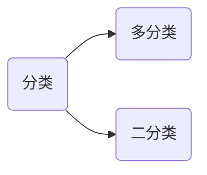

# 逻辑回归

逻辑回归：解决分类问题。



对于二分类问题，假设其中一个类别的概率为 $P_1$，不属于该类的概率是 $P_2$，则有：
$$
P_1+P_2=1
$$
二分类要求两个了类别是互斥的。将样本的特征和样本发生的概率联系起来，概率是一个数值，所以称为逻辑回归。

$$
\hat{p}=f(x) \qquad 
\hat{y}=\begin{cases}
 1, & \hat{p}\ge 0.5\\
 0, & \hat{p}< 0.5\\
\end{cases}
$$
其中1和0表示不同的情况。

> [!warning]
>
> 标准的逻辑回归用于分类，只能解决二分类问题。

在线性回归中
$$
\hat{y}=f(x) \Rightarrow \hat{y}=\theta^{T}\cdot x_b
$$
其中$\hat{y}\in \left [ -\infty, + \infty \right ]$ ，为了使结果映射到概率的值域$ \left [0, 1\right ]$，存在函数
$$
\hat{p}=\sigma \left( \theta^{T}\cdot x_b \right)
$$
其中
$$
\sigma(t)=\frac{1}{1+e^{-t}}
$$
称为sigmod函数。绘制该函数曲线

```python
import numpy as np
import matplotlib.pyplot as plt

def sigmoid(x):
    return 1 / (1 + np.exp(-x))

x = np.linspace(-10, 10, 500)
y = sigmoid(x)

plt.figure(figsize=(10, 8))
plt.plot(x, y)
plt.scatter(0, sigmoid(0), color='red', s=120)  
plt.text(0, sigmoid(0), '(0, 0.5)', fontsize=16, ha='right')
plt.grid(True, linestyle='--', alpha=0.5)
plt.xticks(fontsize=16)
plt.yticks(fontsize=16)
plt.show()
```

sigmod函数曲线的特点

* 值域是在$ \left [0, 1\right ]$之间。
* 当$t>0$时，$p>0.5$；当$t<0$时，$p<0.5$；当$t=0$时，$p=0.5$。

所以概率$\hat{p}$可以表示为
$$
\hat{p}=\sigma \left( \theta^{T}\cdot x_b \right)=\frac{1}{1+e^{-(\theta^{T}\cdot x_b)}} \qquad
\hat{y}=\begin{cases}
 1, & \hat{p}\ge 0.5\\
 0, & \hat{p}< 0.5\\
\end{cases}
$$

> [!warning]
>
> 线性回归和逻辑回归的区别：
>
> 1. 线性回归用于预测连续的值。
> 2. 逻辑回归用于分类。

逻辑回归的预测过程


> [!note]
>
> 那么如何去衡量，逻辑回归的预测结果与真实结果的差异呢？

## 逻辑回归的损失函数

逻辑回归损失函数的特点

* 如果$y=1$，$p$越小，损失函数越大。
* 如果$y=0$，$p$越大，损失函数越大。

根据上述特点定义损失函数
$$
\text{cost} = \begin{cases}
-\log(\hat{p})    & \text{ if } y=1 \\
-\log(1-\hat{p})  & \text{ if } y=0
\end{cases}
$$
当$y=1$时，损失函数为$-\log(\hat{p})$


* $p$越小，损失越大；$p$越大，损失越小。
* 当$p=1$时，损失函数为0。

当$y=0$时，损失函数为$-\log(1-\hat{p})$，其中$-\log(1-x)$的曲线如下


所以$-\log(1-\hat{p})$的曲线为


* $p$越大，损失越大；$p$越小，损失越小。
* 当$p=0$时，损失函数为0。

将上面的分段函数整合为一个函数
$$
\text{cost}=-y\log(\hat{p})-(1-y)\log(1-\hat{p})
$$
所以m个样本的逻辑回归的损失函数为
$$
J(\theta)=-\frac{1}{m}\sum_i^{m}\left (y^{(i)}\log(\hat{p}^{(i)})+(1-y^{(i)})\log(1-\hat{p}^{(i)})\right)
$$
其中
$$
\hat{p}^{(i)}=\sigma \left( X_b^{(i)} \theta \right)=\frac{1}{1+e^{-(X_b^{(i)} \theta)}}
$$

二分类问题中，使用的损失函数称为**对数损失函数**。损失函数的计算如下


> [!warning]
>
> 逻辑回归的优化目标也是使得损失函数值最小。
>
> * 求损失函数的最小值，没有解析解。
> * 上述函数是凸函数，存在唯一的一个全局最优解。
> * 可以使用梯度下降法求解。

### 损失函数的梯度

根据上面的公式逻辑回归的损失函数表示为如下式子：
$$
J(\theta)=-\frac{1}{m}\sum_i^{m}\left (y^{(i)}\log \left(\sigma \left( X_b^{(i)} \theta \right)\right)+(1-y^{(i)})\log \left(1-\sigma \left( X_b^{(i)} \theta \right)\right)\right)
$$
其中对sigmod函数的导数，该倒数可以用其自身表示
$$
\sigma(t)=\frac{1}{1+e^{-t}} \Rightarrow 
{\sigma(t)}' =\sigma(t)\cdot(1-\sigma(t))
$$
所以$\log\sigma(t)$的导数可以表示为
$$
{\log}'\sigma(t) \Rightarrow 1-\sigma(t)
$$
$\log(1-\sigma(t))$的导数可以表示为
$$
{\log}'(1-\sigma(t)) \Rightarrow -\sigma(t)
$$
整理可得
$$
\frac{\partial J(\theta )}{\partial \theta_j }= \frac{1}{m}\sum_{i=1}^{m}\left(\sigma(X_b^{(i)}\theta)-y^{(i)}\right)X^{(i)}_j=\frac{1}{m}\sum_{i=1}^{m}\left(\hat{y}^{(i)}-y^{(i)}\right)X^{(i)}_j
$$
所以逻辑回归的梯度可以表示为
$$
\nabla J(\theta )=
\begin{pmatrix}
\frac{\partial J}{\partial \theta_0 } \\
\frac{\partial J}{\partial \theta_1 } \\
\frac{\partial J}{\partial \theta_2 } \\
…\\
\frac{\partial J}{\partial \theta_n } 
\end{pmatrix}
=\frac{1}{m} 
\begin{pmatrix}
\sum_{i=1}^{m}(\hat{y}^{(i)}-y^{(i)}) \\
\sum_{i=1}^{m}(\hat{y}^{(i)}-y^{(i)})\cdot X_1^{(i)} \\
\sum_{i=1}^{m}(\hat{y}^{(i)}-y^{(i)})\cdot X_2^{(i)} \\
…\\
\sum_{i=1}^{m}(\hat{y}^{(i)}-y^{(i)})\cdot X_n^{(i)} \\
\end{pmatrix}
=\frac{1}{m} \cdot X_b^T \cdot (\sigma(X_b\theta)-y)
$$

## sklearn的逻辑回归

sklearn中逻辑回归使用了正则化的处理方式
$$
C\cdot J(\theta)+L_1 \\
C\cdot J(\theta)+L_2
$$
其中正则化系数$C$在损失函数前面，$C$损失函数越重要。

使用sklearn中的癌症数据集[`load_breast_cancer`](https://scikit-learn.org/stable/modules/generated/sklearn.datasets.load_breast_cancer.html#sklearn.datasets.load_breast_cancer)测试逻辑回归模型

```python
from sklearn import datasets

cancer = datasets.load_breast_cancer()
print(cancer.DESCR)
print(cancer.target_names)
```

* 0代表恶性（Malignant）
* 1代表良性（Benign）

划分测试集和验证集

```python
from sklearn.model_selection import train_test_split

x = cancer.data
y = cancer.target
x_train, x_test, y_train, y_test = train_test_split(x, y, random_state=42)
print(x_train.shape)
print(x_test.shape)
```

使用sklearn的逻辑回归[`LogisticRegression`](https://scikit-learn.org/stable/modules/generated/sklearn.linear_model.LogisticRegression.html)来训练模型和预测

```python
from sklearn.linear_model import LogisticRegression

log_reg = LogisticRegression()
log_reg.fit(x_train, y_train)
print(log_reg.score(x_train, y_train))
print(log_reg.score(x_test, y_test))
```

默认的逻辑回归函数采用$L_2$正则，$C=1$。`load_breast_cancer`数据默认没有归一化，对数据进行归一化

```python
from sklearn.pipeline import Pipeline
from sklearn.preprocessing import StandardScaler

pipeline = Pipeline([
    ('scaler', StandardScaler()),
    ('log_reg', LogisticRegression())
])
pipeline.fit(x_train, y_train)
print(pipeline.score(x_train, y_train))
print(pipeline.score(x_test, y_test))
```

## 逻辑回归的多项式特征

升维可以使线性不可分的数据变为线性可分


生成模拟数据

```python
np.random.seed(666)

X = np.random.normal(0, 1, size=(200, 2))
y = np.array(X[:, 0]**2 + X[:, 1]**2 < 1.5, dtype=int)

plt.scatter(X[y==0, 0], X[y==0, 1], color='red')
plt.scatter(X[y==1, 0], X[y==1, 1], color='blue')
plt.show()
```

使用模拟数据来训练模型

```python
from sklearn.preprocessing import PolynomialFeatures

def PolynomialLogisticRegression(degree, C=1):
    return Pipeline([
        ('poly', PolynomialFeatures(degree=degree)),
        ('std_scaler', StandardScaler()),
        ('log_reg', LogisticRegression(C=C))
    ])

poly_log_reg = PolynomialLogisticRegression(degree=2)
poly_log_reg.fit(x_train, y_train)
print(poly_log_reg.score(x_train, y_train))
print(poly_log_reg.score(x_test, y_test))
```

在实际应用中数据分布不可能是规则的圆形，多项式特征的`degree`可以取更大的值。

> [!warning]
>
> 逻辑回归本质上是找到一条直线，用直线来分割样本的类别。通过对数据添加多项式向，可以使得逻辑回归对非线性的数据同时起作用。

## 逻辑回归的多分类问题

### OvR（One vs Rest）


如果有$n$个类别进行$n$次分类，选择分类得分最高的。需要训练$n$个模型。

### OvO（One vs One）


需要训练$C_n^2$个模型，样本在每个模型上进行分类，选择分类数量最多的类别。

### sklearn中的多分类

使用鸢尾花数据训练多分类模型

```python
iris = datasets.load_iris()
X = iris.data
y = iris.target
X_train, X_test, y_train, y_test = train_test_split(X, y, random_state=42)

log_reg = LogisticRegression()
log_reg.fit(X_train, y_train)
print(log_reg.score(X_test, y_test))
```

sklearn中逻辑回归多分类默认采用`atuo`模式，回自动适配分类模型。

>[!warning]
>
>在`sklearn.multiclass`中，包含`OneVsRestClassifier`和`OneVsOneClassifier`可以用于二分类器的封装，完成多分类任务。

## 模型的保存和加载

使用`joblib`包，可以保存训练的模型。默认安装sklearn是自动安装该包，如果没有可以使用命令`pip install joblib`单独安装。

### 保存训练模型

```python
import joblib

x = cancer.data
y = cancer.target
x_train, x_test, y_train, y_test = train_test_split(x, y, random_state=42)

pipeline = Pipeline([
    ('scaler', StandardScaler()),
    ('log_reg', LogisticRegression())
])
pipeline.fit(x_train, y_train)
joblib.dump(pipeline, 'cancer.pkl')
```

### 加载已保存模型

```python
model = joblib.load('cancer.pkl')
print(model.score(x_test, y_test))
result = model.predict(x_test)
print(result.shape)
```

