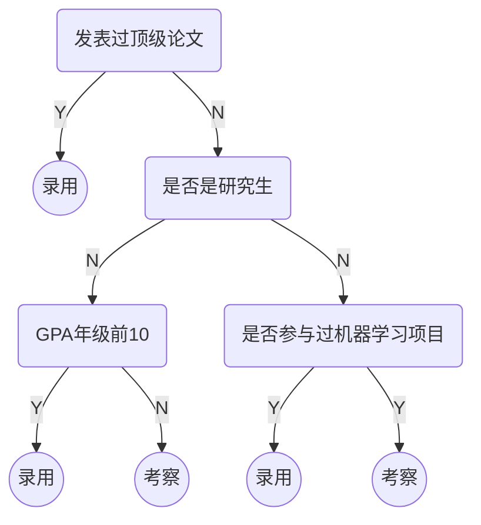
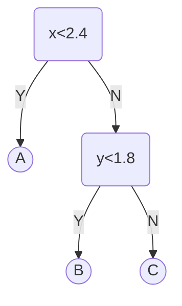
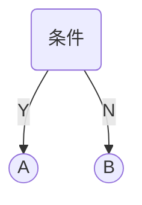
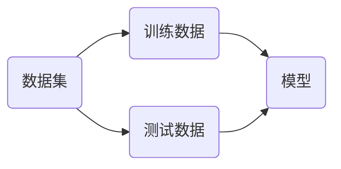
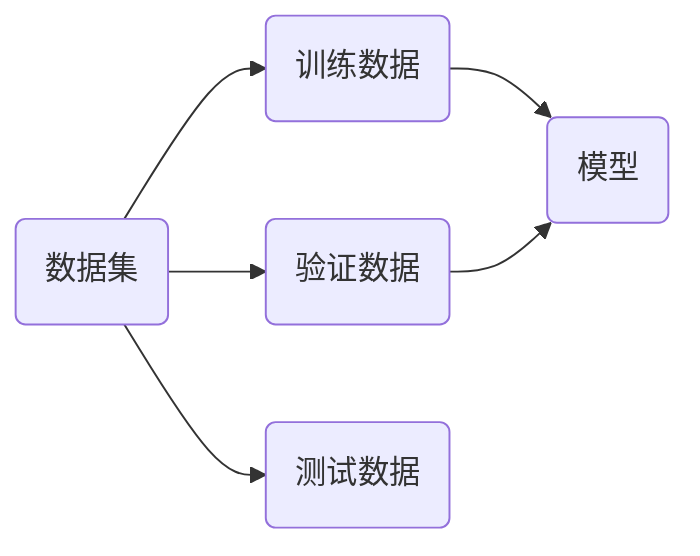
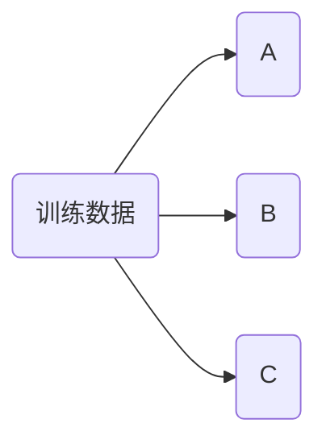

# 决策树

决策树模型是一个树状结构，本质是一颗由多个判断节点组成的树。人工智能的招聘流程



* 决策树模型包含所有计算机树模型的特征：包括根节点、叶子节点和深度等。
* 决策树的判断条件可以是：连续值、离散值（有大小）和离散值（没有大小）

使用鸢尾花数据集测试决策树，保留后两维特征用于可视化

```python
import matplotlib.pyplot as plt
from sklearn import datasets

iris = datasets.load_iris()
x = iris.data[:, 2:]
y = iris.target

plt.figure(figsize=(10, 8))
plt.scatter(x[y==0, 0], x[y==0, 1], s=100)
plt.scatter(x[y==1, 0], x[y==1, 1], s=100)
plt.scatter(x[y==2, 0], x[y==2, 1], s=100)
plt.xticks(fontsize=16)
plt.yticks(fontsize=16)
plt.show()
```

训练决策树模型

```python
from sklearn.tree import DecisionTreeClassifier

dt_clf = DecisionTreeClassifier(max_depth=2, criterion='entropy', random_state=9)
dt_clf.fit(x, y)
```

观察分类结果

```python
import numpy as np

def plot_decision_boundary(model, axis):
    x0, x1 = np.meshgrid(
        np.linspace(axis[0], axis[1], int((axis[1]-axis[0])*100)).reshape(-1, 1),
        np.linspace(axis[2], axis[3], int((axis[3]-axis[2])*100)).reshape(-1, 1),
    )
    X_new = np.c_[x0.ravel(), x1.ravel()]
    y_predict = model.predict(X_new)
    zz = y_predict.reshape(x0.shape)
    from matplotlib.colors import ListedColormap
    custom_cmap = ListedColormap(['#EF9A9A','#FFF59D','#90CAF9'])
    plt.contourf(x0, x1, zz, cmap=custom_cmap)
    
plt.figure(figsize=(10, 4))    
plot_decision_boundary(dt_clf, axis=[0.5, 7.5, 0, 3])
plt.scatter(x[y==0, 0], x[y==0, 1], s=100)
plt.scatter(x[y==1, 0], x[y==1, 1], s=100)
plt.scatter(x[y==2, 0], x[y==2, 1], s=100)
plt.xticks(fontsize=16)
plt.yticks(fontsize=16)
plt.xlabel('x', fontsize=16)
plt.ylabel('y', fontsize=16)
plt.show()
```

决策树分类过程



决策树的特点：

* 决策树构建的永远是二叉树。
* 决策树是非参数学习算法
  * 天然的可以用于多分类问题。
  * 可以解决回归问题，解决回归问题可以使用所有叶子节点的平均值，作为预测值。

* 决策树有很好的可解释性。

## 决策树的计算

决策树模型的目标是使两个类别可以分开。



> [!note]
>
> 决策树构建的核心问题：
>
> 1. 如何度量两个类别数据的区分度？
> 2. 在哪个特征，哪个值上，进行划分构建决策树？

### 信息熵

信息熵代表随机变量的不确定度。熵越大，数据的不确定性越高；熵越小，数据的不确定性越低。
$$
H=-\sum_{i=1}^{k}p_i\log(p_i)
$$
$k$ 表示信息的种类，$p_i$ 表示每类信息占的比例，

| 概率                                           | 信息熵                                                       |
| ---------------------------------------------- | ------------------------------------------------------------ |
| $\{ \frac{1}{3},\frac{1}{3},\frac{1}{3} \} $   | $H=-\frac{1}{3}\log(\frac{1}{3})-\frac{1}{3}\log(\frac{1}{3})-\frac{1}{3}\log(\frac{1}{3})=1.0986$ |
| $\{ \frac{1}{10},\frac{2}{10},\frac{7}{10}\} $ | $H=-\frac{1}{10}\log(\frac{1}{10})-\frac{2}{10}\log(\frac{2}{10})-\frac{7}{10}\log(\frac{7}{10})=0.8018$ |
| $\{ 1,0,0 \} $                                 | $H=-1\log(1)=0$                                              |

对于二分类问题，信息熵计算公式如下：
$$
H=-\sum_{i=1}^{k}p_i\log(p_i)=-x\log(x)-(1-x)\log(1-x)
$$
使用程序绘制信息熵的曲线

```python
def entropy(p):
    return -p * np.log(p) - (1-p) * np.log(1-p)

plt.figure(figsize=(10, 8))  
vals = np.linspace(0.01, 0.99, 200)
plt.plot(vals, entropy(vals), linewidth=3)
plt.xticks(fontsize=16)
plt.yticks(fontsize=16)
plt.show()
```

### 决策树的搜索

决策树划分的分界点是，使得数据整体的信息熵最低。获得分界点过程是通过遍历所有数据。

1. 选择一个值对系统进行划分，得到叶子节点。
2. 根据叶子节点中，样本的类别比例，计算信息熵。
3. 当系统划分后，决策树的叶子节点只包含一种数据，系统的信息熵为0。

定义一个划分函数

```python
def split(x, y, d, value):
    index_a = (x[:, d] <= value)
    index_b = (x[:, d] > value)
    return x[index_a], x[index_b], y[index_a], y[index_b]
```

使用变量的方法计算信息熵，确定信息熵最小处的划分

```python
from collections import Counter
from math import log

def entropy(y):
    counter = Counter(y)
    res = 0.0
    for num in counter.values():
        p = num / len(y)
        res += -p * log(p)
    return res

def try_split(x, y):
    best_entropy = float('inf')
    best_d, best_v = -1, -1
    for d in range(x.shape[1]):
        sorted_index = np.argsort(x[:, d])
        for i in range(1, len(x)):
            if x[sorted_index[i-1], d] != x[sorted_index[i], d]:
                v = (x[sorted_index[i-1], d] + x[sorted_index[i], d]) / 2
                x_l, x_r, y_l, y_r = split(x, y, d, v)
                e = entropy(y_l) + entropy(y_r)
                if e < best_entropy:
                    best_entropy, best_d, best_v = e, d, v
    return best_entropy, best_d, best_v

best_entropy, best_d, best_v = try_split(x, y)
print("best_entropy =", best_entropy)
print("best_d =", best_d)
print("best_v =", best_v)
```

计算决策树分类边界，两侧的信息熵

```python
x1_l, x1_r, y1_l, y1_r = split(x, y, best_d, best_v)
print(entropy(y1_l))
print(entropy(y1_r))
```

对右侧的数据进行划分

```python
best_entropy2, best_d2, best_v2 = try_split(x1_r, y1_r)
print("best_entropy =", best_entropy2)
print("best_d =", best_d2)
print("best_v =", best_v2)
```

计算划分后决策边界两侧数据的信息熵

```python
x2_l, x2_r, y2_l, y2_r = split(x1_r, y1_r, best_d2, best_v2)
print(entropy(y2_l))
print(entropy(y2_r))
```

可以使用构建二叉树的方式创建决策树。

### 基尼系数

$$
G=1-\sum_{i=1}^kp_i^2
$$

| 概率                                           | 基尼系数                                                     |
| ---------------------------------------------- | ------------------------------------------------------------ |
| $\{ \frac{1}{3},\frac{1}{3},\frac{1}{3} \} $   | $G=1-(\frac{1}{3})^2-(\frac{1}{3})^2-(\frac{1}{3})^2=0.666$  |
| $\{ \frac{1}{10},\frac{2}{10},\frac{7}{10}\} $ | $G=1-(\frac{1}{10})^2-(\frac{2}{10})^2-(\frac{7}{10})^2=0.46$ |
| $\{ 1,0,0 \} $                                 | $G=1-1^2=0$                                                  |

对于二分类情况基尼系数为


$$
G=1-x^2-(1-x)^2=-2x^2+2x
$$

使用基尼系数创建决策树的过程与使用信息熵类似，只是在计算信息熵时替换成基尼系数函数。大多情况下，使用信息熵和基尼系数划分决策树差别不大。**信息熵计算比基尼系数稍慢**，sklearn中**默认使用基尼系数**创建决策树。

## 决策树中的超参数

sklearn中使用的决策树是Classification And Regression Tree (CART) ：根据某一维度的和某一阈值进行二分。其他的决策树创建方法还包括：ID3，ID4.5，ID5.0。

决策树的预测平均复杂度为$O(\log m)$，而训练的复杂度$O(nm\log m)$

> [!warning]
>
> 决策树容易参数过拟合现象；非参数学习算法都容易参数过拟合。

解决决策树的过拟合问题，可以使用剪枝的方法。生成随机的测试数据

```python
x, y = datasets.make_moons(noise=0.25, random_state=666)
plt.figure(figsize=(10, 8))
plt.scatter(x[y==0, 0], x[y==0, 1], s=100)
plt.scatter(x[y==1, 0], x[y==1, 1], s=100)
plt.xticks(fontsize=16)
plt.yticks(fontsize=16)
plt.show()
```

生成决策树

```python
dt_clf = DecisionTreeClassifier()
dt_clf.fit(x, y)

plt.figure(figsize=(10, 8))
plot_decision_boundary(dt_clf, axis=[-1.5, 2.5, -1.0, 1.5])
plt.scatter(x[y==0, 0], x[y==0, 1], s=100)
plt.scatter(x[y==1, 0], x[y==1, 1], s=100)
plt.xticks(fontsize=16)
plt.yticks(fontsize=16)
plt.show()
```

1. 限制决策树的深度

```python
dt_clf2 = DecisionTreeClassifier(max_depth=2)
dt_clf2.fit(x, y)

plt.figure(figsize=(10, 8))
plot_decision_boundary(dt_clf2, axis=[-1.5, 2.5, -1.0, 1.5])
plt.scatter(x[y==0, 0], x[y==0, 1], s=100)
plt.scatter(x[y==1, 0], x[y==1, 1], s=100)
plt.xticks(fontsize=16)
plt.yticks(fontsize=16)
plt.show()
```

2. 控制节点拆分的数据数量，即满足包含数据的节点才会进一步拆分。

```python
dt_clf3 = DecisionTreeClassifier(min_samples_split=10)
dt_clf3.fit(x, y)

plt.figure(figsize=(10, 8))
plot_decision_boundary(dt_clf3, axis=[-1.5, 2.5, -1.0, 1.5])
plt.scatter(x[y==0, 0], x[y==0, 1], s=100)
plt.scatter(x[y==1, 0], x[y==1, 1], s=100)
plt.xticks(fontsize=16)
plt.yticks(fontsize=16)
plt.show()
```

3. 控制叶子中节点中数据的数量

```python
dt_clf5 = DecisionTreeClassifier(min_samples_leaf=6)
dt_clf5.fit(x, y)

plt.figure(figsize=(10, 8))
plot_decision_boundary(dt_clf5, axis=[-1.5, 2.5, -1.0, 1.5])
plt.scatter(x[y==0, 0], x[y==0, 1], s=100)
plt.scatter(x[y==1, 0], x[y==1, 1], s=100)
plt.xticks(fontsize=16)
plt.yticks(fontsize=16)
plt.show()
```

4. 控制叶子节点的数量

```python
dt_clf5 = DecisionTreeClassifier(max_leaf_nodes=4)
dt_clf5.fit(x, y)

plt.figure(figsize=(10, 8))
plot_decision_boundary(dt_clf5, axis=[-1.5, 2.5, -1.0, 1.5])
plt.scatter(x[y==0, 0], x[y==0, 1], s=100)
plt.scatter(x[y==1, 0], x[y==1, 1], s=100)
plt.xticks(fontsize=16)
plt.yticks(fontsize=16)
plt.show()
```

## 交叉验证



> [!note]
>
> 使用训练数据集和测试数据集划分的方式验证模型，可能造成准对测试数据的过拟合现象。



1. 训练数据集训练模型。
2. 验证数据集调整模型，主要用于调整超参数。
3. 测试数据集验证模型，测试数据不参与模型的创建，用于评价模型的最终性能。


交叉验证（Cross Validation）



将数据分割为A、B、C三部分。

* 使用B、C训练；使用A验证。
* 使用A、C训练；使用B验证。
* 使用A、B训练；使用C验证。

上面的三种训练可以得到3个模型，使用3个模型的均值作为结果进行调参。训练数据可以分割为$k$份，进行$k$份的交叉验证，称为k-folds cross validation。

留一法（Leave-One-Out，LOO）是一种特殊的交叉验证方法，每次训练只留下一个作为预测值，其它数据全部用来训练。留一法的优点是几乎利用了所有数据进行训练，评估结果相对准确，且不受随机分组的影响，结果具有较高的稳定性和可靠性。但缺点是计算成本高，当数据集较大时，训练和验证的次数会非常多，计算量巨大。

在网格搜索类中`GridSearchCV`，包含了交叉验证。

### 手写数字识别

sklearn测试数据集中包含一个图像数据集`load_digits`

1. 有1797个数据，每个数据是64维特征值，表示一个 $8\times8$ 大大小的图像，每个像素是0~16。
2. 共有10个类别的数据，分别是数字0~9。

```python
digits = datasets.load_digits()
print(digits.DESCR)

x = digits.data
print(x.shape)
y = digits.target
print(y.shape)
print(digits.target_names)

print(y[:70])
print(x[:1])
```

绘制其中一个元素的图像，使用[`imshow`](https://matplotlib.org/stable/api/_as_gen/matplotlib.pyplot.imshow.html)可以绘制图像

```python
import matplotlib
import matplotlib.pyplot as plt

some_digit = x[0]
print(y[0])
some_digit_image = some_digit.reshape(8, 8)
plt.imshow(some_digit_image, cmap=matplotlib.cm.binary)
plt.show()
```

### 决策树分类手写数字

```python
from sklearn.model_selection import GridSearchCV, train_test_split

X_train, X_test, y_train, y_test = train_test_split(
    x, y, test_size=0.2, random_state=42
)

# 3. 定义参数网格
param_grid = {
    'criterion': ['gini', 'entropy'],  # 分裂准则
    'max_depth': [None, 5, 10, 15],    # 最大树深度
    'min_samples_split': [2, 5, 10],   # 分裂所需最小样本数
    'min_samples_leaf': [1, 2, 4, 6],  # 叶节点最小样本数
}

grid_search = GridSearchCV(
    DecisionTreeClassifier(random_state=42), param_grid,
    cv=5,                # 5折交叉验证               
    scoring='accuracy',  # 评估指标为准确率
    n_jobs=-1,           # 使用所有CPU核心
    verbose=1            # 输出详细信息
)

grid_search.fit(X_train, y_train)
print("\n最优参数: ", grid_search.best_params_)
print("5折交叉验证的最优得分: ", grid_search.best_score_)
```

`cv=5`用于控制k份交叉验证。使用最优模型验证测试集准确率

```python
from sklearn.metrics import classification_report, accuracy_score

best_model = grid_search.best_estimator_
y_pred = best_model.predict(X_test)
test_accuracy = accuracy_score(y_test, y_pred)
print(f"测试集上的准确率: {test_accuracy:.4f}")

print("\n分类报告:")
print(classification_report(y_test, y_pred))
```

 绘制混淆矩阵

```python
from sklearn.metrics import confusion_matrix
import seaborn as sns

plt.figure(figsize=(10, 8))
cm = confusion_matrix(y_test, y_pred)
sns.heatmap(cm, annot=True, fmt='d', cmap='Blues', 
            xticklabels=digits.target_names, 
            yticklabels=digits.target_names)
plt.xlabel('Predicted label')
plt.ylabel('True label')
plt.title('Confusion Matrix')
plt.show()
```

`sklearn.model_selection`中的[`cross_val_score`](https://scikit-learn.org/stable/modules/generated/sklearn.model_selection.cross_val_score.html)也可以完成交叉验证功能

```python
from sklearn.model_selection import cross_val_score

knn_clf = DecisionTreeClassifier(random_state=42)
score = cross_val_score(knn_clf, X_train, y_train, cv=5)
print(score)
```

## 决策树解决回归问题

> [!warning]
>
> 计算叶子节点中数据的平均值可以用于回归问题的预测。

使用癌症数据集进行回归预测，打印训练集和测试集的表现

```python
from sklearn.tree import DecisionTreeRegressor

diabetes = datasets.load_diabetes()
x = diabetes.data
y = diabetes.target
x_train, x_test, y_train, y_test = train_test_split(x, y, random_state=666)

dt_reg = DecisionTreeRegressor(max_depth=4, min_samples_split=4)
dt_reg.fit(x_train, y_train)
print(dt_reg.score(x_test, y_test))
print(dt_reg.score(x_train, y_train))
```

## 决策树算法的局限性

1. 决策树的分类曲线通常都是直线

2. 决策树对特殊数据比较敏感

对于4个点分类问题，决策树边界


逻辑回归边界


对于线性可分的数据集


