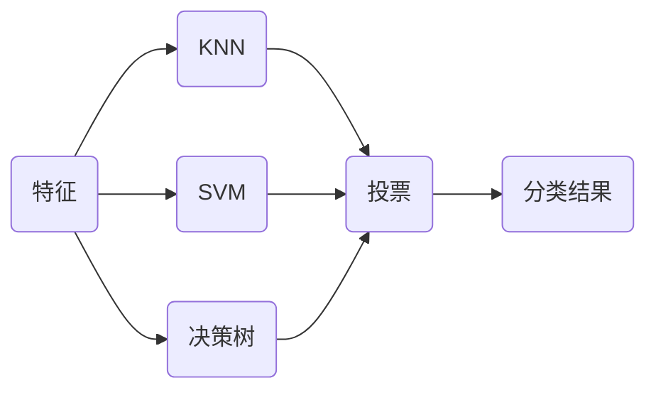

# 集成学习

集成学习是一种机器学习方法，通过组合多个基本模型，以达到更好的整体性能。使用不同的算法训练模型，如：逻辑回归、KNN和SVM等，最后用投票（少数服从多数）的方式确定分类。



生成测试数据

```python
import numpy as np
import matplotlib.pyplot as plt
from sklearn import datasets

x, y = datasets.make_moons(n_samples=500, noise=0.3, random_state=42)
plt.scatter(x[y==0, 0], x[y==0, 1])
plt.scatter(x[y==1, 0], x[y==1, 1])
plt.show()
```

划分测试集和训练集

```python
from sklearn.model_selection import train_test_split

x_train, x_test, y_train, y_test = train_test_split(x, y, random_state=42)
```

1. 创建逻辑回归模型

```python
from sklearn.linear_model import LogisticRegression

log_clf = LogisticRegression()
log_clf.fit(x_train, y_train)
log_clf.score(x_test, y_test)
```

2. 创建SVM模型

```python
from sklearn.svm import SVC

svm_clf = SVC()
svm_clf.fit(x_train, y_train)
svm_clf.score(x_test, y_test)
```

3. 创建决策树模型

```python
from sklearn.tree import DecisionTreeClassifier

dt_clf = DecisionTreeClassifier(random_state=666)
dt_clf.fit(x_train, y_train)
dt_clf.score(x_test, y_test)
```

4. 根据上述三个模型进行集成学习，使用投票的方式进行判决。

```python
y_predict1 = log_clf.predict(x_test)
y_predict2 = svm_clf.predict(x_test)
y_predict3 = dt_clf.predict(x_test)

y_predict = np.array((y_predict1 + y_predict2 + y_predict3) >= 2, dtype='int')
print(y_predict[:10])

from sklearn.metrics import accuracy_score
accuracy_score(y_test, y_predict)
```

## 使用 `VotingClassifier`

sk-learn中包含的集成学习库

```python
from sklearn.ensemble import VotingClassifier

voting_clf = VotingClassifier(estimators=[
    ('log_clf', LogisticRegression()),
    ('svm_clf', SVC()),
    ('dt_clf', DecisionTreeClassifier(random_state=666))
], voting='hard')
voting_clf.fit(x_train, y_train)
voting_clf.score(x_test, y_test)
```

`voting='hard'` 表示少数服从多数的集成方式。

> [!warning]
>
> 更合理的投票方式是每个模型有不同的权重。

对于一个二分类问题

|       | A    | B    |
| ----- | ---- | ---- |
| 模型1 | 99%  | 1%   |
| 模型2 | 49%  | 51%  |
| 模型3 | 40%  | 60%  |
| 模型4 | 90%  | 10%  |
| 模型5 | 30%  | 70%  |

如果是投票集成 A-模型 1，4（两票） B-模型 2，3，5（三票）

> [!warning]
>
> 分类为 A 的模型概率更高，更确定。

为了是集成方式更合理，使用概率作为投票的权重（计算概率的平均值）

$A=\frac15(0.99+0.49+0.4+0.9+0.3)=0.616$

$B=\frac15(0.01+0.51+0.6+0.1+0.7)=0.384$

A的概率更高，选择A类更合理

> [!attention]
>
> 要求集合的每一个模型都能评估概率

可以获得概率的模型

1. 逻辑回归：计算Sigmod函数值。
2. KNN：可以计算加权值的比重。
3. 决策树：叶子节点中数据的比例。
4. SVM

soft voting模型参数`voting='soft'`，使用SVM分类器时`probability=True`。

```python
x, y = datasets.make_moons(n_samples=500, noise=0.3, random_state=42)
x_train, x_test, y_train, y_test = train_test_split(x, y, random_state=42)

voting_clf = VotingClassifier(estimators=[
    ('log_clf', LogisticRegression()),
    ('svm_clf', SVC(probability=True)),
    ('dt_clf', DecisionTreeClassifier())
], voting='soft')

voting_clf.fit(x_train, y_train)
voting_clf.score(x_test, y_test)
```

## 集成更多模型

虽然可以集成很多机器学习算法，但是从投票角度看，仍然不够多。

1. 需要创建更多的子模型。
2. 子模型之间应该有差异性。

> [!warning]
>
> 每个子模型只训练一部分样本数据。

假设有 $n$ 子个模型，每个模型的的准确率有51%的准确率。可以证明如下结果：

1. 如果有1个子模型，整体准确率为 51%
2. 如果有3个子模型，整体准确率为 $0.51^3+C_3^2\cdot0.51^2\cdot 0.49 = 51.5\%$​
3. 如果有500个子模型，整体准确率为 $\sum_{i=251}^{500}C_3^i\cdot0.51^i\cdot 0.49^{500-i}=65.6\%$

当每个子模型的准确率为60%时，500个子模型，整体准确率为 $\sum_{i=251}^{500}C_3^i\cdot0.6^i\cdot 0.4^{500-i}=99.999\%$​

> [!attention]
>
> 训练模型时，不能保证每个模型都是正确的。

训练子模型的抽样方式：

1. 放回取样（Bagging），更常用。
2. 不放回取样（Pasting）。如果数据量有限，只能分很少的模型。

使用同一种算法集成更多模型，生成测试数据

```
x, y = datasets.make_moons(n_samples=500, noise=0.3, random_state=42)
x_train, x_test, y_train, y_test = train_test_split(x, y, random_state=42)
```

采用放回抽样`bootstrap=True`，集成100个子模型`n_estimators=100`，`max_samples=100`每个模型使用100个样本训练

```python
from sklearn.ensemble import BaggingClassifier
seed = 666

bagging_clf = BaggingClassifier(DecisionTreeClassifier(random_state=seed),
                                n_estimators=100, max_samples=100, 
                                random_state=seed, bootstrap=True) # True: 放回取样
bagging_clf.fit(x_train, y_train)
print(bagging_clf.score(x_test, y_test))
```

集成500个子模型`n_estimators=500`

```python
bagging_clf2 = BaggingClassifier(DecisionTreeClassifier(random_state=seed),
                                n_estimators=500, max_samples=100, 
                                random_state=seed, bootstrap=True)
bagging_clf2.fit(x_train, y_train)
print(bagging_clf2.score(x_test, y_test))
```

> [!attention]
>
> 放回取样将导致一部分样本很有可能没有被取到。可以证明平均约有37%的样本没有取到，可以使用这部分样本来做测试数据集。
>

```python
bagging_clf = BaggingClassifier(DecisionTreeClassifier(random_state=seed),
                                n_estimators=500, max_samples=100, 
                                random_state=seed, bootstrap=True, 
                                oob_score=True) # 记录没有被取样的数据用于测试
bagging_clf.fit(x, y)
print(bagging_clf.oob_score_)
```

取样创建子模型的方式可以并行处理，使用参数 `n_jobs=-1`

> [!warning]
>
> 训练子模型的过程中可以针对特征抽样，也可以针对特征和样本同时抽样。
>


```python
bagging_clf = BaggingClassifier(DecisionTreeClassifier(random_state=seed),
                                n_estimators=500, max_samples=100,
                                random_state=seed, bootstrap=True, 
                                oob_score=True, 
                                # 抽样特征数量为1，放回取样
                                max_features=1, bootstrap_features=True) 
bagging_clf.fit(x, y)
print(bagging_clf.oob_score_)
```

> [!warning]
>
> 在训练子模型时，模型之间差异越大越好。反映在模型训练时，即数据和特征的随机性越大越好。

## 随机森林

使用决策树进行集成学习的方式被称作随机森林。sk-learn自带的随机森林模型，其中决策树在节点划分上，在随机的特征子集上寻找最优划分。

```python
from sklearn.ensemble import RandomForestClassifier
rf_clf = RandomForestClassifier(n_estimators=500, max_samples=100,
                                random_state=seed, oob_score=True, 
                                n_jobs=-1)
rf_clf.fit(x, y)
print(rf_clf.oob_score_)
```

控制决策树的叶子节点数量`max_leaf_nodes=16`

```python
rf_clf = RandomForestClassifier(n_estimators=500, max_samples=100,
                                random_state=seed, oob_score=True,
                                max_leaf_nodes=16, n_jobs=-1)
rf_clf.fit(x, y)
print(rf_clf.oob_score_)
```

在决策树的划分上使用了随机的特征和随机的阈值，可以更好的抑制过拟合。

```python
from sklearn.ensemble import ExtraTreesClassifier

et_clf = ExtraTreesClassifier(n_estimators=500, random_state=seed,
                              bootstrap=True, oob_score=True)
et_clf.fit(x, y)
print(et_clf.oob_score_)
```

集成学习也可以解决回归问题：

* `from sklearn.ensemble import ExtraTreesRegressor`
* `from sklearn.ensemble import RandomForestRegressor`
* `from sklearn.ensemble import BaggingRegressor`

## Boosting

集成多个模型，每个模型逐步增加模型的效果

### Ada Boosting

AdaBoost通过调整样本权重来关注难样本。


使用sk-learn中的Ada Boosting库，训练过程中基本模型使用决策树。

```python
from sklearn.ensemble import AdaBoostClassifier

ada_clf = AdaBoostClassifier(
    DecisionTreeClassifier(max_depth=2), n_estimators=500
)
ada_clf.fit(x_train, y_train)
print(ada_clf.score(x_test, y_test))
```

### Gradient Boosting

Gradient Boosting通过添加新模型来修正前一个模型的错误。


Gradient Boosting是以决策树为参数进行模型拟合

```python
from sklearn.ensemble import GradientBoostingClassifier

gb_clf = GradientBoostingClassifier(max_depth=2, n_estimators=30)
gb_clf.fit(x_train, y_train)
print(gb_clf.score(x_test, y_test))
```

Boosting算法也可以解决回归问题

* `from sklearn.ensemble import AdaBoostRegressor`
* `from sklearn.ensemble import GradientBoostingRegressor`

## Stacking

堆叠集成学习（Stacking）的策略，在于将多个预测模型的输出值作为训练集输入到另一个预测模型并将该模型的输入结果作为最后的集成学习输出。


训练过程

1. 原始数据拆出两个训练集。
2. 第一个训练集用来训练第一层预测模型。
3. 第二个训练集将分别传入第一层每个分类器后，产生的预测结果，用于训练第二层预测模型。

多层模型


神经网络的组建策略类似于Stacking模型。
