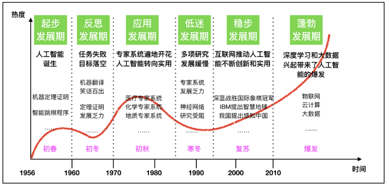
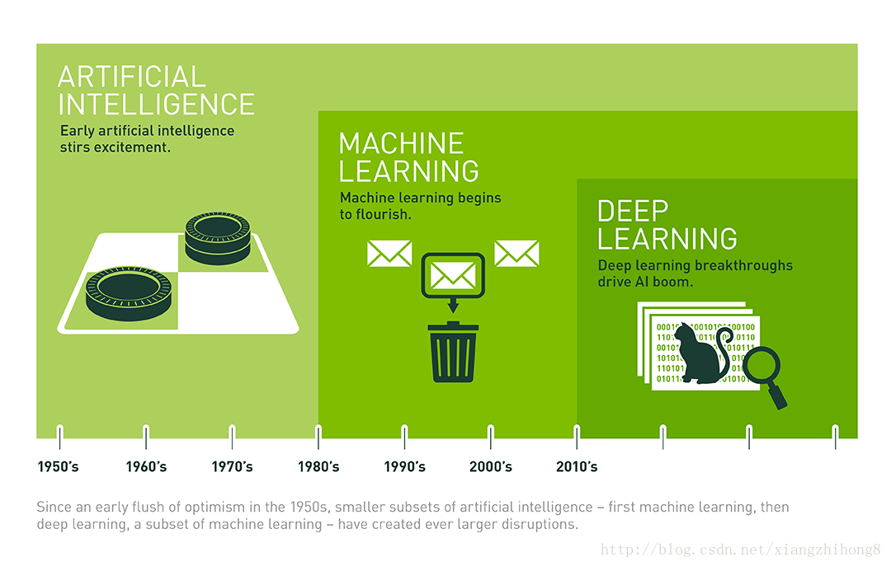
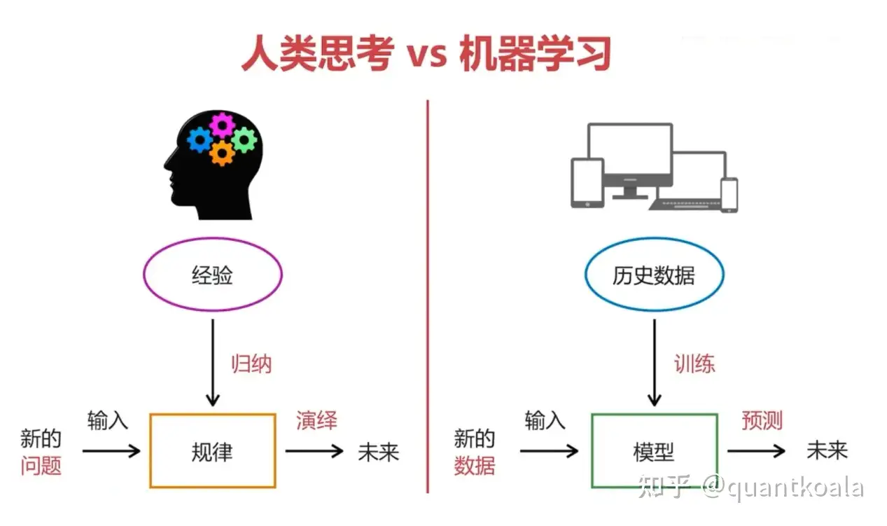
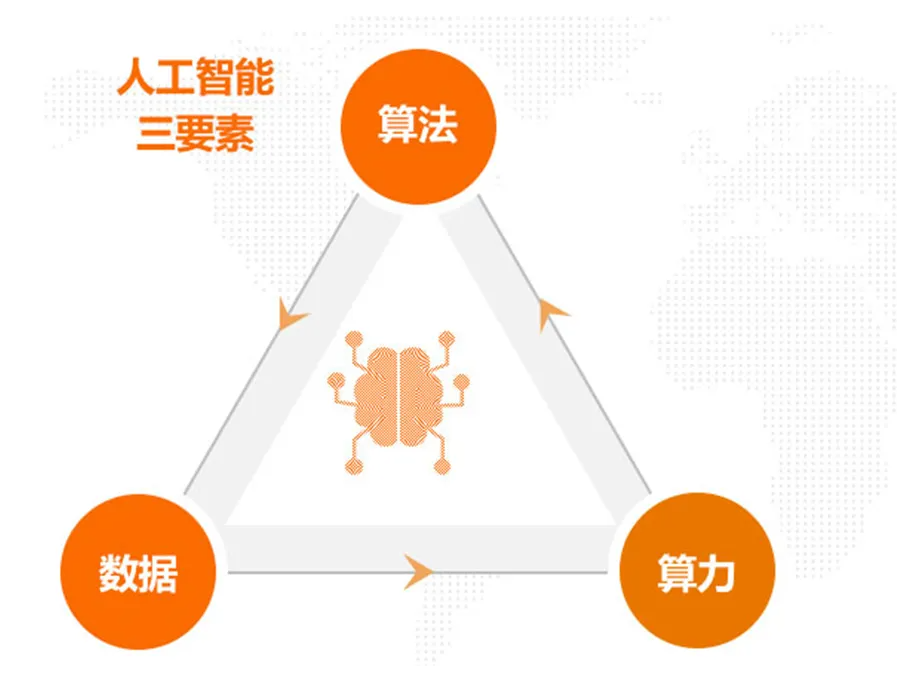
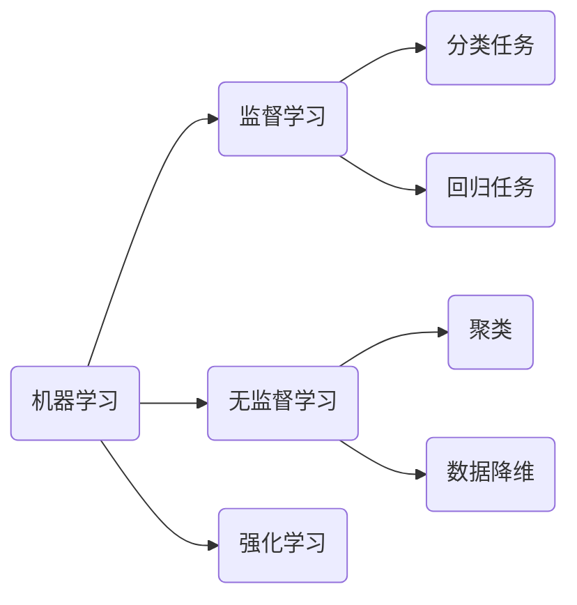
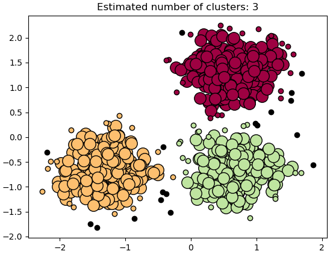
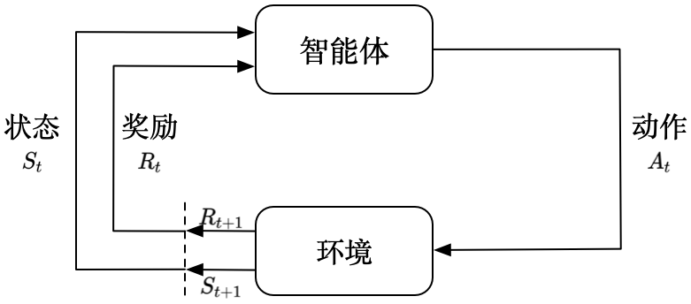
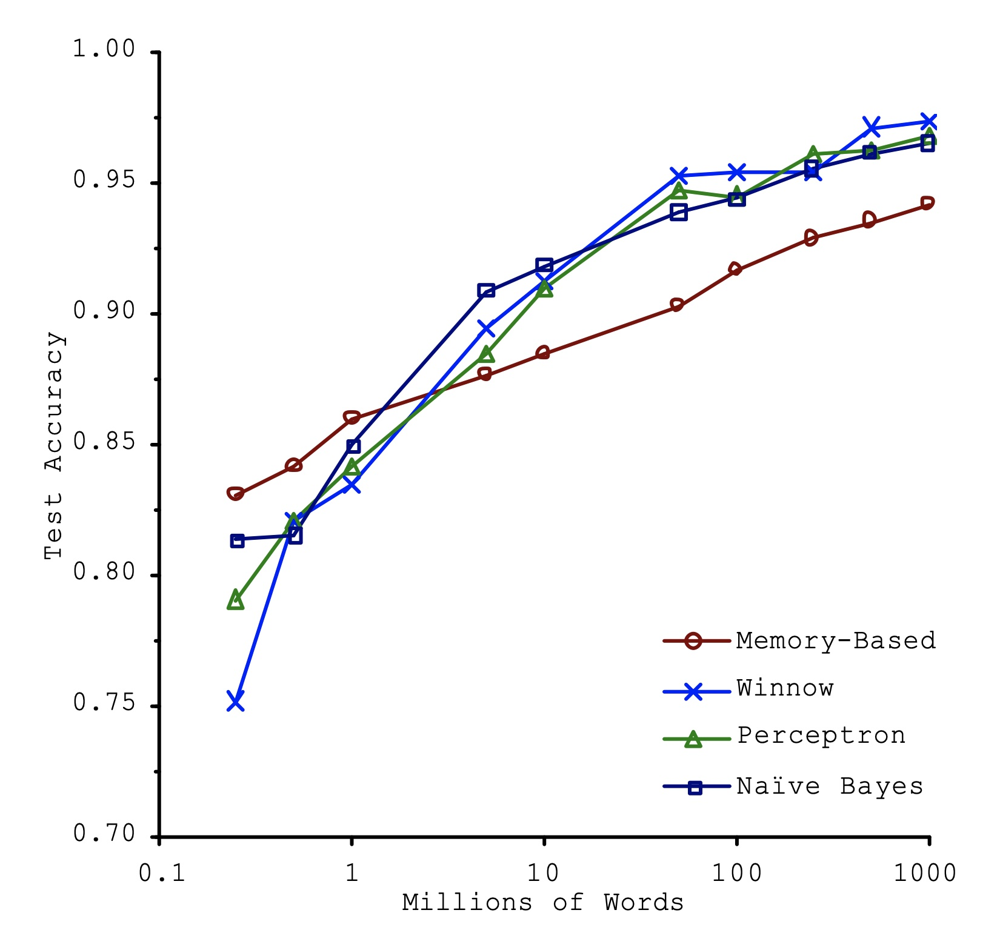

# 机器学习概述

机器学习是指使计算机系统完成，通常需要人类智能的任务的技术和方法。具体任务包括：学习、推理、问题解决、感知和语言理解等。

## 机器学习的应用场景

1. 计算机视觉（Computer Vision）
   * 图像分类：识别图片中的物体类别（如猫、狗、车辆）。  
   * 目标检测：定位并识别图像中的多个物体（如YOLO、Faster R-CNN）。  
2. 自然语言处理（Natural Language Processing, NLP）
   * 机器翻译：跨语言实时翻译（如Google Translate）。  
   * 文本生成：自动撰写文章、代码（如GPT系列）。    
3. 语音识别与合成
   * 语音转文字：语音助手（如Alexa、小爱同学）、会议记录。  
   * 文字转语音（TTS）：有声书、语音导航。  
4. 推荐系统
   * 电商推荐：根据用户行为推荐商品（如亚马逊、淘宝）。   
   * 广告定向投放：精准匹配用户兴趣。  
5. 机器人
   * 自动驾驶：车道、行人识别，车辆控制。
   * 物体抓取：工业机械臂精准操作。  
6. 专家系统：把人类的知识转化为模型。
   * 医疗健康：医学影像诊断、个性化治疗或药物研发。
   * 金融科技：股票预测、信用评分、量化交易。

## 人工智能与机器学习

1956年8月，在美国达特茅斯学院举办了“人工智能研究夏季项目”的会议，提出了人工智能（AI）这一概念，此次会议被广泛认为是人工智能领域的起点。自1956年以来，人工智能技术发展虽经历了一些挑战，但仍取得了显著的进展。

### 图灵测试（Turing Test）

由英国计算机科学家图灵提出的一种测试方法，用于判断机器是否具有智能。如果一台机器能够通过自然语言与人类进行对话，使对话的另一方无法辨别出其是机器还是人类，那么这台机器就被认为具有智能。

### 人工智能、机器学习和深度学习

人工智能、机器学习和深度学习的关系：

* 机器学习是人工智能的一个实现途径。
* 深度学习是机器学习的一个方法发展而来。

### 什么是机器学习

机器学习是通过数据和经验自动改进系统性能的技术，其目标是让计算机能够从数据中自动学习并改进性能，而无需明确的指令编程。

> [!tip]
>
> 如何区分下面两片叶子的种类？

1. 方法一：写一个规则，定义枫叶和梧桐叶，让计算机执行。
   * 人为定义规则存在的问题：
     1. 定义规则是一个很困的的过程。
     2. 规则之间可能会产生冲突。
     3. 规则会不断变化。
2. 方法二：收集一定量的树叶，标注树叶的品种，让计算机根据标注数据学习出树叶的品种。
   * 机器学习算法的优点：
     1. 解决了人为定义规则的难题。
     2. 规则的变化可以通过标注更多的数据来体现。
   * 机器学习算法的缺点：
     1. 依赖大量标记数据。
     2. 计算资源需求大。

机器学习本质是从数据中获取知识，并用知识对未知数据进行预测。

> [!important]
>
> 知识在机器学习中，表现为模型。

### 机器学习的三要素

* 算法：定义了机器如何处理信息、学习模式、进行推理和决策。
* 数据：可以理解为人工智能的“燃料”，是算法训练、测试和验证的基础。
* 算力：可以支持复杂的算法运算和大规模数据处理。
  * CPU主要适合IO密集型的任务
  * GPU主要适合计算密集型任务

[CPU和GPU的区别](http://www.sohu.com/a/201309334_468740)

## 机器学习的任务分类

### 监督学习

利用带标签的数据来训练模型，以便预测新的、未见过的数据。

* 标签数据
* 直接反馈
* 预测结果

监督学习的分类

* 分类任务：预测数据所属的类别。
  * 二分类任务。如：垃圾邮件分类、肿瘤良性或恶性判断。
  * 多分类任务。如：[手写数字识别](https://docs.ultralytics.com/zh/datasets/classify/mnist/)、鸢尾花数据分类。
* 回归任务：预测连续数值。如：房价预测。
  * 回归任务可以简化为分类任务。

> [!important]
>
> 监督学习更符合人类的认知过程，现实应用中，绝大多数任务都是监督学习。

### 无监督学习

不依赖于带标签的数据。目标是从数据中发现潜在的模式、结构或关系，而无需事先知道数据的类别或目标值。

* 聚类：是将数据点分成若干个群组（簇），使得同一簇中的数据点彼此相似，而不同簇中的数据点差异较大。例如：电商网站对用户的兴趣进行聚类。

* 特征降维：减少数据的维度，同时保留尽可能多的有用信息。特征降维能够降低数据的复杂性，提升模型的性能和计算效率。降维也可用于数据可视化。

### 强化学习

通过与环境的交互学习最佳策略，以最大化累积的奖励。增强学习非常适合自动驾驶和机器人类任务。

## 机器学习的本质

机器学习与传统算法的区别在于，机器学习算法给出的答案是不确定的，具有一定统计意义的结果。

> [!tip]
>
> 机器学习的结果真的可靠么？它在多大程度上能反应真实结果？

2001年，Michele Banko的论文[Scaling to Very Very Large Corpora for Natural Language Disambiguation](https://aclanthology.org/P01-1005.pdf)

1. 数据量跨越胜过算法创新：即使是最简单的基准算法，在海量数据喂养下，性能也能轻松碾压那些在小数据上的先进算法。
2. 性能随数据对数增长。 
3. 没有烂算法，只有数据不够多。

2020年OpenAI提出了Scaling Law，说明了参数量、数据量和算力的增长与Loss函数降低之间数学规律，研究人员可以精确的预测出，随着预算的增长，能带来多少Loss的降低。

1. [Scaling Laws for Neural Language Models](https://arxiv.org/pdf/2001.08361/1000)
2. [Training Compute-Optimal Large Language Models](https://arxiv.org/pdf/2203.15556)

> [!warning]
>
> 机器学习的当前发展阶段是以大力出奇迹的阶段。
