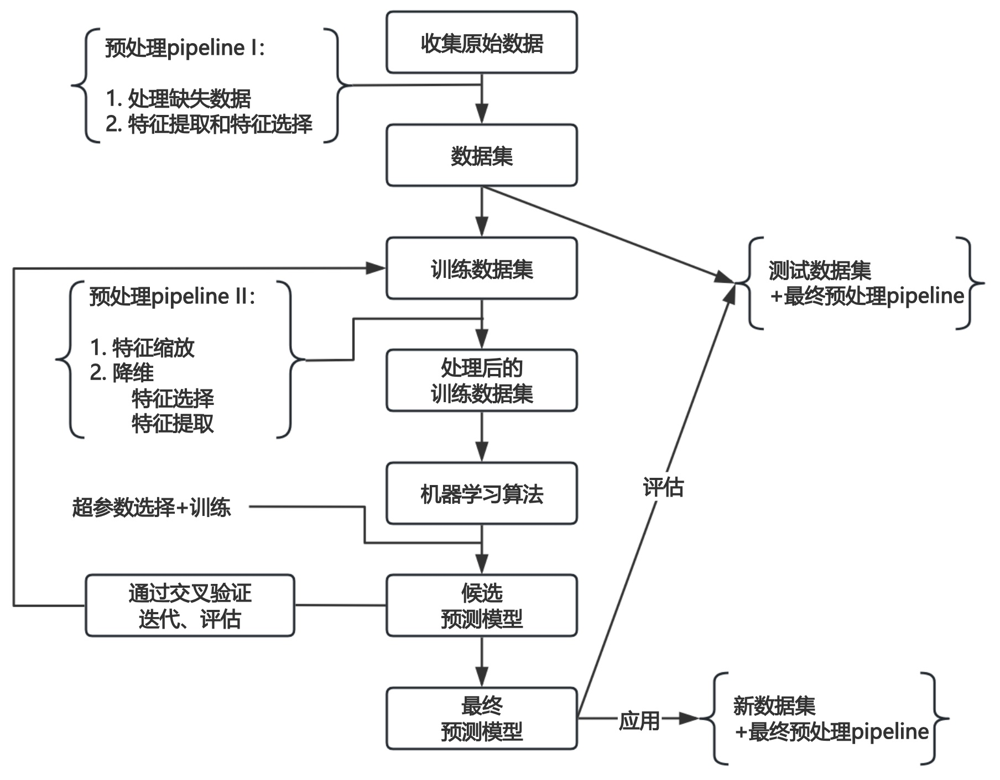
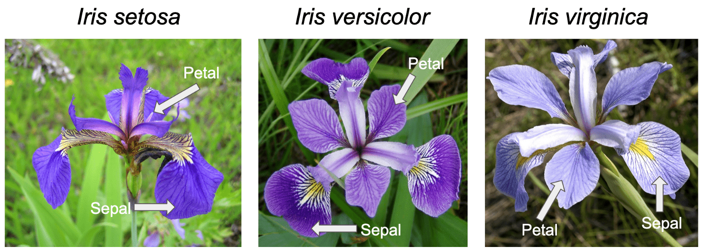

# 机器学习工作流程



机器学习工作流程

1. 原始数据集
   * 原始数据集可能缺失部分值、标签。
   * 原始数据无法直接用于算法的训练。
2. 数据集
   * 把原始数据提炼为机器可以处理的数据。
   * 数据集划分为：训练数据集和测试数据集。
3. 训练数据：用于模型训练的数据。
4. 处理后的训练数据集
   * 将数据缩放到指定的区间内。
   * 将特征压缩到低维子空间。
5. 机器学习算法
   * 使用特征向量和标签训练模型。
   * 通过选择超参数训练提升模型性能。
6. 模型评估
   * 使用交叉验证的方法，调整训练数据集。
   * 重复上面步骤，迭代训练模型。
7. 结果达到要求后，在测试数据集上评估模型性能。
8. 模型通过评估后，上线服务。


## 特征提取

[鸢尾花数据集](https://www.kaggle.com/datasets/uciml/iris)由Fisher收集整理，并发表在1936年的经典论文[《多重测量在分类学问题中的应用》](https://onlinelibrary.wiley.com/doi/epdf/10.1111/j.1469-1809.1936.tb02137.x)中。



论文收集了三种鸢尾花

* 山鸢尾-Setosa
* 杂色鸢尾-Versicolour
* 维吉尼亚鸢尾-Virginica

每个品种50个样本，如何通过数学方法，找到一个有效的函数，对鸢尾花进行分类。

> [!tip]
>
> 如何表示鸢尾花数据？

### 特征工程

特征是数据不同属性的测量值，可以反映数据集的某些现象。特征工程是指从原始数据中提取、转换和选择特征，以便于更好的反映数据集中的现象。


对于鸢尾花数据集，分别测量了两种特征花瓣（petal）和萼片（sepal）的数据。

```
Iris plants dataset
--------------------
**Data Set Characteristics:**
:Number of Instances: 150 (50 in each of three classes)
:Number of Attributes: 4 numeric, predictive attributes and the class
:Attribute Information:
    - sepal length in cm
    - sepal width in cm
    - petal length in cm
    - petal width in cm
    - class:
            - Iris-Setosa
            - Iris-Versicolour
            - Iris-Virginica
```

数据集一般可以看做为一个表格结构：

- 一行数据我们称为一个样本。
- 一列数据我们称为一个特征，是样本数据的一种属性。
- 每一行数据都有一个类别标签。

| sepal length (cm) | sepal width (cm) | petal length (cm) | petal width (cm) | class       | label |
| ----------------- | ---------------- | ----------------- | ---------------- | ----------- | ----- |
| 5.1               | 3.5              | 1.4               | 0.2              | Setosa      | 0     |
| 7. 0              | 3.2              | 4.7               | 1.4              | Versicolour | 1     |
| 6.3               | 3.3              | 6.0               | 2.5              | Virginica   | 2     |

数学上可以将数据集的全部特征看做一个矩阵，记为 $X\in \mathbb{R}^{150\times 4}$ 称作特征矩阵。
$$
\begin{bmatrix}
x_1^{(1)}  & x_2^{(1)} & x_3^{(1)} & x_4^{(1)} \\
x_1^{(2)}  & x_2^{(2)} & x_3^{(2)} & x_4^{(2)} \\
\vdots  & \vdots & \vdots & \vdots \\
x_1^{(150)}  & x_2^{(150)} & x_3^{(150)} & x_4^{(150)}
\end{bmatrix}
$$
上标 $i$ 表示第 $i$ 个样本，$X$ 矩阵的每一行代表一朵花的数据 
$$
X^{(i)}=\begin{bmatrix}
x_1^{(i)}  & x_2^{(i)} & x_3^{(i)} & x_4^{(i)}
\end{bmatrix}
$$
下标 $j$  表示第 $j$ 个特征，每个特征都是150维列向量
$$
x_j=\begin{bmatrix}
x_j^{(1)}   \\
x_j^{(2)}   \\
\vdots  \\
x_j^{(150)}  
\end{bmatrix}
$$
label是类别的数字化表示。通常使用 $y$ 表示，第 $i$ 个样本的标签表示 $y^{(i)}\in [0, 1, 2]$，可以表示为一个150维的列向量
$$
y=\begin{bmatrix}
y^{(1)} \\
y^{(2)} \\
\vdots \\
y^{(150)}
\end{bmatrix}
$$
对于任意数据的特征可以表示 $X\in \mathbb{R}^{n\times m}$。

特征工程包含内容：

- 特征提取：从任意数据（如：文本或图像）抽象出数字特征的过程，这个过程通常是指定规则得到的。
- 特征转换：将原始特征通过某种转换或映射，生成新的特征。
- 特征降维：将高维数据投影到低维空间，以减少特征的数量，同时尽量保留数据的关键信息。

互联网应用特征提取的流程


特征是从原始数据中采集的部分信息，一定存在信息的损失。

> [!important]
>
> 1. 数据只有转化为特征才能进行学习，无法量化的数据，就无法**优化**。
>2. 数据和特征决定了机器学习的上限，而模型和算法只是逼近这个上限而已。

在后面的章节中不会再明确的区分数据和特征的区别，提到数据也指数据的特征，有时也称样本。

## scikit-learn

[Scikit-Learn](https://scikit-learn.org/stable/#)是一个用于机器学习的 Python 库，提供了简单高效的工具来进行数据挖掘和数据分析，它建立在NumPy、SciPy和matplotlib基础之上。

安装Scikit-Learn包

```shell
pip install scikit-learn
```

### sklearn中的数据集

[`sklearn.datasets`](https://scikit-learn.org/stable/datasets.html)中嵌入了一些小型数据集用于实验。

* `loaders`用来加载小型测试数据集。
* `fetchers`用来下载并加载大的真实数据集
  * 参数`data_home`可以控制下载的位置。
  * `subset`可以控制下载训练集或测试集。
* [`fetch_openml`](https://scikit-learn.org/stable/modules/generated/sklearn.datasets.fetch_openml.html)从[OpenML](https://www.openml.org/)平台下载真实数据集。

两类函数都返回，类似字典的对象。加载完成的鸢尾花数据，`keys()`包含了数据集的所有属性。使用前面介绍的鸢尾花数据。

```python
from sklearn import datasets

iris = datasets.load_iris()
print(iris.keys())
```

`DESCR`打印数据集说明

```python
print(iris.DESCR)
```

`data`保存了数据的特征，`target`保存了监督数据的值。

```python
print(iris.data[:5, :])
print(iris.target[:5])
```

## 练习

1. 将鸢尾花的数据集绘制在二维坐标系中。
