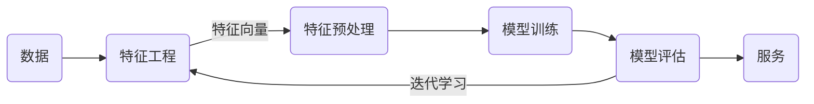
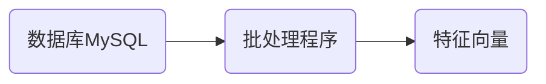
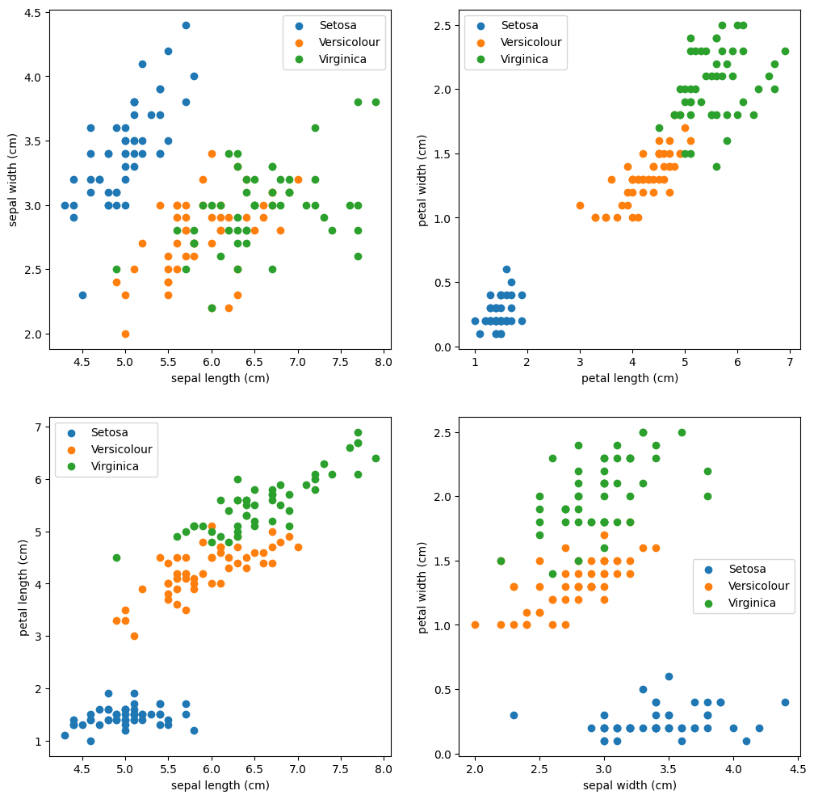

# 机器学习工作流程



机器学习工作流程总结

1. 获取数据：包括样本和标签。

2. 数据基本处理：处理原始数据中的异常值，如：样本或标签缺失。

3. 特征工程：把原始数据提炼为机器可以处理的数据。

4. 机器学习（模型训练）：使用特征向量和标签训练模型。

5. 模型评估
   * 结果达到要求，上线服务没有达到要求，重新上面步骤


### 数据

[鸢尾花数据集](https://www.kaggle.com/datasets/uciml/iris)由Fisher收集整理，并发表在1936年的经典论文[《多重测量在分类学问题中的应用》](https://onlinelibrary.wiley.com/doi/epdf/10.1111/j.1469-1809.1936.tb02137.x)中。


论文收集了三种鸢尾花，每个品种50个样本，希望找到一个判别式可以分类三种鸢尾花。

数据集包含：样本（花朵）和样本标签（花朵的类别）。

### 特征工程

特征是数据的不同属性或测量值，可以反映数据集的某些现象。特征工程是指从原始数据中提取、转换和选择特征，以便于更好的反映数据集中的现象。

> [!note]
>
> [大模型靠啥理解文字？通俗解释：词嵌入embedding]( https://www.bilibili.com/video/BV1bfoQYCEHC/?share_source=copy_web&vd_source=aa661569ff3138d0b604d53a96184bf2)


如果想用一个判别式来对鸢尾花数据集进行分类，首先应该把数据集数字化。对于鸢尾花数据集，分别测量了两种特征花瓣（petal）和萼片（sepal）的数据。

```
Iris plants dataset
--------------------
**Data Set Characteristics:**
:Number of Instances: 150 (50 in each of three classes)
:Number of Attributes: 4 numeric, predictive attributes and the class
:Attribute Information:
    - sepal length in cm
    - sepal width in cm
    - petal length in cm
    - petal width in cm
    - class:
            - Iris-Setosa
            - Iris-Versicolour
            - Iris-Virginica
```

数据集一般可以看做为一个表格结构：

- 一行数据我们称为一个样本。
- 一列数据我们称为一个特征，是样本数据的一种属性。
- 每一行数据都有一个类别标签。

| sepal length (cm) | sepal width (cm) | petal length (cm) | petal width (cm) | class       | label |
| ----------------- | ---------------- | ----------------- | ---------------- | ----------- | ----- |
| 5.1               | 3.5              | 1.4               | 0.2              | Setosa      | 0     |
| 7. 0              | 3.2              | 4.7               | 1.4              | Versicolour | 1     |
| 6.3               | 3.3              | 6.0               | 2.5              | Virginica   | 2     |

数学上可以将数据集的全部特征看做一个矩阵，记为 $X$ 称作特征矩阵。

第 $i$ 个样本的全部特征表示为 $X^{(i)}$，第  $i$ 个样本的第 $j$  个特征表示为 $X^{(i)}_j$。$X$ 的行数表示样本的数量，$X$​ 的列数表示特征的数量。

最后一列label是类别的数字化表示，可以作为判别式的计算结果。通常使用 $y$ 表示，第 $i$ 个样本的标签表示为 $y^{(i)}$。

特征工程包含内容：

- 特征提取：从任意数据（如：文本或图像）抽象出数字特征的过程，这个过程通常是指定规则得到的。
- 特征转换：将原始特征通过某种转换或映射，生成新的特征。
- 特征降维：将高维数据投影到低维空间，以减少特征的数量，同时尽量保留数据的关键信息。

互联网应用特征提取的流程



特征是从原始数据中采集的部分信息，一定存在信息的损失。

> [!warning]
>
> 数据只有转化为特征才能进行学习，无法量化的数据，就无法**优化**。
>
> 数据和特征决定了机器学习的上限，而模型和算法只是逼近这个上限而已。——吴恩达

### 数据预处理

对数据进行缺失值、异常值的处理。

### 训练模型

机器学习模型训练是一个从数据中学习并构建模型以进行预测或决策的过程。

将鸢尾花的特征绘制在二维平面上



由样本数据特征组成的空间称为特征空间（Feature Space），特征空间可以 $n$​ 维空间。

对于鸢尾花数据集，就是找到一个可以区分不同类别鸢尾花的判别式，对于任意的特征向量 $x$ 可以计算出 $y \in[0, 1, 2]$
$$
y = f(x)
$$
这个函数就是要训练的模型。

寻找这个函数的方法：

1. 通过数学证明。
2. 通过数据训练，计算出 $f$​ 的参数，如：极大似然估计就是一种方法。

### 模型评估

评价模型，在未知数据上的性能。模型评估的指标：

1. 分类模型评：正确率（Accuracy）、准确率（Precision）、召回率（Recall）、F1-score、AUC指标和ROC曲线等。
1. 回归模型评估：均方根误差、相对平方误差、平均绝对误差、相对绝对误差等。
1. 过拟合、欠拟合等。

模型评估是指导模型优化的重要手段。

> [!attention]
>
> 在后面的章节中不会再明确的区分数据和特征的区别，提到数据也指数据的特征。有时也称样本。