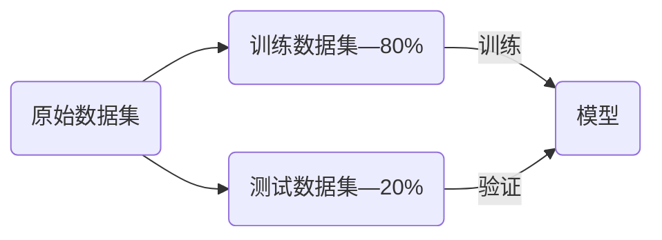
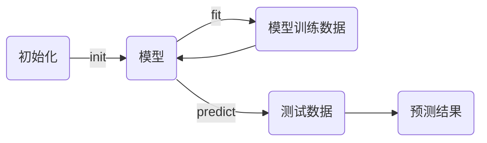
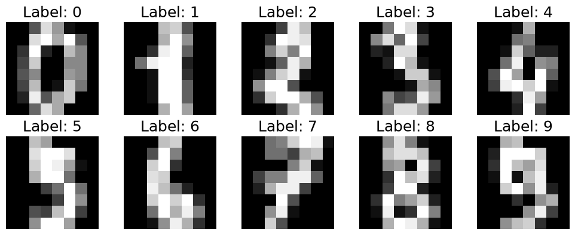
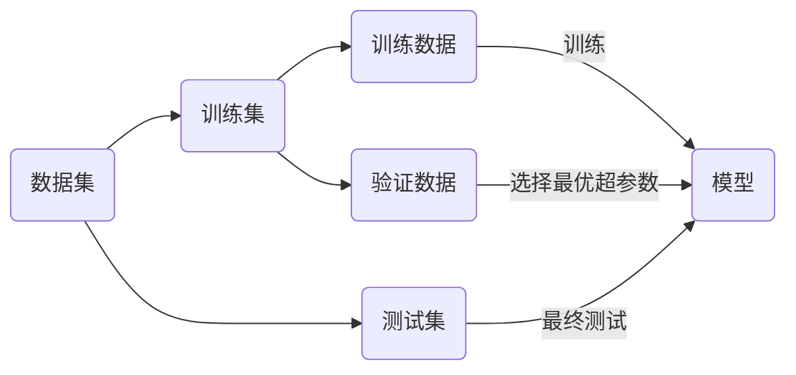
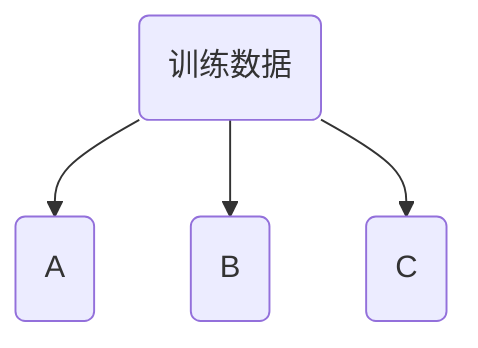
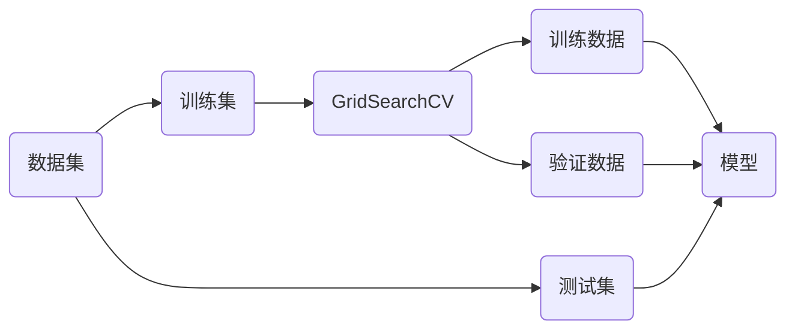

# K近邻 （KNN）

K近邻算法K-Nearest Neighbors（KNN）

1. 存在一定量的数据，包括特征和类别。
2. 计算未知类别的数据与所有已知数据的距离。
3. 选择K个距离最小的样本，以最近的K个样本进行投票。
4. 未知样本与票数最多的样本一致。

KNN的基本思想是样本距离只够接近，样本的类型可以划分为一类。使用欧拉距离来表示两个样本点之间的差异，对于 $n$ 维向量 $x$​ 其距离公式为，欧拉距离为：

$$
\sqrt{\sum_{i=1}^n\left(x_i^{(a)}-x_i^{(b)} \right)^2}
$$

1. 计算样本间所有距离
1. 对全部距离进行排序
1. 选择最近的K个样本，并获取相应的监督数据
1. 统计监督数据结果

KNN算法的特点：

* KNN算法是一个不需要训练过程的算法，可以认为KNN算法的模型就是全部训练数据本身。
* KNN算法的复杂度都集中在算法的预测过程，要从所有的样本数据中选出最小的K个距离。

## KNN算法实践

> [!tip]
>
> 对于已知数据集，如何测试机器学习算法性能的优劣？

使用测试数据解可以客观的评价算法和模型的性能。

> [!note]
>
> 1. 将二维鸢尾花数据，划分为训练集和测试集。
> 2. 将训练数据集绘制在二维平面上。

### KNN算法实现

KNN算法流程如下：

1. 可以使用类来实现KNN分类器。
2. 初始化的时候应该传入K的参数。
3. 输入训练数据训练模型。
4. 输入测试数据返回预测结果。
5. 可以根据预测结果统计预测的正确率。

### sklearn中的算法

scikit-learn机器学习算法的流程

1. `fit`函数是训练模型，需要传入训练数据。
2. `predict`是预测函数，可以同时预测多个结果，传入数据必须为矩阵。预测结果也为二维矩阵。

> [!note]
>
> 1. 使用sklearn完成KNN算法。
>
> 2. 比较sklearn的KNN算法和上面实现的KNN算法结果是否一致。

#### KD树

KNN每次需要预测一个点时，都需要计算训练数据集里每个点到这个点的距离，然后选出距离最近的K个点进行投票。当数据集很大时，这个计算成本非常高。

为了避免每次都重新计算一遍距离，算法会把距离信息保存在一棵树里，这样在计算之前从树里查询距离信息，尽量避免重新计算。构造的这个树叫KD树。

[KD树详解](https://search.bilibili.com/all?vt=11410619&keyword=kd%E6%A0%91&from_source=webtop_search&spm_id_from=333.1007&search_source=5)

## 超参数

* **超参数**是指运行指定机器学习算法之前需要指定的参数。KNN算法中的K是典型的超参数。
* **模型参数**是指机器学习算法中学习的参数。KNN算法中没有模型参数。

### 近邻数K

寻找好的超参数：

1. 结合各领域知识、经验数值。
2. 实验搜索

K参数对模型的影响：

* K值过小：容易受到异常点的影响。
* K值过大：受到样本均衡问题的影响。

#### 手写数值识别

`datasets`数据集中，包含`load_digits`是一个经典的手写数字识别数据集：

* 共有10个类别的数据，分别是数字0~9。
* 包含1797个样本，每个数据是64维特征值，每类约180个。
* 特征值表示一张图片都是$8\times8$像素的灰度图，每个像素的灰度值用0到16 的整数表示。

> [!note]
>
> 使用sklearn的KNN算法测试不同K的参数，对`load_digits`数据集分类的效果。

## 划分验证集

对于模型评测来说，测试集就像“最终考试”，为了保证评测的公平和准确，测试集只能在最终评测中运行一次。为了选择最优的超参数，还需要对训练集进一步划分：

1. 训练数据集训练模型。
2. 验证数据集调整模型，主要用于调整超参数。
3. 测试数据集验证模型，测试数据不参与模型的创建，用于评价模型的最终性能。

### 交叉验证（Cross Validation）

将数据分割为A、B、C三部分。

* 使用B、C训练，使用A验证。
* 使用A、C训练，使用B验证。
* 使用A、B训练，使用C验证。

计算三次验证集的平均值为，作为模型的最终得分。最后选择平均得分最高的模型。如果将训练数据分割为K份，进行K份的交叉验证，称为K折交叉验证（K-Fold Cross Validation）。常见的 $k$ 选择：

* K=10是业界最经典的默认值。它每次用 90% 数据训练，10% 验证，偏差较低，且计算量适中。
* K=5常用于数据量较大时，能显著减少训练时间，且评估结果与10折差异不大（一般的选择）。
* K=3较少用，因为每次只用 67% 数据训练，偏差较大。

留一法（Leave-One-Out，LOO）是一种特殊的交叉验证方法，每次训练只留下一个作为预测值，其它数据全部用来训练。

* 循环N次：每次只从中剔除1个样本作为验证集。
* 训练：用剩下的N-1个样本训练模型。
* 验证：用剔除的那1个样本测试模型效果。
* 最终结果：重复N次后，你会得到N个测试结果，最终取这N个结果的平均值作为模型性能的最终评估。

> [!important]
>
> 留一法的训练结果具有确定性，不受随机分组的影响。

缺点是计算成本高，当数据集较大时，训练和验证的次数会非常多，计算量巨大。

#### 网格搜索

使用sklearn的网格搜索工具[`GridSearchCV`](https://scikit-learn.org/stable/modules/generated/sklearn.model_selection.GridSearchCV.html)，用于超参数自动调优的核心工具，它可以穷举所有超参数的组合。该工具在训练过程中，会自动利用交叉验证来划分训练集和验证集。

> [!note]
>
> 使用网格搜索，验证KNN算法测试不同K的参数，对`load_digits`数据集分类的效果。

### 距离权重

对于一般KNN算法，预测的点属于蓝色类。但是一般KNN算法忽略了，样本点之间的距离的影响。

考虑到距离对预测样本的影响，增加了距离权重的参数，权重等于距离的倒数（距离越近对位置样本的影响越大，距离越远对未知样本的影响越小）。
$$
\text{Red}=1\\
\text{Blue}=\frac{1}{3}+\frac{1}{4}=\frac{7}{12}
$$

计算距离权重之后，样本预测点属于红色。

使用距离权重后，可以有效的解决多分类数据中平票的情况。

> [!note]
>
> 使用网格搜索，验证权重距离和投票两种机制，对`load_digits`数据集分类的效果。

### 距离类型

距离度量（distance measure），需满足如下基本性质：

1. 非负性：$\text{Dist}(X_i,X_j) \ge 0$；
2. 同一性：$\text{Dist}(X_i,X_j) = 0$。当且仅当$X_i=X_j$。
3. 对称性：$\text{Dist}(X_i,X_j) = \text{Dist}(X_j,X_i)$。
4. 三角不等式：$\text{Dist}(X_i,X_j) \le \text{Dist}(X_j,X_k) + \text{Dist}(X_k,X_j)$

评价两个向量的相似程度有多种标准，前面只用了简单的欧式距离。

1. 曼哈顿距离

$$
d=\sum_{i=1}^N|x_i-y_i|
$$

2. 欧拉距离

$$
d=\sqrt{\sum_{i=1}^n\left(x_i^{(a)}-x_i^{(b)} \right)^2}
$$

3. 明可夫斯基距离

$$
d=\left(\sum_{i=1}^N|x_i-y_i|^p\right)^{\frac{1}{p}}
$$

这里就获得了，距离计算的超参数$p$，用来选择不同距离的标准。其他距离

* 切比雪夫距离 Chebyshev Distance
* 向量空间余弦相似度 Cosine Similarity
* 调整余弦相似度 Adjust Cosine Similarity
* 皮尔逊相关系数 Pearson Correlation Coefficient
* Jaccard相似系数 Jaccard Coefficient

> [!note]
>
> 使用网格搜索，验证不统计距离，对`load_digits`数据集分类的效果。

## KNN算法特点

K近邻算法的优点：

* 可以解决分类问题（包括多分类问题）

* 使用k近邻算法可以解决回归问题，取K个近邻的平均值，或加权平均值。

K近邻算法的缺点：

* K近邻算法的计算效率低。如果训练集有$m$个样本，$n$维特征，每预测一个新样本需要$O(m\times n )$​的时间复杂度。

* K紧邻算法对异常点过于敏感。

* K近邻算法预测结果不具有可解释性。

* k近邻算法容易陷入位数灾难。维数灾难的一个特点是，随着维度的增加，数据点之间的距离也会变得越来越大。

| 维度  | 点                         | 距离值 |
| ----- | -------------------------- | ------ |
| 1维   | 0到1                       | 1      |
| 2维   | (0, 0)到(1, 1)             | 1.414  |
| 3维   | (0, 0, 0)到(1, 1, 1)       | 1.73   |
| 64维  | (0, 0, …, 0)到(1, 1, …, 1) | 8      |
| 100维 | (0, 0, …, 0)到(1, 1, …, 1) | 10     |
